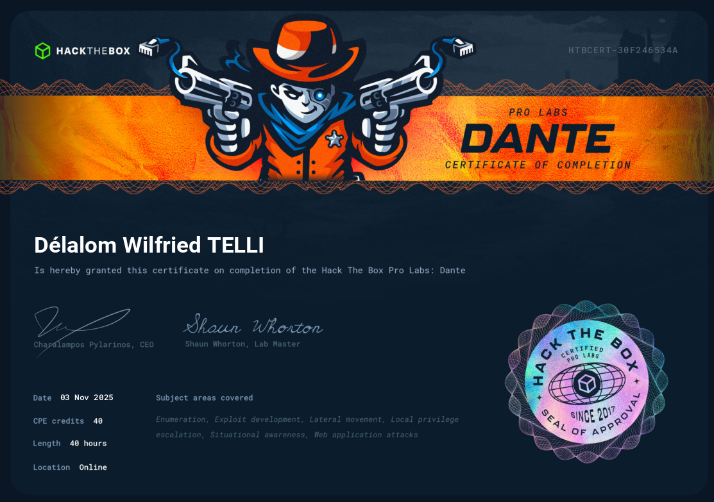
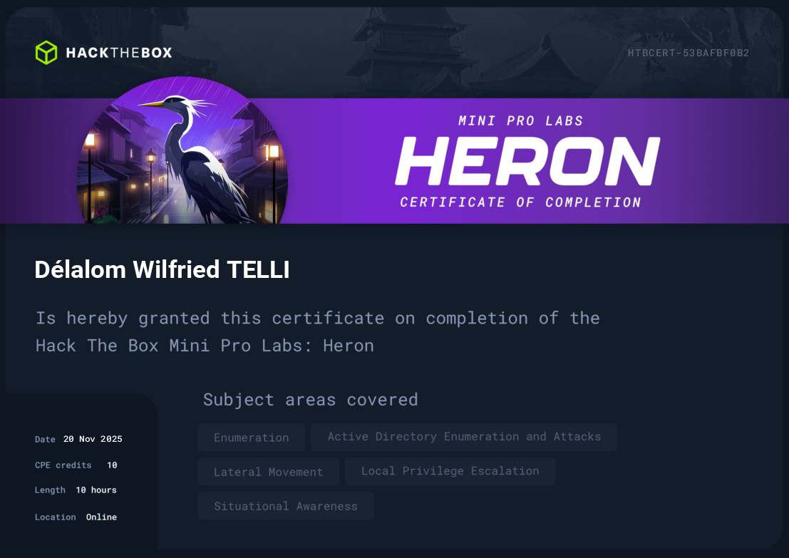
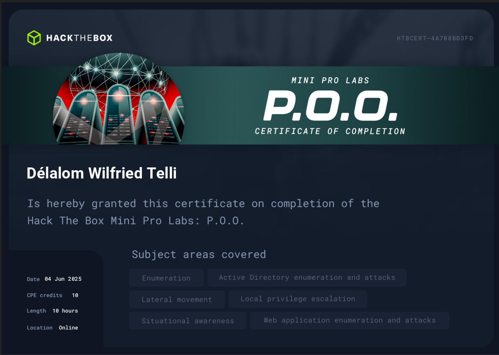
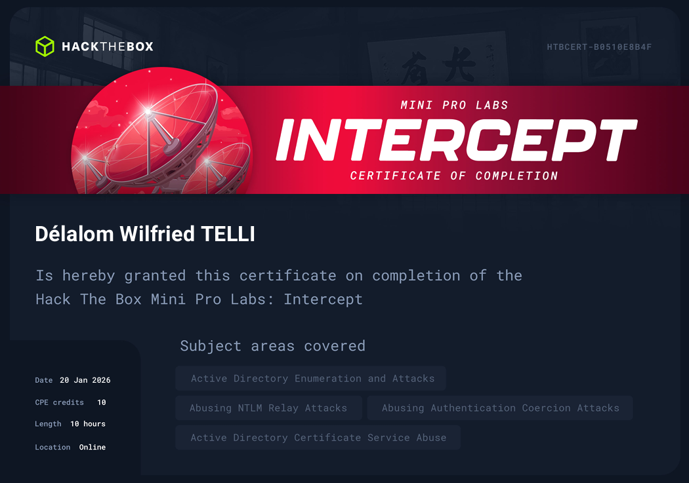
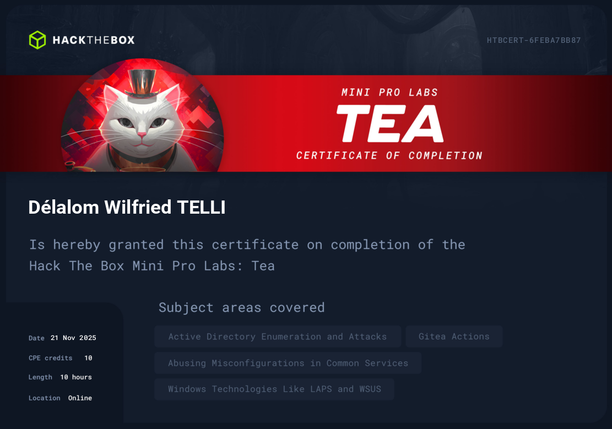
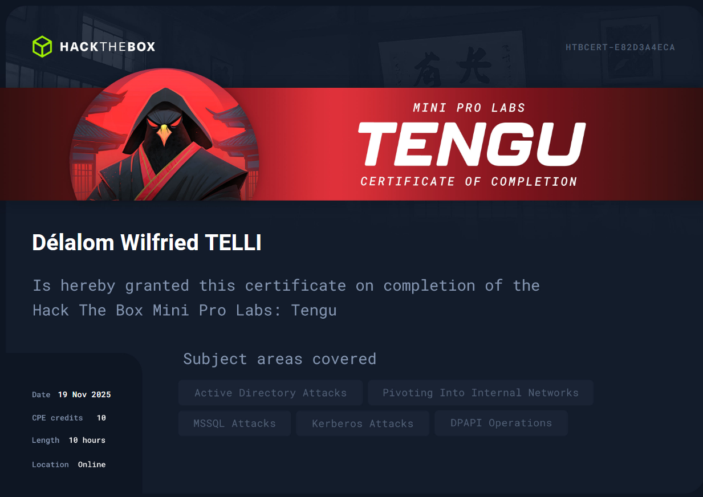
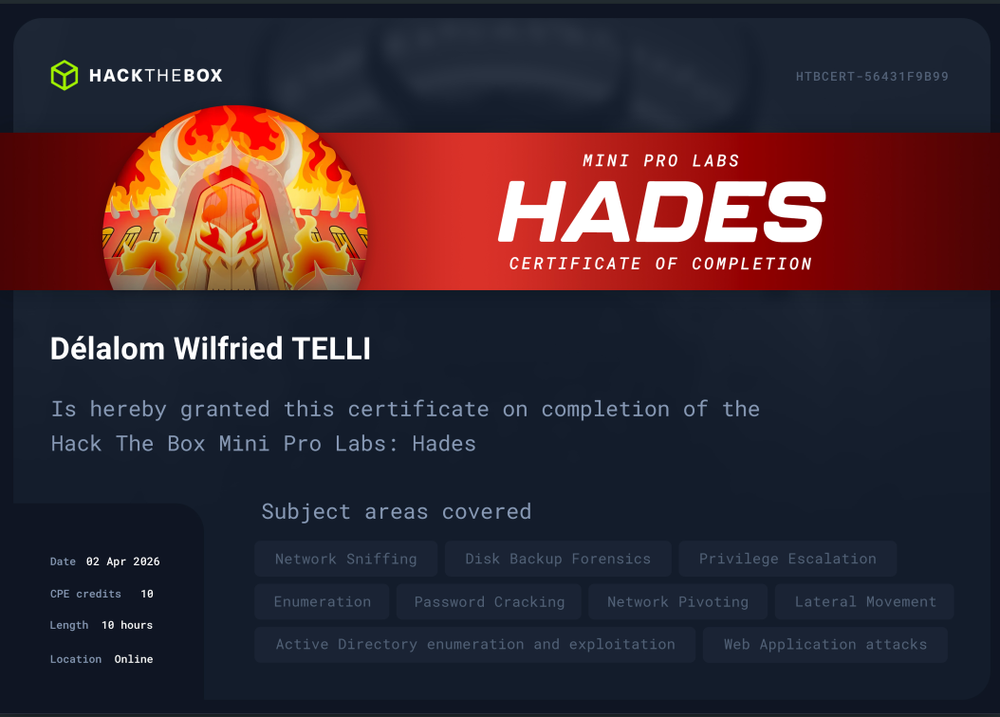

# 👋 Salut, je suis z3rodol

# Qui suis-je ?

Etudiant en Bachelor admin réseau & secops à l’IPSSI de Lyon. Au-delà du cadre académique, je suis un grand passionné de cybersécurité, je passe mon temps libre sur des forums cyber ainsi que des CTF dans l’optique d’en apprendre toujours plus.

Vous trouverez sur ce blog, des articles sur mes différentes expériences, des résolutions de machines Hackthebox et de CTF, ainsi que des ressources pour les débutants.

# 🎓 Mon parcours

## Expérience professionnelle
- **Administrateur Systèmes et Réseaux** chez ProSoft-Togo (Stage) - Avril - Juillet 2024
    - Administration et maintenance des systèmes Windows/Linux
    - Gestion des utilisateurs, droits d’accès et politiques de sécurité
    - Configuration et supervision du réseau informatique
    - Installation, configuration et mise à jour des serveurs et postes clients
    - Support technique aux utilisateurs et résolution des incidents

- **Technicien de maintenance informatique** chez MIF Informatique (Stage) - Mai - Juillet 2023
    - Diagnostic et résolution de pannes matérielles et logicielles
    - Installation, configuration et maintenance de postes informatique
    - Installation et mise à jour de logiciels
    - Sauvegarde et sécurisation des données
    - Configuration de périphériques (imprimantes, scanners, réseau)

# 📜 Certifications

- **Prolabs Hackthebox** : *Dante*, *Hades*, *POO*, *Tengu*, *Tea*, *Heron*, *Intercept*

  <h3 style="color: #3498db; margin-bottom: 10px;"></h3>
  

    
    
    
  

  

  

    
    
    
  

   

  

    
  

- **Fortinet NSE** : *NSE 1*, *NSE 2*, *NSE 3*

# 💡 Compétences

- **Réseaux et systèmes :** *Active Directory, Windows Server, Linux, DHCP, DNS, VPN*
- **Virtualisation :** *Vmware ESXI, PROXMOX, Hyper-V*
- **Pare-feux et proxy :** *PfSense, Fortigate, Fail2ban, Squid Proxy*
- **Monitoring :** *Zabbix*
- **Conteneurisation :**  *Docker*
- **Cloud :** *AWS*

## Formation
- **Bachelor Admin réseaux et secops** - IPSSI Lyon (2024-2026)

- **Licence Cybersécurité** - IPNET Institute of Technology (2022-2024)

# 📫 Me contacter

- **Twitter** : https://x.com/z3rodol
- **Linkedin** : https://www.linkedin.com/in/z3rodol
- **Github** : https://github.com/z3rodol
- **Tryhackme** : https://tryhackme.com/p/z3rodol
- **Hackthebox** : https://app.hackthebox.com/public/users/1587799

---

*N'hésitez pas à me contacter pour toute question ou opportunité de collaboration !*
